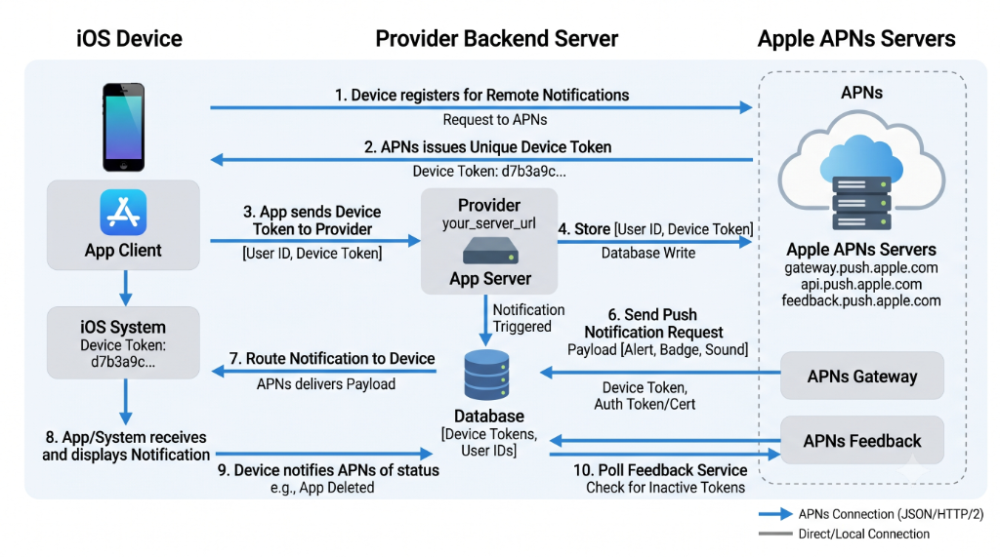
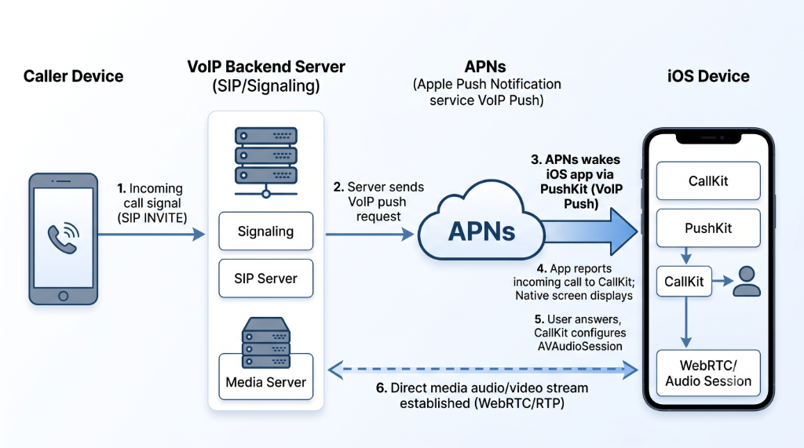
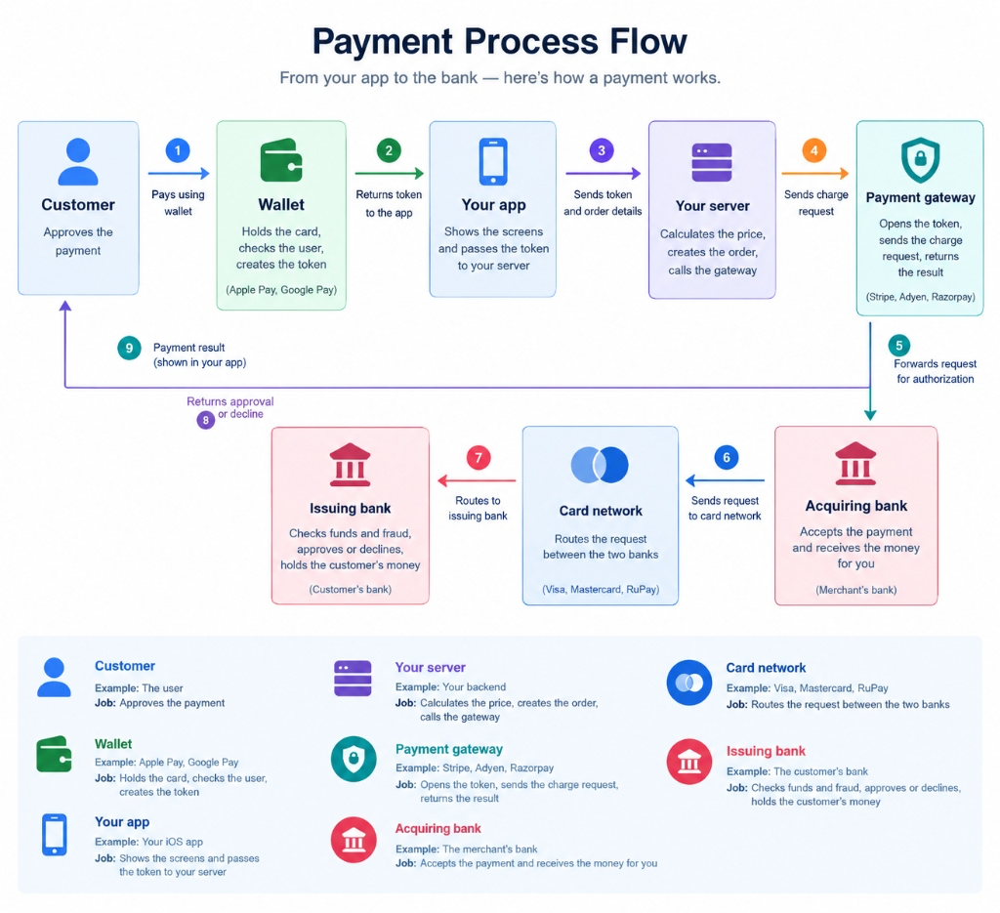
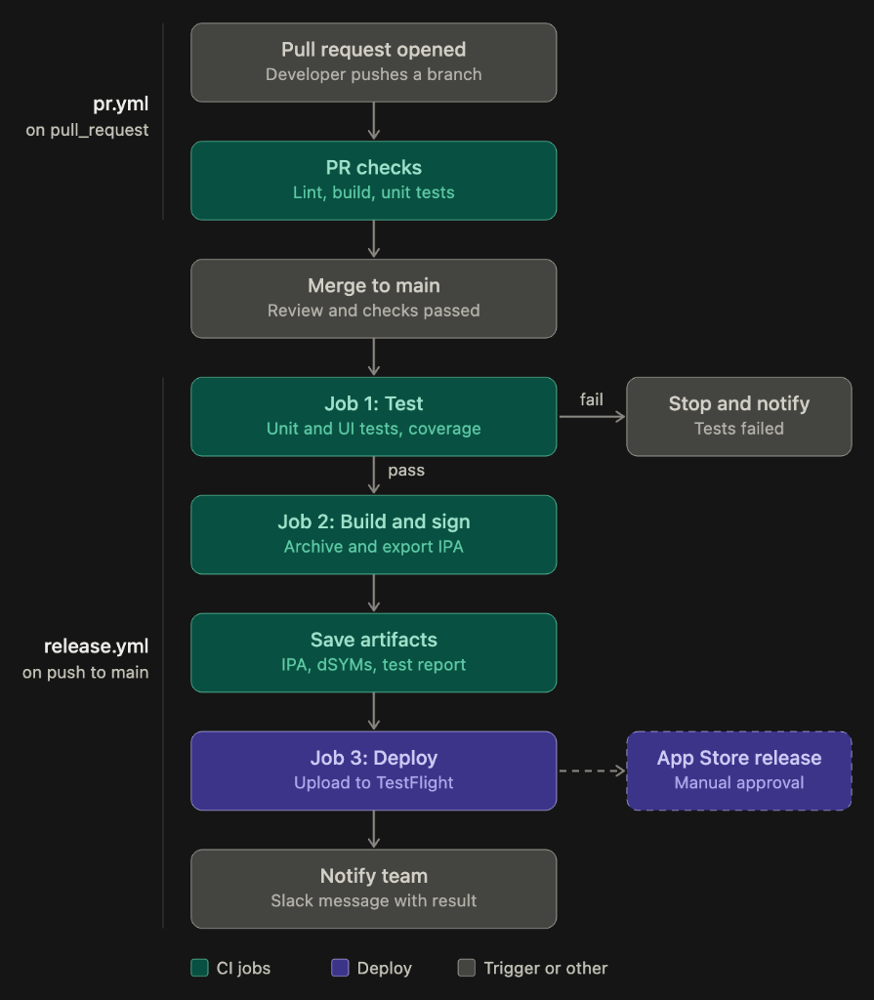

# 📱 iOS Senior & Staff Interview Question Bank

> A comprehensive, senior & staff-level revision suite for 83 iOS interview questions covering Swift internals, Concurrency, Architecture, Auto Layout & Adaptive iPad Design, Localization & RTL, UICollectionView Diffable Data Sources & Compositional Layouts, Background Execution & State Restoration, Performance Profiling & Instruments, 60/120fps Scroll Hitch Elimination, Scalable Image Caching, Keychain Secrets Management, OAuth 2.0 PKCE & Token Rotation, Production Crash Log Triage & Symbolication, Memory Management, and Engineering Leadership. Each question includes a spoken pitch, in-depth technical breakdown, and real-world Swift code with interview talking points.

## 📊 Overview

| Category / Topic | Questions | Key Coverage |
|---|:---:|---|
| **Architecture & Design Patterns** | `5` | Enterprise presentation patterns (MVVM, Clean Architecture, VIPER), Coordinator routing, Dependency Injection, and SOLID principles. |
| **Swift Concurrency & Multithreading** | `7` | Swift Actors, async/await, Structured Concurrency, Task Groups, synchronization primitives, GCD queues, and race conditions. |
| **Core Swift & Language Internals** | `6` | Protocol-Oriented Programming, Stack vs Heap & CoW, Method Dispatch (V-table/witness), Generics & some/any existentials, Property Wrappers & Macros, and Run Loops. |
| **SwiftUI & UIKit Layout** | `10` | Auto Layout Cassowary solver, Dynamic Type, accessibility (a11y), iPad adaptive layouts, internationalization & RTL, UICollectionView diffable data sources & compositional layouts, atomic component decomposition, SwiftUI ViewGraph/AttributeGraph diffing, and UIKit interoperability. |
| **Combine & Reactive Streams** | `1` | Reactive streams, Publishers, Subscribers, Backpressure, Subject types, Debounce vs Throttle, and cancellation lifecycles. |
| **Networking, APIs & Background Tasks** | `7` | URLSession abstractions, REST vs GraphQL contract-driven schemas, token refresh interceptors, silent APNs pushes, APNs architecture, VoIP PushKit & CallKit, Notification Service Extensions, and BGTaskScheduler. |
| **Modularity & Launch Performance** | `7` | SPM multi-module boundaries, static vs dynamic linkage launch effects, build-time reduction cascades, binary caching, app thinning, and Instruments profiling. |
| **Data Persistence & Memory Management** | `4` | Core Data vs SQLite vs Realm vs SwiftData, multi-context concurrency & merging, ARC retain cycles, Heap side tables (weak/unowned), and OS Jetsam OOM survival. |
| **Security, Auth & Compliance** | `12` | Keychain vs Secure Enclave, token storage CRUD, OAuth 2.0 PKCE & token rotation, SSL Certificate Pinning, biometric auth, Jailbreak & Frida detection, NSFileProtectionComplete, and banking compliance (PCI-DSS, SOX, GDPR). |
| **System Design & Mobile Architecture** | `3` | End-to-end mobile system design: Two-tier LRU memory/disk image caching with coalescing, Offline-First bi-directional syncing with outbox pattern, and E-commerce checkout & payment flow (Apple Pay, idempotency, gateway authorization & settlement). |
| **Testing & AI Engineering** | `10` | Unit and UI testing with XCTest, protocol mocking and stubbing, TDD/BDD, test doubles (mocks/stubs/fakes), feature flagging, and hybrid cloud/on-device AI systems. |
| **CI/CD & DevOps** | `1` | Automated continuous integration and delivery with GitHub Actions: PR quality gates, macOS runner optimization, Fastlane match code signing, and headless TestFlight deployment via App Store Connect API keys. |
| **Engineering Leadership & Operations** | `2` | Production incident triage, crash log analysis & dSYM symbolication, Crashlytics velocity alerts, MetricKit crash loops, blameless post-mortems, and migrating legacy monoliths using the Strangler Fig pattern. |
| **Memory Management** | `8` | ARC strong/weak/unowned, retain cycles, stack vs heap, Copy-on-Write internals, memory warnings, the Swift runtime side table, Jetsam OOM survival, and production memory profiling with Instruments and MetricKit. |
| **Total** | **`83`** | Complete Senior & Staff iOS Interview Curriculum |

---

## 📌 Architecture & Design Patterns (Q-01 – Q-05)

### `Q-01` — MVC vs MVVM vs Clean Architecture — tradeoffs

- **Category:** `Architecture & Design Patterns`

> [!TIP]
> **🗣️ Interview Pitch (Say it like this):**  
> *"MVVM is my go-to for SwiftUI because bindings make it natural, but I understand Clean Architecture's use in large teams where you need to isolate business logic from UI and infrastructure completely."*

#### 📖 Detailed Answer

MVC (Model-View-Controller): The default UIKit pattern. The Controller is supposed to be a thin glue between Model and View. In reality, Controllers end up managing network calls, data formatting, navigation, and UI — becoming Massive View Controllers. They are hard to test because the Controller is tightly coupled to UIKit.

MVVM (Model-View-ViewModel): Extracts presentation logic into a ViewModel. The ViewModel knows nothing about UIKit — it just holds state and exposes actions. The View binds to the ViewModel via Combine or @Published properties. ViewModels are 100% testable with plain XCTests, no UIKit needed. SwiftUI was designed for MVVM.

Clean Architecture: Separates the system into concentric rings — Entities (core business rules), Use Cases (application logic), Interface Adapters (presenters, mappers), and Frameworks (UIKit, network, DB). The inner rings know nothing about outer rings. This is perfect for large teams where you want to swap a database or UI framework without touching business logic. The tradeoff: a LOT of boilerplate.

Key interview talking point: Pick your architecture based on team size and app complexity. MVVM for 1-5 engineers; Clean Architecture when 10+ engineers need strict boundaries.

#### 💻 Swift Code Example

```swift
// MVC: ViewController doing too much (the problem)
class ProfileViewController: UIViewController {
    override func viewDidLoad() {
        super.viewDidLoad()
        // ❌ Networking, formatting, AND UI logic all in one place
        URLSession.shared.dataTask(with: url) { data, _, _ in
            let user = try? JSONDecoder().decode(User.self, from: data!)
            self.nameLabel.text = "Hello, \(user?.name ?? "")"
        }.resume()
    }
}

// MVVM: Logic moved to a testable ViewModel
class ProfileViewModel: ObservableObject {
    @Published var displayName: String = ""
    private let repo: UserRepository  // injected — easy to mock

    func loadProfile() async {
        let user = try? await repo.fetchUser(id: "me")
        displayName = "Hello, \(user?.name ?? "")"  // formatting lives here
    }
}

struct ProfileView: View {
    @StateObject var vm = ProfileViewModel(repo: LiveUserRepository())
    var body: some View {
        Text(vm.displayName).task { await vm.loadProfile() }
    }
}
```

---

### `Q-02` — VIPER — the 5 components and why teams choose it

- **Category:** `Architecture & Design Patterns`

> [!TIP]
> **🗣️ Interview Pitch (Say it like this):**  
> *"VIPER enforces strict separation with five dedicated objects per screen — ideal for large enterprise teams to prevent code ownership conflicts, though it is verbose for simple features."*

#### 📖 Detailed Answer

VIPER is an architecture pattern where each screen is split into exactly five objects, each with one job:

• View: Shows UI and forwards user actions to the Presenter. Zero logic.
• Interactor: Contains all business logic. Fetches data from services. Zero UI code.
• Presenter: The bridge. Takes raw data from the Interactor, formats it for display, and tells the View what to show. Zero UIKit or network code.
• Entity: Simple data models (structs/classes).
• Router: Handles all navigation — knows which screen to go to next.

Why teams choose it: In large enterprise apps with 20+ engineers per feature, having strict rules about where each type of code lives prevents who put network code in the View debates. Each component can be tested independently in complete isolation.

The honest tradeoff: VIPER produces a lot of code for simple screens. Even adding a button might mean touching 5 files. It is overkill for a small team or a simple app.

#### 💻 Swift Code Example

```swift
// Entity: Pure data model
struct UserEntity { let id: String; let name: String; let balance: Double }

// Interactor: Business logic — knows nothing about UI
protocol ProfileInteractorProtocol {
    func fetchProfile(userId: String) async throws -> UserEntity
}
class ProfileInteractor: ProfileInteractorProtocol {
    func fetchProfile(userId: String) async throws -> UserEntity {
        return try await UserService.shared.getUser(id: userId)
    }
}

// Presenter: Formats data — no UIKit
class ProfilePresenter {
    weak var view: ProfileViewProtocol?
    let interactor: ProfileInteractorProtocol
    let router: ProfileRouterProtocol

    func viewDidLoad() async {
        let entity = try? await interactor.fetchProfile(userId: "me")
        view?.showName("Welcome, \(entity?.name ?? "")")
    }
}

// Router: Navigation only
class ProfileRouter: ProfileRouterProtocol {
    func navigateToSettings() { /* push SettingsViewController */ }
}
```

---

### `Q-03` — Dependency Injection — constructor vs property injection, why it helps testing

- **Category:** `Architecture & Design Patterns`

> [!TIP]
> **🗣️ Interview Pitch (Say it like this):**  
> *"I always use constructor injection because it gives the compiler control — if you forget a dependency, the code will not compile. It also makes mocking in unit tests trivial."*

#### 📖 Detailed Answer

Dependency Injection (DI) simply means: instead of an object creating the things it needs, you give those things to it from outside. This makes the object flexible — give it real dependencies in production, and fake ones in tests.

Constructor injection (preferred): Pass dependencies in the init method. The object is fully set up the moment it is created. There is no way to forget to provide a dependency — the compiler will not let you.

Property injection: Set a property after init. Used when you do not control initialization — like UIViewControllers from Storyboards. The downside: the object can exist in a broken state before the property is set.

Why it helps testing: Without DI, your ViewModel calls URLSession.shared directly — you cannot test it without hitting a real network. With DI, you pass in a protocol, and your test passes a fake that returns instant, predictable data.

Key interview talking point: DI is not a library or framework. It is just passing things in instead of creating them internally.

#### 💻 Swift Code Example

```swift
// Step 1: Define behavior with a protocol
protocol NetworkService {
    func fetchUser() async throws -> User
}

// Step 2: Real implementation for production
class LiveNetworkService: NetworkService {
    func fetchUser() async throws -> User {
        let (data, _) = try await URLSession.shared.data(from: apiURL)
        return try JSONDecoder().decode(User.self, from: data)
    }
}

// Step 3: Fake for tests — instant, no network
class MockNetworkService: NetworkService {
    var userToReturn = User(name: "Test User")
    func fetchUser() async throws -> User { return userToReturn }
}

// Step 4: ViewModel receives the dependency — does not create it
class ProfileViewModel {
    private let network: NetworkService
    init(network: NetworkService) { self.network = network }  // ✅ Constructor injection
}

let vm     = ProfileViewModel(network: LiveNetworkService()) // production
let testVM = ProfileViewModel(network: MockNetworkService()) // test
```

---

### `Q-04` — SOLID principles

- **Category:** `Architecture & Design Patterns`

> [!TIP]
> **🗣️ Interview Pitch (Say it like this):**  
> *"I apply SOLID daily — most critically the D, by making my ViewModels depend on protocols so I can swap in mocks for testing without changing a line of production code."*

#### 📖 Detailed Answer

SOLID is five design principles that make code easy to change, test, and extend without breaking other things:

S — Single Responsibility: One class, one job. A UserParser should only parse users, not also save to a database. When a class has one responsibility, you know exactly where to look when something breaks.

O — Open/Closed: Open to extension, closed to modification. Add new behavior by adding new code (protocol conformances), not by editing existing code. Editing existing code risks breaking things that already work.

L — Liskov Substitution: If you swap a subclass in where the parent is expected, the program should still work correctly. A Square that extends Rectangle and breaks setWidth violates this.

I — Interface Segregation: Do not force a class to implement methods it does not need. Split large protocols into focused, smaller ones. A ReadOnlyCache should not have to implement clear().

D — Dependency Inversion: High-level modules should not depend on low-level modules directly. Both should depend on abstractions (protocols). Your ViewModel should depend on a NetworkService protocol, not URLSession.

Key interview talking point: In Swift, D (Dependency Inversion) plus protocols is the foundation for testability with mocks.

#### 💻 Swift Code Example

```swift
// S — Single Responsibility
class UserRepository { func fetchUser() {} }  // only networking
class UserStorage    { func saveUser()  {} }  // only persistence

// O — Open/Closed: add new payment via conformance, not by editing CreditCard
protocol PaymentMethod { func process(amount: Double) }
struct CreditCard: PaymentMethod { func process(amount: Double) {} }
struct Crypto:     PaymentMethod { func process(amount: Double) {} } // added without edits

// I — Interface Segregation: separate concerns
protocol ReadableCache { func get() -> Data? }
protocol WritableCache  { func set(_ d: Data); func clear() }
// A read-only cache only adopts ReadableCache — not forced to implement clear()

// D — Dependency Inversion: depend on abstraction
// ❌ Bad: coupled to a concrete class
class ProfileViewModelBad { let svc = URLSessionNetworkService() }
// ✅ Good: depends on protocol — any conformer works, including a mock
class ProfileViewModel {
    let service: NetworkService
    init(service: NetworkService) { self.service = service }
}
```

---

### `Q-05` — MVVM-C (Coordinator pattern) — why enterprise apps use it

- **Category:** `Architecture & Design Patterns`

> [!TIP]
> **🗣️ Interview Pitch (Say it like this):**  
> *"Coordinators centralize navigation so ViewModels stay pure — they fire events, the coordinator decides what is next. It also makes the same screen reusable across different flows, which is huge in enterprise apps."*

#### 📖 Detailed Answer

MVVM without Coordinators has a problem: who handles navigation? If the ViewModel calls navigationController.push, it is now coupled to UIKit. If the View does it, it needs to know about the next screen. Both are wrong.

The Coordinator pattern gives navigation its own dedicated object. The ViewModel just fires an event: user tapped login button. The Coordinator listens and decides what to show next. The ViewModel knows nothing about the dashboard screen.

Why enterprise apps use it:
1. The same screen can appear in multiple flows. The Change PIN screen exists in both Onboarding and Settings. With coordinators, you reuse the VC — each coordinator handles its own routing.
2. Deep links become manageable. The app coordinator can parse a deep link URL and start the right child coordinator.
3. A/B testing flows is easy — swap out a child coordinator without touching ViewModels or Views.

NavigationStack alternative (iOS 16+): In pure SwiftUI apps, NavigationStack with a path-based model is a simpler native alternative. But in mixed or UIKit apps, the classic coordinator is still the standard.

Key interview talking point: Coordinators hold weak references back to their children to avoid retain cycles.

#### 💻 Swift Code Example

```swift
// Step 1: Coordinator contract
protocol Coordinator: AnyObject {
    var childCoordinators: [Coordinator] { get set }
    var navigationController: UINavigationController { get }
    func start()
}

// Step 2: LoginCoordinator owns the login flow
class LoginCoordinator: Coordinator {
    var childCoordinators: [Coordinator] = []
    let navigationController: UINavigationController
    var onLoginSuccess: (() -> Void)?  // parent listens to this

    init(nav: UINavigationController) { self.navigationController = nav }

    func start() {
        let vc = LoginViewController()
        vc.viewModel.onLoginSuccess = { [weak self] in
            self?.onLoginSuccess?()  // notify parent
        }
        navigationController.pushViewController(vc, animated: true)
    }
}

// Step 3: AppCoordinator — root coordinator
class AppCoordinator: Coordinator {
    var childCoordinators: [Coordinator] = []
    let navigationController: UINavigationController
    init(nav: UINavigationController) { self.navigationController = nav }

    func start() {
        let login = LoginCoordinator(nav: navigationController)
        login.onLoginSuccess = { [weak self] in
            self?.showDashboard()  // navigation decision lives here, NOT in ViewModel
        }
        childCoordinators.append(login)
        login.start()
    }

    private func showDashboard() {
        navigationController.setViewControllers([DashboardViewController()], animated: true)
    }
}
```

---


## ⚡ Swift Concurrency & Multithreading (Q-06 – Q-12)

### `Q-06` — GCD vs Swift Concurrency — when to use which, and why

- **Category:** `Swift Concurrency & Multithreading`

> [!TIP]
> **🗣️ Interview Pitch (Say it like this):**  
> *"I default to Swift Concurrency for all new code because the compiler prevents data races and the cooperative thread pool eliminates thread explosion — but I can read and maintain legacy GCD code."*

#### 📖 Detailed Answer

GCD (Grand Central Dispatch) is the older, callback-based system Apple gave us for running work on threads. You push closures onto queues, and you get back results in another closure. The big problem: closures inside closures (callback hell), and nothing stops you from spawning thousands of threads, which crashes the system — that is called thread explosion.

Swift Concurrency (async/await), introduced in Swift 5.5, is the modern replacement. It is built into the language. Code reads top to bottom like synchronous code, but the system suspends and resumes tasks as needed without blocking threads. The compiler itself prevents data races when you use actors.

When to use which:
• New features: Always use Swift Concurrency.
• Maintaining old code: Read and understand GCD, but do not write new GCD code.
• Low-level queue tricks (e.g., barrier writes for a thread-safe cache): a serial DispatchQueue is still fine.

The real interview talking point: GCD let developers create unlimited threads (thread explosion). Swift Concurrency uses a cooperative thread pool — at most one thread per CPU core — so the system is always in control.

#### 💻 Swift Code Example

```swift
// ❌ Old way: GCD — callback hell, no compile-time safety
DispatchQueue.global().async {
    let data = self.fetchData()  // runs on background thread
    DispatchQueue.main.async {
        self.updateUI(with: data) // hop back to main thread
    }
}

// ✅ Modern way: Swift Concurrency — reads like sync code
Task {
    let data = await fetchData()
    await MainActor.run { updateUI(with: data) }
}
```

---

### `Q-07` — How do Swift actors actually prevent data races?

- **Category:** `Swift Concurrency & Multithreading`

> [!TIP]
> **🗣️ Interview Pitch (Say it like this):**  
> *"Actors give me compile-time thread safety — the compiler literally will not let two tasks touch an actor state simultaneously, so I cannot accidentally forget to add a lock."*

#### 📖 Detailed Answer

A data race happens when two threads read and write the same piece of data at the same time. The result is unpredictable.

A normal Swift class gives no protection. Any thread can call any method or read any property at any moment.

An actor is like a class but with a bouncer at the door. The Swift compiler enforces one rule: only one task can be inside an actor at a time. Every call from outside the actor must use await — this is the compiler saying get in line. If someone else is already inside, your task suspends until its turn.

Key interview points:
• @MainActor is a global actor that ensures code runs on the main thread — perfect for all UI updates.
• nonisolated lets you opt out for read-only, pure-value methods that do not need protection.
• Actor reentrancy: an actor can be re-entered at an await suspension point. If state changes between two awaits, you must re-validate.

#### 💻 Swift Code Example

```swift
// ✅ Actor: compiler enforces one-at-a-time access
actor BankAccount {
    private var balance: Double = 0.0

    func deposit(amount: Double) {
        balance += amount  // only one task runs this at a time
    }
    func getBalance() -> Double { balance }
}

Task {
    let account = BankAccount()
    await account.deposit(amount: 100.0)
    let bal = await account.getBalance()
    print(bal) // Always correct, never racey
}

// @MainActor ensures UI updates run on main thread
@MainActor
class ProfileViewModel: ObservableObject {
    @Published var userName: String = ""

    func loadUser() async {
        let name = await fetchNameFromServer()
        userName = name  // guaranteed to run on main thread
    }
}
```

---

### `Q-08` — What is nonisolated? When do you use it?

- **Category:** `Swift Concurrency & Multithreading`

> [!TIP]
> **🗣️ Interview Pitch (Say it like this):**  
> *"nonisolated marks an actor member as exempt from actor isolation so it can be called synchronously without await, provided it never accesses the actor's mutable state (Memory trick: P-L-S — Pure helpers, Let constants, Sync protocol conformance)."*

#### 📖 Detailed Answer

nonisolated tells the compiler that a method or property inside an actor, or inside a @MainActor class, is not tied to that actor. It does not run on the actor's isolation, so I can call it from anywhere without await. The price is that it cannot touch the actor's mutable state, because that state is protected.

I use it when the code inside does not need the protected state. The common cases are:
1. Pure helper functions that only work on their inputs.
2. Computed properties built from let constants.
3. Synchronous protocol conformances: Hashable, Equatable, CustomStringConvertible, or Identifiable, where the protocol requires a normal synchronous method or property. In those cases, the actor method would otherwise need await, and the protocol would not accept it. So I mark it nonisolated.

I don't use it just to silence a compiler error. If the code needs the actor's state, it should stay isolated, and the caller should use await.

Good to mention in an interview:
• Sendable requirement: A nonisolated member can only read let properties that are Sendable. Reading a var is a compile-time error.
• @MainActor helper offloading: nonisolated on a @MainActor class is useful when background code needs to call a small helper without hopping to the main thread.
• nonisolated(unsafe): Exists for global or static variables, but it is an opt-out promise to the compiler that bypasses concurrency checking, so it should be avoided unless strictly necessary for legacy interop.
• Swift 6+ evolutions: Swift 6 introduces nonisolated(nonsending) and dynamic actor execution for nonisolated async functions, running on the caller's actor context.

One-liner: nonisolated marks a member as not tied to the actor, so I can call it without await, but it cannot touch the actor's mutable state.

Memory trick: P-L-S → "Pure helpers, Let constants, Sync protocol conformance."

#### 💻 Swift Code Example

```swift
// MARK: - Senior Interview Concept: Swift 'nonisolated' Keyword in Practice
import Foundation

// 1. Actor with isolated state and nonisolated exemptions
actor UserStore {
    let id: UUID                       // Immutable let constant (Sendable)
    private var users: [String] = []   // Mutable actor-isolated state (protected)

    init(id: UUID = UUID()) {
        self.id = id
    }

    // 🔒 ISOLATED: Mutates actor-protected state — requires 'await' from outside
    func add(_ name: String) {
        users.append(name)
    }

    // ⚡ NONISOLATED PROPERTY: Reads only an immutable 'let', safe without actor hopping
    nonisolated var storeID: String {
        id.uuidString
    }

    // ⚡ NONISOLATED METHOD: Pure helper function, touches zero actor state
    nonisolated func format(_ name: String) -> String {
        name.trimmingCharacters(in: .whitespaces).capitalized
    }
}

// 2. SYNCHRONOUS PROTOCOL CONFORMANCE:
// Protocols like CustomStringConvertible, Hashable, Equatable require synchronous getters.
// Actors cannot satisfy synchronous protocol requirements unless marked 'nonisolated'.
extension UserStore: CustomStringConvertible {
    nonisolated var description: String {
        "UserStore(\(id))"
    }
}

// Usage demonstration:
let store = UserStore()
print(store.storeID)            // ✅ Synchronous call: NO await needed
print(store.format(" john "))   // ✅ Synchronous call: NO await needed
Task {
    await store.add("John")     // 🔒 Isolated call: 'await' required
}

// 3. NONISOLATED IN @MainActor CLASSES:
// Avoids hopping onto the main thread for pure computational tasks.
@MainActor
final class ProfileViewModel {
    var name = "" // Bound to MainActor

    // Background threads can call this without triggering a main thread hop
    nonisolated func validate(_ email: String) -> Bool {
        email.contains("@") // Zero access to 'name' or main thread state
    }
}
```

---

### `Q-09` — async/await, structured concurrency, task groups

- **Category:** `Swift Concurrency & Multithreading`

> [!TIP]
> **🗣️ Interview Pitch (Say it like this):**  
> *"I use structured concurrency with async let for fixed parallelism and task groups for dynamic work — cancellation and error propagation are automatic, so nothing leaks."*

#### 📖 Detailed Answer

async/await is the syntax. You mark a function async to say it can suspend. At the call site, you write await to say I am happy to pause here while the result comes back. The thread is not blocked — it just picks up other work until the result is ready.

Structured concurrency means tasks have a parent-child relationship. When a parent task is cancelled, all its children are cancelled automatically. When a child throws an error, it bubbles up to the parent. Nothing leaks. This is the big improvement over GCD, where you had to manually track and cancel every background operation.

async let: Start two tasks at the same time, then await both results. Simple parallelism.

TaskGroup / ThrowingTaskGroup: Start a dynamic number of tasks (e.g., download 50 images) and collect all results.

Key interview talking point: Structured means the lifetime of a child task is always contained within its parent scope — just like a local variable cannot outlive its function.

#### 💻 Swift Code Example

```swift
// async let: Run two fetches at the SAME TIME, then await both
func loadDashboard() async throws -> Dashboard {
    async let user = fetchUser()         // starts immediately
    async let accounts = fetchAccounts() // starts immediately
    return try await Dashboard(user: user, accounts: accounts)
}

// TaskGroup: Fetch a dynamic list of images in parallel
func fetchImages(urls: [URL]) async throws -> [UIImage] {
    try await withThrowingTaskGroup(of: UIImage.self) { group in
        for url in urls {
            group.addTask { try await downloadImage(url: url) }
        }
        var images: [UIImage] = []
        for try await image in group { images.append(image) }
        return images
    }
    // If parent is cancelled, ALL child tasks are cancelled automatically
}
```

---

### `Q-10` — Race conditions vs deadlocks — definitions + a real example of each

- **Category:** `Swift Concurrency & Multithreading`

> [!TIP]
> **🗣️ Interview Pitch (Say it like this):**  
> *"A race condition gives you wrong, unpredictable results when threads collide on shared data; a deadlock freezes everything when threads wait on each other forever."*

#### 📖 Detailed Answer

A race condition is when two or more threads access the same shared data at the same time, and the result depends on which thread gets there first. The result is unpredictable — sometimes correct, sometimes wrong. This makes bugs very hard to reproduce.

A classic example: two threads both read a bank balance of 100, both add 50 in their local memory, and both write 150 back. The correct answer is 200. You lost 50 to a race.

A deadlock is when two or more threads are stuck waiting for each other forever, so nothing moves forward.

A classic example: Thread A locks Resource 1 and then tries to lock Resource 2. Thread B locks Resource 2 and then tries to lock Resource 1. Both are stuck waiting forever.

In iOS, the most common deadlock trap: calling DispatchQueue.main.sync from the main thread. The main thread waits for itself — instant deadlock.

Key interview talking points:
• Race condition → unpredictable results → fix with actors, locks, or serial queues.
• Deadlock → permanent freeze → fix by always acquiring locks in the same order, or using async/await instead of sync.

#### 💻 Swift Code Example

```swift
// ❌ RACE CONDITION: Two tasks writing a shared counter
var sharedCount = 0
Task { sharedCount += 1 } // Task A reads 0, writes 1
Task { sharedCount += 1 } // Task B also reads 0, writes 1
// Result: sharedCount = 1 (expected 2) ❌

// ✅ FIX: Use an actor — one task at a time
actor SafeCounter {
    var count = 0
    func increment() { count += 1 }
}

// ❌ DEADLOCK: Calling sync from the main thread onto itself
DispatchQueue.main.sync { // Main thread waiting for main thread = DEADLOCK
    print("This will never print")
}

// ❌ DEADLOCK: Lock ordering
let lockA = NSLock(), lockB = NSLock()
// Thread 1 grabs A, tries B. Thread 2 grabs B, tries A. Both wait forever.

// ✅ FIX: Always acquire locks in the same order, or use actors
```

---

### `Q-11` — OperationQueue / Operation — basic concept

- **Category:** `Swift Concurrency & Multithreading`

> [!TIP]
> **🗣️ Interview Pitch (Say it like this):**  
> *"I have not built new features with OperationQueue — I use async let and task groups in new code — but I can read and maintain legacy OperationQueue pipelines confidently."*

#### 📖 Detailed Answer

Before Swift Concurrency existed, OperationQueue was Apple's way to run units of work that depend on each other. You wrap each piece of work in an Operation object, put them in an OperationQueue, and tell the queue about the order using addDependency().

Example: Operation 3 cannot start until Operation 1 and Operation 2 are both done. OperationQueue handles the scheduling — it runs operations concurrently unless you set up a dependency.

You can also cancel, pause, and resume the queue. In UIKit apps before async/await, this was the go-to approach for image processing pipelines.

Modern alternative: Swift Concurrency task groups solve the same problem far more cleanly. But you will find OperationQueue in every older enterprise codebase, so you must be able to read it.

Key interview talking point: OperationQueue maxConcurrentOperationCount = 1 makes it a serial queue. Setting it to nil (default) makes it concurrent.

#### 💻 Swift Code Example

```swift
// OperationQueue with dependency: Resize THEN Upload THEN Update UI
let queue = OperationQueue()
let resizeOp = BlockOperation { print("1. Resize image") }
let uploadOp = BlockOperation { print("2. Upload image") }
let updateOp = BlockOperation { print("3. Update UI") }

uploadOp.addDependency(resizeOp)
updateOp.addDependency(uploadOp)

queue.addOperations([updateOp, resizeOp, uploadOp], waitUntilFinished: false)
// Output order is always: 1 → 2 → 3

// Modern equivalent with Swift Concurrency:
func processAndUpload() async throws {
    let resized = try await resizeImage()
    let result  = try await upload(image: resized)
    await updateUI(with: result)
}
```

---

### `Q-12` — Thread-safe code using synchronization primitives — locks, mutexes, atomic operations

- **Category:** `Swift Concurrency & Multithreading`

> [!TIP]
> **🗣️ Interview Pitch (Say it like this):**  
> *"For new code I always reach for actors — the compiler enforces the safety. For legacy code, I use a serial queue or reader-writer pattern with a concurrent queue to avoid the manual unlock bugs that NSLock carries."*

#### 📖 Detailed Answer

Thread safety means that no matter how many threads access shared data simultaneously, the result is always correct.

The tools, from old to new:

NSLock / os_unfair_lock: Explicit locks. You lock before reading/writing, and unlock after. Simple but manual — forgetting to unlock causes a deadlock. os_unfair_lock is faster and is what Apple uses internally.

Serial DispatchQueue: All reads and writes go through the same serial queue, so they happen one at a time. The reader-writer pattern with a concurrent queue lets multiple reads happen simultaneously, while writes are exclusive (barrier).

Atomicproperty wrapper: Wraps a lock internally. Not built into Swift — you build it yourself or use a library.

Actors (Modern): The compiler handles everything. No manual lock/unlock. The safest approach for new code.

Key interview talking point: The most dangerous mistake with locks is calling a locked method from within the same locked context — this causes a deadlock because NSLock is not reentrant by default.

#### 💻 Swift Code Example

```swift
// Pattern 1: Serial queue — simple and safe for legacy code
class ThreadSafeCache<K: Hashable, V> {
    private var storage: [K: V] = [:]
    private let queue = DispatchQueue(label: "com.app.cache.serial")

    func set(_ value: V, for key: K) { queue.sync { storage[key] = value } }
    func get(for key: K) -> V?       { queue.sync { storage[key] } }
}

// Pattern 2: Reader-Writer — better for read-heavy workloads
class FastCache<K: Hashable, V> {
    private var storage: [K: V] = [:]
    private let queue = DispatchQueue(label: "com.app.rw", attributes: .concurrent)

    func set(_ value: V, for key: K) {
        queue.async(flags: .barrier) { self.storage[key] = value } // exclusive write
    }
    func get(for key: K) -> V? {
        queue.sync { storage[key] }  // concurrent read
    }
}

// Pattern 3: Actor — modern, compiler-enforced
actor ActorCache<K: Hashable, V> {
    private var storage: [K: V] = [:]
    func set(_ value: V, for key: K) { storage[key] = value }
    func get(for key: K) -> V? { storage[key] }
}
```

---


## 🚀 Core Swift & Language Internals (Q-13 – Q-18)

### `Q-13` — Protocol-Oriented Programming in Swift — What problem does it solve?

- **Category:** `Core Swift & Language Internals`

> [!TIP]
> **🗣️ Interview Pitch (Say it like this):**  
> *"Protocol-oriented programming builds code from small abilities that any type can adopt, which avoids the limits of class inheritance and makes testing easy. (Memory trick: M-V-T → "Many protocols, Value types, Testable.")"*

#### 📖 Detailed Answer

Protocol-oriented programming means I design my code around protocols, which describe what something can do, instead of around a base class. Each type then says "I can do this" by conforming to the protocol. I can also give a protocol default behavior using a protocol extension, so every type that conforms gets that code for free.

The problem it solves is the limits of class inheritance. With classes, a type can have only one parent. So if I build a deep class tree, it becomes rigid. A subclass inherits everything from the parent, even things it does not need, and changing the base class can break many children. Also, classes are reference types, so sharing and changing state can cause bugs. And if two unrelated types need the same ability, with inheritance I have to force them into one hierarchy.

With protocols, a type can conform to many protocols, so I mix abilities instead of inheriting them. Structs and enums can conform too, so I can keep value types and avoid the problems of shared state. And protocols make testing easy: my code depends on a protocol, so in tests I swap in a mock. This is how I do dependency injection.

Problems it solves:
• Single inheritance limit: one type can conform to many protocols.
• Rigid class trees: no deep hierarchy and no unwanted inherited code.
• Shared mutable state: structs and enums can conform, so I can use value types.
• Hard to test: depend on a protocol and inject a mock.
• Code duplication: protocol extensions give default code to all conforming types.

Good to mention in an interview:
• Use some Protocol or any Protocol. some is faster because the compiler knows the real type. any is flexible but adds a small cost.
• Protocols with associatedtype need generics or some, and cannot be used as a plain type in older Swift.
• Don't overdo it. If there is only one implementation and no need to mock, a protocol adds extra code with no benefit.
• Protocol extension methods that are not declared in the protocol use static dispatch, so a conforming type's own version may not be called through the protocol type. Declare the method in the protocol to get dynamic dispatch.

One-liner: Protocol-oriented programming builds code from small abilities that any type can adopt, which avoids the limits of class inheritance and makes testing easy.

Memory trick: M-V-T → "Many protocols, Value types, Testable."

#### 💻 Swift Code Example

```swift
// Protocol: describes the ability
protocol Fetching {
    func fetchUser() async throws -> User
}

// Default behavior for all types that conform
extension Fetching {
    func fetchUserName() async throws -> String {
        try await fetchUser().name
    }
}

// Real implementation (a struct, no inheritance)
struct APIService: Fetching {
    func fetchUser() async throws -> User { /* network call */ }
}

// Mock for tests
struct MockService: Fetching {
    func fetchUser() async throws -> User { User(id: 1, name: "Test") }
}

// ViewModel depends on the protocol, not on a concrete class
final class ProfileViewModel {
    private let service: Fetching
    init(service: Fetching) { self.service = service }
}

let prod = ProfileViewModel(service: APIService())
let test = ProfileViewModel(service: MockService())
```

---

### `Q-14` — App lifecycle and Run Loops — what happens from launch to termination

- **Category:** `Core Swift & Language Internals`

> [!TIP]
> **🗣️ Interview Pitch (Say it like this):**  
> *"I understand the full lifecycle from launch to suspension, and my number one rule is to never block the main run loop — that is what causes UI jank and watchdog kills in production."*

#### 📖 Detailed Answer

When you tap an app icon, here is what happens step by step:
1. The OS loads the app binary into memory.
2. The system calls main(), which calls UIApplicationMain() (UIKit) or the @main entry point (SwiftUI).
3. UIApplicationMain creates the UIApplication singleton, finds your AppDelegate, and sets up the first window/scene.
4. The app moves through states: Not Running → Inactive (briefly) → Active.

States you need to know:
• Active: Foreground, receiving user input.
• Inactive: Transitioning (e.g., a phone call comes in).
• Background: Code can still run briefly. Save state here.
• Suspended: Frozen in memory. No code runs. OS can kill this at any time.

The Run Loop is what keeps the app alive. It is an infinite loop on the main thread that waits for events (touches, timers, network callbacks), processes them, and goes back to waiting. If you block the main thread with heavy work, the run loop cannot process new events — the UI freezes and the system watchdog kills the app.

Key interview talking point: The watchdog is a system process that kills your app if the main thread is unresponsive for more than about 8 seconds on launch or 10 seconds in the foreground.

#### 💻 Swift Code Example

```swift
// SceneDelegate lifecycle — modern multi-window apps
func sceneDidBecomeActive(_ scene: UIScene) {
    // App in foreground — resume timers, refresh data
    startRefreshTimer()
}

func sceneWillResignActive(_ scene: UIScene) {
    // Interruption starting (phone call, control centre)
    pauseRefreshTimer()
}

func sceneDidEnterBackground(_ scene: UIScene) {
    // About 5 seconds before suspension — save state NOW
    saveUserDraft()
    var bgTask: UIBackgroundTaskIdentifier = .invalid
    bgTask = UIApplication.shared.beginBackgroundTask {
        UIApplication.shared.endBackgroundTask(bgTask)
    }
}

// ✅ Always push heavy work off the main thread
Task.detached(priority: .userInitiated) {
    let result = await processLargeDataSet()
    await MainActor.run { self.updateUI(with: result) }
}
```

---

### `Q-15` — Core Swift Mechanics — Stack vs Heap, Value vs Reference Semantics, and Copy-on-Write (CoW)

- **Category:** `Core Swift & Language Internals`

> [!TIP]
> **🗣️ Interview Pitch (Say it like this):**  
> *"Stack allocation is virtually instant and thread-safe for local value types, whereas heap allocation requires locks and ARC overhead. Swift leverages Copy-on-Write so collection structs have value semantics without paying an upfront copy penalty until a mutation occurs."*

#### 📖 Detailed Answer

Every senior iOS engineer must understand how Swift allocates and manages memory across the Stack and Heap:

• Stack Allocation (Fast & Predictable):
  - Used for local primitive variables, structs, enums, and function execution call frames.
  - Allocation is trivial: the CPU simply moves the stack pointer register (LIFO order).
  - Memory is automatically reclaimed when the function scope exits.
  - Zero reference counting overhead and thread-safe by default because each thread has its own private call stack.

• Heap Allocation (Dynamic & Flexible):
  - Used for class instances, closures capturing state, and existential containers for large values.
  - Allocation requires finding an unallocated memory block of sufficient size in global virtual memory, requiring thread synchronization locks.
  - Managed at runtime via ARC (Automatic Reference Counting). Each retain/release incurs atomic thread synchronization overhead.

• Value vs Reference Semantics:
  - Value Types (struct, enum, tuple): Passed by value (copied). Mutating a copy never alters the original. Eliminates unintended side-effects and data races.
  - Reference Types (class, actor): Passed by reference (shared pointer). Multiple references point to the exact same heap memory instance.

• Copy-on-Write (CoW) Optimization:
  - Standard Swift collections (Array, Dictionary, Set, String) are value types, but allocating a new heap buffer on every assignment would destroy performance.
  - CoW ensures that multiple variables share the underlying storage buffer until one of them mutates. Only on mutation is a unique copy cloned.
  - Built using isKnownUniquelyReferenced(&ref) in custom data structures.

#### 💻 Swift Code Example

```swift
// MARK: - Interview Concept: Custom Copy-on-Write (CoW) Struct
// Demonstrating how Apple implements CoW for Collections like Array and String

final class StorageBackend<T> {
    var data: [T]
    init(data: [T]) { self.data = data }
}

struct FastList<T> {
    // Private reference type holding the actual heap buffer
    private var backend: StorageBackend<T>

    init(elements: [T] = []) {
        self.backend = StorageBackend(data: elements)
    }

    // Mutating method demonstrates how CoW prevents deep copying unless necessary
    mutating func append(_ element: T) {
        // 'isKnownUniquelyReferenced' checks if the reference count is exactly 1.
        // If another copy points to 'backend', we MUST clone it before writing.
        if !isKnownUniquelyReferenced(&backend) {
            print("📝 CoW Triggered: Cloning internal heap buffer for unique copy")
            backend = StorageBackend(data: backend.data)
        }
        backend.data.append(element)
    }

    func element(at index: Int) -> T? {
        guard backend.data.indices.contains(index) else { return nil }
        return backend.data[index]
    }
}

// Usage in practice:
var listA = FastList(elements: [1, 2, 3])
var listB = listA // Zero buffer copy occurs here! Both share 'backend' pointer.
listB.append(4)   // CoW kicks in here: listB allocates its own copy; listA remains [1, 2, 3]
```

---

### `Q-16` — Swift Method Dispatch — Static, Witness Table, V-Table, and Message Dispatch

- **Category:** `Core Swift & Language Internals`

> [!TIP]
> **🗣️ Interview Pitch (Say it like this):**  
> *"Swift optimizes for static dispatch by default for structs and final classes for maximum performance, uses V-Tables and Protocol Witness Tables for polymorphous inheritance and protocols, and falls back to dynamic message dispatch via objc_msgSend only when runtime flexibility like KVO or swizzling is needed."*

#### 📖 Detailed Answer

Method dispatch is the mechanism by which a program determines which executable CPU instructions to jump to when calling a method. Swift uses four distinct dispatch strategies:

• Static / Direct Dispatch (Fastest):
  - The compiler knows the exact memory address of the function at compile time.
  - Enables compiler inlining and aggressive dead-code stripping.
  - Used for: struct/enum methods, final class methods, methods in protocol extensions (that are NOT part of the protocol requirement), and global functions.

• Virtual Table (V-Table) Dispatch:
  - Used for standard class inheritance hierarchies.
  - Each class stores an array of function pointers called a V-Table. Subclasses copy the parent's table and overwrite overridden entries.
  - At runtime, the CPU reads the object's class pointer, looks up the method index in the table, and jumps to the pointer (1 memory indirection).

• Protocol Witness Table (PWT) Dispatch:
  - Used when calling a protocol method on an existential container or generic constrained type.
  - Each conforming type has a Witness Table mapping protocol requirements to concrete implementations.
  - Overhead: 1 table indirection, plus potential existential container packaging if using 'any Protocol'.

• Message Dispatch (Most Dynamic):
  - Used for @objc dynamic declarations, KVO (Key-Value Observing), and Core Data accessors.
  - Routes calls through the Objective-C runtime via objc_msgSend.
  - Enables runtime swizzling, monkey-patching, and dynamic method resolution at the cost of cache lookup overhead.

#### 💻 Swift Code Example

```swift
// MARK: - Interview Concept: Swift 4 Dispatch Mechanisms

// 1. Direct / Static Dispatch: Structs cannot be inherited
struct AccountBalance {
    func printSummary() { print("Static Dispatch: Direct CPU jump") }
}

// 2. Table Dispatch (V-Table): Overridable class methods
class BankService {
    func transferFunds() { print("V-Table Dispatch: Index lookup") }
    // Marking final forces compiler to use Direct Dispatch
    final func cancelPending() { print("Static Dispatch: Inlined") }
}

// 3. Protocol Witness Table (PWT) Dispatch
protocol PaymentEngine {
    func process() // Requirement -> Witness Table Dispatch
}
extension PaymentEngine {
    func logAudit() { // Extension method NOT in requirement -> Static Dispatch!
        print("Static Dispatch: Protocol extension default without requirement")
    }
}

// 4. Message Dispatch: Objective-C runtime
class SecurityMonitor: NSObject {
    // Dynamic allows runtime swizzling, KVO, and uses objc_msgSend
    @objc dynamic func reportSuspiciousActivity() {
        print("Message Dispatch: Runtime objc_msgSend")
    }
}
```

---

### `Q-17` — Generics & Type Erasure — some vs any, Existential Containers, and Memory Overhead

- **Category:** `Core Swift & Language Internals`

> [!TIP]
> **🗣️ Interview Pitch (Say it like this):**  
> *"I always prefer 'some' because it retains type identity and static dispatch with zero memory allocation overhead, whereas 'any' forces the compiler to construct an existential container with protocol witness tables and potential heap allocation if the payload exceeds 24 bytes."*

#### 📖 Detailed Answer

Swift 5.6+ and Swift 5.7 clarified the deep architectural distinction between opaque types (some) and existential types (any):

• some Protocol (Opaque Return Types — Static Polymorphism):
  - Guarantees that the function returns ONE specific, concrete type that conforms to the protocol.
  - The exact underlying type is hidden from the caller, but the compiler knows it at build time.
  - Zero performance cost: uses static dispatch, preserves type identity, and avoids heap boxing.
  - Essential in SwiftUI: var body: some View lets the compiler know the massive concrete view hierarchy without typing complex generics.

• any Protocol (Existential Containers — Dynamic Polymorphism):
  - An existential container is a box that can hold ANY conforming type, which can change dynamically at runtime.
  - Memory Structure: An existential container occupies 5 words (40 bytes on 64-bit systems):
    1. Value Buffer: 3 words (24 bytes) for inline storage.
    2. Value Witness Table (VWT) pointer: manages allocation, copying, and deallocation.
    3. Protocol Witness Table (PWT) pointer: dispatches protocol requirements.
  - Performance Penalty: If the conforming value exceeds 24 bytes, Swift must allocate heap memory and put a reference in the value buffer. Calls use dynamic table dispatch.

• Type Erasure Pattern (e.g., AnyView, AnyPublisher):
  - A technique where an explicit wrapper class/struct holds closures delegating to an underlying generic instance.
  - Used in older Swift or when homogeneous collections of heterogeneous generics are required without existential overhead.

#### 💻 Swift Code Example

```swift
// MARK: - Interview Concept: 'some' vs 'any' and Existential Overhead

protocol PaymentMethod {
    var fee: Double { get }
    func process()
}

struct ApplePay: PaymentMethod {
    let fee: Double = 0.0
    func process() { print("Processed via ApplePay") }
}

struct CreditCard: PaymentMethod {
    let fee: Double = 1.5
    let cardNumber: String // Adds memory footprint
    func process() { print("Processed via CreditCard") }
}

// ✅ FAST: Opaque type ('some') -> Compiler resolves exact concrete type at build time
// Zero boxing, zero heap allocation, uses static/inline dispatch
func defaultPaymentMethod() -> some PaymentMethod {
    return ApplePay()
}

// ⚠️ EXISTENTIAL: Boxed type ('any') -> Holds heterogeneous types in runtime container
// Uses 5-word existential container; allocates on Heap if size > 24 bytes
func processMultipleMethods(methods: [any PaymentMethod]) {
    for method in methods {
        // Dispatches through Protocol Witness Table (PWT)
        method.process()
    }
}
```

---

### `Q-18` — Property Wrappers & Swift 5.9+ Macros — @propertyWrapper, wrappedValue, projectedValue, and @Observable

- **Category:** `Core Swift & Language Internals`

> [!TIP]
> **🗣️ Interview Pitch (Say it like this):**  
> *"Property wrappers encapsulate storage logic with wrapped and projected values, while Swift 5.9's @Observable macro revolutionizes SwiftUI rendering by tracking access at the property level rather than triggering whole-object view recalculations like ObservableObject did."*

#### 📖 Detailed Answer

Modern Swift state management relies on two foundational metaprogramming features: Property Wrappers and Swift Macros:

• Property Wrappers (@propertyWrapper):
  - Encapsulates reusable property access logic (e.g., UserDefaults syncing, thread-safety, validation).
  - Requires a wrappedValue property: defines what is stored and retrieved when accessing myVar.
  - Optional projectedValue property: accessed via dollar-sign syntax $myVar (e.g., providing a two-way SwiftUI Binding or publisher stream).
  - Synthesized storage: The compiler creates a private backing storage variable named _myVar.

• Swift 5.9+ Macros (@Observable vs ObservableObject):
  - Swift Macros execute at compile time to safely generate boilerplate code and inspect syntax trees.
  - @Observable replaces the Combine-based ObservableObject and @Published properties.
  - Why @Observable is superior:
    1. Granular View Invalidation: With ObservableObject, changing ANY @Published property invalidates every view observing the object. With @Observable, SwiftUI tracks dependencies at the property level — views only redraw when the exact property they read changes!
    2. Cleaner Syntax: No @Published, no @ObservedObject or @StateObject boilerplate; standard @State or regular variables work natively.
    3. Better Performance: Removes Combine publisher subscription overhead.

#### 💻 Swift Code Example

```swift
// MARK: - Interview Concept: Custom Property Wrapper & Swift 5.9 @Observable

// 1. Production Property Wrapper with projectedValue
@propertyWrapper
struct Clamped<T: Comparable> {
    private var value: T
    let range: ClosedRange<T>

    var wrappedValue: T {
        get { value }
        set { value = min(max(newValue, range.lowerBound), range.upperBound) }
    }

    // Projected value accessible via $age
    var projectedValue: Bool {
        return value == range.upperBound || value == range.lowerBound
    }

    init(wrappedValue: T, range: ClosedRange<T>) {
        self.range = range
        self.value = min(max(wrappedValue, range.lowerBound), range.upperBound)
    }
}

// 2. Modern Swift 5.9 @Observable Macro (Replaces ObservableObject)
import Observation

@Observable
final class AccountStore {
    var balance: Double = 1500.0 // Automatically tracked per-property
    var accountHolder: String = "Alex"

    // A SwiftUI view that only displays 'accountHolder' will NOT re-render
    // when 'balance' changes! (Unlike legacy ObservableObject)
}
```

---


## 🎨 SwiftUI & UIKit Layout (Q-19 – Q-28)

### `Q-19` — UIKit and SwiftUI interoperability — UIHostingController and UIViewRepresentable

- **Category:** `SwiftUI & UIKit Layout`

> [!TIP]
> **🗣️ Interview Pitch (Say it like this):**  
> *"I use UIHostingController to embed new SwiftUI screens in UIKit navigation stacks, and UIViewRepresentable with a Coordinator for bridging UIKit delegate callbacks back into SwiftUI state."*

#### 📖 Detailed Answer

Enterprise apps are never purely one framework. You will have a UIKit core built for 10 years, and new features in SwiftUI. You need both to work together.

UIHostingController (SwiftUI to UIKit): Wraps a SwiftUI view so it can be used inside a UIKit flow. You push it onto a UINavigationController just like any other UIViewController.

UIViewRepresentable (UIKit to SwiftUI): Wraps a UIKit view so it can live inside a SwiftUI hierarchy. Required for UIKit views with no SwiftUI equivalent: MKMapView, WKWebView, UITextView with rich text, or custom UIKit controls. Two required methods: makeUIView (create it once) and updateUIView (update it when SwiftUI state changes).

UIViewControllerRepresentable: Same idea but for a full UIViewController — useful for wrapping UIImagePickerController, SFSafariViewController, etc.

The Coordinator object: When a UIKit view needs to send events back to SwiftUI (e.g., a delegate callback from MKMapView), you create a Coordinator that acts as the UIKit delegate and bridges the callback into SwiftUI state.

Key interview talking point: SwiftUI does not have everything. Knowing UIViewRepresentable is a mark of a senior iOS engineer.

#### 💻 Swift Code Example

```swift
// 1. UIViewRepresentable: Wrap MKMapView for use in SwiftUI
struct MapView: UIViewRepresentable {
    @Binding var center: CLLocationCoordinate2D

    func makeUIView(context: Context) -> MKMapView {
        let map = MKMapView()
        map.delegate = context.coordinator
        return map
    }

    func updateUIView(_ map: MKMapView, context: Context) {
        let region = MKCoordinateRegion(
            center: center,
            latitudinalMeters: 1000, longitudinalMeters: 1000
        )
        map.setRegion(region, animated: true)
    }

    func makeCoordinator() -> Coordinator { Coordinator(self) }

    class Coordinator: NSObject, MKMapViewDelegate {
        var parent: MapView
        init(_ parent: MapView) { self.parent = parent }
        func mapView(_ mapView: MKMapView, regionDidChangeAnimated: Bool) {
            parent.center = mapView.region.center  // bridge UIKit event to SwiftUI
        }
    }
}

// 2. UIHostingController: Push SwiftUI from UIKit
let hosting = UIHostingController(rootView: DashboardView())
navigationController.pushViewController(hosting, animated: true)
```

---

### `Q-20` — SwiftUI vs UIKit: how do you decide for a large app?

- **Category:** `SwiftUI & UIKit Layout`

> [!TIP]
> **🗣️ Interview Pitch (Say it like this):**  
> *"For a large app I pick per screen: SwiftUI for new work, UIKit where I need fine control or performance, and I never rewrite stable UIKit screens without a clear business reason."*

#### 📖 Detailed Answer

I don't treat it as one or the other. For a large app, I decide per screen and per feature, based on the team, the minimum iOS version, and how much risk the screen carries.

For new screens, I default to SwiftUI. It is faster to build, it has less code, and previews help the team iterate. It also works well with async/await and @Observable, and it is where Apple is putting its new features. For a large team, one common style across screens is also easier to maintain.

I keep UIKit when the screen needs fine control or is very performance sensitive. Examples are complex collection views with custom layouts, heavy text editing, camera or video screens, and anything that needs a UIKit-only API. I also don't rewrite stable UIKit screens just to use SwiftUI. A rewrite costs time and can bring new bugs, with no value to the user.

The two work together. I use UIHostingController to put SwiftUI inside UIKit, and UIViewRepresentable or UIViewControllerRepresentable to put UIKit inside SwiftUI. So I can migrate one screen at a time, starting with leaf screens like settings or profile, and keep the navigation and shell in UIKit until the end.

Before I decide, I check the minimum iOS version. If we support older versions, some SwiftUI features, like NavigationStack or @Observable, are not available, and that can push me to UIKit for some flows.

How I decide:
• New feature, modern iOS target: SwiftUI.
• Stable UIKit screen that works: leave it.
• Complex custom layout, text editing, camera, heavy lists: UIKit, or SwiftUI with UIKit pieces.
• Older iOS support: check what SwiftUI features I can really use.
• Team skill: if the team knows UIKit well, I move step by step, with training and code review.

Good to mention in an interview:
• Debugging SwiftUI is harder in some cases because the view update rules are less visible; use Self._printChanges() and Instruments to understand redraws.
• Mixed codebases need clear boundaries: a screen is either SwiftUI or UIKit, and they talk through simple models and closures, not shared view code.
• Measure before deciding on performance: many lists that were slow in early SwiftUI are fine now with LazyVStack and List.

One-liner: For a large app I pick per screen: SwiftUI for new work, UIKit where I need control, and I don't rewrite stable screens without a reason.

#### 💻 Swift Code Example

```swift
// MARK: - Senior Interview Concept: SwiftUI vs UIKit Enterprise Hybrid Strategy
import UIKit
import SwiftUI
import MapKit

// =========================================================================
// 1. SWIFTUI INSIDE UIKIT (Incremental Leaf Migration)
// =========================================================================
// UIHostingController wraps a SwiftUI View inside a UIViewController.
// Ideal for migrating leaf screens (Settings, Profile, Forms) inside existing UIKit navigation.
struct SettingsView: View {
    var body: some View {
        Text("Enterprise Settings Screen")
            .font(.headline)
    }
}

class DashboardViewController: UIViewController {
    func openSettings() {
        // Wrap SwiftUI view in UIHostingController
        let hosting = UIHostingController(rootView: SettingsView())
        // Seamlessly push onto existing UIKit UINavigationController
        navigationController?.pushViewController(hosting, animated: true)
    }
}

// =========================================================================
// 2. UIKIT INSIDE SWIFTUI (Fine-Grained Performance & Legacy APIs)
// =========================================================================
// UIViewRepresentable bridges complex UIKit components (MapKit, Camera, UITextView) into SwiftUI.
struct MapContainer: UIViewRepresentable {
    // 1. Create the UIKit view once
    func makeUIView(context: Context) -> MKMapView {
        let mapView = MKMapView()
        mapView.showsUserLocation = true
        return mapView
    }

    // 2. Update UIKit view when SwiftUI state changes
    func updateUIView(_ view: MKMapView, context: Context) {
        // Configure region, overlays, or annotations
    }
}
```

---

### `Q-21` — How does Auto Layout work?

- **Category:** `SwiftUI & UIKit Layout`

> [!TIP]
> **🗣️ Interview Pitch (Say it like this):**  
> *"Auto Layout describes relationships between views as constraint equations, and the Cassowary engine solves them to calculate every view's position and size across update, layout, and draw passes."*

#### 📖 Detailed Answer

Auto Layout is a system where I describe the layout with rules, called constraints, instead of fixed frames. A constraint is a simple relationship, like "this view's leading edge is 16 points from its parent" or "this button's width is twice its height." I don't say where a view is. I say how it relates to other views and to the screen.

Behind the scenes, the layout engine turns all the constraints into a set of linear equations (using the Cassowary linear equality and inequality algorithm) and solves them to find the x, y, width, and height of every view. Each view needs enough constraints to answer four things: x position, y position, width, and height. If I give too few, the layout is ambiguous. If I give conflicting ones, the engine breaks one and prints an unsatisfiable constraints warning in the console.

Constraints have a priority from 1 to 1000. A required constraint is 1000 (.required) and must be satisfied. Lower priorities (like .defaultHigh = 750 or .defaultLow = 250) are preferences, and the engine tries to satisfy them if it can. This is how I handle flexible, adaptive layouts across varying screen sizes.

Many views also have an intrinsic content size, like a label or a button, which is the size its content needs based on font and text. For these, I don't need to set explicit width and height. Two more settings decide what happens when space is tight or extra:
• Content Hugging Priority: Says how much a view resists growing larger than its intrinsic size ("hug me tight, don't stretch me").
• Content Compression Resistance Priority: Says how much a view resists shrinking smaller than its intrinsic size ("don't truncate or clip me").
When two labels sit side by side, these decide which one grows or gets cut.

The layout runs in passes:
1. Constraint Pass (updateConstraints): Updates the constraint equations from bottom to top of the view hierarchy when something changes.
2. Layout Pass (layoutSubviews): The engine solves the math and sets the concrete center and bounds (frames) of every view from top to bottom.
3. Draw Pass (draw / display): Views render their pixels to Core Animation layers.

When I change a constraint, I don't force layout directly. I call setNeedsLayout(), and the system batches the work in the next run loop turn. If I need the result right now (for example to read a frame or animate a change inside UIView.animate), I call layoutIfNeeded().

Key ideas:
• Constraints: Mathematical relationships, not hardcoded fixed frames.
• Four answers: Every view needs x, y, width, and height, resolved from constraints or intrinsic size.
• Priority: 1000 is required, lower values are preferences.
• Hugging vs Compression Resistance: Hugging decides who stretches; compression resistance decides who resists truncation.
• Passes: updateConstraints ➔ layoutSubviews ➔ draw.

Good to mention:
• Always set translatesAutoresizingMaskIntoConstraints = false for views created in code. If I forget, UIKit generates implicit constraints from autoresizing masks that conflict with manual constraints.
• Use safeAreaLayoutGuide for notches, Dynamic Island, and the home indicator.
• Use UIStackView where possible: it manages constraints internally and keeps code clean.
• For debugging, use Xcode's Debug View Hierarchy, set accessibilityIdentifier on constraints, and read the "Unable to simultaneously satisfy constraints" log.
• Self-sizing cells require a complete, unbroken vertical chain of constraints from top to bottom of the cell contentView.
• Too many constraints, or constraints that change often on a long scrolling list, can slow down scrolling, so keep cell hierarchies shallow and clean.

One-liner: Auto Layout lets me describe views with constraint rules, and the engine solves them to find every view's position and size.

#### 💻 Swift Code Example

```swift
// MARK: - Senior iOS Interview: Auto Layout Mechanics, Priorities & Constraint Lifecycle
import UIKit

final class ProfileHeaderCard: UIView {
    private let titleLabel = UILabel()
    private let actionButton = UIButton(type: .system)
    
    // Store reference to animate dynamic constraint constant changes
    private var cardHeightConstraint: NSLayoutConstraint?

    override init(frame: CGRect) {
        super.init(frame: frame)
        setupViews()
    }

    required init?(coder: NSCoder) {
        fatalError("init(coder:) has not been implemented")
    }

    private func setupViews() {
        // MARK: 1. translatesAutoresizingMaskIntoConstraints
        // CRITICAL INTERVIEW RULE: When adding constraints programmatically in code,
        // you MUST set translatesAutoresizingMaskIntoConstraints = false.
        // Otherwise, UIKit converts the legacy autoresizing mask into constraints,
        // creating immediate conflicting constraints with your new rules!
        titleLabel.translatesAutoresizingMaskIntoConstraints = false
        actionButton.translatesAutoresizingMaskIntoConstraints = false

        titleLabel.text = "Citi Mobile Priority Access"
        titleLabel.font = .preferredFont(forTextStyle: .headline)
        
        actionButton.setTitle("Verify Identity", for: .normal)
        actionButton.titleLabel?.font = .preferredFont(forTextStyle: .subheadline)

        addSubview(titleLabel)
        addSubview(actionButton)

        // MARK: 2. Activating Constraints (Linear Equations)
        // Auto Layout uses the Cassowary solver to resolve 4 required dimensions per view:
        // x-position, y-position, width, and height.
        NSLayoutConstraint.activate([
            // Y-position: Anchor to the safe area guide (respects notch, Dynamic Island, status bar)
            titleLabel.topAnchor.constraint(equalTo: safeAreaLayoutGuide.topAnchor, constant: 16),
            // X-position: 16pt from leading edge
            titleLabel.leadingAnchor.constraint(equalTo: leadingAnchor, constant: 16),
            // Width relationship (Inequality): Label trailing edge must not overlap button leading edge
            titleLabel.trailingAnchor.constraint(lessThanOrEqualTo: actionButton.leadingAnchor, constant: -8),

            // Button Y-position: Centered vertically with titleLabel
            actionButton.centerYAnchor.constraint(equalTo: titleLabel.centerYAnchor),
            // Button X-position: 16pt from container trailing edge
            actionButton.trailingAnchor.constraint(equalTo: trailingAnchor, constant: -16)
        ])

        // MARK: 3. Intrinsic Content Size, Hugging & Compression Resistance Priorities
        // UILabel and UIButton provide an intrinsicContentSize based on their content and font.
        // Therefore, explicit width and height constraints are not required.
        // When space is tight (narrow screen / large font), priorities dictate behavior:
        // • Compression Resistance: Resists shrinking ("don't truncate my text")
        // • Content Hugging: Resists expanding beyond intrinsic size ("hug me tight")
        
        // Scenario: When space is constrained, label should shrink and truncate first; button keeps full text!
        titleLabel.setContentCompressionResistancePriority(.defaultLow, for: .horizontal)     // Priority 250 (yields)
        actionButton.setContentCompressionResistancePriority(.required, for: .horizontal)    // Priority 1000 (must not truncate)

        // Button hugs its text tightly; title label expands to fill remaining space
        actionButton.setContentHuggingPriority(.required, for: .horizontal)                  // Priority 1000 (stays compact)
        titleLabel.setContentHuggingPriority(.defaultLow, for: .horizontal)                  // Priority 250 (expands)

        // Height constraint stored for dynamic animation
        let height = heightAnchor.constraint(equalToConstant: 100)
        height.priority = UILayoutPriority(999) // High priority allowing animation overrides
        height.isActive = true
        self.cardHeightConstraint = height
    }

    // MARK: 4. Layout Passes & Animating Constraint Changes
    func updateHeight(to newHeight: CGFloat, animated: Bool) {
        // Step 1: Mutate the constraint constant
        cardHeightConstraint?.constant = newHeight

        if animated {
            // Step 2: Invalidate layout. setNeedsLayout() marks the hierarchy as dirty.
            // It does NOT perform immediate layout; the system batches it in the next run loop turn.
            setNeedsLayout()

            // Step 3: layoutIfNeeded() forces an immediate synchronous layout pass (layoutSubviews).
            // When wrapped inside UIView.animate, Core Animation catches the frame changes and animates them!
            UIView.animate(withDuration: 0.3, delay: 0, options: [.curveEaseInOut]) {
                self.layoutIfNeeded()
            }
        } else {
            layoutIfNeeded()
        }
    }
}
```

---

### `Q-22` — Auto Layout, Dynamic Type, and Accessibility (a11y)

- **Category:** `SwiftUI & UIKit Layout`

> [!TIP]
> **🗣️ Interview Pitch (Say it like this):**  
> *"I build adaptive layouts with Auto Layout constraints, use semantic font styles so text scales with Dynamic Type, and always add accessibilityLabels for VoiceOver — in banking this is a compliance requirement, not optional."*

#### 📖 Detailed Answer

Auto Layout: Instead of giving a view a fixed position, you describe relationships: this button is 16pt from the left edge, centered vertically. The system solves these constraints for any screen size or orientation. In SwiftUI, this is handled automatically by VStack/HStack/Spacer with frame modifiers.

Dynamic Type: iOS lets users choose their preferred text size in Settings > Accessibility > Display Text Size. If you use hardcoded font sizes (e.g., UIFont.systemFont(ofSize: 14)), your text will NOT scale. If you use semantic font styles (.body, .headline, .caption), the system scales them automatically. In UIKit, you also must set adjustsFontForContentSizeCategory = true on labels.

Accessibility (a11y): Making your app usable by people with disabilities:
• VoiceOver: A screen reader that reads UI elements aloud. Each interactive element needs a clear accessibilityLabel.
• accessibilityHint: Describes what happens when you interact with the element.
• accessibilityTraits: Tells VoiceOver what kind of element this is (button, header, image, etc.).
• Color contrast: Text must meet WCAG AA ratios (4.5:1 for normal text).
• In banking apps, accessibility is often a legal compliance requirement, not just best practice.

Key interview talking point: You can test VoiceOver without a real device — use the Accessibility Inspector in Xcode.

#### 💻 Swift Code Example

```swift
// UIKit: Dynamic Type + Accessibility
class AccountBalanceCell: UITableViewCell {
    private let titleLabel   = UILabel()
    private let balanceLabel = UILabel()

    override init(style: UITableViewCell.CellStyle, reuseIdentifier: String?) {
        super.init(style: style, reuseIdentifier: reuseIdentifier)

        // ✅ Dynamic Type: semantic style, NOT a hardcoded size
        titleLabel.font = UIFont.preferredFont(forTextStyle: .body)
        titleLabel.adjustsFontForContentSizeCategory = true  // REQUIRED in UIKit

        balanceLabel.font = UIFont.preferredFont(forTextStyle: .title2)
        balanceLabel.adjustsFontForContentSizeCategory = true

        // ✅ Accessibility: VoiceOver reads these aloud
        balanceLabel.accessibilityLabel = "Current account balance"
        balanceLabel.accessibilityHint  = "Swipe right to see transaction history"
        balanceLabel.accessibilityTraits = .staticText

        [titleLabel, balanceLabel].forEach {
            /bin/zsh.translatesAutoresizingMaskIntoConstraints = false
            contentView.addSubview(/bin/zsh)
        }
        NSLayoutConstraint.activate([
            titleLabel.leadingAnchor.constraint(equalTo: contentView.leadingAnchor, constant: 16),
            balanceLabel.trailingAnchor.constraint(equalTo: contentView.trailingAnchor, constant: -16)
        ])
    }
    required init?(coder: NSCoder) { fatalError() }
}

// SwiftUI: Dynamic Type is automatic; accessibility is explicit
struct BalanceView: View {
    let balance: Double
    var body: some View {
        Text(balance, format: .currency(code: "USD"))
            .font(.title2)  // scales with Dynamic Type automatically
            .accessibilityLabel("Current balance: \(balance) dollars")
            .accessibilityAddTraits(.isHeader)
    }
}
```

---

### `Q-23` — How do you handle iPad, split view, and adaptive layouts?

- **Category:** `SwiftUI & UIKit Layout`

> [!TIP]
> **🗣️ Interview Pitch (Say it like this):**  
> *"I design for the space available rather than specific hardware, leveraging size classes, split view controllers, and flexible adaptive grids so the exact same codebase seamlessly adapts from iPhone to Stage Manager."*

#### 📖 Detailed Answer

My main rule is: don't design for a device, design for the space I am given. On iPad, the app can run full screen, in Split View, in Slide Over, or in a resizable window in Stage Manager. The size can change at any time, so I never check UIDevice.current.userInterfaceIdiom to decide the layout. I react to the size of my own view.

In UIKit, I use size classes through traitCollection. There are two values, horizontal and vertical, and each is either compact (.compact) or regular (.regular). An iPhone in portrait is compact width. A full-screen iPad is regular width. The same iPad in a narrow 1/3 Split View becomes compact width, so my app automatically switches to the iPhone layout. When the size changes, I get traitCollectionDidChange or viewWillTransition(to:with:), and I update the layout there. For the structure of the app, I use UISplitViewController. It shows a sidebar and detail side by side in regular width, and collapses into a normal navigation stack in compact width, so I write the navigation once.

In SwiftUI, I use @Environment(\.horizontalSizeClass) to read the size class, and NavigationSplitView for sidebar and detail. For custom cases, I use ViewThatFits or GeometryReader. I also use LazyVGrid with .adaptive columns, so the number of columns changes with the width, instead of fixing it to 2 or 3.

For Auto Layout, I pin to safeAreaLayoutGuide and readableContentGuide, so text lines don't become too wide on a big screen. I also set a max width on content when needed. I test with all of these: iPad full screen, 1/3 and 1/2 Split View, Slide Over, landscape, and Stage Manager resizing.

Key ideas:
• Space, not device: Never check "is this an iPad." Check the size class or the real container width.
• Size classes: Compact or Regular, for width and height.
• Split view controller: One navigation setup (UISplitViewController or NavigationSplitView) that works for both iPhone and iPad.
• Flexible layout: Adaptive grids, safe area, readable content guide, max widths, and ViewThatFits.
• Test every size: Split View, Slide Over, and Stage Manager resizable windows.

Good to mention:
• Size class is not the same as screen size. Large iPhones in landscape can be regular width in some cases, and an iPad in 1/3 Split View is compact width.
• Don't cache layout sizes: Re-query traits and geometry when the trait collection or environment size class changes.
• iPad hardware affordances: Support keyboard shortcuts (UIKeyCommand or .keyboardShortcut), pointer hover effects, and drag & drop.
• Multi-window iPadOS: Apps run in resizable windows; support UIScene and multiple scenes where it brings user value.
• Empty state in detail pane: Use UIContentUnavailableConfiguration or ContentUnavailableView when nothing is selected.
• UIDevice.current.userInterfaceIdiom is acceptable for feature availability (e.g., Apple Pencil, camera types), but never for geometric layout decisions.

One-liner: I design for the space available, using size classes, split view controllers, and flexible layouts, so the same code works on iPhone, iPad, and any window size.

#### 💻 Swift Code Example

```swift
// MARK: - Senior iOS Interview: Adaptive Layouts, Size Classes & Multi-Window iPadOS Architecture
import UIKit
import SwiftUI

// =========================================================================
// 1. UIKit Adaptive Strategy: Size Classes & Container View Controllers
// =========================================================================

final class AdaptiveFeedViewController: UIViewController {
    private let stackView = UIStackView()
    private let primaryContentView = UIView()
    private let secondarySidebarView = UIView()

    override func viewDidLoad() {
        super.viewDidLoad()
        setupAdaptiveHierarchy()
    }

    private func setupAdaptiveHierarchy() {
        // MARK: Interview Rule — Never check UIDevice.current.userInterfaceIdiom for Layout!
        // An iPad in 1/3 Split View or Slide Over has a Compact width (.compact),
        // requiring an iPhone-style single-column layout. An iPhone Pro Max in landscape
        // can offer Regular width (.regular). Always query size classes or trait collections!
        stackView.translatesAutoresizingMaskIntoConstraints = false
        view.addSubview(stackView)

        // Readable Content Guide: Prevents text lines from stretching uncomfortably wide on 13" iPad Pro
        NSLayoutConstraint.activate([
            stackView.topAnchor.constraint(equalTo: view.safeAreaLayoutGuide.topAnchor),
            stackView.leadingAnchor.constraint(equalTo: view.readableContentGuide.leadingAnchor),
            stackView.trailingAnchor.constraint(equalTo: view.readableContentGuide.trailingAnchor),
            stackView.bottomAnchor.constraint(equalTo: view.bottomAnchor)
        ])

        updateLayoutForTraitCollection(traitCollection)
    }

    // iOS 17+ Modern Trait Registration (or legacy traitCollectionDidChange)
    override func traitCollectionDidChange(_ previousTraitCollection: UITraitCollection?) {
        super.traitCollectionDidChange(previousTraitCollection)
        guard previousTraitCollection?.horizontalSizeClass != traitCollection.horizontalSizeClass else { return }
        updateLayoutForTraitCollection(traitCollection)
    }

    private func updateLayoutForTraitCollection(_ traits: UITraitCollection) {
        let isWide = traits.horizontalSizeClass == .regular
        // Switch between side-by-side (iPad/Regular) and vertical stacking (iPhone/Compact)
        stackView.axis = isWide ? .horizontal : .vertical
        stackView.spacing = isWide ? 24 : 12
    }
}

// MARK: - Enterprise Multi-Column Navigation with UISplitViewController
final class MainSplitCoordinator {
    func makeRootSplitController() -> UISplitViewController {
        // UISplitViewController handles Stage Manager, Split View, and rotation out-of-the-box
        let split = UISplitViewController(style: .doubleColumn)
        split.preferredDisplayMode = .oneBesideSecondary
        split.preferredSplitBehavior = .tile

        let sidebarVC = UIViewController() // Primary sidebar
        let detailVC = UIViewController()  // Secondary detail
        let compactTabsVC = UITabBarController() // Dedicated iPhone tab bar fallback

        split.setViewController(sidebarVC, for: .primary)
        split.setViewController(detailVC, for: .secondary)
        split.setViewController(compactTabsVC, for: .compact) // Automatic collapse on Compact width

        return split
    }
}

// =========================================================================
// 2. SwiftUI Adaptive Strategy: Size Classes, NavigationSplitView & Grids
// =========================================================================

struct AdaptiveDashboardView: View {
    // Read horizontal size class from the environment
    @Environment(\.horizontalSizeClass) private var horizontalSizeClass
    @State private var selectedAccountID: String?

    var body: some View {
        // MARK: Native Two/Three-Column Adaptive Navigation
        // NavigationSplitView automatically collapses to a NavigationStack on iPhone or 1/3 Split View!
        NavigationSplitView {
            List(selection: $selectedAccountID) {
                Text("Checking Account (••• 4821)").tag("checking")
                Text("Savings Account (••• 9102)").tag("savings")
                Text("Investment Portfolio").tag("investments")
            }
            .navigationTitle("Accounts")
        } detail: {
            if let accountID = selectedAccountID {
                AccountDetailView(accountID: accountID)
            } else {
                // Content Unavailable configuration for iPad when no row is selected
                ContentUnavailableView(
                    "Select an Account",
                    systemImage: "creditcard",
                    description: Text("Choose an account from the sidebar to inspect ledger transactions.")
                )
            }
        }
    }
}

struct AccountDetailView: View {
    let accountID: String

    var body: some View {
        ScrollView {
            // Adaptive Grid: Columns expand automatically based on available canvas width
            LazyVGrid(columns: [GridItem(.adaptive(minimum: 180, maximum: 300), spacing: 16)], spacing: 16) {
                ForEach(1...8, id: \.self) { idx in
                    MetricCardView(title: "Metric #\(idx)")
                }
            }
            .padding()

            // ViewThatFits: Selects the first layout that fits into the current width without truncation
            ViewThatFits(in: .horizontal) {
                HStack(spacing: 12) { ActionButtonsGroup() } // Regular width
                VStack(spacing: 8) { ActionButtonsGroup() }   // Compact fallback
            }
            .padding()
        }
        .navigationTitle(accountID.capitalized)
    }
}

struct MetricCardView: View {
    let title: String
    var body: some View {
        RoundedRectangle(cornerRadius: 12)
            .fill(Color.secondary.opacity(0.1))
            .frame(height: 90)
            .overlay(Text(title).font(.subheadline).bold())
    }
}

struct ActionButtonsGroup: View {
    var body: some View {
        Group {
            Button("Transfer Funds") {}
            Button("Deposit Check") {}
            Button("Download Statement") {}
        }
        .buttonStyle(.borderedProminent)
    }
}
```

---

### `Q-24` — How do you handle localization?

- **Category:** `SwiftUI & UIKit Layout`

> [!TIP]
> **🗣️ Interview Pitch (Say it like this):**  
> *"I keep user-facing text out of the code using String Catalogs (.xcstrings), let Foundation format dates, numbers, and plurals, and strictly use leading/trailing constraints so the entire UI flips automatically in Right-to-Left languages."*

#### 📖 Detailed Answer

Localization means making my app work in many languages and regions, without changing the code. The idea is simple: I never write text directly in the code. I put all the text in a separate file, one file per language, and the app picks the right one based on the phone's language.

In Xcode, I use a String Catalog. It is one file called Localizable.xcstrings, and I add languages to it. For each text, I give a key, and for each language, I write the translation. In SwiftUI, a Text("welcome") looks up the key automatically. In UIKit, I use String(localized: "welcome").

Three more things I always handle:
1. Plurals: like "1 item" and "2 items". I let the String Catalog handle it, because some languages (like Arabic, Russian, Polish) have more than two plural forms (zero, one, two, few, many, other). Never construct plurals with string interpolation or if-statements.
2. Dates, numbers, and currency: I never format them by hand. I use Date.formatted(), NumberFormatter, or Foundation FormatStyle (e.g. .currency(code: "USD")), so they follow the user's active region and locale conventions.
3. Right-to-Left (RTL) languages like Arabic and Hebrew: The whole screen must flip: text starts from the right, and the back button, icons, navigation chevrons, and layout move to the mirror side.

For RTL, the key rule is: don't use left and right. Use leading and trailing. Leading means the start side, which is left in English and right in Arabic. If I use leading and trailing in Auto Layout and SwiftUI, the system flips everything for me. For images that must flip, like a back arrow, I enable the 'Directional' option in the asset catalog. I test by running the app with the Arabic language, or with the pseudolanguage 'Right-to-Left Pseudolanguage' in the Xcode scheme.

Easy steps to remember:
• No hardcoded text: All user-facing strings go into a String Catalog (.xcstrings).
• One file, many languages: Add each language, translate each key with compile-time verification.
• Plurals, dates, numbers: Let the system format them via FormatStyle and locale rules.
• RTL: Use leading and trailing, never left and right. Use .natural text alignment.
• Test: Run with Arabic locale and the RTL Pseudolanguage in Xcode scheme settings.

Good to mention:
• Text expansion: German and Finnish text can be 30-40% longer than English. Never hardcode fixed button or label widths; enable multi-line wrapping (numberOfLines = 0).
• Digits: Arabic can display Eastern Arabic-Indic digits (١, ٢, ٣) or Western digits depending on the user's region setting. Use system number formatters and never hardcode digit substitution.
• Directional Assets: Symmetrical icons (like a settings gear or camera) should not flip; asymmetric navigational icons (like forward/backward arrows) must have 'Directional' enabled in Assets.xcassets.
• Embedded text in images: Never ship bitmap images containing baked-in text, as they cannot be localized without asset duplication.

One-liner: Keep text out of the code in a String Catalog, let the system format dates and plurals, and use leading and trailing so Arabic flips automatically.

#### 💻 Swift Code Example

```swift
// =========================================================================
// QUICK REFERENCE: The 8 Core Rules of Modern iOS Localization
// =========================================================================

// 1. Localizable.xcstrings (String Catalog)
//    key: "welcome"      en: "Welcome"          ar: "مرحباً"
//    key: "items_count"  plural: en: "%lld item(s)"  ar: has its own plural forms

// 2. SwiftUI: key is looked up automatically
Text("welcome")                        // shows "مرحباً" when the phone is in Arabic

// 3. UIKit
label.text = String(localized: "welcome")

// 4. Auto Layout: use leading / trailing, NOT left / right
label.leadingAnchor.constraint(equalTo: view.leadingAnchor, constant: 16)   // flips in Arabic
label.trailingAnchor.constraint(equalTo: view.trailingAnchor, constant: -16)

// 5. Text alignment: .natural follows the language direction
label.textAlignment = .natural         // left in English, right in Arabic

// 6. Check if the current language is RTL
if UIView.userInterfaceLayoutDirection(for: view.semanticContentAttribute) == .rightToLeft {
    // special handling if needed
}

// 7. Dates and numbers follow the user's region automatically
Text(Date.now, format: .dateTime.day().month().year())
Text(price, format: .currency(code: "SAR"))

// 8. Test Arabic in a SwiftUI preview
ContentView()
    .environment(\.locale, Locale(identifier: "ar"))
    .environment(\.layoutDirection, .rightToLeft)

// =========================================================================
// SENIOR PRODUCTION ARCHITECTURE: Enterprise Internationalization & RTL Mirroring
// =========================================================================
import UIKit
import SwiftUI

final class LocalizedAccountCardView: UIView {
    private let titleLabel = UILabel()
    private let transactionCountLabel = UILabel()
    private let balanceLabel = UILabel()

    override init(frame: CGRect) {
        super.init(frame: frame)
        setupViews()
    }

    required init?(coder: NSCoder) {
        fatalError("init(coder:) has not been implemented")
    }

    private func setupViews() {
        // MARK: 1. String Catalogs (Xcode 15+)
        // String Catalogs replace legacy .strings and .stringsdict with a single typed .xcstrings file.
        // In UIKit, use String(localized:) which extracts compile-time keys automatically into the catalog.
        titleLabel.text = String(localized: "account_overview_title", defaultValue: "Account Overview")
        
        // MARK: 2. Automatic Pluralization Handling
        // Languages like Arabic have 6 plural categories (zero, one, two, few, many, other).
        // Never interpolate numbers manually into strings! Use String Catalog plural rules.
        let txCount = 5
        transactionCountLabel.text = String(localized: "transaction_count_\(txCount)", defaultValue: "\(txCount) transactions completed")

        // MARK: 3. Foundation FormatStyle: Currency & Locale-Aware Numbers
        // In financial banking apps, formatting must respect user locale (e.g., decimal comma vs period).
        let currentBalance = 14500.50
        balanceLabel.text = currentBalance.formatted(.currency(code: "USD").locale(.current))

        // MARK: 4. Right-to-Left (RTL) Layout: Leading & Trailing vs Left & Right
        // CRITICAL INTERVIEW RULE: Never use leftAnchor or rightAnchor for geometric layouts!
        // Always use leadingAnchor and trailingAnchor. In RTL locales (Arabic, Hebrew),
        // UIKit automatically inverts leading/trailing so the layout mirrors seamlessly.
        [titleLabel, transactionCountLabel, balanceLabel].forEach {
            $0.translatesAutoresizingMaskIntoConstraints = false
            addSubview($0)
        }

        // Text alignment: .natural respects the text language's reading direction automatically
        titleLabel.textAlignment = .natural
        transactionCountLabel.textAlignment = .natural
        balanceLabel.textAlignment = .natural

        NSLayoutConstraint.activate([
            titleLabel.topAnchor.constraint(equalTo: topAnchor, constant: 16),
            titleLabel.leadingAnchor.constraint(equalTo: leadingAnchor, constant: 16), // Left in LTR, Right in RTL

            transactionCountLabel.topAnchor.constraint(equalTo: titleLabel.bottomAnchor, constant: 8),
            transactionCountLabel.leadingAnchor.constraint(equalTo: leadingAnchor, constant: 16),

            balanceLabel.topAnchor.constraint(equalTo: transactionCountLabel.bottomAnchor, constant: 8),
            balanceLabel.leadingAnchor.constraint(equalTo: leadingAnchor, constant: 16),
            balanceLabel.trailingAnchor.constraint(equalTo: trailingAnchor, constant: -16)
        ])
    }

    // MARK: 5. Programmatic Semantic Mirroring Check
    func isCurrentLayoutDirectionRTL() -> Bool {
        // Inspect semanticContentAttribute for custom layout engine overrides if necessary
        return UIView.userInterfaceLayoutDirection(for: semanticContentAttribute) == .rightToLeft
    }
}

// MARK: - SwiftUI Modern Localization, RTL Previews & FormatStyles
struct AccountSummaryRow: View {
    let itemCount: Int
    let amount: Decimal
    let lastUpdated: Date

    var body: some View {
        VStack(alignment: .leading, spacing: 6) {
            // SwiftUI Text automatically treats string literals as LocalizedStringKey!
            Text("welcome_greeting") // Automatically resolves key in Localizable.xcstrings
                .font(.headline)

            // Pluralization via inflected String Catalog key
            Text("^[\(itemCount) item](inflect: true)")
                .font(.subheadline)
                .foregroundStyle(.secondary)

            // Locale-aware Date and Currency formatting via FormatStyle
            HStack {
                Text(amount, format: .currency(code: "SAR")) // Saudi Riyal formatting
                Spacer()
                Text(lastUpdated, format: .dateTime.day().month().year())
            }
            .font(.caption)
        }
        .padding()
    }
}

// MARK: 6. Xcode RTL Testing: SwiftUI Previews with Arabic Locale Override
#Preview("Arabic (RTL) Preview") {
    AccountSummaryRow(itemCount: 2, amount: 2500.0, lastUpdated: .now)
        .environment(\.locale, Locale(identifier: "ar"))
        .environment(\.layoutDirection, .rightToLeft) // Simulates full bidirectional mirror
}
```

---

### `Q-25` — What do UICollectionViewDiffableDataSource and compositional layout give you?

- **Category:** `SwiftUI & UIKit Layout`

> [!TIP]
> **🗣️ Interview Pitch (Say it like this):**  
> *"UICollectionViewDiffableDataSource provides declarative snapshot-based data updates that eliminate reloadData crashes and manual index math, while Compositional Layout decomposes visual structure into items, groups, and sections to build complex multi-section layouts in a single collection view."*

#### 📖 Detailed Answer

Both are used with UICollectionView, the iOS view that shows items in a grid or a list, like a photo gallery, a product grid, or the Settings screen.

• Diffable data source: the thing that gives the collection view its data. It answers "which items do I show?" and it updates the screen when the data changes.
• Compositional layout: the thing that decides how the items are arranged. It answers "how do I place the items: one column, two columns, a horizontal scroll?"

Think of it as two jobs: what to show (diffable data source) and where to put it (compositional layout).

1. Why Diffable Data Source Solved Legacy Pain:
In the old way, I implemented numberOfItemsInSection and cellForItemAt, and when the data changed, I called reloadData() or performBatchUpdates. If my data and the screen did not match, the app crashed with a 'number of items' error (NSInternalInconsistencyException). With the diffable data source, I just give it a snapshot, which is the list of items I want to show. It compares the new snapshot with the old one, finds what was added, removed, or moved, and animates only those changes. No crashes from mismatched counts, and no manual index math.

2. Why Compositional Layout Replaced Flow Layout:
In the old way, UICollectionViewFlowLayout could only do simple grids and lists. With compositional layout, I build the layout from three small pieces: an item, a group of items, and a section of groups. With these, I can make a screen like the App Store, with a horizontal carousel, then a grid, then a list, all in one collection view. I can also make it adaptive, so it shows more columns on iPad.

Together, the diffable data source tells the collection view what to show, and compositional layout tells it how to arrange it.

Quick comparison:
• Diffable data source: what to show, snapshot in, automatic animated updates, no reloadData, no count-mismatch crashes.
• Compositional layout: how to arrange, item then group then section, can mix grid, list, and carousel in one screen.

Good to mention:
• Hashable & Stable IDs: Items must be Hashable, and the hash should be stable, like an id. If I use a value that changes, the item looks new every time.
• reconfigureItems (iOS 15+): To update an existing item's content, I call snapshot.reconfigureItems, not reloadItems, because it reuses the cell and is faster without flashing.
• Modern Cell Registration: UICollectionView.CellRegistration with UICollectionViewListCell eliminates identifier typos and manual casting.
• SwiftUI Integration: Both work in SwiftUI-based apps too: UIHostingConfiguration lets me put SwiftUI views inside the collection view cells.
• Threading: Apply snapshots from the main actor, or use the async apply version.

One-liner: Diffable data source decides what to show and updates the screen safely, and compositional layout decides how to arrange it.

#### 💻 Swift Code Example

```swift
// =========================================================================
// QUICK REFERENCE: Diffable Data Source & Compositional Layout Core Architecture
// =========================================================================
import UIKit
import SwiftUI

// Item must be Hashable, so the data source can compare old and new
struct Product: Hashable {
    let id: UUID
    let name: String
    let price: Decimal
}

enum Section: Hashable {
    case main
}

final class ProductsViewController: UIViewController {
    private var collectionView: UICollectionView!
    private var dataSource: UICollectionViewDiffableDataSource<Section, Product>!

    override func viewDidLoad() {
        super.viewDidLoad()
        setupCollectionView()
        setupDataSource()
        apply(products: [])
    }

    // MARK: 1. COMPOSITIONAL LAYOUT: How items are arranged (item -> group -> section)
    private func makeLayout() -> UICollectionViewLayout {
        // Item: Defines fractional width/height relative to the parent group
        let item = NSCollectionLayoutItem(layoutSize: .init(
            widthDimension: .fractionalWidth(0.5),     // 2 columns
            heightDimension: .fractionalHeight(1.0)))
        item.contentInsets = .init(top: 4, leading: 4, bottom: 4, trailing: 4)

        // Group: Assembles items horizontally or vertically
        let group = NSCollectionLayoutGroup.horizontal(
            layoutSize: .init(widthDimension: .fractionalWidth(1.0),
                              heightDimension: .absolute(160)),
            subitems: [item])

        // Section: Wraps groups, supports scrolling behaviors and headers/footers
        let section = NSCollectionLayoutSection(group: group)
        return UICollectionViewCompositionalLayout(section: section)
    }

    private func setupCollectionView() {
        collectionView = UICollectionView(frame: view.bounds, collectionViewLayout: makeLayout())
        collectionView.autoresizingMask = [.flexibleWidth, .flexibleHeight]
        view.addSubview(collectionView)
    }

    // MARK: 2. DIFFABLE DATA SOURCE: What items are shown & type-safe dequeueing
    private func setupDataSource() {
        // CellRegistration (iOS 14+): Eliminates reuse string identifiers and casting
        let registration = UICollectionView.CellRegistration<UICollectionViewListCell, Product> { cell, _, product in
            var content = cell.defaultContentConfiguration()
            content.text = product.name
            content.secondaryText = "$\(product.price)"
            cell.contentConfiguration = content
        }

        dataSource = UICollectionViewDiffableDataSource<Section, Product>(collectionView: collectionView) {
            collectionView, indexPath, product in
            collectionView.dequeueConfiguredReusableCell(using: registration, for: indexPath, item: product)
        }
    }

    // MARK: 3. SNAPSHOT RECONCILIATION: Eugene Myers Diffing Algorithm
    // Declarative snapshot eliminates reloadData() and performBatchUpdates count-mismatch crashes!
    func apply(products: [Product], animating: Bool = true) {
        var snapshot = NSDiffableDataSourceSnapshot<Section, Product>()
        snapshot.appendSections([.main])
        snapshot.appendItems(products)
        dataSource.apply(snapshot, animatingDifferences: animating)
    }

    // MARK: 4. iOS 15+ In-Place Reconfiguration (Flicker-Free Cell Updates)
    // Avoids cell teardown and re-allocation; simply refreshes contentConfiguration
    func updateProductDetails(_ product: Product) {
        var snapshot = dataSource.snapshot()
        if snapshot.indexOfItem(product) != nil {
            snapshot.reconfigureItems([product]) // iOS 15+ preferred over reloadItems
            dataSource.apply(snapshot, animatingDifferences: false)
        }
    }
}
```

---

### `Q-26` — Decomposing complex screens into reusable, composable UI components

- **Category:** `SwiftUI & UIKit Layout`

> [!TIP]
> **🗣️ Interview Pitch (Say it like this):**  
> *"I break screens into single-responsibility components like TransactionRow and AccountCard — each takes a plain data struct and has no knowledge of networking or navigation, making them trivially reusable and testable."*

#### 📖 Detailed Answer

A screen with 500+ lines of UI code in one View or ViewController has several problems: it takes a long time to scroll through, it is hard to change without breaking something else, two developers cannot work on it at the same time without merge conflicts, and it is impossible to write a unit test for a small part of it.

The solution: treat your UI like Lego. Break each screen into small, focused components. Each component has one job.

Principles for good component decomposition:
1. Single responsibility: A TransactionRow only knows how to display one transaction. It does not know about network, navigation, or other transactions.
2. Configurable via simple data types: The component takes a plain data struct as input (not a ViewModel or a network call). This makes it usable anywhere.
3. No internal business logic: It shows data and reports user actions upward via callbacks or bindings.
4. Reusable across screens: If your AccountCard appears on three screens, you only fix bugs once.

Building a component library: In a large team, these components become your design system — a library of pre-built, pre-tested UI building blocks ensuring visual consistency.

Key interview talking point: Component decomposition plus Xcode Previews lets you build and preview each component in isolation at every data state before the screen is even wired up.

#### 💻 Swift Code Example

```swift
// ✅ Small, focused, reusable component
struct TransactionRowView: View {
    let transaction: Transaction  // plain data struct — not a ViewModel

    var body: some View {
        HStack(spacing: 12) {
            Image(systemName: transaction.categoryIcon)
                .font(.title2)
                .foregroundStyle(transaction.amount < 0 ? Color.red : Color.green)
                .frame(width: 44, height: 44)

            VStack(alignment: .leading, spacing: 2) {
                Text(transaction.merchantName).font(.headline)
                Text(transaction.date, style: .date)
                    .font(.caption).foregroundStyle(.secondary)
            }
            Spacer()
            Text(transaction.amount, format: .currency(code: "USD"))
                .fontWeight(.semibold)
                .foregroundStyle(transaction.amount < 0 ? Color.red : Color.green)
        }
        .accessibilityElement(children: .combine)  // VoiceOver reads as one element
    }
}

// ✅ Same component reused on multiple screens
struct DashboardView: View {
    var body: some View {
        List(recentTransactions) { txn in TransactionRowView(transaction: txn) }
    }
}
struct TransactionHistoryView: View {
    var body: some View {
        List(allTransactions) { txn in TransactionRowView(transaction: txn) }
    }
}

// ✅ Preview in isolation — no app needed
#Preview { TransactionRowView(transaction: .stub) }
```

---

### `Q-27` — Modern SwiftUI Rendering Engine — ViewGraph, AttributeGraph, Structural vs Explicit Identity

- **Category:** `SwiftUI & UIKit Layout`

> [!TIP]
> **🗣️ Interview Pitch (Say it like this):**  
> *"SwiftUI views are disposable blueprints; state is retained in the runtime's AttributeGraph based on identity. Knowing the difference between structural identity in if-statements and explicit identity ensures view state isn't accidentally destroyed during re-renders."*

#### 📖 Detailed Answer

Understanding SwiftUI's internal rendering pipeline is the difference between junior trial-and-error and senior architectural mastery:

• Ephemeral Views vs Persistent Tree:
  - In SwiftUI, structs conforming to View are NOT persistent UI objects like UIView. They are lightweight, ephemeral blueprints allocated on the stack and discarded immediately after their body evaluates.
  - The actual persistent hierarchy is the AttributeGraph (ViewGraph), maintained in memory by the SwiftUI runtime.

• Identity: The Core of SwiftUI Lifecycle:
  - Identity tells SwiftUI whether a view represents the same persistent element or a brand new element across re-evaluations.
  - Explicit Identity: Assigned via an explicit identifier using .id(someID) or conforming to Identifiable in a ForEach.
  - Structural Identity: Assigned by the view's physical position in the hierarchy and branching logic (e.g. if / else).

• Structural Identity Gotcha:
  - Writing if condition { MyView() } else { MyView() } creates TWO distinct structural identities. When condition toggles, SwiftUI destroys the old view's @State and transitions the view out, creating a fresh one.
  - Prefer .opacity(condition ? 1 : 0) or modifying internal view properties to maintain structural identity and preserve animations and state.

• Diffing Algorithm:
  - When state changes, SwiftUI evaluates body, producing a new view struct hierarchy. It compares the old struct values against the new ones via bitwise or reflection-based diffing.
  - Only nodes whose properties changed cause layout invalidation and GPU render pass updates.

#### 💻 Swift Code Example

```swift
// MARK: - Interview Concept: Structural vs Explicit Identity in SwiftUI
import SwiftUI

struct ProfileCardView: View {
    @State private var isVIPUser = false

    var body: some View {
        VStack {
            // ❌ ANTI-PATTERN: Breaks structural identity!
            // When 'isVIPUser' toggles, SwiftUI destroys the UserBannerView
            // and resets all its internal @State variables because of the if/else branch.
            if isVIPUser {
                UserBannerView(badge: "VIP")
            } else {
                UserBannerView(badge: "Standard")
            }

            // ✅ SENIOR PATTERN: Preserves structural identity
            // Same node in the AttributeGraph; internal @State is preserved,
            // and transitions animate smoothly.
            UserBannerView(badge: isVIPUser ? "VIP" : "Standard")

            Button("Toggle Status") {
                isVIPUser.toggle()
            }
        }
    }
}

struct UserBannerView: View {
    let badge: String
    @State private var internalCounter = 0 // Will NOT be wiped when preserving identity
    var body: some View {
        Text("Status: \(badge) - Hits: \(internalCounter)")
    }
}
```

---

### `Q-28` — What are property wrappers? How do @State, @Binding, and @Published work inside?

- **Category:** `SwiftUI & UIKit Layout`

> [!TIP]
> **🗣️ Interview Pitch (Say it like this):**  
> *"Property wrappers encapsulate property storage and access logic using wrapped and projected values; under the hood, @State allocates persistent heap storage tied to the view identity in the AttributeGraph, @Binding acts as a zero-storage two-way closure proxy (getter/setter), and @Published triggers objectWillChange.send() in willSet to invalidate observing views before mutation."*

#### 📖 Detailed Answer

Property wrappers (introduced in Swift 5.1 via SE-0258) are a metaprogramming mechanism that lets you extract and reuse property management logic — such as storage, synchronization, or validation — behind clean, declarative syntax.

1. Anatomy of a Property Wrapper:
• @propertyWrapper: Declares a struct or class as a property wrapper.
• wrappedValue: Required property that defines what is read and written when accessing the variable directly (e.g. user.name).
• projectedValue: Optional property exposed via the $ prefix ($user.name). In SwiftUI, this exposes an auxiliary interface (such as a two-way Binding or Combine Publisher).
• Synthesized Storage: For a property @Wrapper var count: Int, the Swift compiler synthesizes a private backing variable named _count of type Wrapper.

2. How @State Works Under the Hood:
• The Challenge: SwiftUI Views are ephemeral structs allocated on the stack. When state changes, body re-evaluates and the struct is destroyed and recreated. Normal struct properties would reset to their initial values.
• The Internal Mechanism:
  - @State is a struct that does NOT store its value directly inside the view struct.
  - Instead, @State holds an internal pointer/token to a persistent storage box allocated on the heap inside SwiftUI's AttributeGraph (the persistent dependency graph).
  - When a view's body is re-evaluated, SwiftUI matches the new struct to its existing node in the AttributeGraph via its identity (structural or explicit) and reconnects the _state wrapper to the same heap storage.
  - Mutating wrappedValue: When you write count += 1, the setter mutates the heap box and notifies the AttributeGraph that this node is "dirty", scheduling a redraw on the main runloop.
  - Projected Value ($count): Returns a Binding<Value> whose getter and setter are bound directly to that heap box.

3. How @Binding Works Under the Hood:
• Zero Local Storage: Unlike @State, @Binding stores NO data of its own. It is a reference / proxy to a source of truth owned elsewhere (e.g. a parent's @State or a custom model).
• The Closure Mechanism:
  - Internally, Binding<Value> wraps two closures:
    1. get: () -> Value
    2. set: (Value) -> Void
  - Reading wrappedValue invokes get(). Writing wrappedValue invokes set(newValue).
  - When the child view writes through a @Binding, the mutation executes directly against the parent's source of truth, triggering invalidation in the parent's view graph.
  - Projected Value ($binding): Simply returns self (the Binding itself), allowing bindings to be passed down through child view hierarchies without recreating wrappers.

4. How @Published Works Under the Hood:
• Class-Based Reactive State: Used inside classes conforming to ObservableObject (from Combine).
• The willSet Timing (Critical Interview Detail):
  - When a property marked @Published changes, it fires objectWillChange.send() in willSet (BEFORE the value is assigned), NOT in didSet.
  - Why willSet? Because SwiftUI needs to capture the previous view hierarchy and prepare layout animations before the mutation takes effect.
  - The compiler synthesizes an ObservableObjectPublisher on the enclosing class. The @Published wrapper captures a reference to this enclosing publisher when installed.
  - Projected Value ($name): Returns a Published<Value>.Publisher, which allows Combine subscribers to observe changes as a reactive stream (e.g. $query.debounce(...).sink(...)).

Key Interview Talking Points:
• Why mark @State as private? It prevents external callers from initializing or tampering with the view's local state, preserving single source of truth.
• @StateObject vs @ObservedObject: @StateObject stores the reference type in the AttributeGraph heap (surviving view re-creations), while @ObservedObject only observes an externally owned instance.
• Modern Evolution (iOS 17+): Apple's @Observable macro replaces ObservableObject and @Published by using Swift 5.9 macros to track access at the property level, eliminating whole-object invalidations and Combine dependency overhead.

#### 💻 Swift Code Example

```swift
// MARK: - Interview Concept: How Property Wrappers, @State, @Binding & @Published Work Under the Hood
import SwiftUI
import Combine

// =========================================================================
// 1. ANATOMY OF A CUSTOM PROPERTY WRAPPER (Mental Model)
// =========================================================================
// Property wrappers encapsulate boilerplate logic (validation, persistence, locks).
@propertyWrapper
struct UpperCased {
    private var text: String = ""

    // 🔑 wrappedValue: What the caller sees when reading/writing directly (e.g. user.name)
    var wrappedValue: String {
        get { text }
        set { text = newValue.uppercased() }
    }

    // 🔑 projectedValue ($name): Auxiliary capability exposed via the '$' prefix
    var projectedValue: Int {
        return text.count
    }

    init(wrappedValue: String) {
        self.wrappedValue = wrappedValue
    }
}

// =========================================================================
// 2. SIMULATING HOW @Binding WORKS UNDER THE HOOD (Closure Proxy)
// =========================================================================
// @Binding stores ZERO data. It is a two-way reference (proxy) containing a getter & setter.
@propertyWrapper
struct MyBinding<Value> {
    private let getter: () -> Value
    private let setter: (Value) -> Void

    var wrappedValue: Value {
        get { getter() }
        nonmutating set { setter(newValue) }
    }

    // Projected value returns the wrapper itself ($binding -> MyBinding<Value>)
    var projectedValue: MyBinding<Value> { self }

    init(get: @escaping () -> Value, set: @escaping (Value) -> Void) {
        self.getter = get
        self.setter = set
    }
}

// =========================================================================
// 3. SIMULATING HOW @Published WORKS UNDER THE HOOD (Combine willSet)
// =========================================================================
// Inside ObservableObject, @Published fires `objectWillChange.send()` in willSet (BEFORE mutation).
final class MockViewModel: ObservableObject {
    // Under the hood, @Published works similarly to:
    var title: String = "" {
        willSet {
            // ⚠️ SENIOR TALKING POINT: Fires in willSet, NOT didSet!
            // SwiftUI needs to snapshot the UI before mutation to compute diffs & animations.
            objectWillChange.send()
        }
    }
}

// =========================================================================
// 4. PRODUCTION SWIFTUI VIEW: @State, @Binding, and @Published in Harmony
// =========================================================================
struct CounterContainerView: View {
    // 🧠 @State INTERNALS:
    // 'View' is an ephemeral struct destroyed on every render.
    // SwiftUI stores this 'count' in the persistent AttributeGraph (Heap).
    // The '_count' property wrapper only holds an identifier pointing to that heap box.
    @State private var count: Int = 0

    var body: some View {
        VStack(spacing: 16) {
            Text("Parent Count: \(count)")
                .font(.headline)

            // Passing '$count' projects a Binding<Int> down to the child
            ChildCounterControl(value: $count)
        }
        .padding()
    }
}

struct ChildCounterControl: View {
    // 🧠 @Binding INTERNALS:
    // Holds NO storage. Directly mutates the parent's AttributeGraph heap cell.
    @Binding var value: Int

    var body: some View {
        HStack {
            Button("-") { value -= 1 }
            Text("\(value)").bold()
            Button("+") { value += 1 }
        }
        .buttonStyle(.borderedProminent)
    }
}
```

---


## 🌊 Combine & Reactive Streams (Q-29)

### `Q-29` — Combine Framework & Reactive Streams — Publishers, Subjects, Backpressure, and Operators

- **Category:** `Combine & Reactive Streams`

> [!TIP]
> **🗣️ Interview Pitch (Say it like this):**  
> *"Combine provides structured reactive event streams with native backpressure. I use CurrentValueSubject for stateful data models, PassthroughSubject for stateless events, and operators like debounce to safeguard network endpoints during live search queries."*

#### 📖 Detailed Answer

Combine is Apple's native declarative, reactive framework for handling asynchronous streams of events over time:

• Core Architecture (3 Components):
  1. Publisher: Declares type of values (Output) and errors (Failure) it can emit. Does not produce data until requested by a subscriber (pull-based).
  2. Subscriber: Receives elements via receive(_:) and completion signals via receive(completion:).
  3. Subscription: Connects publisher and subscriber. Represents the active token and handles cancellation.

• Backpressure Protocol:
  - Combine provides native backpressure: when a subscriber connects, it sends a Subscribers.Demand (e.g. .unlimited, .none, .max(3)).
  - The publisher only emits up to the requested demand, preventing fast producers from overwhelming slow consumers.

• Subject Types:
  - PassthroughSubject: A stateless event pipe. Transmits events to active subscribers; does not store or replay any values. (Great for button taps or notification events).
  - CurrentValueSubject: Holds a stateful current value and immediately replays it to new subscribers upon subscription. (Great for representing current user profile or connectivity state).

• Critical Operators in Interviews:
  - debounce(for:scheduler:): Waits for a pause in emission (e.g., 300ms pause while typing in a search bar before firing an API request).
  - throttle(for:scheduler:latest:): Emits at most once every specified time interval, discarding intermediate bursts (e.g., scroll tracking, click spamming).
  - flatMap: Maps each upstream value to a new publisher and merges inner streams.

#### 💻 Swift Code Example

```swift
// MARK: - Interview Concept: Combine Search Pipeline with Debounce & Cancellation
import Combine
import Foundation

final class LiveSearchViewModel {
    // CurrentValueSubject holds current search state and emits on change
    let searchSubject = CurrentValueSubject<String, Never>("")
    private var cancellables = Set<AnyCancellable>()

    @Published private(set) var results: [String] = []

    init() {
        setupPipeline()
    }

    private func setupPipeline() {
        searchSubject
            // 1. Debounce: Wait 300ms of user silence before sending network call
            .debounce(for: .milliseconds(300), scheduler: DispatchQueue.main)
            // 2. Remove duplicate consecutive keystrokes
            .removeDuplicates()
            // 3. Filter out trivial 1-character queries
            .filter { $0.count >= 2 }
            // 4. Transform string query into network publisher (cancelling previous pending requests)
            .flatMap { [weak self] query -> AnyPublisher<[String], Never> in
                guard let self = self else { return Empty().eraseToAnyPublisher() }
                return self.fetchSearchResults(for: query)
            }
            .receive(on: DispatchQueue.main)
            .sink { [weak self] newResults in
                self?.results = newResults
            }
            .store(in: &cancellables) // Retains subscription; automatically cancels on dealloc
    }

    private func fetchSearchResults(for query: String) -> AnyPublisher<[String], Never> {
        return Just(["Account A", "Account B"]) // Simulated API response
            .eraseToAnyPublisher()
    }
}
```

---


## 🌐 Networking, APIs & Background Tasks (Q-30 – Q-36)

### `Q-30` — URLSession and building a networking layer — how would you architect one?

- **Category:** `Networking, APIs & Background Tasks`

> [!TIP]
> **🗣️ Interview Pitch (Say it like this):**  
> *"I build networking layers behind a protocol with a generic request method — the rest of the app never touches URLSession directly, making it trivial to test and to add auth interceptors or retry logic."*

#### 📖 Detailed Answer

URLSession is Apple's built-in HTTP client. A production app wraps it behind a protocol so you can:
1. Mock it in tests without hitting a real server.
2. Add cross-cutting concerns (auth headers, logging, retry logic) in one place.
3. Centralize error handling — map HTTP 401, 403, 500 to typed Swift errors.

The architecture I use:
• An Endpoint type — stores the URL, method, headers, body. Converts itself to a URLRequest.
• An APIClient protocol — one method: func request<T: Decodable>(_ endpoint: Endpoint) async throws -> T
• A LiveAPIClient that wraps URLSession and does the actual work.
• A MockAPIClient for tests that returns predefined JSON instantly.

For enterprise features:
• Auth token interceptor: attach Bearer headers, refresh tokens on 401.
• Retry logic: on network timeout, retry up to 3 times with exponential backoff.
• Certificate pinning: reject connections where the server cert does not match.

Key interview talking point: The networking layer should know nothing about the rest of the app. It takes a request, returns data or throws an error. Period.

#### 💻 Swift Code Example

```swift
// 1. Endpoint: Encapsulates a single API call
struct Endpoint {
    let path: String
    let method: String
    var headers: [String: String] = [:]

    var urlRequest: URLRequest {
        var req = URLRequest(url: URL(string: "https://api.citi.com" + path)!)
        req.httpMethod = method
        headers.forEach { req.setValue(, forHTTPHeaderField: /bin/zsh) }
        return req
    }
}

// 2. Protocol — the abstraction
protocol APIClientProtocol {
    func request<T: Decodable>(_ endpoint: Endpoint) async throws -> T
}

// 3. Live client
class APIClient: APIClientProtocol {
    private let session: URLSession
    init(session: URLSession = .shared) { self.session = session }

    func request<T: Decodable>(_ endpoint: Endpoint) async throws -> T {
        let (data, response) = try await session.data(for: endpoint.urlRequest)
        guard let http = response as? HTTPURLResponse,
              (200...299).contains(http.statusCode) else {
            throw APIError.invalidResponse
        }
        return try JSONDecoder().decode(T.self, from: data)
    }
}

// 4. Mock client — no network, instant
class MockAPIClient: APIClientProtocol {
    var mockData: Data = Data()
    func request<T: Decodable>(_ endpoint: Endpoint) async throws -> T {
        return try JSONDecoder().decode(T.self, from: mockData)
    }
}
```

---

### `Q-31` — REST and GraphQL API integration — contract-driven development

- **Category:** `Networking, APIs & Background Tasks`

> [!TIP]
> **🗣️ Interview Pitch (Say it like this):**  
> *"I prefer contract-driven development where we agree on the OpenAPI spec or GraphQL schema upfront — then iOS and backend develop in parallel against the same contract, using mock responses until the real API is ready."*

#### 📖 Detailed Answer

REST (Representational State Transfer): Multiple fixed endpoints, each representing a resource. GET /accounts returns all accounts. GET /accounts/123/transactions returns transactions for account 123. The server decides what data is in each response — sometimes you get more fields than you need (over-fetching), sometimes you need multiple requests (under-fetching).

GraphQL: One single endpoint (POST /graphql). The client sends a query that describes exactly what fields it needs. The server returns exactly that, nothing more. Perfect for mobile where bandwidth and battery are limited.

Contract-Driven Development: The API schema is defined and agreed upon BEFORE any code is written. For REST: an OpenAPI/Swagger spec. For GraphQL: the GraphQL schema. Both the iOS team and backend team build against this contract simultaneously. This eliminates the the API is not ready yet, I am blocked problem — you mock responses from the contract definition and develop in parallel.

Codable in practice: The Swift type you define must match the JSON structure from the API. Use CodingKeys to map Swift camelCase property names to the API snake_case keys.

Key interview talking point: If the API does not exist yet, use a JSON mock file in your test bundle and swap in the real URL in production — the rest of your code does not need to change.

#### 💻 Swift Code Example

```swift
// REST: Fetching transactions with Codable — CodingKeys bridge snake_case
struct Transaction: Codable, Identifiable {
    let id: String
    let amount: Double
    let merchantName: String    // Swift camelCase
    let transactionDate: Date   // Swift camelCase

    enum CodingKeys: String, CodingKey {
        case id, amount
        case merchantName    = "merchant_name"     // JSON snake_case
        case transactionDate = "transaction_date"  // JSON snake_case
    }
}

func fetchTransactions(accountId: String) async throws -> [Transaction] {
    let url = URL(string: "https://api.citi.com/accounts/\(accountId)/transactions")!
    let decoder = JSONDecoder()
    decoder.dateDecodingStrategy = .iso8601
    let (data, _) = try await URLSession.shared.data(from: url)
    return try decoder.decode([Transaction].self, from: data)
}

// GraphQL: Fetch ONLY the fields you need — no over-fetching
// POST /graphql with body:
// {
//   account(id: "acc_123") {
//     balance
//     currency
//     lastUpdated
//   }
// }
```

---

### `Q-32` — Push Notifications & Background Tasks — APNs Extensions & BGTaskScheduler

- **Category:** `Networking, APIs & Background Tasks`

> [!TIP]
> **🗣️ Interview Pitch (Say it like this):**  
> *"I use Notification Service Extensions for in-flight decryption and rich media attachments within a 30-second budget, and schedule non-urgent data syncing using BGTaskScheduler so work executes when the device is charging and idle."*

#### 📖 Detailed Answer

Background execution in iOS is strictly budgeted by the kernel to preserve battery and memory. A senior iOS engineer must know how to architect push notification pipelines and background tasks:

• APNs Push Types:
  - User-Facing Push: Contains an alert, badge, or sound. Displayed directly to the user.
  - Silent Push: Contains "content-available": 1 with no alert. Wakes the app in the background to fetch new content before the user opens the app. Subject to system throttling if sent too frequently or if battery is low.

• Notification Service Extension (Rich & Encrypted Push):
  - A separate app extension process that intercepts incoming remote notifications before they are presented to the user.
  - Operating System Budget: 30 seconds execution limit.
  - Critical Use Cases:
    1. End-to-End Decryption: Backend sends encrypted cipher payload; extension fetches user's private key from Keychain and decrypts message in-flight.
    2. Media Attachments: Downloads an image, video, or audio file from a CDN URL and attaches it to the notification banner (UNNotificationAttachment).

• BGTaskScheduler (Modern Background Tasks):
  - Replaces legacy background fetch modes.
  - BGAppRefreshTask: Short tasks (up to 30 seconds) to update feeds or refresh balances.
  - BGProcessingTask: Long-running maintenance tasks (database compaction, ML training, syncing large caches) scheduled when the device is locked, connected to power, and connected to Wi-Fi.
  - Always register tasks in application(_:didFinishLaunchingWithOptions:) and provide an expiration handler to avoid watchdog process termination.

#### 💻 Swift Code Example

```swift
// MARK: - Interview Concept: Notification Service Extension & BGTaskScheduler
import UserNotifications
import BackgroundTasks

// 1. Notification Service Extension (Runs before banner displays)
class NotificationService: UNNotificationServiceExtension {
    var contentHandler: ((UNNotificationContent) -> Void)?
    var bestAttemptContent: UNMutableNotificationContent?

    override func didReceive(
        _ request: UNNotificationRequest,
        withContentHandler contentHandler: @escaping (UNNotificationContent) -> Void
    ) {
        self.contentHandler = contentHandler
        bestAttemptContent = (request.content.mutableCopy() as? UNMutableNotificationContent)

        guard let content = bestAttemptContent else { return }

        // Decrypt payload in flight (Financial Security Requirement)
        if let encryptedText = content.userInfo["encrypted_payload"] as? String {
            content.body = SecurityService.decrypt(encryptedText)
        }

        contentHandler(content)
    }

    override func serviceExtensionTimeWillExpire() {
        // OS 30-second budget warning: Fallback to safe redacted content to avoid termination
        if let contentHandler = contentHandler, let bestAttempt = bestAttemptContent {
            bestAttempt.body = "You have received a secure update."
            contentHandler(bestAttempt)
        }
    }
}
```

---

### `Q-33` — What does background execution allow?

- **Category:** `Networking, APIs & Background Tasks`

> [!TIP]
> **🗣️ Interview Pitch (Say it like this):**  
> *"Background execution allows an app a limited window to work while off-screen—short tasks use beginBackgroundTask, deferred work uses BGTaskScheduler, out-of-process transfers use background URLSession, and calls use VoIP push with CallKit—treated strictly as an OS favor, not a right."*

#### 📖 Detailed Answer

When the user leaves your app, iOS suspends it, so your code stops running. Background execution is how an app still gets a little time to work while it is not on screen. It is used for things like syncing data, uploading a photo, downloading a file, updating content, or receiving a VoIP call. iOS controls it strictly to save battery, so each API fits one kind of job.

Say it like this:
"By default, when the user leaves the app, it is suspended and my code stops. Background execution lets me get a short, limited time to run, and each API is for a different job.

For a short task that must finish, like saving data, I use beginBackgroundTask. I get around 30 seconds. For work that I want iOS to run later, I use BGTaskScheduler. A refresh task is short and good for fetching fresh content. A processing task is longer and good for cleanup or syncing, and iOS usually runs it when the device is charging and on Wi-Fi. I ask for it, but iOS decides when. For big uploads and downloads, I use a background URLSession. The system does the transfer for me, even if my app is suspended or closed, and wakes my app when it is done. For a signal from my server, I use a silent push with content-available, which gives me about 30 seconds to fetch data, but it is not guaranteed. And for calls, I use VoIP push with PushKit, which wakes my app right away, but I must report the call to CallKit immediately, or iOS kills the app and can stop sending me pushes.

The main idea is: background time is a favor from the system, not a right. I never depend on it for anything critical."

The 5 Core Background Execution Pillars:
1. Finish a Short In-Flight Task (beginBackgroundTask): Requests a brief grace period (~30 seconds) to complete critical work (e.g. saving state, flushing write-ahead logs, or finishing a transaction) before suspension.
2. Scheduled Deferred Work (BGTaskScheduler):
   • BGAppRefreshTask: Short fetch window (<30s) to refresh feeds and cache before user wakes.
   • BGProcessingTask: Long-running task (several minutes) scheduled when charging and on Wi-Fi for heavy database indexing or syncing.
3. Out-of-Process Transfers (Background URLSession): Handled by nsurlsessiond system daemon. Continues even if the app crashes, is suspended, or is Jetsam-killed. Wakes the app via handleEventsForBackgroundURLSession upon completion.
4. Server-Triggered Wakeups (Silent Push Notification): APNs payload with content-available: 1 wakes the app with ~30s execution window. Strictly rate-limited by the OS.
5. Incoming VoIP Audio (PushKit + CallKit): High-priority wake. Under iOS 13+, every VoIP push MUST report to CallKit immediately via reportNewIncomingCall or iOS terminates the app and revokes VoIP entitlements.

Quick comparison:
• beginBackgroundTask: Finish a short job, about 30 seconds.
• BGAppRefreshTask: Short refresh, iOS picks the time based on user habits.
• BGProcessingTask: Longer work, usually runs when device is charging and idle.
• Background URLSession: Big transfers, works out-of-process even if app is closed.
• Silent push: Server asks the app to fetch delta data, not guaranteed.
• VoIP push: Wakes the app for incoming calls, must use CallKit immediately.

Good to mention:
• Background Modes in Info.plist: Add required identifiers to BGTaskSchedulerPermittedIdentifiers.
• Force-Quit Behavior: If the user force-quits the app from the App Switcher, iOS cancels background refresh and silent pushes until the next manual launch.
• Expiration Handlers: Always assign expirationHandler to BGTask and pass an expiration closure to beginBackgroundTask to prevent 0x8badf00d watchdog crashes and OS budget penalties.
• Xcode Debugger Simulation: Test BGTaskScheduler in LLDB using:
  e -l objc -- (void)[[BGTaskScheduler sharedScheduler] _simulateLaunchForTaskWithIdentifier:@"com.app.refresh"]
• Low Power Mode: Heavily throttles or disables background fetch, discretionary transfers, and processing tasks.

One-liner: Background time is a limited favor from iOS: short tasks use beginBackgroundTask, later work uses BGTaskScheduler, big transfers use background URLSession, and calls use VoIP push.

#### 💻 Swift Code Example

```swift
// =========================================================================
// SENIOR INTERVIEW ARCHITECTURE: The 5 Pillars of iOS Background Execution
// =========================================================================
import UIKit
import BackgroundTasks
import PushKit
import CallKit

// =========================================================================
// 1. FINISH A SHORT TASK: UIApplication.beginBackgroundTask
// =========================================================================
final class AnalyticsUploader {
    func flushEventsToServer(events: [String]) {
        var taskID: UIBackgroundTaskIdentifier = .invalid

        // Request ~30s extension from UIKit before app suspension
        taskID = UIApplication.shared.beginBackgroundTask(withName: "FlushAnalytics") {
            // Expiration handler: OS signals that time is exhausted
            // SENIOR TALKING POINT: Must call endBackgroundTask or watchdogs kill the app (0x8badf00d)
            UIApplication.shared.endBackgroundTask(taskID)
            taskID = .invalid
        }

        // Perform async work
        Task {
            defer {
                if taskID != .invalid {
                    UIApplication.shared.endBackgroundTask(taskID)
                    taskID = .invalid
                }
            }
            try? await sendPayloadToServer(events)
        }
    }

    private func sendPayloadToServer(_ events: [String]) async throws {}
}

// =========================================================================
// 2. SCHEDULE WORK FOR LATER: BGTaskScheduler (Refresh & Processing)
// =========================================================================
final class BackgroundSyncManager {
    static let shared = BackgroundSyncManager()
    static let refreshTaskID = "com.citi.app.refresh"
    static let processingTaskID = "com.citi.app.processing"

    // Register at application launch before didFinishLaunching finishes!
    func registerBackgroundTasks() {
        BGTaskScheduler.shared.register(forTaskWithIdentifier: Self.refreshTaskID, using: nil) { task in
            self.handleAppRefresh(task: task as! BGAppRefreshTask)
        }

        BGTaskScheduler.shared.register(forTaskWithIdentifier: Self.processingTaskID, using: nil) { task in
            self.handleHeavyProcessing(task: task as! BGProcessingTask)
        }
    }

    // Schedule next refresh window
    func scheduleAppRefresh() {
        let request = BGAppRefreshTaskRequest(identifier: Self.refreshTaskID)
        request.earliestBeginDate = Date(timeIntervalSinceNow: 15 * 60) // Earliest 15 mins
        try? BGTaskScheduler.shared.submit(request)
    }

    // Schedule heavy overnight sync
    func scheduleNightlyProcessing() {
        let request = BGProcessingTaskRequest(identifier: Self.processingTaskID)
        request.requiresNetworkConnectivity = true
        request.requiresExternalPower = true // Runs when plugged in overnight
        try? BGTaskScheduler.shared.submit(request)
    }

    private func handleAppRefresh(task: BGAppRefreshTask) {
        scheduleAppRefresh() // Schedule next iteration immediately

        let workTask = Task {
            let success = await syncAccountLedger()
            task.setTaskCompleted(success: success)
        }

        // Handle expiration gracefully if OS revokes time
        task.expirationHandler = {
            workTask.cancel()
        }
    }

    private func handleHeavyProcessing(task: BGProcessingTask) {
        let workTask = Task {
            await compactDatabaseAndCleanCache()
            task.setTaskCompleted(success: true)
        }
        task.expirationHandler = { workTask.cancel() }
    }

    private func syncAccountLedger() async -> Bool { return true }
    private func compactDatabaseAndCleanCache() async {}
}

// =========================================================================
// 3. OUT-OF-PROCESS TRANSFERS: Background URLSession
// =========================================================================
final class BackgroundDownloadService: NSObject, URLSessionDownloadDelegate {
    private lazy var backgroundSession: URLSession = {
        let config = URLSessionConfiguration.background(withIdentifier: "com.citi.app.bgdownload")
        config.isDiscretionary = true // Lets iOS defer transfer to Wi-Fi / power optimal times
        config.sessionSendsLaunchEvents = true
        return URLSession(configuration: config, delegate: self, delegateQueue: nil)
    }()

    var backgroundCompletionHandler: (() -> Void)?

    func startLargeExport(url: URL) {
        let downloadTask = backgroundSession.downloadTask(with: url)
        downloadTask.resume()
    }

    func urlSession(_ session: URLSession, downloadTask: URLSessionDownloadTask, didFinishDownloadingTo location: URL) {
        // Move file from temporary location
    }

    func urlSessionDidFinishEvents(forBackgroundURLSession session: URLSession) {
        DispatchQueue.main.async {
            // Notify OS that background session UI events have completed
            self.backgroundCompletionHandler?()
            self.backgroundCompletionHandler = nil
        }
    }
}

// =========================================================================
// 4. SERVER TRIGGER: Silent Push (aps: { content-available: 1 })
// =========================================================================
// In AppDelegate:
// func application(_ application: UIApplication,
//                  didReceiveRemoteNotification userInfo: [AnyHashable: Any]) async -> UIBackgroundFetchResult {
//     let hasNewData = await DataSyncManager.fetchDelta()
//     return hasNewData ? .newData : .noData
// }

// =========================================================================
// 5. INCOMING CALLS: PushKit & Mandatory CallKit Reporting
// =========================================================================
final class VoIPPushHandler: NSObject, PKPushRegistryDelegate {
    private let callProvider = CXProvider(configuration: CXProviderConfiguration())

    func setupVoIP() {
        let registry = PKPushRegistry(queue: .main)
        registry.delegate = self
        registry.desiredPushTypes = [.voIP]
    }

    func pushRegistry(_ registry: PKPushRegistry, didReceiveIncomingPushWith payload: PKPushPayload, for type: PKPushType, completion: @escaping () -> Void) {
        // CRITICAL INTERVIEW RULE (iOS 13+):
        // Every VoIP push MUST report to CallKit immediately! If you fail to report,
        // iOS will immediately kill the app and permanently revoke VoIP push privileges.
        let callUpdate = CXCallUpdate()
        callUpdate.remoteHandle = CXHandle(type: .generic, value: "Advisor Call")
        callUpdate.hasVideo = false

        callProvider.reportNewIncomingCall(with: UUID(), update: callUpdate) { error in
            completion()
        }
    }
}
```

---

### `Q-34` — What happens when the app is suspended or terminated? How do you save state?

- **Category:** `Networking, APIs & Background Tasks`

> [!TIP]
> **🗣️ Interview Pitch (Say it like this):**  
> *"A suspended app can be terminated by iOS at any time without notification or deinit, so I save user data as it changes, leverage sceneDidEnterBackground with beginBackgroundTask for in-flight persistence, and restore ephemeral UI state via @SceneStorage or NSUserActivity."*

#### 📖 Detailed Answer

An app moves through a few states. When the user leaves it, the app goes to background, runs a little, and then is suspended. Suspended means the app is still in memory, but no code runs. Later, iOS can terminate it to free memory, with no warning. This matters because users expect to come back and find their work still there: a half-written message, a scroll position, a form. So I save state before it is too late.

Say it like this:
"When the user leaves the app, it goes to the background, and soon after it is suspended. A suspended app stays in memory but runs no code. If iOS needs memory, it kills suspended apps, and I get no callback and no deinit. The user can also swipe the app away, and that also gives me no warning. So I cannot wait for a 'terminate' event. I must save at the right moments.

The last reliable moment is when the app moves to the background. In a scene-based app, that is sceneDidEnterBackground, or scenePhase becoming .background in SwiftUI. I save quickly there. If saving takes a bit longer, I wrap it in beginBackgroundTask, so iOS gives me extra seconds.

I treat state in two groups. First, user data, like notes, orders, and drafts. I save it to disk right when it changes, with SwiftData, Core Data, or a file, not only when the app goes to background. Second, UI state, like the selected tab, scroll position, and text in a field. For this, I use state restoration: NSUserActivity with stateRestorationActivity(for:) in UIKit, and @SceneStorage in SwiftUI. Small settings go to UserDefaults, and secrets like tokens go to the Keychain.

When the app launches again, I read the saved data and put the user back where they were. I also test it by running the app, going to the background, and killing it from Xcode, because that is what really happens in production."

Key Lifecycle States Breakdown:
• Background: App is no longer on screen but executes code for a brief grace period (~5-30s). This is your last reliable hook to finalize state.
• Suspended: App resides in RAM, but CPU execution is completely frozen. iOS can evict (terminate) suspended apps at any instant under memory pressure (Jetsam) without firing applicationWillTerminate or deinit.
• Terminated: App process is killed. Memory is reclaimed. Only persisted state survives.

State Taxonomy & Persistence Strategy:
1. User Data (Source of Truth): Notes, orders, drafts, ledger changes. Persisted immediately upon mutation using SwiftData, Core Data, or atomic file writes. Never defer crucial user data strictly to background transitions.
2. Ephemeral UI State: Selected tab, active navigation path, draft text field contents, scroll offsets. Persisted via @SceneStorage in SwiftUI or NSUserActivity / UIStateRestoring in UIKit.
3. User Preferences: Theme selection, toggle states, non-sensitive flags. Persisted via UserDefaults.
4. Secrets & Credentials: Auth tokens, biometrics, API secrets. Stored strictly in the iOS Keychain with NSFileProtectionComplete.

Quick comparison:
• Background: App is visible no more, still running briefly. Save immediately here.
• Suspended: In memory, no code runs, can be killed any time without warning.
• Terminated: Gone, no callback. Only what was already saved survives.
• User data: Save when it changes, to a database or disk file.
• UI state: @SceneStorage (SwiftUI) or NSUserActivity (UIKit).
• Small settings: UserDefaults. Secrets: Keychain.

Good to mention:
• applicationWillTerminate is practically a myth: iOS skips it entirely for suspended apps and sudden memory kills. Never rely on it for critical business logic.
• Save small and often: Continuous debounced autosaving prevents data loss during sudden app crashes or OS Jetsam kills.
• Offload heavy persistence: Perform large database writes off the main thread, wrapped in beginBackgroundTask to prevent watchdog 0x8badf00d kills.
• Memory warnings (didReceiveMemoryWarning): Purge in-memory image caches and temporary buffers immediately to avoid being top-of-list for Jetsam eviction.
• Defensive state restoration: Never restore invalid or stale state (e.g. referencing a deleted record); always provide safe fallbacks to the root screen.
• User Force-Quit: Swiping the app away clears system state restoration in some iOS versions, so user data must never rely on state restoration alone.

One-liner: A suspended app can be killed with no warning, so I save user data as it changes, save again when the app goes to background, and restore UI state with @SceneStorage or NSUserActivity.

#### 💻 Swift Code Example

```swift
// =========================================================================
// SENIOR INTERVIEW ARCHITECTURE: Lifecycle States & State Restoration
// =========================================================================
import SwiftUI
import UIKit
import Security

// =========================================================================
// 1. SAVE WHEN APP TRANSITIONS TO BACKGROUND (SwiftUI & UIKit)
// =========================================================================

// SwiftUI Scene Phase Observation
struct RootAppView: View {
    @Environment(\.scenePhase) private var scenePhase
    @StateObject private var ledgerStore = AccountLedgerStore()

    var body: some View {
        ContentView()
            .onChange(of: scenePhase) { _, newPhase in
                switch newPhase {
                case .background:
                    // SENIOR TALKING POINT: Last reliable moment before CPU freeze!
                    // Save pending in-memory mutations immediately.
                    ledgerStore.savePendingChanges()
                case .inactive:
                    // App interrupted by notification shade, Control Center, or app switcher
                    break
                case .active:
                    // App resumed and interactive on screen
                    break
                @unknown default:
                    break
                }
            }
    }
}

// UIKit SceneDelegate Hook with Grace Period Extension
final class SceneDelegate: UIResponder, UIWindowSceneDelegate {
    var window: UIWindow?

    func sceneDidEnterBackground(_ scene: UIScene) {
        // Request background execution time if persistence requires disk/network I/O
        var taskID = UIBackgroundTaskIdentifier.invalid
        taskID = UIApplication.shared.beginBackgroundTask(withName: "SaveStateOnBackground") {
            // Watchdog expiration: must end task or iOS terminates with 0x8badf00d
            UIApplication.shared.endBackgroundTask(taskID)
            taskID = .invalid
        }

        Task {
            defer {
                if taskID != .invalid {
                    UIApplication.shared.endBackgroundTask(taskID)
                    taskID = .invalid
                }
            }
            await AccountLedgerStore.shared.flushAsync()
        }
    }

    // =========================================================================
    // 2. UI STATE RESTORATION IN UIKIT: NSUserActivity
    // =========================================================================
    
    // Called when iOS snapshots current scene state for restoration
    func stateRestorationActivity(for scene: UIScene) -> NSUserActivity? {
        let activity = NSUserActivity(activityType: "com.citi.transferForm")
        activity.userInfo = [
            "recipientID": "ACC-98124",
            "amountDraft": "250.00",
            "scrollOffset": 140.0
        ]
        return activity
    }

    // Restores UI state when app relaunches after suspension or Jetsam kill
    func scene(_ scene: UIScene, willConnectTo session: UISceneSession, options connectionOptions: UIScene.ConnectionOptions) {
        if let activity = session.stateRestorationActivity ?? connectionOptions.userActivities.first {
            restoreFormState(from: activity)
        }
    }

    private func restoreFormState(from activity: NSUserActivity) {
        guard let info = activity.userInfo else { return }
        // Populate navigation stack and input fields safely
        print("Restored recipient: \(info["recipientID"] ?? "")")
    }
}

// =========================================================================
// 3. UI STATE RESTORATION IN SWIFTIUI: @SceneStorage
// =========================================================================
// @SceneStorage automatically persists lightweight UI state across app terminations
// tied directly to the window scene identity (supports iPad multi-window).
struct TransferDraftView: View {
    @SceneStorage("transfer_draft_notes") private var draftNotes = ""
    @SceneStorage("selected_tab_index") private var selectedTab = 0

    var body: some View {
        TabView(selection: $selectedTab) {
            Form {
                TextEditor(text: $draftNotes)
                    .frame(height: 120)
            }
            .tabItem { Label("Transfer", systemImage: "arrow.right.arrow.left") }
            .tag(0)

            Text("Transaction History")
                .tabItem { Label("History", systemImage: "clock") }
                .tag(1)
        }
    }
}

// =========================================================================
// 4. PERSISTENCE TAXONOMY: UserDefaults vs Secure Keychain
// =========================================================================
enum PersistenceCoordinator {
    // Non-sensitive preferences & flags
    static func savePreference(hasSeenOnboarding: Bool) {
        UserDefaults.standard.set(hasSeenOnboarding, forKey: "has_seen_onboarding")
    }

    // Sensitive tokens & secrets -> iOS Keychain with hardware encryption
    static func saveAuthToken(_ token: String) -> Bool {
        guard let data = token.data(using: .utf8) else { return false }
        let query: [String: Any] = [
            kSecClass as String: kSecClassGenericPassword,
            kSecAttrAccount as String: "user_session_token",
            kSecAttrAccessible as String: kSecAttrAccessibleAfterFirstUnlockThisDeviceOnly,
            kSecValueData as String: data
        ]
        SecItemDelete(query as CFDictionary)
        return SecItemAdd(query as CFDictionary, nil) == errSecSuccess
    }
}

final class AccountLedgerStore: ObservableObject {
    static let shared = AccountLedgerStore()
    func savePendingChanges() {}
    func flushAsync() async {}
}
```

---

### `Q-35` — How does APNs work end to end?

- **Category:** `Networking, APIs & Background Tasks`

> [!TIP]
> **🗣️ Interview Pitch (Say it like this):**  
> *"The app gets a device token from APNs and gives it to my server, then my server sends the payload to APNs over HTTP/2, and APNs delivers it to the phone."*

#### 📖 Detailed Answer

APNs (Apple Push Notification service) is Apple's server that delivers push notifications to iPhones. Your app cannot receive a push straight from your own server, because the phone has no open connection to it. Instead, every iPhone keeps one secure, always-on connection to Apple, and all pushes travel through it. This is how chat messages, order updates, and reminders reach a user when the app is closed. It matters for any app with a backend that needs to reach the user.

Say it like this:

"There are three parties: my app, my server, and APNs. The flow has two phases, registration and delivery.

For registration, my app asks the user for permission, then calls registerForRemoteNotifications(). iOS contacts APNs, and APNs returns a device token. That token is an address for this app on this device. My app sends it to my server, and the server stores it with the user's ID. The token can change, for example after a restore or reinstall, so I send it to my server on every launch, and the server updates it.

For delivery, when something happens, my server builds a small JSON payload and sends an HTTP/2 request to APNs, with the device token in the URL. The server proves who it is with an auth key, a .p8 file from my Apple developer account, used to sign a short-lived JWT. The request also carries my app's bundle ID as the apns-topic. APNs checks the request and sends the push to the device over its connection. If the device is offline, APNs holds the push for a while, depending on the expiration I set.

On the phone, iOS shows the alert, or if the payload is a silent push with content-available, it wakes my app for a short time. When the user taps it, my app opens and gets the payload, so I can navigate to the right screen.

When something fails, APNs replies with an error, and I handle it. If the reply says the token is no longer valid, like 410 Unregistered, my server deletes that token, so it stops sending to a dead address."

The flow in one picture:



```
 REGISTRATION (once per launch)
 iOS App                      APNs                       My Server
    | 1. ask permission          |                            |
    | 2. register -------------->|                            |
    |<-- 3. device token --------|                            |
    | 4. send token + user id ------------------------------->| stores it

 DELIVERY (each notification)
 My Server                    APNs                       iPhone
    | 5. POST /3/device/<token>  |                            |
    |    + JWT + payload ------->|                            |
    |                            | 6. checks, finds device    |
    |                            |--------------------------->| 7. shows alert
    |<-- 8. 200 OK or error -----|                            |   or wakes the app
```

1. Turn on the capability

```
Xcode > Target > Signing & Capabilities > + Capability > Push Notifications
// This adds the aps-environment entitlement, without it registration fails
```

2. Ask permission and register

```swift
import UserNotifications                                          // gives us the notification permission API
import UIKit                                                      // gives us UIApplication

func setUpPush() async {
    let center = UNUserNotificationCenter.current()               // the system notification center
    let granted = (try? await center.requestAuthorization(        // show the permission popup
        options: [.alert, .sound, .badge]                         // ask for banners, sound, and badge numbers
    )) ?? false                                                   // treat an error as "not granted"
    guard granted else { return }                                 // user said no, stop here
    await MainActor.run {                                         // this call must run on the main thread
        UIApplication.shared.registerForRemoteNotifications()     // ask iOS to get a device token from APNs
    }
}
```

3. Receive the device token

```swift
// AppDelegate
func application(_ application: UIApplication,
                 didRegisterForRemoteNotificationsWithDeviceToken deviceToken: Data) {
    let token = deviceToken.map { String(format: "%02x", $0) }.joined() // turn the bytes into a hex string
    Task { try? await api.registerPushToken(token) }              // send it to my server, on every launch
}

func application(_ application: UIApplication,
                 didFailToRegisterForRemoteNotificationsWithError error: Error) {
    print("Push registration failed:", error)                     // for example: no capability, or no network
}
```

4. Send the token to my server

```swift
func registerPushToken(_ token: String, accessToken: String) async throws {
    var request = URLRequest(url: URL(string: "https://api.myapp.com/push-token")!) // my own endpoint
    request.httpMethod = "POST"                                   // sending data, so POST
    request.setValue("application/json", forHTTPHeaderField: "Content-Type") // the body is JSON
    request.setValue("Bearer \(accessToken)", forHTTPHeaderField: "Authorization") // tells the server which user this is
    request.httpBody = try JSONEncoder().encode(["token": token]) // the device token
    _ = try await URLSession.shared.data(for: request)            // the server stores token + user id
}
```

5. The server sends the push to APNs

```bash
# JWT is signed with the .p8 key, and includes the Key ID and Team ID
curl --http2 \
  --header "authorization: bearer $JWT" \
  --header "apns-topic: com.mycompany.myapp" \
  --header "apns-push-type: alert" \
  --header "apns-priority: 10" \
  --header "apns-expiration: 0" \
  --data '{"aps":{"alert":{"title":"Order shipped","body":"Arrives tomorrow"},"sound":"default"},"orderId":"1234"}' \
  https://api.push.apple.com/3/device/DEVICE_TOKEN
# For debug builds use api.sandbox.push.apple.com, because sandbox and production tokens are different
```

6. The payload

```json
{
  "aps": {
    "alert": { "title": "Order shipped", "body": "Arrives tomorrow" },
    "sound": "default",
    "badge": 1
  },
  "orderId": "1234"
}
```
aps is the part iOS reads: the alert, the sound, and the badge.
orderId is my own custom data. My app reads it when the user taps the notification.
The whole payload is limited to 4 KB, so I send an ID and let the app fetch the details.

7. Handle the notification in the app

```swift
extension AppDelegate: UNUserNotificationCenterDelegate {

    // The app is open: choose whether to still show the banner
    func userNotificationCenter(_ center: UNUserNotificationCenter,
                                willPresent notification: UNNotification) async -> UNNotificationPresentationOptions {
        [.banner, .sound]                                         // show a banner even while the app is in the foreground
    }

    // The user tapped the notification
    func userNotificationCenter(_ center: UNUserNotificationCenter,
                                didReceive response: UNNotificationResponse) async {
        let info = response.notification.request.content.userInfo // the full payload
        if let orderId = info["orderId"] as? String {             // read my custom value
            router.openOrder(id: orderId)                         // go straight to the right screen
        }
    }
}
// Set this early, in didFinishLaunching:
// UNUserNotificationCenter.current().delegate = self             // so iOS knows where to send these callbacks
```

8. Silent push (wake the app to fetch data)

```swift
func application(_ application: UIApplication,
                 didReceiveRemoteNotification userInfo: [AnyHashable: Any]) async -> UIBackgroundFetchResult {
    let hasNew = await syncLatestData()                           // fetch fresh data, you get about 30 seconds
    return hasNew ? .newData : .noData                            // tell iOS what happened
}
// The payload is { "aps": { "content-available": 1 } } with apns-push-type: background
// Silent pushes are not guaranteed, and iOS may delay or drop them (see Q27)
```

Quick steps to remember:

1. Permission: ask the user, then call registerForRemoteNotifications().
2. Device token: APNs gives it to the app, and the app sends it to my server.
3. Server sends: HTTP/2 request to APNs with the token, JWT, topic, and payload.
4. APNs delivers: to the phone, or holds it if the phone is offline.
5. App handles: show a banner, handle the tap, or wake silently.
6. Clean up: delete tokens that APNs reports as invalid.

Good to mention:

• Two environments: sandbox for debug builds, production for TestFlight and App Store builds. A token from one does not work in the other, and this is the most common cause of "push is not arriving".
• Auth methods: the .p8 token-based key works for all apps and does not expire. The older certificate method expires every year. I prefer the .p8 key.
• JWT rules: refresh the signed token at least every hour, and not more often than every 20 minutes, or APNs rejects it with TooManyProviderTokenUpdates.
• Common errors: 400 BadDeviceToken (wrong environment or bad token), 403 InvalidProviderToken (bad JWT), 410 Unregistered (app deleted, delete the token), 429 (too many pushes to one device).
• Rich notifications: add mutable-content: 1 and a Notification Service Extension to download an image or decrypt content before it is shown.
• Collapse ID: apns-collapse-id replaces an older notification with a new one, so the user does not see five "new message" banners.
• No guarantee: APNs is best-effort. Do not use a push as the only way to deliver important data, and always let the app fetch the real data from the server.
• Do not put private data in the payload. It passes through Apple's servers, so send an ID or an encrypted value.
• If a user turns off notifications, the token may still be valid, so check the permission with getNotificationSettings() before assuming the user will see the push.
• VoIP pushes use PushKit and a different topic, and must be reported to CallKit right away.

One-liner: The app gets a device token from APNs and gives it to my server, then my server sends the payload to APNs over HTTP/2, and APNs delivers it to the phone.

Memory trick: P-T-S-D-H → "Permission, Token to my server, Server calls APNs, Delivered to the phone, Handle the tap."

#### 💻 Swift Code Example

```swift
// =========================================================================
// 🔔 SENIOR INTERVIEW ARCHITECTURE: Apple Push Notification service (APNs)
// =========================================================================
//
// 💡 INTERVIEW TALKING POINTS (Staff/Senior Level):
// • Persistent Socket: The device maintains a single persistent, encrypted TCP socket to APNs.
//   Individual apps do NOT maintain persistent connections, saving cellular radio power and battery.
// • Device Token Lifecycle: Device tokens are ephemeral per app/device install. Reinstalls,
//   device restores, or OS upgrades can rotate the token. Always register on launch and synchronize.
// • Modern HTTP/2 Provider API: Uses Token-based (.p8 JWT) auth. Replaced the legacy binary protocol
//   and legacy Feedback Service. Inactive tokens return HTTP 410 (Unregistered) immediately.
// • Notification Service Extension: Intercepts pushes with "mutable-content": 1 before display
//   for end-to-end decryption (e.g. Signal, WhatsApp) and rich media attachment downloads (images/video).

import Foundation
import UIKit
import UserNotifications

// MARK: - 1. Push Notification Coordinator (Clean Architecture)

@MainActor
final class PushNotificationManager: NSObject, ObservableObject {
    static let shared = PushNotificationManager()
    
    @Published private(set) var isRegistered = false
    @Published private(set) var currentDeviceToken: String?
    
    private let notificationCenter = UNUserNotificationCenter.current()
    private let backendClient: PushBackendClientProtocol
    
    init(backendClient: PushBackendClientProtocol = PushBackendClient()) {
        self.backendClient = backendClient
        super.init()
        notificationCenter.delegate = self
    }
    
    /// Requests user authorization and kicks off remote registration
    func requestAuthorizationAndRegister() async {
        do {
            let options: UNAuthorizationOptions = [.alert, .sound, .badge, .provisional]
            let granted = try await notificationCenter.requestAuthorization(options: options)
            
            guard granted else {
                print("⚠️ Push notification permission denied by user")
                return
            }
            
            // 💡 Must be dispatched on MainActor
            UIApplication.shared.registerForRemoteNotifications()
            self.isRegistered = true
        } catch {
            print("❌ Push authorization error: \(error.localizedDescription)")
        }
    }
    
    /// Called from AppDelegate when APNs delivers the 32-byte binary token
    func handleDeviceToken(_ deviceTokenData: Data, userAuthToken: String) async {
        // Convert binary token bytes to hex string format required by APNs HTTP/2 path
        let tokenString = deviceTokenData.map { String(format: "%02.2hhx", $0) }.joined()
        self.currentDeviceToken = tokenString
        
        // 💡 Synchronize token with backend provider database
        do {
            try await backendClient.updateDeviceToken(tokenString, authToken: userAuthToken)
            print("✅ Device token successfully synchronized with backend: \(tokenString)")
        } catch {
            print("❌ Failed to synchronize device token: \(error)")
        }
    }
}

// MARK: - 2. UNUserNotificationCenterDelegate (Foreground & Interaction)

extension PushNotificationManager: UNUserNotificationCenterDelegate {
    
    /// 💡 Triggered when notification arrives while the app is in the FOREGROUND
    func userNotificationCenter(
        _ center: UNUserNotificationCenter,
        willPresent notification: UNNotification
    ) async -> UNNotificationPresentationOptions {
        let userInfo = notification.request.content.userInfo
        print("📨 Received push in foreground: \(userInfo)")
        
        // Return .banner and .sound to display banner even while app is active
        return [.banner, .sound, .badge]
    }
    
    /// 💡 Triggered when user TAPS on a notification banner or lock screen alert
    func userNotificationCenter(
        _ center: UNUserNotificationCenter,
        didReceive response: UNNotificationResponse
    ) async {
        let userInfo = response.notification.request.content.userInfo
        
        if let orderId = userInfo["orderId"] as? String {
            // Route user directly to feature screen
            print("🧭 Navigating to order: \(orderId)")
        }
    }
}

// MARK: - 3. Notification Service Extension (Rich Media & Decryption)
// 💡 Add via: File > New > Target > Notification Service Extension

class NotificationService: UNNotificationServiceExtension {
    var contentHandler: ((UNNotificationContent) -> Void)?
    var bestAttemptContent: UNMutableNotificationContent?
    
    override func didReceive(
        _ request: UNNotificationRequest,
        withContentHandler contentHandler: @escaping (UNNotificationContent) -> Void
    ) {
        self.contentHandler = contentHandler
        bestAttemptContent = (request.content.mutableCopy() as? UNMutableNotificationContent)
        
        guard let bestAttemptContent = bestAttemptContent else { return }
        
        // 1. Download media attachment (image/video thumbnail)
        if let attachmentURLString = bestAttemptContent.userInfo["mediaUrl"] as? String,
           let attachmentURL = URL(string: attachmentURLString) {
            
            Task {
                if let attachment = try? await downloadAttachment(for: attachmentURL) {
                    bestAttemptContent.attachments = [attachment]
                }
                contentHandler(bestAttemptContent)
            }
        } else {
            contentHandler(bestAttemptContent)
        }
    }
    
    override func serviceExtensionTimeWillExpire() {
        // Called if extension takes too long (~30s limit). Display fallback content immediately.
        if let contentHandler = contentHandler, let bestAttemptContent = bestAttemptContent {
            contentHandler(bestAttemptContent)
        }
    }
    
    private func downloadAttachment(for url: URL) async throws -> UNNotificationAttachment {
        let (tempURL, _) = try await URLSession.shared.download(from: url)
        let uniqueURL = FileManager.default.temporaryDirectory.appendingPathComponent(url.lastPathComponent)
        try? FileManager.default.removeItem(at: uniqueURL)
        try FileManager.default.moveItem(at: tempURL, to: uniqueURL)
        return try UNNotificationAttachment(identifier: "media", url: uniqueURL, options: nil)
    }
}

// MARK: - 4. Backend Client Protocol

protocol PushBackendClientProtocol {
    func updateDeviceToken(_ token: String, authToken: String) async throws
}

struct PushBackendClient: PushBackendClientProtocol {
    func updateDeviceToken(_ token: String, authToken: String) async throws {
        var req = URLRequest(url: URL(string: "https://api.myapp.com/v1/users/device-token")!)
        req.httpMethod = "POST"
        req.setValue("application/json", forHTTPHeaderField: "Content-Type")
        req.setValue("Bearer \(authToken)", forHTTPHeaderField: "Authorization")
        req.httpBody = try JSONEncoder().encode(["deviceToken": token, "platform": "iOS"])
        _ = try await URLSession.shared.data(for: req)
    }
}
```

---

### `Q-36` — How does a VoIP call work between two iOS devices?

- **Category:** `Networking, APIs & Background Tasks`

> [!TIP]
> **🗣️ Interview Pitch (Say it like this):**  
> *"A VoIP call separates signaling from media: signaling coordinates call setup, PushKit wakes the callee in the background, CallKit manages the native call UI and audio exclusivity, and media streams peer-to-peer via WebRTC using STUN and TURN for NAT traversal."*

#### 📖 Detailed Answer

A VoIP call is a phone call that travels over the internet instead of the mobile network. It is used in apps like WhatsApp, FaceTime, Zoom, and enterprise phone apps. Four systems work together:

• The two apps (caller A and callee B).
• A signaling server, which sets up and ends the call. It carries only small control messages, such as "A wants to call B", and it does not carry the voice.
• APNs and PushKit, which wake B's app when it is closed.
• CallKit, which gives the call the normal iPhone call screen and audio priority.

The voice itself travels in a separate path, directly between the two phones if possible.

Say it like this:

"A VoIP call has two parts: signaling and media. Signaling is the setup conversation. Media is the actual voice. They use different paths.

Before any call, both apps log in to my signaling server, and both send their VoIP push token to it. That is how the server can reach a phone whose app is closed.

When A starts a call, the app tells CallKit, so the system treats it as a real call. Then A sends a call request to the server, with an offer that describes how A can send and receive audio. The server looks up B. If B's app is not running, the server sends a VoIP push through APNs. iOS wakes B's app, and B must report the incoming call to CallKit right away, so the system shows the full call screen. B's app then connects to the server and replies 'ringing', so A hears a ring.

When B accepts, B sends back an answer. Now both phones need a way to reach each other. They find their public addresses with a STUN server, and try a direct connection. If a firewall blocks it, they use a TURN server, which relays the audio. This process is called ICE. Once connected, the voice flows as encrypted audio packets, and CallKit activates the audio session.

During the call, I handle mute, hold, and network changes, such as Wi-Fi to cellular. When someone hangs up, the app sends an end message through the server, tells CallKit, stops the audio, and releases everything."

The flow diagram:



```
  Caller Device             VoIP Backend Server (SIP/Signaling)             APNs                     iOS Device (Callee)
       |                                    |                                 |                               |
       | 1. Incoming call (SIP INVITE)      |                                 |                               |
       |----------------------------------->|                                 |                               |
       |                                    | 2. Server sends VoIP push       |                               |
       |                                    |-------------------------------->| 3. Wakes app via PushKit      |
       |                                    |                                 |------------------------------>| [PushKit]
       |                                    |                                 |                               |     |
       |                                    |                                 |                               | 4. Report to CallKit
       |                                    |                                 |                               |     v
       |                                    |                                 |                               | [CallKit Screen]
       |                                    |                                 |                               |     | 5. User answers
       |                                    |                                 |                               |     v
       |                                    |                                 |                               | [AVAudioSession]
       |<====================================================================================================>|
       |                   6. Direct Media Stream (WebRTC / DTLS-SRTP / P2P via STUN/TURN)                    |
```

Step by step

Before any call (setup)
1. Both users log in. Each app connects to the signaling server and sends its VoIP push token, so the server can wake the phone later.

Starting the call (caller A)
2. A taps the call button. The app asks CallKit to start an outgoing call. The system now treats it as a real call, with the call UI and audio priority.
3. A's app creates an offer. It describes which audio codecs A supports and how to reach A's phone.
4. A sends the call request with the offer to the signaling server.

Reaching the callee (callee B)
5. The server looks up B. If B's app is open and connected, the server sends the request directly. Usually the app is closed, so the server sends a VoIP push to APNs, using B's VoIP token.
6. APNs delivers it, and iOS wakes B's app in the background.
7. B's app must report the incoming call to CallKit immediately. The system then shows the full-screen incoming call UI, even on a locked phone. If the app skips this step, iOS kills it and may stop sending VoIP pushes.
8. B's app connects to the signaling server and replies "ringing". A hears the ring tone.

Answering
9. B taps Accept. The app creates an answer, which says which codec B will use, and sends it through the server to A.
10. Both phones now know how to talk.

Connecting the audio
11. Each phone finds its public address with a STUN server, and shares its possible routes with the other. This is called ICE.
12. The phones try the best route first, which is a direct peer-to-peer link. If a firewall or strict network blocks it, they fall back to a TURN server that relays the audio.
13. The phones set up encryption (DTLS-SRTP) so no one in the middle can listen.

During the call
14. Voice travels in small encrypted packets in both directions. CallKit activates the audio session, so the microphone and speaker work.
15. The apps handle mute, hold, speaker, and Bluetooth through CallKit. If the network changes, for example Wi-Fi to cellular, the apps run ICE again to find a new route.

Ending the call
16. Either user hangs up. That app sends an end message through the signaling server and tells CallKit the call is over.
17. The other app receives it, ends the call in CallKit, stops the audio, closes the connection, and releases resources.

Other endings to handle:
• B declines: B sends a reject message, and A shows "declined".
• B is busy: the server or B's app replies "busy".
• No answer: the server times out after about 30 to 60 seconds, and both sides record a missed call.
• Network drops: the call goes into a reconnecting state, then ends after a timeout.

Quick steps to remember:
1. Register: both apps log in and give the server their VoIP tokens.
2. Call: A starts via CallKit and sends an offer.
3. Wake: the server sends a VoIP push, and B reports to CallKit at once.
4. Answer: B accepts and sends an answer.
5. Connect: STUN and TURN find a route (ICE), then the voice flows encrypted.
6. End: a hang-up message through the server, then clean up.

Good to mention (Staff-Level Interview Points):
• Mandatory CallKit Rule (iOS 13+): Every incoming VoIP push delivered via PKPushRegistry MUST be reported to CallKit using reportNewIncomingCall(with:update:completion:) immediately. iOS gives the app approximately 5 seconds. If this step is omitted, iOS terminates the process immediately and revokes the VoIP push entitlement for the app.
• PushKit vs Standard APNs: VoIP pushes bypass Do Not Disturb and Low Power Mode, do not display system notification banners by themselves, and wake the app in the background with high priority to prepare the call engine.
• Signaling vs Media Separation: The signaling channel (SIP over TLS, WebSocket, or gRPC) only exchanges session descriptions (SDP offers/answers). It never carries voice packets, keeping backend server bandwidth negligible.
• NAT Traversal (STUN, TURN, ICE):
  - STUN (Session Traversal Utilities for NAT): Discovers public IP and port mappings.
  - TURN (Traversal Using Relays around NAT): Acts as media relay when symmetric NAT prevents direct peer-to-peer connection.
  - ICE (Interactive Connectivity Establishment): Systematically probes all candidate address pairs to select the lowest-latency, working connection.
• AVAudioSession & CallKit Synchronization: Never activate AVAudioSession manually during call setup. Wait for the CXProviderDelegate provider(_:didActivate:) callback to ensure the system has relinquished audio hardware exclusivity to your app.
• Media Encryption (DTLS-SRTP): Audio and video packets are encrypted end-to-end using Secure Real-Time Transport Protocol (SRTP), with keys exchanged via Datagram Transport Layer Security (DTLS).

One-liner: Signaling sets up the call through the server, PushKit wakes the device, CallKit manages native call UI and audio, and media streams peer-to-peer via WebRTC (ICE/STUN/TURN).

Memory trick: S-P-C-M → "Signaling sets up, PushKit wakes up, CallKit displays, Media flows."

#### 💻 Swift Code Example

```swift
// =========================================================================
// 📞 SENIOR INTERVIEW ARCHITECTURE: VoIP Calling with CallKit & PushKit
// =========================================================================
//
// 💡 INTERVIEW TALKING POINTS (Staff/Senior Level):
// • Separation of Planes: Signaling (Call setup/SIP/WebSocket) vs Media (WebRTC/RTP audio).
// • Mandatory iOS 13+ CallKit Rule: Every incoming VoIP push from PushKit MUST be reported
//   to CallKit via `reportNewIncomingCall(with:update:completion:)` immediately.
//   Failing to report results in iOS terminating the app and revoking PushKit privileges.
// • Audio Session Exclusivity: Never activate AVAudioSession manually during call setup.
//   Wait for CXProviderDelegate `provider(_:didActivate:)` callback to guarantee exclusivity.
// • NAT Traversal (ICE / STUN / TURN):
//   - STUN: Discovers device public IP:port mapping.
//   - TURN: Relays media packets when symmetric NAT blocks peer-to-peer UDP.
//   - ICE: Gathers candidates and negotiates the lowest-latency encrypted path.

import Foundation
import PushKit
import CallKit
import AVFoundation

// MARK: - 1. VoIP Call Manager (PushKit & CallKit Orchestration)

@MainActor
final class VoIPCallManager: NSObject, ObservableObject {
    static let shared = VoIPCallManager()
    
    // CallKit Controllers
    private let callController = CXCallController()
    private var provider: CXProvider!
    
    // PushKit Registry
    private var voipRegistry: PKPushRegistry!
    
    // Active Call State
    @Published private(set) var activeCallUUID: UUID?
    
    override init() {
        super.init()
        setupCallKit()
        setupPushKit()
    }
    
    // MARK: - CallKit Setup
    private func setupCallKit() {
        let configuration = CXProviderConfiguration(localizedName: "MyBank Talk")
        configuration.supportsVideo = false
        configuration.maximumCallGroups = 1
        configuration.maximumCallsPerCallGroup = 1
        configuration.supportedHandleTypes = [.generic, .phoneNumber]
        configuration.iconTemplateImageData = UIImage(systemName: "phone.fill")?.pngData()
        
        provider = CXProvider(configuration: configuration)
        provider.setDelegate(self, queue: nil) // Dispatched on main queue
    }
    
    // MARK: - PushKit Setup
    private func setupPushKit() {
        voipRegistry = PKPushRegistry(queue: .main)
        voipRegistry.delegate = self
        voipRegistry.desiredPushTypes = [.voIP]
    }
    
    // MARK: - Outgoing Call (Caller A)
    func startOutgoingCall(to recipient: String) async throws {
        let uuid = UUID()
        let handle = CXHandle(type: .generic, value: recipient)
        let startAction = CXStartCallAction(call: uuid, handle: handle)
        let transaction = CXTransaction(action: startAction)
        
        try await callController.request(transaction)
        self.activeCallUUID = uuid
        // App now generates SDP offer and transmits to Signaling Server via WebSocket
    }
    
    // MARK: - End Call
    func endCurrentCall() async throws {
        guard let uuid = activeCallUUID else { return }
        let endAction = CXEndCallAction(call: uuid)
        let transaction = CXTransaction(action: endAction)
        
        try await callController.request(transaction)
    }
}

// MARK: - 2. PKPushRegistryDelegate (Receiving VoIP Wakeup)

extension VoIPCallManager: PKPushRegistryDelegate {
    
    // 💡 Registered device token for VoIP pushes (distinct from standard APNs token)
    func pushRegistry(
        _ registry: PKPushRegistry,
        didUpdate pushCredentials: PKPushCredentials,
        for type: PKPushType
    ) {
        let hexToken = pushCredentials.token.map { String(format: "%02.2hhx", $0) }.joined()
        print("📲 VoIP Push Token Updated: \(hexToken)")
        // Transmit token to Signaling Server: ties user ID to VoIP wakeup token
    }
    
    // ⚠️ CRITICAL INTERVIEW RULE (iOS 13+):
    // You MUST report the call to CallKit synchronously inside this delegate method.
    // iOS gives you approximately 5 seconds. If you fail, the process will crash.
    func pushRegistry(
        _ registry: PKPushRegistry,
        didReceiveIncomingPushWith payload: PKPushPayload,
        for type: PKPushType
    ) async {
        guard type == .voIP else { return }
        
        let dict = payload.dictionaryPayload
        let callerName = dict["callerName"] as? String ?? "Unknown Caller"
        let callUUIDString = dict["callUUID"] as? String ?? UUID().uuidString
        let callUUID = UUID(uuidString: callUUIDString) ?? UUID()
        
        let update = CXCallUpdate()
        update.remoteHandle = CXHandle(type: .generic, value: callerName)
        update.localizedCallerName = callerName
        update.hasVideo = false
        
        do {
            // 💡 Report to CallKit: triggers full-screen native incoming call UI
            try await provider.reportNewIncomingCall(with: callUUID, update: update)
            self.activeCallUUID = callUUID
            
            // Connect to signaling server and send 'ringing' acknowledgment
        } catch {
            print("❌ Failed to report incoming call to CallKit: \(error)")
        }
    }
}

// MARK: - 3. CXProviderDelegate (Handling User Actions from Native Call UI)

extension VoIPCallManager: CXProviderDelegate {
    
    func providerDidReset(_ provider: CXProvider) {
        // Stop audio engine, release WebRTC peer connections
        activeCallUUID = nil
    }
    
    // User tapped "Accept" on lock screen / banner
    func provider(_ provider: CXProvider, perform action: CXAnswerCallAction) {
        // 1. Send SDP answer back to caller via Signaling Server
        // 2. Start ICE candidate exchange (STUN/TURN)
        action.fulfill()
    }
    
    // User tapped "Decline" or hung up
    func provider(_ provider: CXProvider, perform action: CXEndCallAction) {
        // Send SIP BYE or reject message to signaling server
        activeCallUUID = nil
        action.fulfill()
    }
    
    // 💡 AUDIO SESSION ACTIVATION:
    // CallKit grants high-priority audio hardware access here
    func provider(_ provider: CXProvider, didActivate audioSession: AVAudioSession) {
        do {
            try audioSession.setCategory(.playAndRecord, mode: .voiceChat, options: [.allowBluetooth, .allowBluetoothA2DP])
            try audioSession.setActive(true)
            // Start WebRTC audio processing & microphone capture
        } catch {
            print("❌ Failed to configure AVAudioSession: \(error)")
        }
    }
    
    func provider(_ provider: CXProvider, didDeactivate audioSession: AVAudioSession) {
        // Stop microphone and speaker playback
        try? audioSession.setActive(false)
    }
}
```

---


## 📦 Modularity & Launch Performance (Q-37 – Q-43)

### `Q-37` — How do you reduce build time in a multi-module app?

- **Category:** `Modularity & Launch Performance`

> [!TIP]
> **🗣️ Interview Pitch (Say it like this):**  
> *"I reduce build times by splitting modules into Interface and Implementation targets to cut rebuild cascades, flattening the dependency graph for parallel compilation, and giving each module its own demo app."*

#### 📖 Detailed Answer

In a large modular app, slow builds come from the same root cause: one change triggers a rebuild cascade through the entire dependency tree. Here is how I attack it:

1. Interface/Implementation split: Split each module into a lightweight FeatureInterface (protocols and models only) and a FeatureImplementation (the actual code). Other modules import only the interface. When you change the implementation, dependent modules do not recompile.

2. Flatten the dependency graph: Avoid one giant Core or Common module that everything imports. Changing one line in Core invalidates the entire build cache. Keep the graph wide and shallow so Xcode can compile independent modules in parallel on multiple CPU cores.

3. Per-module Demo Apps: Create a standalone mini-app for each feature module. Engineers can build and run their feature in seconds without compiling the entire 500k-line app shell.

4. Binary caching: Use tools like Tuist or Bazel to cache precompiled binary artifacts. If a module has not changed, its binary is reused without recompilation.

5. Fix slow type inference: Enable -warn-long-expression-type-checking=200 to find complex expressions that take 200ms+ to type-check.

6. Build Active Architecture Only: In Debug builds, only compile for the simulator architecture.

#### 💻 Swift Code Example

```swift
// Package.swift — Interface/Implementation split
let package = Package(
    name: "PaymentsFeature",
    products: [
        // Other modules import ONLY this lightweight target
        .library(name: "PaymentsInterface",       targets: ["PaymentsInterface"]),
        // The app shell imports this concrete target
        .library(name: "PaymentsImplementation",  targets: ["PaymentsImplementation"]),
    ],
    targets: [
        // Interface: Only protocols & models — rarely changes
        .target(name: "PaymentsInterface"),
        // Implementation: All business logic, UI, network code
        .target(
            name: "PaymentsImplementation",
            dependencies: ["PaymentsInterface"]
        ),
        // Demo App: Engineers build THIS, not the full 500k-line shell
        .target(
            name: "PaymentsDemoApp",
            dependencies: ["PaymentsImplementation"]
        )
    ]
)
// Changing a ViewController in PaymentsImplementation does NOT
// recompile modules that only import PaymentsInterface ✅
```

---

### `Q-38` — Static vs dynamic frameworks. What is the effect on launch?

- **Category:** `Modularity & Launch Performance`

> [!TIP]
> **🗣️ Interview Pitch (Say it like this):**  
> *"Static code is already inside the binary at launch — zero cost. Dynamic frameworks are loaded by dyld before main(), so I keep modules static by default and only go dynamic for code shared with app extensions."*

#### 📖 Detailed Answer

This question is really about what happens before your app main() function runs.

Static library/framework: At build time, the compiler copies all the code from the library directly into your app main binary. When the app launches, it is all already there. There is zero additional loading cost.

Dynamic framework: The code lives in a separate file inside the app bundle. When the app launches, the dynamic linker (dyld) must find the file, map it into memory, bind its symbols, and run its initializers — all before your code runs. One dynamic framework costs roughly 5-10ms. Fifty dynamic frameworks can cost 500ms+ on a cold launch.

Format clarifications interviewers love:
• .a file → always static.
• .framework → can be either static or dynamic, depending on the Mach-O Type build setting.
• XCFramework → just a container for device and simulator slices; the code inside can be static or dynamic.
• In Swift Package Manager: type: .static vs type: .dynamic.

When to use dynamic: When the same code must be shared between the main app and an extension (e.g., a Widget or Share Extension). A dynamic framework is loaded once and shared in memory.

Key interview talking point: Measure first. Use MetricKit launch time metrics and the Static Initializer Checker instrument to see if frameworks are costing you time.

#### 💻 Swift Code Example

```swift
// Package.swift — controlling linkage type
let package = Package(
    name: "AppInfrastructure",
    products: [
        // ✅ Static: Copied into main binary at build time
        // Zero launch cost. Bigger binary. Faster cold launch.
        .library(name: "CoreNetworking",    type: .static,  targets: ["CoreNetworking"]),

        // ✅ Dynamic: Separate file, loaded by dyld before main()
        // Use ONLY when shared between the app and an extension (e.g., Widget)
        .library(name: "SharedAuthSession", type: .dynamic, targets: ["SharedAuthSession"]),
    ],
    targets: [
        .target(name: "CoreNetworking"),
        .target(name: "SharedAuthSession"),
    ]
)
// SharedAuthSession is dynamic because both the main app AND the
// WidgetExtension import it. As dynamic, one copy is loaded and shared.
// Trade-off: ~5ms dyld load time — acceptable for the memory saving.
```

---

### `Q-39` — How do you control app size?

- **Category:** `Modularity & Launch Performance`

> [!TIP]
> **🗣️ Interview Pitch (Say it like this):**  
> *"I profile with the App Thinning Size Report first — never guess — then target the largest items. In my OCR app, INT8 quantizing the Core ML model cut it by over 50% with negligible accuracy loss."*

#### 📖 Detailed Answer

First, I look at what is actually taking space. I never guess. I build an App Store archive and open the App Thinning Size Report in Xcode Organizer — this shows the real download and install size per device family, not the raw IPA size. Most of the time, the biggest items are not code. They are images, videos, fonts, and ML models.

For assets:
• Use asset catalogs so the App Store delivers only the correct scale to each device (App Slicing).
• Prefer SF Symbols over custom icon PNGs — they are vector and cost zero bytes.
• Convert photos to HEIC or WebP — typically 30-50% smaller than JPEG/PNG.
• Move large, rarely-needed content to On-Demand Resources (ODR) — they live on Apple CDN and download only when needed.

For code:
• Use -Osize compiler optimization in Release builds.
• Remove unused code with the linker -dead_strip flag.
• Avoid heavy third-party SDKs when a small focused solution works.
• Link most modules statically — each dynamic framework adds overhead.

For ML models:
• Use coremltools to quantize weights to INT8 or Float16 — typically 50-75% size reduction with minimal accuracy loss. I did this for the Core ML model in my Meitei Mayek OCR app.

CI gate: Add a build size check to your CI pipeline. A PR that adds 5MB gets flagged before it merges.

#### 💻 Swift Code Example

```swift
// 1. On-Demand Resources: Download heavy content only when needed
func loadTutorialContent() async throws {
    let request = NSBundleResourceRequest(tags: ["tutorial_videos"])
    try await request.beginAccessingResources()  // downloads from Apple CDN
    playTutorialVideo(named: "intro.mp4")
    request.endAccessingResources()  // OS can evict to free disk space
}

// 2. Core ML INT8 Quantization (Python/coremltools — done at build time)
// import coremltools as ct
// model = ct.models.MLModel("MeiteiOCR.mlmodel")
// op_config = ct.optimize.coreml.OpLinearQuantizerConfig(
//     mode="linear_symmetric", dtype="int8")
// config = ct.optimize.coreml.OptimizationConfig(global_config=op_config)
// compressed = ct.optimize.coreml.linear_quantize_weights(model, config=config)
// compressed.save("MeiteiOCR_INT8.mlmodel")
// Result: ~75% smaller file, <1% accuracy loss for OCR

// 3. CI size gate (GitHub Actions)
// - name: Fail if IPA exceeds 50MB
//   run: |
//     SIZE=
//     if [  -gt 52428800 ]; then
//       echo "IPA too large"; exit 1
//     fi
```

---

### `Q-40` — Your app is slow. How do you find the cause? Walk me through the steps.

- **Category:** `Modularity & Launch Performance`

> [!TIP]
> **🗣️ Interview Pitch (Say it like this):**  
> *"Don't guess: define what is slow, reproduce it on a real device in Release, measure with Instruments and MetricKit, fix the heaviest root cause on the call tree, and protect against regressions with XCTMetric performance tests."*

#### 📖 Detailed Answer

"Slow" can mean many things: the app starts slowly, a screen scrolls with stutter, a button reacts late, or the battery drains. Each one has a different cause and a different tool. So I never start by changing code. I start by measuring. Guessing wastes time and often fixes the wrong thing.

Say it like this:
"First, I get clear on what 'slow' means. Is it launch time, scrolling, a screen load, memory, or battery? I ask when it happens, on which device, and on which iOS version. Then I try to reproduce it on a real device, in a Release build, and preferably on an older phone, because the Simulator and Debug builds give wrong numbers.

Second, I check real user data. I look at MetricKit and Xcode Organizer, which show launch time, hangs, and hitches from real users. This tells me how big the problem is and who has it.

Third, I measure on my device with Instruments. For a stuck or laggy UI, I use Time Profiler to see which functions take the most time on the main thread. For scroll stutter, I use the Animation Hitches and SwiftUI instruments. For memory, I use Allocations and Leaks. For launch, I use App Launch. For network, I use the Network instrument or Charles Proxy. For battery, I use Energy Log.

Fourth, I find the root cause. Most of the time, it is one of these: heavy work on the main thread, too many view redraws, big images decoded at full size, a slow network call or too many calls, slow database queries, or too much work at launch. I read the call tree, find the heaviest path, and fix that one thing.

Fifth, I fix one thing at a time, and measure again. If the number did not improve, my guess was wrong, and I go back. Finally, I add protection so it doesn't return: a performance test with XCTMetric, and tracking with MetricKit or a monitoring tool, so a regression shows up early."

The 6-Step Diagnostic Framework (D-R-M-F-P):
1. Define: Clarify exact symptoms: cold launch latency, UI hangs (>250ms), scroll hitches (>16.6ms frame drops), peak memory usage, or thermal throttling.
2. Reproduce: Isolate on a physical device using the Release configuration. Never profile on the iOS Simulator or Debug builds.
3. Measure: Gather quantitative baselines with Xcode Instruments (Time Profiler, Allocations), MetricKit, and Xcode Organizer.
4. Find Root Cause: Invert Call Tree, hide system libraries, and isolate the heaviest single call stack on the main thread.
5. Fix One Thing & Measure Again: Avoid shotgun optimization; fix the primary bottleneck and verify the delta with numbers.
6. Protect Against Regressions: Add automated XCTMetric performance tests to CI/CD and monitor 24-hr MetricKit aggregates.

Which Tool for Which Problem:
• App starts slowly: App Launch instrument — audit pre-main dyld linkage and initial view setup.
• UI freezes / Hangs: Time Profiler — sample the main thread; look for synchronous I/O or JSON decoding.
• Scroll stutter / Hitches: Animation Hitches & SwiftUI Profiler — detect dropped frames, expensive layout passes, and offscreen rendering.
• Memory grows or app is killed: Allocations, Leaks, and Memory Graph Debugger — identify unbounded object retention and retain cycles.
• Slow screen load: Network instrument, Charles Proxy, and custom os_signpost intervals.
• Battery drain: Energy Log — inspect high-frequency GPS polling, timer runaway, and unnecessary network radio wakeups.

Good to Mention (Staff-Level Insights):
• Always profile a Release build on a real device: Debug mode disables compiler optimizations and injects safety checks; Simulator uses your Mac's multi-core desktop CPU.
• Invert Call Tree & Hide System Libraries: In Time Profiler, checking these options bubbles your app's actual leaf functions to the very top.
• Fix the biggest problem first: If one routine accounts for 80% of CPU time, optimizing a 2% helper offers negligible user impact.
• SwiftUI Redraw Diagnosis: Use Self._printChanges() inside the body property to pinpoint which @State or @Binding dependency triggered view evaluation.
• Xcode Hang Detection & MetricKit: Xcode Organizer groups hangs (>250ms) by frequency and user percentage across production fleets.
• Quantifiable Impact: Always state performance gains in hard metrics (e.g. "Cold start reduced from 2.4s to 850ms, eliminating 65% of main thread hangs").

One-liner: Don't guess: define the problem, reproduce it on a real device in Release, measure with Instruments and MetricKit, fix the biggest cause, then measure again.

Memory trick: D-R-M-F-P → "Define, Reproduce, Measure, Fix one thing, Protect."

#### 💻 Swift Code Example

```swift
// =========================================================================
// SENIOR INTERVIEW ARCHITECTURE: App Performance Diagnosis & Telemetry
// =========================================================================
import Foundation
import UIKit
import os.signpost
import MetricKit
import XCTest

// =========================================================================
// 1. INSTRUMENTS TELEMETRY: os_signpost Intervals
// =========================================================================
// SENIOR TALKING POINT:
// os_signpost injects lightweight points-of-interest directly into the
// Instruments timeline without degrading app performance. Correlates business
// operations (like feed loading) with CPU spikes and animation hitches.
final class FeedTelemetryManager {
    static let shared = FeedTelemetryManager()
    private let perfLog = OSLog(subsystem: "com.citi.retailbanking", category: "Performance")

    func loadFeed() async {
        let signpostID = OSSignpostID(log: perfLog)
        
        // Emits interval start marker visible in Instruments 'Points of Interest'
        os_signpost(.begin, log: perfLog, name: "LoadFeed", signpostID: signpostID)
        
        defer {
            // Guarantee end marker is emitted even if an error is thrown
            os_signpost(.end, log: perfLog, name: "LoadFeed", signpostID: signpostID)
        }
        
        await fetchAndParse()
    }

    private func fetchAndParse() async {
        // Simulated network I/O and JSON deserialization off the main thread
        try? await Task.sleep(nanoseconds: 120_000_000)
    }
}

// =========================================================================
// 2. MAIN-THREAD HANG DETECTION: High-Resolution Timestamp Check
// =========================================================================
// SENIOR TALKING POINT:
// The main runloop must render frames every 16.6ms (60Hz) or 8.3ms (120Hz ProMotion).
// Any main-thread task exceeding 16ms drops frames (hitches); > 250ms is flagged as a Hang by iOS.
enum MainThreadDiagnostics {
    static func auditOperation(named name: String, execute: () -> Void) {
        let start = CFAbsoluteTimeGetCurrent()
        execute()
        let elapsedMs = (CFAbsoluteTimeGetCurrent() - start) * 1000
        
        if elapsedMs > 16.0 {
            // Log warning or emit non-fatal telemetry for main thread bottleneck
            print("⚠️ [MainThread Warning] '\(name)' took \(String(format: "%.2f", elapsedMs)) ms (exceeded 16ms frame budget)")
        }
    }
}

// =========================================================================
// 3. AGGREGATED FIELD TELEMETRY: MetricKit Subscriber
// =========================================================================
// SENIOR TALKING POINT:
// MXMetricManager delivers daily aggregated payloads from real user devices
// in production. Captures real-world launch times, hang durations, and memory peaks
// without third-party SDK performance overhead or battery penalty.
final class ProductionMetricsReceiver: NSObject, MXMetricManagerSubscriber {
    static let shared = ProductionMetricsReceiver()

    func startMonitoring() {
        MXMetricManager.shared.add(self)
    }

    // Called once daily by iOS with aggregated metrics from production users
    func didReceive(_ payloads: [MXMetricPayload]) {
        for payload in payloads {
            // Extract critical KPIs: launch time, hang time, memory, battery
            let data = payload.jsonRepresentation()
            uploadMetricPayload(data)
        }
    }

    // Called when iOS detects diagnostic crashes, CPU exceptions, or disk write spikes
    func didReceive(_ payloads: [MXDiagnosticPayload]) {
        for payload in payloads {
            let diagnosticData = payload.jsonRepresentation()
            uploadDiagnosticPayload(diagnosticData)
        }
    }

    private func uploadMetricPayload(_ data: Data) {
        // Asynchronously post to backend APM observability dashboard
    }

    private func uploadDiagnosticPayload(_ data: Data) {
        // Forward crash / hang stack traces to telemetry pipeline
    }
}

// =========================================================================
// 4. REGRESSION PROTECTION: XCTMetric Automated Performance Testing
// =========================================================================
// SENIOR TALKING POINT:
// Prevent performance regressions in CI/CD by asserting quantitative baselines.
// XCTApplicationLaunchMetric fails the build if cold start time exceeds threshold.
final class LaunchPerformanceTests: XCTestCase {
    func testAppLaunchPerformance() throws {
        let metrics: [XCTMetric] = [
            XCTApplicationLaunchMetric(waitUntilResponsive: true),
            XCTCPUMetric(),
            XCTMemoryMetric()
        ]
        
        let options = XCTMeasureOptions()
        options.iterationCount = 5
        
        measure(metrics: metrics, options: options) {
            XCUIApplication().launch()
        }
    }
}
```

---

### `Q-41` — Which Instruments tools do you use? What are their purposes?

- **Category:** `Modularity & Launch Performance`

> [!TIP]
> **🗣️ Interview Pitch (Say it like this):**  
> *"I pick the tool based on the symptom: Time Profiler for CPU bottlenecks, Allocations for growing heap, Leaks for orphaned pointers, Hangs for UI freezes over 250ms, and Animation Hitches for scroll stutter."*

#### 📖 Detailed Answer

Instruments is Apple's profiling app that comes with Xcode. You open it with Product > Profile (Cmd + I). It records what your app is doing while it runs, such as CPU, memory, and screen drawing. Each tool inside it answers one question. Use it on a real device, with a Release build.

Say it like this:
"I pick the tool based on the symptom, because each one answers a different question.

Time Profiler answers 'where is my CPU time going?' It takes samples of the call stack many times a second, so I see which functions take the most time. I use it when the app feels slow or the UI freezes. I look at the main thread and use 'Invert Call Tree' and 'Hide System Libraries' to find my own heavy function quickly.

Allocations answers 'how much memory is my app using, and what is using it?' It tracks every object created. I use it when memory keeps growing. I use the Generations feature: I take a snapshot, do an action like opening and closing a screen a few times, take another snapshot, and look at what stayed in memory. That tells me what is not being freed.

Leaks answers 'which objects can never be freed?' It finds memory that nothing points to anymore, but was never released. It is good for finding the classic leaks. But it misses retain cycles where objects still point to each other, so I also use the Memory Graph debugger in Xcode for those.

Hangs answers 'when did the UI stop responding?' It marks the moments when the main thread was blocked for too long, usually more than 250 milliseconds. I use it to find the exact moment of a freeze, then look at what the main thread was doing at that time.

Animation Hitches answers 'why does my scrolling or animation stutter?' A hitch is a frame that appears late. The tool shows which frames were late and whether the cause was my app's work (commit) or the system rendering. I use it for janky scrolling and slow transitions."

Which Tool for Which Symptom:
• App feels slow, CPU high: Time Profiler — Inspect heaviest functions on the main thread (Invert Call Tree & Hide System Libraries).
• Memory keeps growing: Allocations — Use Generations feature to compare snapshots and see what objects stay alive.
• Objects never freed: Leaks — Identify leaked objects and their exact allocation stack traces.
• UI freezes for a moment: Hangs — Detect exact moments where the main runloop was blocked (> 250ms).
• Scroll or animation stutters: Animation Hitches — Pinpoint late frames and isolate Commit phase vs Render phase delays.

Good to Mention (Staff-Level Interview Points):
• Always profile a Release build on a real device: Debug builds disable compiler optimizations and inject debug assertions; the Simulator uses your Mac's CPU and memory architecture.
• Other specialized tools: App Launch for startup pre-main dyld and post-main setup, Network for slow endpoints, Energy Log for battery/GPS drain, and SwiftUI instrument for redundant view body evaluations.
• Combined Template: Hangs and Animation Hitches are bundled together in the "Hangs and Hitches" template in Xcode Instruments.
• Subtle Memory Growth: A small, steady growth in Allocations across repeated user flows signifies a logical leak, even if the Leaks instrument reports 0 leaks.
• Field Observability: Complement Instruments with Xcode Organizer and MetricKit to observe real-world hangs and hitches across customer devices.

One-liner: Time Profiler finds slow code, Allocations and Leaks find memory problems, Hangs finds UI freezes, and Animation Hitches finds stutter.

Memory trick: C-M-L-F-S → "CPU = Time Profiler, Memory = Allocations, Leaks = never freed, Freeze = Hangs, Stutter = Hitches."

#### 💻 Swift Code Example

```swift
// =========================================================================
// SENIOR INTERVIEW ARCHITECTURE: Instruments Diagnostics & Profiling Code
// =========================================================================
import Foundation
import UIKit
import os.signpost

// =========================================================================
// 1. TIME PROFILER & SIGNPOSTS: Custom Points of Interest
// =========================================================================
// SENIOR TALKING POINT:
// os_signpost injects labeled intervals directly into the Instruments timeline.
// This bridges the gap between high-level business logic and low-level CPU samples.
final class FeedParserService {
    private let perfLog = OSLog(subsystem: "com.citi.retailbanking", category: "FeedProcessing")

    func processFeedPayload(_ data: Data) async {
        let signpostID = OSSignpostID(log: perfLog)
        
        // Appears as a highlighted duration bar in Instruments 'os_signpost' track
        os_signpost(.begin, log: perfLog, name: "ParseFeed", signpostID: signpostID)
        defer {
            os_signpost(.end, log: perfLog, name: "ParseFeed", signpostID: signpostID)
        }
        
        // SENIOR TALKING POINT: Time Profiler Optimization
        // Parsing offload prevents main-thread hitching (>16.6ms)
        await Task.detached(priority: .userInitiated) {
            self.parseTransactions(data)
        }.value
    }

    private func parseTransactions(_ data: Data) {
        // High-cost JSON decoding performed safely off the main runloop
    }
}

// =========================================================================
// 2. ALLOCATIONS & MEMORY GRAPH: Detecting Retain Cycles
// =========================================================================
// SENIOR TALKING POINT:
// Leaks instrument catches orphaned heap allocations (0 pointers remaining).
// But standard Leaks misses cyclic reference graphs (A <-> B) where retain counts > 0.
// Generations in Allocations & the Xcode Memory Graph Debugger catch these cycles.
final class DetailViewModel {
    var onUpdate: (() -> Void)?
    private var cachedData: [String] = []

    func start() {
        // ❌ RETAIN CYCLE: self -> onUpdate closure -> self
        // Closure captures self strongly by default, creating an unfreeable loop.
        // onUpdate = { self.refresh() }

        // ✅ FIX: [weak self] breaks reference cycle, allowing deallocation
        onUpdate = { [weak self] in
            guard let self = self else { return }
            self.refresh()
        }
    }

    func refresh() {
        // State update safely dispatched to UI
    }

    deinit {
        // SENIOR TIP: Add deinit log to confirm deallocation during manual verification
        print("DetailViewModel safely deallocated")
    }
}

// =========================================================================
// 3. HANGS & HITCHE ELIMINATION: Main-Thread Yielding
// =========================================================================
// SENIOR TALKING POINT:
// Animation Hitches instrument splits frames into Commit phase (app layout)
// and Render phase (system GPU compositing). Use Task.yield() in heavy loops.
actor HeavyBatchProcessor {
    func processLargeArray(_ items: [Int]) async {
        for (index, item) in items.enumerated() {
            // Expensive math computation
            _ = item * 2
            
            // Periodically yield execution to allow higher priority tasks to run
            if index % 500 == 0 {
                await Task.yield()
            }
        }
    }
}
```

---

### `Q-42` — How do you fix scroll jank and dropped frames?

- **Category:** `Modularity & Launch Performance`

> [!TIP]
> **🗣️ Interview Pitch (Say it like this):**  
> *"Find the late frames with Animation Hitches and Time Profiler, then fix the biggest cause using M-I-L-D-R: Main-thread work, Images, Layout, Drawing, and Redraws."*

#### 📖 Detailed Answer

A screen shows a new picture 60 times a second, or 120 on ProMotion phones. Each picture is a frame, and I have about 16 ms (or 8 ms) to prepare it. If my code takes longer, the frame is late, and the user sees the scroll stutter. That is jank. It shows up most in table views, collection views, and SwiftUI lists, because they build many cells while the user scrolls.

Say it like this:
"When someone says scrolling is janky, I first check how bad it is and where it happens. I ask which screen, which device, and whether it happens all the time or only on the first scroll. Then I try it on a real, older phone with a Release build, because the Simulator and Debug builds show wrong results.

To find the cause, I open Instruments. I start with Animation Hitches, which shows me which frames were late. Then I use Time Profiler and look at the main thread while I scroll, to see which function is taking the time. For SwiftUI, I also use the SwiftUI instrument, and I add Self._printChanges() to see why a view redraws. I also check Xcode Organizer to see if real users have the same problem.

Then I fix the biggest cause first. These are the common causes in a scrolling list:
1. Heavy work on the main thread: parsing JSON, formatting dates, or reading files while the cell is being built.
2. Big images: decoded at full size on the main thread.
3. Complex layout: too many nested views or Auto Layout constraints.
4. Expensive drawing: shadows without a shadow path, rounded corners with masks, or lots of transparent views.
5. SwiftUI: too many redraws or a non-lazy container.

After each fix, I measure again. If the hitch number did not go down, that fix was not the real problem, and I go back to the profiler. At the end, I add a scroll performance test, so the problem does not come back."

How to Fix Each Cause:
1. Heavy work on the main thread: Do it before the cell is built. Never allocate DateFormatter inside cellForRowAt; format once upfront in the view model and reuse a single static formatter.
2. Big images: Downsample and load in the background. Use Image I/O CGImageSourceCreateThumbnailAtIndex to decode directly to display size off the main thread. In the cell, load in background, cancel in prepareForReuse, and enable prefetchDataSource.
3. Complex layout: Make it flatter and cheaper. Use UIStackView or fewer nested views. Set fixed row height (tableView.rowHeight = 88) when possible. If heights vary, use automaticDimension with an accurate estimatedRowHeight.
4. Expensive drawing: Give the system a shadow path, avoid masks and transparency. Set layer.shadowPath to eliminate dynamic offscreen render passes. Keep cornerRadius without masksToBounds when combined with shadows. Set cell.contentView.isOpaque = true to skip alpha blending.
5. SwiftUI: Use lazy containers, stable IDs, and eliminate redundant redraws. Replace VStack with LazyVStack so rows build on demand. Keep row views lightweight and debug redraws with Self._printChanges().

Quick Steps to Remember:
1. Find: Animation Hitches, then Time Profiler on the main thread.
2. Fix the biggest cause: main thread work, images, layout, drawing, redraws.
3. Measure again with the same scroll.
4. Protect with a scroll performance test (XCTOSSignpostMetric.scrollingAndDecelerationMetric).

Good to Mention (Staff-Level Interview Points):
• Cell Reuse Discipline: Inside cellForRowAt, only bind pre-calculated data; never allocate views, calculate constraints, or perform disk/network I/O.
• Diffable Data Sources: Use NSDiffableDataSourceSnapshot so updates animate cleanly without calling reloadData() while the user is actively dragging.
• ProMotion Frame Budget: At 120 Hz, each frame budget drops to 8.3 ms, meaning even small synchronous work causes dropped frames.
• Core Animation Debug Overlays: Use Instruments / Xcode "Color Blended Layers" and "Color Offscreen-Rendered" to identify transparency and masking bottlenecks directly on screen.

One-liner: Find the late frames with Animation Hitches and Time Profiler, then fix the biggest cause: main thread work, big images, heavy layout, expensive drawing, or too many SwiftUI redraws.

Memory trick: M-I-L-D-R → "Main thread work, Images, Layout, Drawing, Redraws."

#### 💻 Swift Code Example

```swift
// =========================================================================
// SENIOR INTERVIEW ARCHITECTURE: 60/120fps Scroll Hitch Elimination (M-I-L-D-R)
// =========================================================================
import UIKit
import SwiftUI
import ImageIO
import XCTest

// =========================================================================
// 1. HEAVY WORK ON MAIN THREAD: Do it before the cell is built
// =========================================================================
// SENIOR TALKING POINT:
// Creating DateFormatter() or NumberFormatter() is extraordinarily expensive (~1-3ms)
// because it queries system locale databases. Doing it inside cellForRowAt guarantees
// dropped frames on 120Hz ProMotion screens (budget: 8.3ms per frame).

// ❌ Bad: formatting inside cellForRowAt, runs on every scroll
// cell.dateLabel.text = DateFormatter().string(from: item.date)

// ✅ Good: format once in the view model, reuse a single formatter
struct ItemViewData: Identifiable {
    let id: UUID
    let title: String
    let dateText: String
    let imageURL: URL
}

enum Formatters {
    static let date: DateFormatter = {
        let f = DateFormatter()
        f.dateStyle = .medium
        return f
    }()
}

// In ViewModel or Background Mapper:
// let viewData = ItemViewData(id: UUID(),
//                             title: item.title,
//                             dateText: Formatters.date.string(from: item.date),
//                             imageURL: item.imageURL)

// =========================================================================
// 2. BIG IMAGES: Downsample and load in the background
// =========================================================================
// SENIOR TALKING POINT:
// UIImage(data:) decodes full JPEG/PNG into an uncompressed bitmap on the main thread.
// CGImageSourceCreateThumbnailAtIndex creates a scaled thumbnail directly
// and caches it immediately off the main thread, bypassing massive memory allocations.
func downsample(url: URL, maxPixel: CGFloat) -> UIImage? {
    let options: [CFString: Any] = [
        kCGImageSourceCreateThumbnailFromImageAlways: true,
        kCGImageSourceCreateThumbnailWithTransform: true, // Preserve EXIF rotation
        kCGImageSourceShouldCacheImmediately: true,      // Decode now, off the main thread
        kCGImageSourceThumbnailMaxPixelSize: maxPixel
    ]
    guard let source = CGImageSourceCreateWithURL(url as CFURL, nil),
          let cg = CGImageSourceCreateThumbnailAtIndex(source, 0, options as CFDictionary)
    else { return nil }
    return UIImage(cgImage: cg)
}

// In the cell: load in the background, set on main, cancel on reuse
final class ItemCell: UITableViewCell {
    private var imageTask: Task<Void, Never>?
    let customImageView = UIImageView()

    override func prepareForReuse() {
        super.prepareForReuse()
        // Cancel in-flight decode task so recycled cell doesn't process stale work
        imageTask?.cancel()
        imageTask = nil
        customImageView.image = nil
    }

    func configure(with item: ItemViewData) {
        imageTask = Task.detached(priority: .userInitiated) { [weak self] in
            guard let image = downsample(url: item.imageURL, maxPixel: 120) else { return }
            await MainActor.run {
                self?.customImageView.image = image
            }
        }
    }
}

// Also turn on prefetching, so images start loading before the cell appears:
extension ItemListViewController: UITableViewDataSourcePrefetching {
    func tableView(_ tableView: UITableView, prefetchRowsAt indexPaths: [IndexPath]) {
        indexPaths.forEach { indexPath in
            imageLoader.preload(items[indexPath.row].imageURL)
        }
    }
}

// =========================================================================
// 3. COMPLEX LAYOUT: Make it flatter and cheaper
// =========================================================================
// SENIOR TALKING POINT:
// Auto Layout solves systems of linear equalities using the Cassowary solver.
// Fixed row height is O(1). If dynamic height is needed, provide estimatedRowHeight
// to prevent massive table layout recalculations and scrollbar stutter during flings.
func configureListLayout(tableView: UITableView) {
    // Use UIStackView or fewer nested views, and fixed heights when possible
    tableView.rowHeight = 88                       // fixed height is the cheapest

    // If the height must change, use automatic dimension with a full constraint chain
    tableView.rowHeight = UITableView.automaticDimension
    tableView.estimatedRowHeight = 88              // give a good estimate
}

// =========================================================================
// 4. EXPENSIVE DRAWING: Give the system a shadow path, avoid masks & transparency
// =========================================================================
// SENIOR TALKING POINT:
// Without shadowPath, Core Animation must do an offscreen render pass to discover the
// layer's silhouette on EVERY frame. Setting shadowPath enables single-pass GPU compositing.
func optimizeDrawing(cell: UITableViewCell, imageView: UIImageView) {
    // ❌ Bad: the system must work out the shadow shape on every frame
    // cell.layer.shadowOpacity = 0.3

    // ✅ Good: tell it the shape, so it is cheap
    cell.layer.shadowOpacity = 0.3
    cell.layer.shadowPath = UIBezierPath(roundedRect: cell.bounds, cornerRadius: 8).cgPath

    // Rounded corners: cornerRadius alone is fine. Avoid masksToBounds on many cells with shadows.
    imageView.layer.cornerRadius = 8
    imageView.clipsToBounds = true

    // Make views opaque when possible, so the system skips blending
    cell.contentView.backgroundColor = .systemBackground
    cell.contentView.isOpaque = true
}

// =========================================================================
// 5. SWIFTUI: Lazy container, stable IDs, fewer redraws
// =========================================================================
// SENIOR TALKING POINT:
// Standard VStack instantiates and evaluates body for all children instantly.
// LazyVStack allocates views on-demand as they approach the visible scroll boundary.
// Self._printChanges() prints the exact property trigger causing body re-evaluation.

// ❌ Bad: VStack builds every row at once
// ScrollView { VStack { ForEach(items) { ItemRow(item: $0) } } }

// ✅ Good: lazy builds rows only when needed
struct FastScrollFeedView: View {
    let items: [ItemViewData]

    var body: some View {
        ScrollView {
            LazyVStack {
                ForEach(items) { item in
                    ItemRow(item: item)
                }
            }
        }
    }
}

// Row: small, no heavy work inside body, stable id from Identifiable
struct ItemRow: View {
    let item: ItemViewData
    var body: some View {
        let _ = Self._printChanges()          // why did this row redraw?
        Text(item.title)
    }
}

// =========================================================================
// 6. REGRESSION GUARD: Automated Scroll Performance Test
// =========================================================================
// SENIOR TALKING POINT:
// XCTOSSignpostMetric.scrollingAndDecelerationMetric measures hitch ratio
// (ms of late frames per second of animation). Add to CI to prevent regressions.
final class ScrollPerformanceUITests: XCTestCase {
    func testScrollPerformance() throws {
        let app = XCUIApplication()
        app.launch()
        measure(metrics: [XCTOSSignpostMetric.scrollingAndDecelerationMetric]) {
            app.tables.firstMatch.swipeUp(velocity: .fast)
        }
    }
}
```

---

### `Q-43` — Swift Package Manager (SPM) and modularization strategies

- **Category:** `Modularity & Launch Performance`

> [!TIP]
> **🗣️ Interview Pitch (Say it like this):**  
> *"I use SPM for both external dependencies and internal modularization — splitting the app into focused packages like Networking, DesignSystem, and feature modules gives each team clear ownership and speeds up builds by only recompiling what changed."*

#### 📖 Detailed Answer

SPM is Apple built-in tool for managing both external dependencies and your own internal modules. Before SPM, Cocoapods and Carthage filled this role. SPM is now the preferred choice because it is integrated directly into Xcode, no extra tools needed.

For external dependencies: Add a package URL in Xcode > File > Add Package Dependencies. SPM resolves and pins the version. The lock file (Package.resolved) guarantees reproducible builds across all machines.

For modularization of your own app:
You create a local Swift Package for each major area: Networking, DesignSystem, CoreModels, FeatureTransfer, FeatureLogin. Each package is an independent build target with its own tests. Benefits:
• Only recompile what changed — if DesignSystem did not change, it is reused from cache.
• Clear ownership: Team A owns Networking, Team B owns FeatureTransfer.
• Strict access control: internal is the default — code inside a module is hidden unless marked public.
• Reusable across apps: A SharedDesignSystem package can be used by your main app AND your widget extension.

Key interview talking point: The difference between a local package and an external one is just where the source lives. The import syntax and usage are identical.

#### 💻 Swift Code Example

```swift
// Local package structure for a banking app:
// MyBankApp/
// ├── MyBankApp.xcodeproj
// └── Packages/
//     ├── CoreNetworking/    ← API client, request types
//     ├── DesignSystem/      ← Colors, fonts, shared components
//     ├── CoreModels/        ← Shared data models (User, Transaction)
//     └── FeatureTransfer/   ← Transfer funds feature

// Packages/CoreNetworking/Package.swift
import PackageDescription

let package = Package(
    name: "CoreNetworking",
    platforms: [.iOS(.v17)],
    products: [
        .library(name: "CoreNetworking", targets: ["CoreNetworking"]),
    ],
    targets: [
        .target(name: "CoreNetworking"),
        // ✅ Each module has its own isolated test target
        .testTarget(
            name: "CoreNetworkingTests",
            dependencies: ["CoreNetworking"]
        ),
    ]
)

// FeatureTransfer imports CoreNetworking — Xcode compiles them in parallel
import CoreNetworking
import CoreModels
// Access control: APIClient is public in CoreNetworking so other modules can use it
// Internal implementation details are hidden from other modules by default
```

---


## 💾 Data Persistence & Memory Management (Q-44 – Q-47)

### `Q-44` — Core Data vs SQLite vs Realm — one-line difference

- **Category:** `Data Persistence & Memory Management`

> [!TIP]
> **🗣️ Interview Pitch (Say it like this):**  
> *"Core Data is my depth — it is Apple full ORM with migration support and CloudKit sync. SQLite is the raw engine underneath it. Realm is a simpler third-party alternative that shines with reactive queries."*

#### 📖 Detailed Answer

All three are ways to persist structured data on device, but at very different levels of abstraction.

SQLite: The raw engine. A file on disk that understands SQL. You write queries like SELECT * FROM users WHERE id = 5. Fast and lightweight, but you write raw SQL strings — no type safety, no Swift objects, lots of boilerplate. Third-party libraries like GRDB wrap it and add Swift type safety.

Core Data: Apple framework built on top of SQLite. Instead of writing SQL, you work with Swift objects (NSManagedObject). Core Data handles the object-to-database mapping (ORM). It adds: a visual data model editor, automatic migration when your model changes, lazy loading, faulting (load data only when accessed), and CloudKit sync with NSPersistentCloudKitContainer.

Realm: A third-party database engine (not built on SQLite). You subclass Object and Realm handles persistence. Often praised for being simpler to learn than Core Data, and for real-time reactive queries that automatically update when underlying data changes.

One-line comparison:
• SQLite: raw speed, you write SQL, no type safety.
• Core Data: full Apple ORM, great for complex graphs, steeper learning curve.
• Realm: simple API, reactive updates, good for medium-complexity apps without CloudKit needs.

Key interview talking point: In a banking app at Citi, Core Data with NSPersistentCloudKitContainer for sync, or SQLite via GRDB for high-performance transaction logs, would be the realistic choices.

#### 💻 Swift Code Example

```swift
// Core Data: Save and fetch using Swift objects (no SQL)
import CoreData

func fetchTransactions(context: NSManagedObjectContext) throws -> [TransactionEntity] {
    let request = TransactionEntity.fetchRequest()
    request.predicate = NSPredicate(format: "amount > %f", 100.0)
    request.sortDescriptors = [NSSortDescriptor(key: "date", ascending: false)]
    return try context.fetch(request)
}

func save(amount: Double, context: NSManagedObjectContext) throws {
    let transaction = TransactionEntity(context: context)
    transaction.amount = amount
    transaction.date = Date()
    try context.save()  // Core Data writes to SQLite under the hood
}

// GRDB: SQLite with Swift type safety
import GRDB

struct TransactionRecord: Codable, FetchableRecord, PersistableRecord {
    var id: Int64?
    var amount: Double
    var date: Date
}

func fetchLargeTransactions(db: Database) throws -> [TransactionRecord] {
    // Type-safe: compiler catches wrong column names
    try TransactionRecord.filter(Column("amount") > 100).fetchAll(db)
}
```

---

### `Q-45` — ARC and retain cycles — a clear example of a strong reference cycle

- **Category:** `Data Persistence & Memory Management`

> [!TIP]
> **🗣️ Interview Pitch (Say it like this):**  
> *"ARC frees objects when their reference count hits zero — a retain cycle prevents that by keeping two objects pointing at each other. I break cycles with weak (in delegates and parent references) or [weak self] in closures."*

#### 📖 Detailed Answer

ARC (Automatic Reference Counting) is how Swift manages memory. Every object has a reference count. When you create an object and point a variable at it, the count goes to 1. When another variable also points to it, the count goes to 2. When variables go out of scope, the count drops. When the count hits 0, Swift deallocates the object and frees the memory.

Retain cycle: Object A holds a strong reference to Object B, AND Object B holds a strong reference back to Object A. Neither count ever reaches 0. Neither is ever freed. This is a memory leak.

How to fix:
• weak: The reference does NOT increase the retain count. The object CAN be deallocated. The property becomes Optional and is automatically set to nil when the object is freed. Use weak for delegates, parent references in child objects, and closures that capture self.
• unowned: Like weak, but non-Optional. You are telling Swift this object will always outlive me. If you are wrong and the object is deallocated, your app crashes. Use unowned only when you are certain about the lifetime order.

Key interview talking point: The most common retain cycle in iOS is a closure that captures self strongly, inside an object that stores that closure. Fix: [weak self] or [unowned self] in the closure capture list.

#### 💻 Swift Code Example

```swift
// ❌ RETAIN CYCLE: A and B hold strong references to each other
class Parent {
    var child: Child?
    deinit { print("Parent freed") }
}
class Child {
    var parent: Parent?        // ❌ strong — creates a cycle!
    deinit { print("Child freed") }
}

var p: Parent? = Parent()
var c: Child?  = Child()
p?.child = c; c?.parent = p
p = nil  // ❌ Parent NOT freed — Child still holds a strong ref
c = nil  // ❌ Child NOT freed  — nothing prints

// ✅ FIX: weak breaks the cycle
class Child {
    weak var parent: Parent?   // weak — does not keep Parent alive
    deinit { print("Child freed") }
}

// ❌ CLOSURE RETAIN CYCLE (most common real-world bug!)
class ViewModel {
    var onComplete: (() -> Void)?
    var data = "hello"

    func setup() {
        onComplete = {
            print(self.data)  // ❌ self captured strongly
        }
        // cycle: self → onComplete (strong), onComplete → self (strong)
    }
}

// ✅ FIX: [weak self] capture list
onComplete = { [weak self] in
    guard let self else { return }
    print(self.data)
}
```

---

### `Q-46` — Deep Memory Management — Weak vs Unowned, Side Tables, and OS Jetsam OOM Kills

- **Category:** `Data Persistence & Memory Management`

> [!TIP]
> **🗣️ Interview Pitch (Say it like this):**  
> *"When a weak reference is created, Swift allocates a Heap Side Table so the target can be freed while zeroing out weak pointers safely. In production, I monitor dirty memory allocations because the OS Jetsam daemon kills apps with excessive dirty memory without throwing an exception."*

#### 📖 Detailed Answer

Senior iOS candidates must understand what happens under the hood in Swift runtime memory allocation:

• Swift Reference Counting Internals:
  - Every Swift class object has an inline header containing an isa pointer and an inline reference count field.
  - This field tracks 3 distinct counts: Strong count, Unowned count, and Weak count.

• The Heap Side Table:
  - If an object only has strong and unowned references, the counts live inline in the object's header.
  - The moment the FIRST weak reference is created to an object, the Swift runtime allocates a separate HeapObjectSideTableEntry (Side Table).
  - The object's inline header points to the side table, and weak references point to the side table — NOT directly to the object!
  - Why? When the strong count hits 0, the object can immediately be deinitialized and its storage reclaimed. The side table remains in memory until all weak references are accessed or zeroed out, preventing dangling pointers.

• weak vs unowned:
  - weak: Always an optional (T?). Mutated to nil automatically by the runtime when the referent deallocates.
  - unowned: Assumes the target is ALWAYS alive. If accessed after deallocation, it triggers a fatal runtime trap (_swift_abortRetainUnowned). Use only when lifetimes are tightly bound (e.g., Parent owns Child).

• OS Jetsam & Out-of-Memory (OOM) Kills:
  - iOS does not have swap space/virtual memory paging to disk. When physical RAM is depleted, the OS kernel daemon (jetsam) terminates apps based on their priority tier.
  - Dirty Memory: Memory modified by the app (heap objects, decoded image bitmaps, cache allocations). Cannot be freed by OS.
  - Clean Memory: Read-only memory mapped from disk (code binary, compiled frameworks). Can be paged out and reloaded from disk.
  - Jetsam terminates apps that exceed their dirty memory threshold without warning!

#### 💻 Swift Code Example

```swift
// MARK: - Interview Concept: Weak vs Unowned and Autoreleasepool Memory Budget

final class FinancialReportGenerator {
    // 'unowned' is appropriate here if the ReportPrinter can NEVER outlive its Generator
    private var printer: ReportPrinter?

    func generateBatchReports() {
        // High dirty-memory loop: Processing 10,000 transactions
        for i in 0..<10_000 {
            // ✅ autoreleasepool reclaims temporary Objective-C / Foundation objects
            // at the end of EACH iteration rather than waiting for RunLoop cycle to end!
            autoreleasepool {
                let data = Data(repeating: 0xFF, count: 1024 * 50) // 50 KB dirty memory
                processSingleReport(data, index: i)
            }
        }
    }

    private func processSingleReport(_ data: Data, index: Int) {
        // Business computation...
    }
}

final class ReportPrinter {
    unowned let generator: FinancialReportGenerator // Zero side-table overhead; assumes generator lives longer
    init(generator: FinancialReportGenerator) {
        self.generator = generator
    }
}
```

---

### `Q-47` — Core Data & SwiftData Concurrency — Multi-Context Architecture and Merging

- **Category:** `Data Persistence & Memory Management`

> [!TIP]
> **🗣️ Interview Pitch (Say it like this):**  
> *"In Core Data, I never pass managed objects across threads; I pass NSManagedObjectID and perform heavy writes in a background task context while setting automaticallyMergesChangesFromParent to true so the main view context stays smooth and responsive."*

#### 📖 Detailed Answer

Concurrency bugs in local persistence are a major source of enterprise crashes. Here is the modern concurrency model for Core Data and SwiftData:

• The Core Data Thread Safety Rule:
  - NSManagedObjectContext and NSManagedObject instances are NOT thread-safe.
  - Never pass an NSManagedObject across threads. Instead, pass its thread-safe NSManagedObjectID and re-fetch it on the target context.
  - Always wrap interactions inside context.perform { ... } or await context.perform { ... }.

• Multi-Context Architecture for Heavy Operations:
  - Main Context: Tied to the main queue. Used solely for driving the UI and NSFetchedResultsController. Keep it fast and free of heavy writes.
  - Background Context: Created via persistentContainer.performBackgroundTask { context in ... } or a private queue context for batch parsing, syncing, or importing thousands of transactions.
  - Merging Changes: Set viewContext.automaticallyMergesChangesFromParent = true. When background context saves, NSPersistentStoreCoordinator writes to SQLite and merges changes into the main viewContext seamlessly.

• Modern SwiftData Model:
  - SwiftData replaces contexts with ModelContainer and ModelContext.
  - Concurrency is managed using the @ModelActor macro, which wraps a private actor and model context, ensuring all persistence calls are scheduled safely on the actor's executor.

#### 💻 Swift Code Example

```swift
// MARK: - Interview Concept: Thread-Safe Background Core Data Sync & SwiftData ModelActor
import CoreData

final class AccountSyncService {
    private let container: NSPersistentContainer

    init(container: NSPersistentContainer) {
        self.container = container
        // Automatically sync background saves into the UI context
        container.viewContext.automaticallyMergesChangesFromParent = true
        container.viewContext.mergePolicy = NSMergeByPropertyObjectTrumpMergePolicy
    }

    // Safely import 5,000 transactions on a background thread
    func importTransactions(rawItems: [[String: Any]]) async throws {
        try await container.performBackgroundTask { bgContext in
            bgContext.mergePolicy = NSMergeByPropertyObjectTrumpMergePolicy

            for item in rawItems {
                let entity = NSEntityDescription.insertNewObject(
                    forEntityName: "TransactionEntity",
                    into: bgContext
                )
                entity.setValue(item["id"], forKey: "id")
                entity.setValue(item["amount"], forKey: "amount")
            }

            // Save on background context -> NSPersistentStoreCoordinator writes to SQLite
            // and automatically notifies container.viewContext on the main thread!
            if bgContext.hasChanges {
                try bgContext.save()
            }
        }
    }
}
```

---


## 🔒 Security, Auth & Compliance (Q-48 – Q-59)

### `Q-48` — Certificate pinning — what it is, why it stops MITM attacks

- **Category:** `Security, Auth & Compliance`

> [!TIP]
> **🗣️ Interview Pitch (Say it like this):**  
> *"Certificate pinning means my app rejects any certificate that does not exactly match my hardcoded public key hash — even a CA-signed cert fails — which stops a MITM from intercepting traffic with a fraudulent but technically valid certificate."*

#### 📖 Detailed Answer

Normally, when your app connects to a server over HTTPS, it trusts any certificate signed by any recognized Certificate Authority (CA). There are hundreds of CAs. If any one of them is compromised or issues a fraudulent cert for your domain, an attacker can sit between your app and your server and decrypt all traffic. This is a Man-in-the-Middle (MITM) attack.

Certificate pinning makes your app trust only one specific certificate (or public key), not any CA-signed cert. If the server returns anything different — even a technically valid CA-signed cert — your app rejects the connection.

Public key pinning vs certificate pinning:
• Certificate pinning: Pin the full certificate. Breaks every time the cert is renewed.
• Public key pinning (preferred): Pin only the public key hash (SPKI). The key can remain the same across cert renewals.

How to implement in iOS: In URLSession, implement URLAuthenticationChallenge in your URLSessionDelegate. Extract the server certificate, hash the public key, and compare against your pinned hash.

Key talking point: If you pin incorrectly, users will get connection errors with no way to fix it without an app update. Always have a backup pin.

#### 💻 Swift Code Example

```swift
// Public Key Pinning via URLSessionDelegate
class PinnedURLSessionDelegate: NSObject, URLSessionDelegate {
    // SHA-256 hash of the server public key (SPKI format)
    // Generate with:
    // openssl s_client -connect api.citi.com:443 | openssl x509 -pubkey -noout |
    //   openssl pkey -pubin -outform der | openssl dgst -sha256 -binary | base64
    private let pinnedKeyHash = "abc123YourBase64HashHere="

    func urlSession(
        _ session: URLSession,
        didReceive challenge: URLAuthenticationChallenge,
        completionHandler: @escaping (URLSession.AuthChallengeDisposition, URLCredential?) -> Void
    ) {
        guard
            challenge.protectionSpace.authenticationMethod == NSURLAuthenticationMethodServerTrust,
            let serverTrust = challenge.protectionSpace.serverTrust,
            let serverCert = SecTrustGetCertificateAtIndex(serverTrust, 0)
        else {
            completionHandler(.cancelAuthenticationChallenge, nil); return
        }

        let serverKeyHash = extractPublicKeyHash(from: serverCert)

        if serverKeyHash == pinnedKeyHash {
            completionHandler(.useCredential, URLCredential(trust: serverTrust))  // ✅ match
        } else {
            completionHandler(.cancelAuthenticationChallenge, nil)  // ❌ reject
        }
    }

    private func extractPublicKeyHash(from cert: SecCertificate) -> String {
        return ""  // extract DER public key, SHA-256 hash it, base64 encode
    }
}
```

---

### `Q-49` — How do you store tokens and secrets on iOS? What goes in Keychain?

- **Category:** `Security, Auth & Compliance`

> [!TIP]
> **🗣️ Interview Pitch (Say it like this):**  
> *"Secrets that could let someone act as the user go in the Keychain, harmless settings go in UserDefaults, and real API secrets stay on the server."*

#### 📖 Detailed Answer

Every app has some data that must stay private: login tokens, refresh tokens, passwords, and API keys. If I store them in a normal place like UserDefaults or a plain file, anyone with a backup or a jailbroken phone can read them. The Keychain is the iOS safe for small secrets. It is encrypted, the system protects it, and it can survive an app delete and reinstall.

Say it like this:
"My rule is simple: if losing it would let someone pretend to be the user, it goes in the Keychain.

So in the Keychain, I store the access token, the refresh token, passwords, and any private key or session secret. In UserDefaults, I store only harmless settings like dark mode or 'onboarding done'. Big files go to disk with Data Protection turned on. And I never put secrets in the code, in Info.plist, or in the app bundle, because anyone can extract those from the app.

The Keychain stores each item with a class, like kSecClassGenericPassword, and a key. I save, read, update, and delete using four functions: SecItemAdd, SecItemCopyMatching, SecItemUpdate, and SecItemDelete. I also choose when the item can be read, using kSecAttrAccessible. For most tokens, I use AfterFirstUnlockThisDeviceOnly. It lets background work read the token after the first unlock, and ThisDeviceOnly stops it from moving to another phone through backup. For very sensitive data, I use WhenUnlockedThisDeviceOnly, or add Face ID with an access control, so the user must unlock to read it.

For API keys, I know that nothing inside the app is truly safe, because people can reverse the app. So I keep real secrets on my server, and the app gets a short-lived token instead.

I also keep tokens short-lived, so if one leaks, it expires soon. And on logout, I delete the Keychain items."

What Goes Where (The Storage Matrix):
• Keychain: Access tokens, refresh tokens, user passwords, cryptographic private keys, biometric-gated secrets.
• UserDefaults: Harmless non-sensitive user preferences (e.g. app theme, sound toggle, 'hasSeenOnboarding').
• File System with Data Protection (NSFileProtectionComplete): Larger structured databases (Core Data / SQLite files, document caches) encrypted while device is locked.
• Never in the Client App: Hardcoded API master secrets, payment private keys, or credentials embedded in binary code or Info.plist.

The 4 Core Keychain Operations (CRUD) & Accessibility Flags:
1. Save: SecItemAdd with kSecClassGenericPassword. Always call SecItemDelete first (upsert pattern) to avoid errSecDuplicateItem (-25299).
2. Read: SecItemCopyMatching with kSecReturnData: true and kSecMatchLimit: kSecMatchLimitOne.
3. Update: SecItemUpdate passing the query filter and updated kSecValueData dictionary.
4. Delete: SecItemDelete when the user logs out or session is invalidated.
5. Biometric Protection: SecAccessControlCreateWithFlags with .biometryCurrentSet and kSecAttrAccessibleWhenPasscodeSetThisDeviceOnly, requiring Face ID/Touch ID to decrypt.

Accessibility Policies (kSecAttrAccessible):
• kSecAttrAccessibleAfterFirstUnlockThisDeviceOnly: Recommended default for auth tokens. Decrypted once user unlocks the device after reboot; remains accessible for background transfers/syncing while locked, and excluded from iCloud/iTunes backups.
• kSecAttrAccessibleWhenUnlockedThisDeviceOnly: Maximum security for payment or biometric secrets. Only decryptable while device screen is actively unlocked.

Good to mention (Staff-Level Interview Points):
• Pick accessibility levels deliberately: AfterFirstUnlock is required for background BGTaskScheduler refresh tasks; WhenUnlocked is safer but inaccessible during background wakes.
• ThisDeviceOnly protection: Prevents sensitive keys from being migrated across devices during unencrypted iTunes backups or iCloud backups.
• Keychain Persistence Across App Deletions: Keychain items survive app uninstallations. On first launch, check a UserDefaults "isFirstLaunch" flag and clear legacy Keychain items to ensure clean state.
• Keychain Access Groups (kSecAttrAccessGroup): Use Keychain Sharing entitlements to share credentials between your main app, App Clips, and extensions (e.g. Widget, Notification Service Extension).
• Zero Secrets in Logs: Never output auth tokens to OSLog/print statements or embed them as query parameters in URLs (use Authorization: Bearer headers).
• Token Rotation & Lifecycles: Pair short-lived JWT access tokens (15-min) with refresh tokens. Rotate refresh tokens upon each use to minimize the blast radius of token interception.
• Defense-in-Depth: Certificate pinning protects tokens in transit across the wire; Keychain protects tokens at rest on device flash memory.

One-liner: Secrets that could let someone act as the user go in the Keychain, harmless settings go in UserDefaults, and real API secrets stay on the server.

Memory trick: K-U-S → "Keychain = Keep secrets, UserDefaults = Unimportant settings, Server = real API secrets."

#### 💻 Swift Code Example

```swift
// =========================================================================
// SENIOR INTERVIEW ARCHITECTURE: iOS Keychain Token & Secrets Management (K-U-S)
// =========================================================================
import Foundation
import Security

// =========================================================================
// 1. KEYCHAIN CRUD: Save, Read, Update, Delete
// =========================================================================
// SENIOR TALKING POINT:
// The Keychain is a SQLite database encrypted by the OS using hardware-backed keys.
// Unlike UserDefaults (unencrypted plist), Keychain persists across app deletions
// and is inaccessible via device backups when using 'ThisDeviceOnly'.

enum KeychainManager {
    
    // MARK: 1. Save (Upsert pattern: delete old value first to prevent errSecDuplicateItem)
    static func saveToken(_ token: String, key: String) {
        let data = Data(token.utf8) // Keychain values are stored as raw Data
        
        let query: [String: Any] = [
            kSecClass as String: kSecClassGenericPassword,
            kSecAttrAccount as String: key,
            kSecValueData as String: data,
            // SENIOR TALKING POINT: Accessible after first device unlock; never exported in backups
            kSecAttrAccessible as String: kSecAttrAccessibleAfterFirstUnlockThisDeviceOnly
        ]
        
        // Remove existing item to avoid errSecDuplicateItem (-25299)
        SecItemDelete(query as CFDictionary)
        let status = SecItemAdd(query as CFDictionary, nil)
        assert(status == errSecSuccess, "Keychain save failed with OSStatus: \(status)")
    }
    
    // MARK: 2. Read (Query matching single item with decrypted data payload)
    static func readToken(key: String) -> String? {
        let query: [String: Any] = [
            kSecClass as String: kSecClassGenericPassword,
            kSecAttrAccount as String: key,
            kSecReturnData as String: true,        // Return decrypted payload
            kSecMatchLimit as String: kSecMatchLimitOne // Stop search after first match
        ]
        
        var result: AnyObject?
        let status = SecItemCopyMatching(query as CFDictionary, &result)
        
        guard status == errSecSuccess, let data = result as? Data else {
            return nil
        }
        return String(data: data, encoding: .utf8)
    }
    
    // MARK: 3. Update (In-place mutation without recreating metadata)
    static func updateToken(_ token: String, key: String) {
        let query: [String: Any] = [
            kSecClass as String: kSecClassGenericPassword,
            kSecAttrAccount as String: key
        ]
        let changes: [String: Any] = [
            kSecValueData as String: Data(token.utf8)
        ]
        let status = SecItemUpdate(query as CFDictionary, changes as CFDictionary)
        if status == errSecItemNotFound {
            saveToken(token, key: key) // Fallback to save if not found
        }
    }
    
    // MARK: 4. Delete (Critical for secure logout and wiping sessions)
    static func deleteToken(key: String) {
        let query: [String: Any] = [
            kSecClass as String: kSecClassGenericPassword,
            kSecAttrAccount as String: key
        ]
        SecItemDelete(query as CFDictionary)
    }
    
    // =====================================================================
    // 2. BIOMETRIC ACCESS CONTROL: Face ID / Touch ID Gated Secrets
    // =====================================================================
    // SENIOR TALKING POINT:
    // SecAccessControl binds the item to the Secure Enclave.
    // '.biometryCurrentSet' invalidates the item if the user adds or modifies
    // enrolled fingerprints or Face ID profiles (stops unauthorized biometric takeover).
    static func saveBiometricProtectedToken(_ token: String, key: String) {
        var error: Unmanaged<CFError>?
        guard let access = SecAccessControlCreateWithFlags(
            nil,
            kSecAttrAccessibleWhenPasscodeSetThisDeviceOnly, // Requires passcode set
            .biometryCurrentSet,                             // Invalidates on biometric enrollment changes
            &error
        ) else {
            print("Failed to create SecAccessControl: \(String(describing: error))")
            return
        }
        
        let query: [String: Any] = [
            kSecClass as String: kSecClassGenericPassword,
            kSecAttrAccount as String: key,
            kSecValueData as String: Data(token.utf8),
            kSecAttrAccessControl as String: access
        ]
        
        SecItemDelete(query as CFDictionary)
        SecItemAdd(query as CFDictionary, nil)
    }
}

// =========================================================================
// 3. ARCHITECTURAL WRAPPER: Type-Safe Session Token Store
// =========================================================================
// SENIOR TALKING POINT:
// Encapsulating raw C-APIs behind a clean Swift property wrapper or struct
// ensures UI and Networking components never handle low-level SecItem dictionaries.
struct TokenStore {
    private let key = "com.citi.retailbanking.accessToken"
    
    var token: String? {
        get { KeychainManager.readToken(key: key) }
        set {
            if let newValue {
                KeychainManager.saveToken(newValue, key: key)
            } else {
                KeychainManager.deleteToken(key: key) // Clear on logout
            }
        }
    }
}

// Usage Example:
// var store = TokenStore()
// store.token = "jwt_ey654321..." // Saved securely to Keychain
// print(store.token ?? "none")     // Retrieved decrypted
// store.token = nil               // Wiped on session termination
```

---

### `Q-50` — Explain a safe login flow: OAuth 2.0, refresh tokens, and token rotation

- **Category:** `Security, Auth & Compliance`

> [!TIP]
> **🗣️ Interview Pitch (Say it like this):**  
> *"Log in through the system browser with the code flow and PKCE, use a short-lived access token for the API, and use a rotating refresh token, stored in the Keychain, to renew it one refresh at a time."*

#### 📖 Detailed Answer

This is how an app logs a user in without ever seeing their password. You see it in "Sign in with Google", banking apps, and any app with its own login server. The user logs in on the login server's page, and the app only receives tokens.

• OAuth 2.0: the standard way to give an app limited access to a user's account.
• Access token: a short-lived token (5 to 15 minutes) that the app sends to the API on every call.
• Refresh token: a longer-lived token used only to get a new access token, so the user stays logged in.
• Token rotation: every refresh gives a new refresh token, and the old one stops working.
• PKCE: a small extra step (Proof Key for Code Exchange) that makes the authorization code flow safe on mobile devices.

Say it like this:
"For a mobile app, I use the Authorization Code flow with PKCE. I open the login page in a system browser using ASWebAuthenticationSession, so my app never sees the password. The user logs in and agrees to the permissions. The server then sends my app back a one-time code. My app trades that code for an access token and a refresh token.

PKCE protects that trade. Before login, my app makes a random secret and sends only its hash. When I trade the code, I send the original secret. If another app steals the code, it cannot use it, because it does not have the secret.

After that, I send the access token in the header of every API call. It expires quickly, so if someone steals it, they can use it only for a short time. When it expires, I use the refresh token to get a new one, without asking the user to log in again.

With rotation, each refresh returns a new refresh token, and the old one is dead. If a thief uses an old refresh token after I already used it, the server sees the same token twice, knows it was stolen, and ends the whole session. In my app, I allow only one refresh at a time, because two refreshes together would look like theft.

Both tokens are stored in the Keychain. On logout, I tell the server to revoke the token and delete everything locally."

The flow in one picture:
```text
 App                  System Browser          Login Server              API
  |                         |                       |                     |
  | 1. open login page ---->|---------------------->|                     |
  |    (with PKCE hash)     |                       |                     |
  |                         | 2. user logs in       |                     |
  |                         |    (app never sees the password)            |
  |                                                 |                     |
  | 3. redirect back with a one-time CODE <---------|                     |
  |                                                 |                     |
  | 4. send CODE + PKCE secret -------------------->|                     |
  | 5. access token + refresh token <---------------|                     |
  |    (save both in Keychain)                      |                     |
  |                                                                       |
  | 6. call API with access token ----------------------------------->    |
  |                                                                       |
  | 7. access token expired                                               |
  |    send refresh token ------------------------->|                     |
  |    NEW access token + NEW refresh token <-------|                     |
  |    (old refresh token is now dead = rotation)                         |
```

Quick steps to remember:
1. Login in the system browser: the app never sees the password.
2. Code: the server sends a one-time code, and PKCE protects it.
3. Tokens: trade the code for an access token and a refresh token, store both in the Keychain.
4. Use: access token in the Authorization header.
5. Refresh: when it expires, use the refresh token. Each refresh gives a new refresh token (rotation).
6. One at a time: only one refresh runs at once (single-flight via Actor).
7. Logout: revoke on the server, delete locally from Keychain.

Good to mention (Staff-Level Interview Points):
• Short-Lived vs. Long-Lived: Access tokens are short-lived (5-15 mins) and refresh tokens are long-lived. The short lifetime limits the attack window if an access token leaks in transit or memory.
• Reuse Detection in Token Rotation: The main security benefit of rotation is theft detection. If an attacker uses an old, already-rotated refresh token, the server detects token reuse, flags the session as compromised, and revokes all tokens issued in that lineage.
• OIDC vs. OAuth 2.0: OpenID Connect (OIDC) sits on top of OAuth. It adds an ID token (JWT) specifying *who* the user is (identity/authentication). OAuth 2.0 alone specifies *what* the app may do (delegated authorization/scopes).
• Deprecated Anti-Patterns: Avoid the Implicit Flow (tokens exposed in redirect URL fragments) and Resource Owner Password Credentials Grant (where the mobile app handles raw usernames and passwords).
• Sandboxed Authentication: Always use ASWebAuthenticationSession, never a custom in-app WKWebView (which could log keystrokes or bypass Apple Face ID/Passkey autofill).
• Zero Token Leakage: Never log tokens to OSLog/Console, and never embed them as query parameters in GET request URLs (always use Authorization: Bearer <token> headers).

One-liner: Log in through the system browser with the code flow and PKCE, use a short-lived access token for the API, and use a rotating refresh token, stored in the Keychain, to renew it one refresh at a time.

Memory trick: B-C-T-U-R → "Browser login, Code, Tokens in Keychain, Use the access token, Refresh with rotation."

#### 💻 Swift Code Example

```swift
// =========================================================================
// SENIOR INTERVIEW ARCHITECTURE: Safe Login Flow (OAuth 2.0 + PKCE + Rotation)
// =========================================================================
import Foundation
import AuthenticationServices
import Security
import UIKit

// MARK: - 1. Open the Login Page with PKCE & ASWebAuthenticationSession
// 💡 SENIOR TALKING POINT:
// Using ASWebAuthenticationSession provides a sandboxed system browser.
// The host app CANNOT inspect keystrokes or steal credentials, and benefits
// from shared Safari session cookies and system Passkey / 2FA autofill.

final class OAuthLoginCoordinator: NSObject, ASWebAuthenticationPresentationContextProviding {
    private var webAuthSession: ASWebAuthenticationSession?
    
    func presentationAnchor(for session: ASWebAuthenticationSession) -> ASPresentationAnchor {
        guard let windowScene = UIApplication.shared.connectedScenes.first as? UIWindowScene,
              let window = windowScene.windows.first(where: { $0.isKeyWindow }) else {
            return ASPresentationAnchor()
        }
        return window
    }
    
    func startLogin(challenge: String, state: String, completion: @escaping (Result<URL, Error>) -> Void) {
        var comps = URLComponents(string: "https://auth.example.com/authorize")!
        comps.queryItems = [
            .init(name: "response_type", value: "code"),              // We request a one-time authorization code
            .init(name: "client_id", value: "my-ios-app"),            // Registered public client ID
            .init(name: "redirect_uri", value: "myapp://callback"),   // Custom scheme or Universal Link callback
            .init(name: "scope", value: "profile offline_access"),    // offline_access requests a refresh token
            .init(name: "state", value: state),                       // CSRF protection token
            .init(name: "code_challenge", value: challenge),          // PKCE: SHA-256 hash of the code verifier
            .init(name: "code_challenge_method", value: "S256")       // RFC 7636 S256 challenge method
        ]
        
        let session = ASWebAuthenticationSession(
            url: comps.url!,
            callbackURLScheme: "myapp"
        ) { callbackURL, error in
            if let error = error {
                completion(.failure(error))
                return
            }
            guard let url = callbackURL else {
                completion(.failure(AuthError.invalidCallback))
                return
            }
            completion(.success(url))
        }
        
        session.presentationContextProvider = self
        session.prefersEphemeralWebBrowserSession = false // Allows SSO via Safari session cookies
        self.webAuthSession = session
        session.start()
    }
}

// MARK: - 2. Trade the One-Time Code for Tokens
// 💡 SENIOR TALKING POINT:
// The code_verifier proves this client instance initiated the request.
// Even if an attacker intercepts the authorization code via URL scheme hijacking,
// they cannot exchange it without the unhashed secret.

struct TokenResponse: Codable {
    let access_token: String
    let refresh_token: String
    let expires_in: Int
    let token_type: String
}

enum AuthError: Error {
    case loggedOut
    case invalidCallback
    case tokenRefreshFailed
}

func exchange(code: String, verifier: String) async throws {
    var request = URLRequest(url: URL(string: "https://auth.example.com/token")!)
    request.httpMethod = "POST"
    request.setValue("application/x-www-form-urlencoded", forHTTPHeaderField: "Content-Type")
    
    let bodyString = "grant_type=authorization_code" +
        "&code=\(code)" +
        "&redirect_uri=myapp://callback" +
        "&client_id=my-ios-app" +
        "&code_verifier=\(verifier)"
    
    request.httpBody = Data(bodyString.utf8)
    
    let (data, response) = try await URLSession.shared.data(for: request)
    guard (response as? HTTPURLResponse)?.statusCode == 200 else {
        throw AuthError.tokenRefreshFailed
    }
    
    let tokens = try JSONDecoder().decode(TokenResponse.self, from: data)
    TokenStorage.save(tokens) // Store securely in Keychain
}

// MARK: - 3. Call Protected API with Bearer Access Token
// 💡 SENIOR TALKING POINT:
// Tokens must ALWAYS be delivered via Authorization headers, NEVER in URL query params.

func fetchOrders(accessToken: String) async throws -> Data {
    var request = URLRequest(url: URL(string: "https://api.example.com/orders")!)
    request.setValue("Bearer \(accessToken)", forHTTPHeaderField: "Authorization")
    let (data, _) = try await URLSession.shared.data(for: request)
    return data
}

// MARK: - 4. Token Rotation with Single-Flight Actor
// 💡 SENIOR TALKING POINT:
// Concurrency Trap: If 5 parallel network calls encounter an expired access token,
// they must NOT trigger 5 simultaneous refresh requests. With Token Rotation,
// the 2nd request using the invalidated refresh token would cause the server to
// trigger 'Reuse Detection' and revoke the user session!
// We serialize refreshes using a Swift Actor with task deduplication.

actor TokenManager {
    private var refreshTask: Task<String, Error>? // In-flight refresh task deduplication

    func validAccessToken() async throws -> String {
        if let token = TokenStorage.accessToken, !TokenStorage.isExpired {
            return token // Fast-path: Token is valid in memory/Keychain
        }
        
        // Single-flight pattern: Share ongoing refresh task among all callers
        if let running = refreshTask {
            return try await running.value
        }
        
        let task = Task { try await self.refresh() }
        refreshTask = task
        defer { refreshTask = nil } // Clear once completed
        return try await task.value
    }

    private func refresh() async throws -> String {
        guard let oldRefresh = TokenStorage.refreshToken else {
            throw AuthError.loggedOut
        }
        
        var request = URLRequest(url: URL(string: "https://auth.example.com/token")!)
        request.httpMethod = "POST"
        request.setValue("application/x-www-form-urlencoded", forHTTPHeaderField: "Content-Type")
        request.httpBody = Data(
            "grant_type=refresh_token&refresh_token=\(oldRefresh)&client_id=my-ios-app".utf8
        )
        
        let (data, response) = try await URLSession.shared.data(for: request)
        guard (response as? HTTPURLResponse)?.statusCode == 200 else {
            // If the server returns 400/401, token was revoked or reused by an attacker.
            TokenStorage.clear()
            throw AuthError.loggedOut
        }
        
        let tokens = try JSONDecoder().decode(TokenResponse.self, from: data)
        // TOKEN ROTATION: Store the newly issued refresh token; the previous one is invalidated
        TokenStorage.save(tokens)
        return tokens.access_token
    }
}

// MARK: - 5. Keychain Token Storage & Expiry Checking
enum TokenStorage {
    private static let accessKey = "com.citi.retailbanking.accessToken"
    private static let refreshKey = "com.citi.retailbanking.refreshToken"
    private static let expiryKey = "com.citi.retailbanking.tokenExpiry"
    
    static var accessToken: String? {
        readKeychain(key: accessKey)
    }
    
    static var refreshToken: String? {
        readKeychain(key: refreshKey)
    }
    
    static var isExpired: Bool {
        guard let expiryString = readKeychain(key: expiryKey),
              let timestamp = Double(expiryString) else { return true }
        return Date().timeIntervalSince1970 >= (timestamp - 30) // 30-second buffer
    }
    
    static func save(_ response: TokenResponse) {
        saveKeychain(key: accessKey, value: response.access_token)
        saveKeychain(key: refreshKey, value: response.refresh_token)
        let expiry = Date().addingTimeInterval(Double(response.expires_in)).timeIntervalSince1970
        saveKeychain(key: expiryKey, value: String(expiry))
    }
    
    static func clear() {
        deleteKeychain(key: accessKey)
        deleteKeychain(key: refreshKey)
        deleteKeychain(key: expiryKey)
    }
    
    // MARK: - Low-level SecItem Helpers
    private static func saveKeychain(key: String, value: String) {
        guard let data = value.data(using: .utf8) else { return }
        let query: [String: Any] = [
            kSecClass as String: kSecClassGenericPassword,
            kSecAttrAccount as String: key,
            kSecValueData as String: data,
            kSecAttrAccessible as String: kSecAttrAccessibleAfterFirstUnlockThisDeviceOnly
        ]
        SecItemDelete(query as CFDictionary)
        SecItemAdd(query as CFDictionary, nil)
    }
    
    private static func readKeychain(key: String) -> String? {
        let query: [String: Any] = [
            kSecClass as String: kSecClassGenericPassword,
            kSecAttrAccount as String: key,
            kSecReturnData as String: true,
            kSecMatchLimit as String: kSecMatchLimitOne
        ]
        var item: AnyObject?
        if SecItemCopyMatching(query as CFDictionary, &item) == errSecSuccess,
           let data = item as? Data {
            return String(data: data, encoding: .utf8)
        }
        return nil
    }
    
    private static func deleteKeychain(key: String) {
        let query: [String: Any] = [
            kSecClass as String: kSecClassGenericPassword,
            kSecAttrAccount as String: key
        ]
        SecItemDelete(query as CFDictionary)
    }
}

// MARK: - 6. Secure Logout with Server-Side Revocation
func logout() async {
    if let refresh = TokenStorage.refreshToken {
        var request = URLRequest(url: URL(string: "https://auth.example.com/revoke")!)
        request.httpMethod = "POST"
        request.setValue("application/x-www-form-urlencoded", forHTTPHeaderField: "Content-Type")
        request.httpBody = Data("token=\(refresh)&client_id=my-ios-app".utf8)
        _ = try? await URLSession.shared.data(for: request) // Best effort revocation on backend
    }
    TokenStorage.clear() // Wipe tokens from local device Keychain
}
```

---

### `Q-51` — Secure Enclave vs Keychain — what each one is actually for

- **Category:** `Security, Auth & Compliance`

> [!TIP]
> **🗣️ Interview Pitch (Say it like this):**  
> *"Keychain is encrypted storage for sensitive data like tokens. Secure Enclave is dedicated hardware that holds private keys that physically cannot be extracted — even if the OS is compromised. For high-value signing operations, Secure Enclave is the right choice."*

#### 📖 Detailed Answer

These two often get confused, but they solve different problems.

Keychain: A secure, encrypted storage area managed by iOS. Think of it as a locked box on disk for small, sensitive pieces of data: passwords, auth tokens, API keys, cryptographic keys. The OS encrypts the data and decrypts it only when your app requests it with the right entitlements. Items can be locked behind biometrics (Face ID) using a kSecAccessControl flag.

Secure Enclave: A dedicated hardware security co-processor physically built into every modern iPhone chip (A7 and later). It generates and stores cryptographic private keys, and those keys NEVER leave the chip — not even the main CPU can read them. What you can do: ask the Secure Enclave to sign a piece of data with the key it holds. Face ID and Touch ID matching happen entirely inside the Secure Enclave.

A simple analogy: Keychain is a safe in your office — your data is inside, encrypted, and you can get it out with the right code. Secure Enclave is a vault that is permanently sealed — you cannot get the key out; you can only ask the vault to use the key on your behalf.

Key interview talking point: In banking apps, the most sensitive cryptographic operations (signing transactions) should use a Secure Enclave-backed key for maximum security.

#### 💻 Swift Code Example

```swift
import Security

// 1. KEYCHAIN: Store a sensitive token
func saveToken(_ token: String) {
    guard let data = token.data(using: .utf8) else { return }
    let query: [String: Any] = [
        kSecClass as String:       kSecClassGenericPassword,
        kSecAttrAccount as String: "auth_token",
        kSecValueData as String:   data,
        kSecAttrAccessControl as String: SecAccessControlCreateWithFlags(
            nil, kSecAttrAccessibleWhenUnlockedThisDeviceOnly, .biometryAny, nil
        )!  // locked behind Face ID
    ]
    SecItemDelete(query as CFDictionary)
    SecItemAdd(query as CFDictionary, nil)
}

// 2. SECURE ENCLAVE: Generate a private key that never leaves the chip
func createSecureEnclaveKey() throws -> SecKey {
    let access = SecAccessControlCreateWithFlags(
        nil,
        kSecAttrAccessibleWhenUnlockedThisDeviceOnly,
        [.privateKeyUsage, .biometryCurrentSet],
        nil
    )!
    let attributes: [String: Any] = [
        kSecAttrKeyType as String:       kSecAttrKeyTypeECSECPrimeRandom,
        kSecAttrKeySizeInBits as String: 256,
        kSecAttrTokenID as String:       kSecAttrTokenIDSecureEnclave,  // stays in hardware
        kSecPrivateKeyAttrs as String: [
            kSecAttrIsPermanent as String:    true,
            kSecAttrAccessControl as String: access
        ]
    ]
    var error: Unmanaged<CFError>?
    guard let key = SecKeyCreateRandomKey(attributes as CFDictionary, &error) else {
        throw error!.takeRetainedValue() as Error
    }
    return key  // public key readable; private key NEVER leaves the chip
}
```

---

### `Q-52` — Secure data handling in financial apps — tokenization, biometric auth, session management

- **Category:** `Security, Auth & Compliance`

> [!TIP]
> **🗣️ Interview Pitch (Say it like this):**  
> *"In banking apps: tokenize sensitive card data so it never touches the app in raw form, use LocalAuthentication plus Keychain for biometric-gated token access, and implement short-lived JWTs with automatic silent refresh and server-side revocation on logout."*

#### 📖 Detailed Answer

Tokenization: You never store a real card number (PAN) in the app or send it in plaintext. Instead, a payment processor generates a token — a random, meaningless string that maps to the real card number only on the processor secure server. The app stores and transmits the token. Even if someone intercepts it, the token is useless without access to the processor vault.

Biometric authentication: Use Apple LocalAuthentication framework to verify the user with Face ID or Touch ID before performing sensitive actions. The biometric check happens entirely in the Secure Enclave — the app never sees the biometric data itself. Just a boolean: authenticated or not. Always provide a passcode fallback.

Session management: After login, you get a short-lived access token (JWT) and a longer-lived refresh token. When the access token expires (e.g., after 15 minutes), the app uses the refresh token to silently get a new one. On logout: delete BOTH tokens from Keychain and invalidate the session server-side. In banking, sessions often have very short absolute timeouts — auto-logout after 5 minutes of inactivity is typical.

Key interview talking point: JWTs are base64-encoded JSON — they are readable by anyone. Never put sensitive data (card numbers, account details) in a JWT payload. The token proves identity; do not overload it with data.

#### 💻 Swift Code Example

```swift
import LocalAuthentication; import Security

// 1. Biometric Auth: Gate sensitive actions behind Face ID
func authenticateForSensitiveAction(reason: String) async -> Bool {
    let context = LAContext()
    var error: NSError?
    guard context.canEvaluatePolicy(.deviceOwnerAuthenticationWithBiometrics, error: &error) else {
        return (try? await context.evaluatePolicy(.deviceOwnerAuthentication, localizedReason: reason)) ?? false
    }
    return (try? await context.evaluatePolicy(
        .deviceOwnerAuthenticationWithBiometrics,
        localizedReason: reason
    )) ?? false
}

// 2. Secure Token Storage: JWT in Keychain (NEVER UserDefaults)
func saveAccessToken(_ token: String) {
    guard let data = token.data(using: .utf8) else { return }
    let query: [String: Any] = [
        kSecClass as String:          kSecClassGenericPassword,
        kSecAttrService as String:    "com.citi.app",
        kSecAttrAccount as String:    "access_token",
        kSecValueData as String:      data,
        kSecAttrAccessible as String: kSecAttrAccessibleWhenUnlockedThisDeviceOnly
    ]
    SecItemDelete(query as CFDictionary)
    SecItemAdd(query as CFDictionary, nil)
}

// 3. Session Management: Silent token refresh + secure logout
class SessionManager {
    func makeAuthenticatedRequest(endpoint: Endpoint) async throws -> Data {
        if isTokenExpired() { try await refreshAccessToken() }
        return try await apiClient.request(endpoint, token: currentAccessToken)
    }

    func logout() {
        deleteFromKeychain(key: "access_token")
        deleteFromKeychain(key: "refresh_token")
        Task { try? await apiClient.revokeSession() }  // server-side invalidation
    }
}
```

---

### `Q-53` — PCI-DSS — what it protects and who it applies to

- **Category:** `Security, Auth & Compliance`

> [!TIP]
> **🗣️ Interview Pitch (Say it like this):**  
> *"I have not implemented PCI-DSS controls directly, but I understand it is why tokenization is mandatory — the app must never handle raw card numbers, only tokens that the payment processor maps to the real PAN in their secure PCI-compliant vault."*

#### 📖 Detailed Answer

PCI-DSS (Payment Card Industry Data Security Standard) is a set of security rules created by the major card networks (Visa, Mastercard, Amex) that apply to any business that stores, processes, or transmits credit/debit card data.

What it mandates:
• Card numbers (PANs) must be encrypted at rest and in transit.
• Card data must never be stored in application logs or databases without strong encryption.
• Systems that touch card data must be isolated in a cardholder data environment (CDE) with strict access controls.
• Regular penetration testing and vulnerability scanning is required.

For an iOS engineer at a bank: PCI-DSS is why tokenization is non-negotiable. The app never stores or transmits raw card numbers — only tokens. The payment processor (e.g., Stripe, Adyen, Visa token service) handles the PCI-compliant storage of the real card number.

There are 4 compliance levels (Level 1 being strictest, for organizations processing over 6M transactions per year — that is definitely Citi).

#### 💻 Swift Code Example

```swift
// PCI-DSS in practice: The app must NEVER see a raw card number

// ❌ PCI VIOLATION: Raw card data in your code
struct BadPaymentRequest: Codable {
    let cardNumber: String  // "4532015112830366" — raw PAN in memory!
    let cvv: String         // "123" — must NEVER be stored
    let expiry: String      // "12/27"
}

// ✅ PCI-COMPLIANT: Use a tokenized payment method
struct SafePaymentRequest: Codable {
    let paymentToken: String  // "tok_1234AbcdXYZ" — useless without the processor vault
    let amount: Double
    let currency: String
}

// How tokenization works:
// 1. User enters card details into a PCI-compliant SDK view (e.g., Stripe Elements)
//    Raw card number goes DIRECTLY to Stripe servers — never through your app code
// 2. Stripe returns a one-time token
// 3. Your app sends ONLY the token + amount to your backend
// 4. Your backend charges the card via Stripe using the token
// 5. Neither your app nor backend ever sees the real card number

// Stripe SDK:
// STPAPIClient.shared.createToken(withCard: cardParams) { token, error in
//     guard let tokenId = token?.tokenId else { return }
//     placeOrder(paymentToken: tokenId)  // all you get is the token
// }
```

---

### `Q-54` — SOX (Sarbanes-Oxley) — what it's for

- **Category:** `Security, Auth & Compliance`

> [!TIP]
> **🗣️ Interview Pitch (Say it like this):**  
> *"I do not have direct SOX experience, but I understand it requires immutable audit trails and strict access controls on financial systems — the apps we build must log financial actions that cannot be modified, and code changes need documented approval before going to production."*

#### 📖 Detailed Answer

SOX is a US federal law passed in 2002 in response to major accounting scandals (Enron, WorldCom). It applies to all publicly traded companies in the US — including Citi.

What SOX requires that matters to engineers:

1. Audit trails: Every action on a financial system must be logged with who did it, what they did, and when. There must be an immutable log. The systems engineers build must write audit logs that cannot be edited or deleted, even by admins.

2. Access controls: Only authorized personnel can access financial systems and data. Every access must be logged. Engineers typically cannot access production financial data directly.

3. Change management: Code changes to financial systems require documented approval. You cannot push code to production without going through a change management process.

4. Separation of duties: The person who writes the code cannot also be the only one who approves it for production. Peer review is not just best practice — it is a legal requirement.

For an iOS engineer: SOX compliance is why Citi change management process is more rigorous than a startup. Audit logging in the app is sometimes a product requirement driven by legal.

#### 💻 Swift Code Example

```swift
// SOX Audit Trail: Every financial action must be logged immutably

struct AuditEvent: Codable {
    let eventId: UUID
    let timestamp: Date
    let userId: String         // WHO performed the action
    let action: String         // WHAT they did
    let resourceType: String   // e.g., "account", "transfer"
    let resourceId: String
    let ipAddress: String
    let sessionId: String
}

class AuditLogger {
    private let auditService: AuditServiceProtocol
    init(service: AuditServiceProtocol) { self.auditService = service }

    // SOX: Sent to an external, append-only log store
    // Engineers must NOT be able to delete or modify these records
    func log(userId: String, action: String, resource: String, resourceId: String) async {
        let event = AuditEvent(
            eventId: UUID(),
            timestamp: Date(),
            userId: userId,
            action: action,
            resourceType: resource,
            resourceId: resourceId,
            ipAddress: getCurrentIPAddress(),
            sessionId: SessionManager.shared.sessionId
        )
        // Fire-and-forget — never block UI for audit logging
        Task.detached { try? await self.auditService.submit(event) }
    }
}

// Usage: Every sensitive financial action is logged
await auditLogger.log(userId: user.id, action: "VIEW_BALANCE",     resource: "account",  resourceId: account.id)
await auditLogger.log(userId: user.id, action: "INITIATE_TRANSFER", resource: "transfer", resourceId: transferId)
```

---

### `Q-55` — GDPR — what it protects and where it applies

- **Category:** `Security, Auth & Compliance`

> [!TIP]
> **🗣️ Interview Pitch (Say it like this):**  
> *"I do not have direct GDPR implementation experience, but I understand it means we collect only what we need, get explicit consent before tracking, and must be able to fully delete a user data on request — the iOS ATT prompt is a direct product of GDPR principles."*

#### 📖 Detailed Answer

GDPR (General Data Protection Regulation) is an EU law that gives individuals control over their personal data. It applies to any company that processes the personal data of people in the EU — regardless of where the company is headquartered. Citi operates in the EU, so it applies.

The key rights GDPR gives users:
• Right to Access: A user can ask what personal data do you have about me and you must provide it.
• Right to Rectification: A user can ask you to correct inaccurate data.
• Right to Erasure (Right to be Forgotten): A user can ask you to delete all their data.
• Data Portability: A user can ask for their data in a machine-readable format.
• Consent: You must get explicit, informed consent before collecting personal data.

What this means for iOS engineers:
1. Analytics and tracking: You cannot track users without explicit consent — hence the ATT prompt on iOS 14+.
2. Data minimization: Only collect data you actually need.
3. Right to be forgotten: Your backend and local Core Data store must be able to delete a specific user data completely on request.
4. Data locality: Personal data of EU citizens must often be stored on servers in the EU.

Key interview talking point: GDPR non-compliance fines are severe — up to 20 million euros or 4% of global annual turnover. For Citi, that is a very large number.

#### 💻 Swift Code Example

```swift
import AppTrackingTransparency

// 1. ATT Prompt: REQUIRED before tracking (iOS 14.5+)
func requestTrackingPermission() async {
    let status = await ATTrackingManager.requestTrackingAuthorization()
    switch status {
    case .authorized:
        Analytics.shared.enableTracking()   // user said yes
    default:
        Analytics.shared.disableTracking()  // respect the no — do NOT track
    }
}

// 2. Data Minimization: Log behavior, not identity
// ❌ Too much — contains PII (Personally Identifiable Information)
Analytics.log("transfer_completed", properties: [
    "user_email": user.email,  // PII!
    "user_name": user.name     // PII!
])

// ✅ GDPR-compliant: behavior only, no PII
Analytics.log("transfer_completed", properties: [
    "amount_bucket": "200-500",  // bucketed range, not exact
    "currency": "USD"
])

// 3. Right to Erasure: Delete ALL data on request
func handleDeleteMyDataRequest(userId: String) async throws {
    try await localStore.deleteAllData(for: userId)  // Core Data
    KeychainService.deleteAll(for: userId)           // Keychain
    URLCache.shared.removeAllCachedResponses()       // URL cache
    try await apiClient.request(.deleteUserData(userId: userId))  // server-side
    await auditLogger.log(
        userId: userId, action: "DATA_ERASURE_COMPLETED",
        resource: "user", resourceId: userId
    )
}
```

---

### `Q-56` — Application Hardening & Anti-Tampering — Jailbreak, Frida & At-Rest Encryption

- **Category:** `Security, Auth & Compliance`

> [!TIP]
> **🗣️ Interview Pitch (Say it like this):**  
> *"In banking apps, I implement defense-in-depth: probing for jailbreak filesystem artifacts and Frida injection, disabling LLDB attachment via sysctl checks, and enforcing NSFileProtectionComplete so sensitive data is wiped from memory as soon as the screen is locked."*

#### 📖 Detailed Answer

Financial and tier-1 enterprise iOS applications require aggressive client-side hardening against reverse engineering, dynamic instrumentation, and compromised operating systems:

• Jailbreak & Compromised Environment Detection:
  - Attackers on jailbroken devices disable SSL pinning, inspect memory, and tamper with runtime code using tools like Frida and Cycript.
  - Multi-Vector Defense Strategy:
    1. Filesystem Checks: Probe for known jailbreak artifacts (e.g. /Applications/Cydia.app, /usr/sbin/sshd, /Library/MobileSubstrate/MobileSubstrate.dylib).
    2. Sandbox Integrity: Attempt to write to paths outside the app sandbox (/private/jailbreak_test.txt). On a non-jailbroken device, this immediately fails.
    3. Dynamic Linker Inspection: Iterate over loaded dylibs using _dyld_get_image_name to detect injected frameworks (e.g. FridaGadget.dylib, SubstrateLoader).

• Anti-Debugging & Runtime Protection:
  - Detect debugger attachment: Query sysctl with CTL_KERN, KERN_PROC, KERN_PROC_PID and check the P_TRACED flag.
  - Inline Assembly: Use direct syscalls (SYS_ptrace with PT_DENY_ATTACH) to prevent debuggers (LLDB) from hooking into the binary.

• Data at Rest Encryption (NSFileProtectionComplete):
  - Protect local SQLite / Core Data files using iOS Data Protection classes:
  - NSFileProtectionComplete: File is encrypted with a hardware key wrapped by the user's passcode. Readable ONLY when the device is unlocked. The moment the screen locks, the decryption key is wiped from RAM!

#### 💻 Swift Code Example

```swift
// MARK: - Interview Concept: Banking Security Hardening & Jailbreak Detection
import Foundation

struct AppSecurityHardenCheck {
    // 1. Multi-vector Jailbreak Verification
    static func isDeviceCompromised() -> Bool {
        #if targetEnvironment(simulator)
        return false // Bypass in simulator development
        #endif

        // Vector A: Suspicious file paths
        let suspiciousPaths = [
            "/Applications/Cydia.app",
            "/Library/MobileSubstrate/MobileSubstrate.dylib",
            "/bin/bash",
            "/usr/sbin/sshd",
            "/etc/apt"
        ]
        for path in suspiciousPaths {
            if FileManager.default.fileExists(atPath: path) { return true }
        }

        // Vector B: Attempt to break out of sandbox
        let sandboxTestPath = "/private/jailbreak_test.txt"
        do {
            try "test".write(toFile: sandboxTestPath, atomically: true, encoding: .utf8)
            try? FileManager.default.removeItem(atPath: sandboxTestPath)
            return true // ❌ SECURITY ALERT: Successfully wrote outside sandbox!
        } catch {
            // Expected behavior on standard secured iOS device
        }

        return false
    }

    // 2. Enforce File Protection at Rest
    static func secureFileAtRest(url: URL) throws {
        try (url as NSURL).setResourceValue(
            URLFileProtection.complete,
            forKey: .fileProtectionKey
        )
        // ✅ Hardware-accelerated AES-256; key wiped from RAM when screen locks
    }
}
```

---

### `Q-57` — What is App Transport Security?

- **Category:** `Security, Auth & Compliance`

> [!TIP]
> **🗣️ Interview Pitch (Say it like this):**  
> *"ATS is the iOS default that blocks non-HTTPS or weak connections, and the safe way to deal with it is to fix the server and keep any exception small and domain-specific."*

#### 📖 Detailed Answer

App Transport Security (ATS) is an iOS rule that says: your app must talk to servers over secure HTTPS. It is turned on by default for every app, so a plain http:// request is blocked unless you ask for an exception. It protects users from someone reading or changing data on the network, like on public Wi-Fi. You meet it the first time a request to http:// fails with an error in the console, and again whenever you need to talk to a local test server or an old backend.

Say it like this:
"ATS is a security default in iOS. It forces the networking that my app does through URLSession and web views to use HTTPS with a modern, safe setup. If a server does not meet the rules, the connection fails before any data is sent.

The rules are: the connection must use HTTPS, with TLS 1.2 or newer. The server needs strong ciphers with forward secrecy, which means that even if the server's key leaks later, old recorded traffic still cannot be decrypted. The certificate must be valid, signed with SHA-256 or stronger, with a strong key size. Redirects from HTTPS to HTTP are blocked too.

If I must break one of these rules, I use exceptions in Info.plist, under NSAppTransportSecurity. I try to keep them as small as possible: one domain, only the setting that is needed. For example, for a local dev server I use NSAllowsLocalNetworking, or an exception for that one domain. I avoid NSAllowsArbitraryLoads, which turns ATS off for everything. App Review asks me to explain broad exceptions, so a global switch can also delay a release.

ATS covers the high-level networking, like URLSession and WKWebView. It does not cover low-level sockets, where I must set up TLS myself. And ATS only checks that the connection is secure. It does not check that I am talking to my own server. For that I add certificate pinning, which I can also set up in Info.plist."

Core ATS Specifications & Requirements:
• Protocol: HTTPS only (plain http:// is rejected before any packet is sent over the wire).
• Minimum TLS Version: TLS 1.2 or higher (TLS 1.0 and 1.1 are completely disabled by default).
• Symmetric Ciphers: Strong modern ciphers only (AES-128 or AES-256 with GCM or CBC).
• Forward Secrecy (PFS): Required via Ephemeral Diffie-Hellman (ECDHE). If a private server key is compromised in the future, past captured traffic cannot be retroactively decrypted.
• Certificate Digest & Key Size: Must be signed by a trusted root CA in the iOS trust store using SHA-256 or stronger digest with at least a 2048-bit RSA key or 256-bit ECC key.
• Redirect Enforcement: HTTPS-to-HTTP redirects are blocked by default to prevent SSL-stripping attacks.

The Hierarchy of ATS Exceptions (Info.plist):
1. Best Practice (Zero Exceptions): Upgrade all endpoints to modern HTTPS with TLS 1.2+. No Info.plist modification needed.
2. Targeted Domain Exception (NSExceptionDomains): Whitelist only a legacy subdomain with NSExceptionAllowsInsecureHTTPLoads or NSExceptionMinimumTLSVersion.
3. Local Development (NSAllowsLocalNetworking): Enables connections to Bonjour, .local domains, and RFC 1918 private IPv4/IPv6 ranges without disabling public ATS.
4. Web-Only Traffic (NSAllowsArbitraryLoadsInWebContent): Allows WKWebView to load non-HTTPS sites without weakening native API security.
5. The Anti-Pattern (NSAllowsArbitraryLoads): Blanket disables ATS across the entire app. Triggers Apple App Review scrutiny and demands written justification.

Good to mention (Staff-Level Interview Points):
• ATS Default Since iOS 9: iOS enforces ATS by default on all Apple networking frameworks: URLSession, WebKit (WKWebView), and AVFoundation streaming.
• Raw Sockets Exception: Low-level BSD sockets (CFSocket, POSIX socket()) bypass ATS; you must configure TLS manually using Network.framework (NWConnection).
• App Store Review Scrutiny: Broad exceptions (like NSAllowsArbitraryLoads = true) require explicit architectural justification during submission and can delay app approval.
• Third-Party SDK Danger: A single misconfigured third-party advertising or analytics SDK using HTTP often tempts developers to disable ATS globally. Always audit SDK network traffic and push vendors for HTTPS endpoints.
• Command-Line Diagnostic: Test any endpoint's ATS compliance directly from macOS terminal using: `nscurl --ats-diagnostics --verbose https://api.yourbank.com`. It tests every ATS rule individually and flags exact cipher/certificate failures.
• Configuration Splitting: Never ship development ATS exceptions in production! Use build configurations (xcconfig / per-scheme Info.plist) to enable local networking in Debug while maintaining zero exceptions in Release.
• Defense-in-Depth vs Pinning: ATS guarantees the connection is encrypted with a CA-trusted certificate; Certificate Pinning guarantees the server is genuinely YOUR server, protecting against compromised public CAs.

One-liner: ATS is the iOS default that blocks non-HTTPS or weak connections, and the safe way to deal with it is to fix the server and keep any exception small and domain-specific.

Memory trick: H-T-E → "HTTPS by default, TLS 1.2+ with strong ciphers, Exceptions small and per domain."

#### 💻 Swift Code Example

```swift
// =========================================================================
// 🔒 SENIOR INTERVIEW ARCHITECTURE: App Transport Security (ATS)
// =========================================================================
//
// 💡 INTERVIEW TALKING POINTS (Staff/Senior Level):
// • ATS enforces secure connections (TLS 1.2+, forward secrecy, strong ciphers).
// • URLSession blocks non-compliant or plaintext HTTP requests before packets leave the device.
// • Exceptions in Info.plist must follow the Principle of Least Privilege.

// MARK: - 1. What a Blocked Request Looks Like
// ⚠️ ATS blocks plain HTTP before any network data is transmitted.
func demonstrateBlockedRequest() async {
    let url = URL(string: "http://api.example.com/data")!
    do {
        let (data, _) = try await URLSession.shared.data(from: url)
        print("Received: \(data.count) bytes")
    } catch {
        // Console error output:
        // "The resource could not be loaded because the
        //  App Transport Security policy requires the use of a secure connection."
        print("❌ ATS Blocked Connection: \(error.localizedDescription)")
    }
}

// MARK: - 2. The Right Fix: Secure HTTPS Endpoint
// ✅ HTTPS with TLS 1.2+ and forward secrecy passes ATS natively with zero configuration.
func demonstrateSecureRequest() async throws -> Data {
    let url = URL(string: "https://api.example.com/data")!
    let (data, response) = try await URLSession.shared.data(from: url)
    guard (response as? HTTPURLResponse)?.statusCode == 200 else {
        throw URLError(.badServerResponse)
    }
    return data
}

/*
// =========================================================================
// 📄 INFO.PLIST EXCEPTION EXAMPLES (Principle of Least Privilege)
// =========================================================================

// MARK: - 3. Small Exception for a Single Legacy Domain
// 💡 SENIOR TALKING POINT:
// Never use global switches. Narrow down the exception strictly to the domain,
// and disable subdomain inheritance unless strictly necessary.

<key>NSAppTransportSecurity</key>
<dict>
    <key>NSExceptionDomains</key>
    <dict>
        <key>legacy.example.com</key>
        <dict>
            <!-- Allows plain HTTP only for this specific legacy endpoint -->
            <key>NSExceptionAllowsInsecureHTTPLoads</key>
            <true/>
            <!-- Strict boundary: Do not apply to subdomains -->
            <key>NSIncludesSubdomains</key>
            <false/>
        </dict>
    </dict>
</dict>

// MARK: - 4. Local Network for Development & Simulator Testing
// 💡 SENIOR TALKING POINT:
// Allows connecting to http://localhost, http://192.168.x.x, or .local Bonjour names
// without weakening ATS rules for any internet-facing domains.

<key>NSAppTransportSecurity</key>
<dict>
    <key>NSAllowsLocalNetworking</key>
    <true/>
</dict>

// MARK: - 5. Allow Older TLS or Relax Forward Secrecy for One Domain
// 💡 SENIOR TALKING POINT:
// Used only during migration when an old partner server does not support ECDHE (PFS).

<key>NSAppTransportSecurity</key>
<dict>
    <key>NSExceptionDomains</key>
    <dict>
        <key>partner-old.example.com</key>
        <dict>
            <key>NSExceptionMinimumTLSVersion</key>
            <string>TLSv1.2</string>
            <!-- Relax Perfect Forward Secrecy (PFS) rule only for this domain -->
            <key>NSExceptionRequiresForwardSecrecy</key>
            <false/>
        </dict>
    </dict>
</dict>

// MARK: - 6. The Danger Setting to Avoid in Production
// ⚠️ RED FLAG IN SENIOR INTERVIEWS:
// NSAllowsArbitraryLoads turns off ATS for the ENTIRE app.
// Apple App Review will flag this and require written justification before approval.

<key>NSAppTransportSecurity</key>
<dict>
    <!-- ❌ NEVER SHIP THIS IN PRODUCTION BANKING APPS -->
    <key>NSAllowsArbitraryLoads</key>
    <true/>
</dict>
*/
```

---

### `Q-58` — How do you protect data at rest?

- **Category:** `Security, Auth & Compliance`

> [!TIP]
> **🗣️ Interview Pitch (Say it like this):**  
> *"Secrets go in the Keychain, files get one of four protection levels, and I pick the strongest one that still lets my feature work."*

#### 📖 Detailed Answer

"Data at rest" means data saved on the phone's storage: files, databases, caches, and tokens. If someone gets the phone, or a backup, they could try to read it. iOS protects files with Data Protection. Every file is encrypted, and the key for each file is locked by the user's passcode. You choose when that key is available, and that choice is the protection level. This matters for any app that stores user documents, messages, health data, or a local database.

Say it like this:

"First, I decide what I am storing. Tokens, passwords, and keys go in the Keychain. Everything else goes in files or a database, and I give those files a protection level, based on when my app needs to read them.

There are four levels. The strongest one makes the file readable only while the phone is unlocked. The next one lets a file I already opened stay readable after the phone locks, which is good for downloads and background writes. The third makes the file readable any time after the user unlocks the phone once after a restart, which is the default. The last one means no protection.

I choose the strongest level that still lets my feature work. If background work needs the file while the phone is locked, I step down one level, but not to 'none'. For databases, I set the same level on the store. I also exclude cache files from backups, turn on the Data Protection capability in Xcode, and never write secrets to UserDefaults or plain files. If the data is very sensitive, I add my own encryption on top, using CryptoKit, with the key stored in the Keychain."

The 4 levels of protection:

1. Complete (.completeFileProtection)
The file can be read only while the phone is unlocked. Use it for the most private data, like health or financial records.

```swift
let url = documentsURL.appendingPathComponent("health.json")   // where the file will be saved
try data.write(to: url, options: .completeFileProtection)      // readable only while the phone is unlocked
```

2. Complete Unless Open (.completeFileProtectionUnlessOpen)
A file you opened while unlocked stays readable even after the phone locks. New files can be created while locked. Use it for downloads or uploads that continue in the background.

```swift
let url = documentsURL.appendingPathComponent("download.zip")             // where the file will be saved
try data.write(to: url, options: .completeFileProtectionUnlessOpen)       // a file already open stays usable after lock
```

3. Until First User Authentication (.completeFileProtectionUntilFirstUserAuthentication)
The file is locked after a restart, until the user unlocks the phone for the first time. After that it stays readable, even when locked. This is the default level. Use it when background work needs the file, like sync or push handling.

```swift
let url = documentsURL.appendingPathComponent("messages.db")                           // where the file will be saved
try data.write(to: url, options: .completeFileProtectionUntilFirstUserAuthentication)  // readable after the first unlock since restart
```

4. None (.noFileProtection)
The file is not locked by the passcode at all. Use it only for non-sensitive data that must always be readable, like public content.

```swift
let url = cachesURL.appendingPathComponent("public-config.json")   // where the file will be saved
try data.write(to: url, options: .noFileProtection)                // always readable, no protection from the passcode
```

Change the level of an existing file:

```swift
try FileManager.default.setAttributes(
    [.protectionKey: FileProtectionType.complete],    // the new protection level
    ofItemAtPath: url.path                            // the file that should change
)
```

Database and Keychain follow the same idea:

```swift
// Core Data store: set the level on the store
let description = NSPersistentStoreDescription()                              // describes where and how the store is saved
description.setOption(FileProtectionType.complete as NSObject,                // use level 1 for the database file
                      forKey: NSPersistentStoreFileProtectionKey)             // the key that controls protection

// Keychain item: the same levels, with different names
let query: [String: Any] = [
    kSecClass as String: kSecClassGenericPassword,                            // a generic secret
    kSecAttrAccount as String: "token",                                       // its name
    kSecValueData as String: Data("secret".utf8),                             // the secret value
    kSecAttrAccessible as String: kSecAttrAccessibleWhenUnlockedThisDeviceOnly // like level 1, and never leaves this device
]
SecItemAdd(query as CFDictionary, nil)                                        // save it
```

Quick steps to remember:

• Secrets: Keychain.
• Files and databases: pick a protection level, strongest first.
• Background work needs the file: step down to level 2 or 3, never to 4 for private data.
• Very sensitive data: add your own encryption with CryptoKit, key in the Keychain.

Good to mention:

• Turn on the Data Protection capability in Xcode, so the entitlement is set.
• Check UIApplication.protectedDataDidBecomeAvailableNotification and protectedDataWillBecomeUnavailableNotification to know when protected files become readable or locked.
• Reading a level 1 file while the phone is locked fails, so background tasks must handle that error and retry later.
• Mark cache and temporary files with isExcludedFromBackup, so they do not go into iCloud or computer backups.
• Data Protection protects against someone who has the device but not the passcode. It does not protect against malware running inside your app on an unlocked phone.
• Never store secrets in UserDefaults, Info.plist, or plain text files.

One-liner: Secrets go in the Keychain, files get one of four protection levels, and I pick the strongest one that still lets my feature work.

Memory trick: C-U-F-N → "Complete, Unless open, First unlock, None: strongest to weakest."

#### 💻 Swift Code Example

```swift
// =========================================================================
// 🛡️ SENIOR INTERVIEW ARCHITECTURE: Data Protection at Rest in iOS
// =========================================================================
//
// 💡 INTERVIEW TALKING POINTS (Staff/Senior Level):
// • Data Protection relies on hardware-backed AES-256 per-file encryption.
// • Class keys are protected by the user's passcode and hardware UID.
// • Match the protection level to the operational lifecycle (Interactive vs Background).

import Foundation
import UIKit
import CoreData
import Security

// MARK: - 1. Complete (.completeFileProtection)
// The file can be read only while the phone is unlocked. Use it for the most private data, like health or financial records.
let healthURL = documentsURL.appendingPathComponent("health.json")   // where the file will be saved
try data.write(to: healthURL, options: .completeFileProtection)      // readable only while the phone is unlocked

// MARK: - 2. Complete Unless Open (.completeFileProtectionUnlessOpen)
// A file you opened while unlocked stays readable even after the phone locks. New files can be created while locked.
let downloadURL = documentsURL.appendingPathComponent("download.zip")             // where the file will be saved
try data.write(to: downloadURL, options: .completeFileProtectionUnlessOpen)       // a file already open stays usable after lock

// MARK: - 3. Until First User Authentication (.completeFileProtectionUntilFirstUserAuthentication)
// The file is locked after a restart, until the user unlocks the phone for the first time. This is the default level.
let messagesURL = documentsURL.appendingPathComponent("messages.db")                           // where the file will be saved
try data.write(to: messagesURL, options: .completeFileProtectionUntilFirstUserAuthentication)  // readable after the first unlock since restart

// MARK: - 4. None (.noFileProtection)
// The file is not locked by the passcode at all. Use it only for non-sensitive data that must always be readable.
let publicURL = cachesURL.appendingPathComponent("public-config.json")   // where the file will be saved
try data.write(to: publicURL, options: .noFileProtection)                // always readable, no protection from the passcode

// MARK: - 5. Change the Level of an Existing File
try FileManager.default.setAttributes(
    [.protectionKey: FileProtectionType.complete],    // the new protection level
    ofItemAtPath: url.path                            // the file that should change
)

// MARK: - 6. Core Data Store Protection
let description = NSPersistentStoreDescription()                              // describes where and how the store is saved
description.setOption(FileProtectionType.complete as NSObject,                // use level 1 for the database file
                      forKey: NSPersistentStoreFileProtectionKey)             // the key that controls protection

// MARK: - 7. Keychain Item Accessibility Level
let query: [String: Any] = [
    kSecClass as String: kSecClassGenericPassword,                            // a generic secret
    kSecAttrAccount as String: "token",                                       // its name
    kSecValueData as String: Data("secret".utf8),                             // the secret value
    kSecAttrAccessible as String: kSecAttrAccessibleWhenUnlockedThisDeviceOnly // like level 1, and never leaves this device
]
SecItemAdd(query as CFDictionary, nil)                                        // save it

// MARK: - 8. Excluding Caches from Backup
var resourceValues = URLResourceValues()
resourceValues.isExcludedFromBackup = true
var mutableURL = url
try mutableURL.setResourceValues(resourceValues)

// MARK: - 9. Observing Protected Data Availability
final class ProtectionObserver {
    func setup() {
        NotificationCenter.default.addObserver(
            forName: UIApplication.protectedDataDidBecomeAvailableNotification,
            object: nil,
            queue: .main
        ) { _ in
            print("Protected data is now readable.")
        }
    }
}
```

---

### `Q-59` — Where do you store an AI API key for an iOS app?

- **Category:** `Security, Auth & Compliance`

> [!TIP]
> **🗣️ Interview Pitch (Say it like this):**  
> *"The AI key stays on my server, the app sends the prompt with the user's access token, and the server checks limits, calls the AI provider, and returns only the answer."*

#### 📖 Detailed Answer

An AI API key is a secret that is tied to your billing account. If someone steals it, they can send thousands of requests, and you pay the bill. It is the same case as a payment key, so it follows the same rule from Q44: anything inside the app can be extracted, so the key must not be in the app.

The right approach is a backend proxy. Your own server holds the AI key. The app talks only to your server, and your server talks to the AI provider.

Say it like this:

"I never put the AI key in the app, not in the code, not in Info.plist, not in an xcconfig, and not in the Keychain. The Keychain protects data on a phone I trust, but an attacker can run my app on a jailbroken phone, or unzip it, and read what is shipped inside. So the key lives on my server, in the hosting platform's secret store.

The app sends the user's prompt to my server, with the user's access token. The server checks the token, checks the user's usage limit, and then calls the AI provider with the real key. The provider replies to the server, and the server sends the answer back to the app. The app never sees the key.

This also gives me control. On the server, I can limit how many requests each user can make, cap the prompt size, choose the model, log usage, and stop a user who abuses the service. If the key ever leaks, I rotate it on the server, and no app update is needed. For more protection, I add App Attest, so the server accepts requests only from a genuine copy of my app."

The 6-step Backend Proxy Pattern:

1. The app sends the prompt with the access token

```swift
struct AIRequest: Encodable {
    let prompt: String                                            // the text the user typed
}

struct AIResponse: Decodable {
    let answer: String                                            // the AI reply, sent back by my server
}

func askAI(prompt: String, accessToken: String) async throws -> String {
    var request = URLRequest(url: URL(string: "https://api.myapp.com/ai/chat")!) // MY server, not the AI provider
    request.httpMethod = "POST"                                   // we are sending data, so POST
    request.setValue("application/json", forHTTPHeaderField: "Content-Type") // the body is JSON
    request.setValue("Bearer \(accessToken)", forHTTPHeaderField: "Authorization") // proves which user is asking
    request.httpBody = try JSONEncoder().encode(AIRequest(prompt: prompt)) // only the prompt, no AI key

    let (data, response) = try await URLSession.shared.data(for: request) // send it and wait for the reply
    guard (response as? HTTPURLResponse)?.statusCode == 200 else {        // stop if the server said no
        throw URLError(.badServerResponse)                        // for example: 401 not logged in, 429 too many requests
    }
    return try JSONDecoder().decode(AIResponse.self, from: data).answer   // read the answer from the reply
}
```

2. The server checks who is asking and how much they use

```javascript
// server.js (Node.js with Express)
import express from "express";                                    // a small web server library

const app = express();                                            // create the server
app.use(express.json());                                          // read JSON request bodies

app.post("/ai/chat", async (req, res) => {                        // the endpoint the app calls
  const user = await verifyAccessToken(req.headers.authorization); // check the token, get the user (or null)
  if (!user) return res.status(401).json({ error: "Unauthorized" }); // no valid token: stop here

  const prompt = String(req.body.prompt || "").slice(0, 4000);    // cap the prompt size, so one request cannot be huge
  if (!prompt) return res.status(400).json({ error: "Empty prompt" }); // reject empty prompts

  const allowed = await checkAndCountUsage(user.id);              // each user has a daily limit
  if (!allowed) return res.status(429).json({ error: "Daily limit reached" }); // too many requests: stop here
```

3. The server calls the AI provider with the secret key

```javascript
  const aiReply = await fetch("https://api.ai-provider.com/v1/chat", { // the AI provider's address
    method: "POST",                                               // sending data, so POST
    headers: {
      "Content-Type": "application/json",                         // the body is JSON
      "Authorization": `Bearer ${process.env.AI_API_KEY}`         // the secret key, read from the server's secret store
    },
    body: JSON.stringify({
      model: "chosen-model-name",                                 // the server picks the model, not the app
      max_tokens: 500,                                            // the server caps the cost of each answer
      messages: [{ role: "user", content: prompt }]               // the user's prompt
    })
  });

  if (!aiReply.ok) return res.status(502).json({ error: "AI service error" }); // the provider failed: tell the app politely
  const result = await aiReply.json();                            // read the provider's reply
```

4. The server sends the answer back to the app

```javascript
  res.json({ answer: result.text });                              // send only the answer, never the key or raw provider data
});

app.listen(3000);                                                 // start listening for requests
```

5. Store the key in the server's secret store, not in the code

```bash
# Local development only: a .env file that is ignored by Git
AI_API_KEY=sk-xxxxxxxx                                            # this stays on the developer's machine

# Production: use the hosting platform's secret manager
# Examples: AWS Secrets Manager, Google Secret Manager, or the host's environment variables
# The code reads it with process.env.AI_API_KEY, so the key is never in the repo
```

6. Make sure the request comes from a genuine app (App Attest)

```swift
import DeviceCheck                                                // gives us App Attest
import CryptoKit                                                  // gives us SHA256

func signAIRequest(keyId: String, body: Data) async throws -> Data {
    let hash = Data(SHA256.hash(data: body))                      // hash the request body about to be sent
    return try await DCAppAttestService.shared.generateAssertion( // sign it with the key created in the Secure Enclave
        keyId,                                                    // the key that was attested earlier (see Q41)
        clientDataHash: hash                                      // ties the proof to this exact request
    )
}
// The app sends this assertion in a header, and the server verifies it.
// The server then knows the request comes from my real app on a real Apple device.
```

Quick steps to remember:

1. App → server: send the prompt with the user's access token.
2. Server checks: valid token, usage limit, prompt size.
3. Server → AI provider: call with the secret key from the server's secret store.
4. AI provider → server: the server receives the answer.
5. Server → app: send back only the answer.
6. Extra protection: App Attest, rate limits, and spending caps.

Good to mention:

• Never ship the key inside the app, even in the Keychain or obfuscated. A skilled attacker can still pull it out, and the bill is yours.
• Set a spending cap and alerts in the AI provider's dashboard, so a bug or an abuser cannot create a huge bill.
• Rate limit per user and per device, not only per IP address, because many users share one IP.
• Let the server choose the model and the limits like max_tokens. If the app sends them, a modified app can ask for the most expensive option.
• Streaming: for a chat that types out word by word, the server can stream the provider's reply to the app using Server-Sent Events, and the app reads it with URLSession.bytes(for:). The key still stays on the server.
• Key rotation: if the key leaks, create a new one in the provider's dashboard and update the server's secret store. Apps keep working, with no new release.
• Do not log the key, and be careful about logging full prompts, because they may contain private user data.
• Exception: a provider that offers a key built for client apps, with strict limits and restrictions, can be used directly. Even then, check what damage a stolen key can do before choosing it.

One-liner: The AI key stays on my server, the app sends the prompt with the user's access token, and the server checks limits, calls the AI provider, and returns only the answer.

Memory trick: P-R-O-X-Y → "Proxy Relies On eXternal servers, not Your phone."

#### 💻 Swift Code Example

```swift
// =========================================================================
// 🛡️ SENIOR INTERVIEW ARCHITECTURE: AI API Key Security & Backend Proxy
// =========================================================================
//
// 💡 INTERVIEW TALKING POINTS (Staff/Senior Level):
// • Zero Trust on Client: Never ship paid or billing-tied API keys inside an iOS app.
//   Strings extracted via `strings`, `hopper`, or decrypted IPAs expose your billing account.
// • Backend Proxy Pattern: The iOS app communicates strictly with your proprietary backend
//   using user authentication (OAuth JWT) and DeviceCheck/App Attest device assertions.
// • Defense-in-Depth:
//   1. Authentication: User access token verifies the identity of the caller.
//   2. Device Integrity: App Attest verifies the binary is untampered and running on a real Apple device.
//   3. Rate Limiting: Leaky bucket / sliding window limits per user ID and per device ID.
//   4. Cost Capping: Server enforces max_tokens, allowed models, and strict prompt character lengths.
//   5. Streaming UX: Server-Sent Events (SSE) proxy streaming via URLSession.bytes(for:) without exposing keys.

import Foundation
import DeviceCheck
import CryptoKit

// MARK: - 1. DTOs (Data Transfer Objects)

struct ChatMessage: Codable {
    let role: String    // "user", "assistant", "system"
    let content: String
}

struct AIProxyRequest: Encodable {
    let prompt: String
    // 💡 Notice: model, temperature, and max_tokens are NOT sent by the client.
    // The server controls all cost-governing parameters to prevent client-side price tampering.
}

struct AIProxyResponse: Decodable {
    let answer: String
    let tokensUsed: Int?
}

// MARK: - 2. Secure Mobile Client Service

@MainActor
final class AIService: ObservableObject {
    private let session: URLSession
    private let baseURL = URL(string: "https://api.myapp.com/v1/ai")!
    
    init(session: URLSession = .shared) {
        self.session = session
    }
    
    /// Sends a prompt to your secure backend proxy with User Auth and App Attest proof
    func sendPrompt(
        prompt: String,
        userAccessToken: String,
        attestKeyId: String? = nil
    ) async throws -> String {
        // 1. Sanitize prompt on client before sending
        let sanitized = prompt.trimmingCharacters(in: .whitespacesAndNewlines)
        guard !sanitized.isEmpty else {
            throw AIServiceError.emptyPrompt
        }
        
        let endpoint = baseURL.appendingPathComponent("chat")
        var request = URLRequest(url: endpoint)
        request.httpMethod = "POST"
        request.setValue("application/json", forHTTPHeaderField: "Content-Type")
        
        // 💡 2. Authenticate the user (proves who is calling and ties billing/quota to user ID)
        request.setValue("Bearer \(userAccessToken)", forHTTPHeaderField: "Authorization")
        
        let bodyPayload = try JSONEncoder().encode(AIProxyRequest(prompt: sanitized))
        request.httpBody = bodyPayload
        
        // 💡 3. App Attest (DCAppAttestService): Hardware-bound proof that request comes from authentic app
        if let keyId = attestKeyId, DCAppAttestService.shared.isSupported {
            let clientDataHash = Data(SHA256.hash(data: bodyPayload))
            let assertion = try await DCAppAttestService.shared.generateAssertion(keyId, clientDataHash: clientDataHash)
            request.setValue(assertion.base64EncodedString(), forHTTPHeaderField: "X-App-Attest-Assertion")
            request.setValue(keyId, forHTTPHeaderField: "X-App-Attest-Key-ID")
        }
        
        // 4. Execute network request against YOUR proxy, never OpenAI / Anthropic / Gemini directly
        let (data, response) = try await session.data(for: request)
        
        guard let httpResponse = response as? HTTPURLResponse else {
            throw AIServiceError.networkError
        }
        
        switch httpResponse.statusCode {
        case 200:
            let decoded = try JSONDecoder().decode(AIProxyResponse.self, from: data)
            return decoded.answer
        case 401:
            throw AIServiceError.unauthorized          // Expired or invalid user token
        case 429:
            throw AIServiceError.rateLimitExceeded      // Daily quota reached or too rapid requests
        case 502:
            throw AIServiceError.upstreamAIProviderDown // Provider outage handled gracefully
        default:
            throw AIServiceError.serverError(statusCode: httpResponse.statusCode)
        }
    }
    
    /// Server-Sent Events (SSE) Streaming without exposing the upstream AI key
    func streamPrompt(
        prompt: String,
        userAccessToken: String
    ) -> AsyncThrowingStream<String, Error> {
        AsyncThrowingStream { continuation in
            let task = Task {
                do {
                    let endpoint = baseURL.appendingPathComponent("stream")
                    var request = URLRequest(url: endpoint)
                    request.httpMethod = "POST"
                    request.setValue("application/json", forHTTPHeaderField: "Content-Type")
                    request.setValue("Bearer \(userAccessToken)", forHTTPHeaderField: "Authorization")
                    request.httpBody = try JSONEncoder().encode(AIProxyRequest(prompt: prompt))
                    
                    // 💡 URLSession.bytes(for:) delivers chunks as they arrive from your proxy
                    let (asyncBytes, response) = try await session.bytes(for: request)
                    guard let http = response as? HTTPURLResponse, http.statusCode == 200 else {
                        continuation.finish(throwing: AIServiceError.networkError)
                        return
                    }
                    
                    for try await line in asyncBytes.lines {
                        // SSE protocol format: "data: <chunk_text>"
                        if line.hasPrefix("data: ") {
                            let textChunk = String(line.dropFirst(6))
                            if textChunk == "[DONE]" {
                                break
                            }
                            continuation.yield(textChunk)
                        }
                    }
                    continuation.finish()
                } catch {
                    continuation.finish(throwing: error)
                }
            }
            continuation.onTermination = { _ in
                task.cancel()
            }
        }
    }
}

// MARK: - 3. Service Error Types

enum AIServiceError: LocalizedError {
    case emptyPrompt
    case unauthorized
    case rateLimitExceeded
    case upstreamAIProviderDown
    case networkError
    case serverError(statusCode: Int)
    
    var errorDescription: String? {
        switch self {
        case .emptyPrompt: return "Prompt cannot be empty."
        case .unauthorized: return "Session expired. Please log in again."
        case .rateLimitExceeded: return "Daily AI quota exceeded. Please upgrade or try again tomorrow."
        case .upstreamAIProviderDown: return "AI service is currently busy. Please try again shortly."
        case .networkError: return "Network connection error."
        case .serverError(let code): return "Server returned error code: \(code)."
        }
    }
}
```

---


## 🏛️ System Design & Mobile Architecture (Q-60 – Q-62)

### `Q-60` — How do you load and cache images at scale?

- **Category:** `System Design & Mobile Architecture`

> [!TIP]
> **🗣️ Interview Pitch (Say it like this):**  
> *"Check memory, then disk, then network; shrink images to the display size; share and cancel downloads; and load in the background with prefetching."*

#### 📖 Detailed Answer

Apps like shopping, social, and news show hundreds of images in lists and grids. If I download and decode every image again each time, the app gets slow, uses a lot of data, and can run out of memory. So the idea is simple: download once, keep a small copy, and reuse it.

Say it like this:
"My image loader does four simple things.

First, it uses two caches. A memory cache for fast access while the app is open, and a disk cache so images are still there after the app restarts. I check memory first, then disk, and only then go to the network.

Second, it makes images smaller. A photo can be 4000 pixels wide, but the screen shows it at 100 points. I downsample it to the display size, so it uses much less memory.

Third, it avoids duplicate work. If three cells ask for the same URL, I make only one download and share the result. When a cell scrolls away, I cancel its download.

Fourth, it loads in the background. Download and decode happen off the main thread, and I set the image on the main thread. I also prefetch images for cells that are about to appear, so scrolling feels smooth.

In a real project, I can use a library like Kingfisher or Nuke, because they already do all of this well. In an interview, I explain that I know how it works inside, and I only build my own if there is a special need."

The 4 Core Pillars of Image Caching at Scale:
1. Two-Tier Caching (Memory & Disk):
   - Memory Cache (L1): Instant RAM lookup using NSCache<NSURL, UIImage>. Configure countLimit (e.g. 200 items) and totalCostLimit (~100 MB). NSCache automatically evicts items under memory pressure and is natively thread-safe.
   - Disk Cache (L2): Persistent storage using URLCache (configured on URLSessionConfiguration) or a dedicated directory in Library/Caches. Preserves downloaded images across app restarts.
2. Image Downsampling (Image I/O):
   - Avoid UIImage(data:), which decompresses the full 12MP–48MP bitmap in memory.
   - Use Image I/O CGImageSourceCreateThumbnailAtIndex with kCGImageSourceShouldCacheImmediately: true to downscale directly to the target point dimensions off the main thread.
3. Request Coalescing & Cancellation:
   - Coalescing: Maintain an active inFlight dictionary [URL: Task<UIImage?, Never>] inside a Swift actor. If multiple cells request the same avatar or product URL, share the identical Task.
   - Cancellation: In prepareForReuse(), cancel the cell's active Task so scrolled-away rows stop consuming network bandwidth.
4. Background Execution & Prefetching:
   - Network I/O and thumbnail decoding run asynchronously on cooperative background threads.
   - Use UICollectionViewDataSourcePrefetching (prefetchItemsAt) to start downloading images 5–10 rows before they scroll into the visible viewport.

Quick steps to remember:
1. Cache in two layers: memory first, then disk, then network.
2. Shrink: downsample to the display size.
3. Share: one download for many requests, cancel when not needed.
4. Background: download and decode off the main thread.
5. Prefetch: start loading before the cell appears.

Good to mention (Staff-Level Interview Points):
• Byte Cost in Memory: A decoded bitmap consumes width × height × 4 bytes in RAM regardless of compressed file size. A 4000×3000 photo is ~48 MB in memory!
• NSCache vs Dictionary: NSCache auto-evicts items on memory warnings, does not copy keys, and is thread-safe without manual NSLocking.
• Compound Cache Keys: Include pixel dimensions in cache keys (e.g. "url_w300_h300") so thumbnails and full-size images don't overwrite each other.
• Server-Side Resizing & Modern Formats: Recommend dynamic CDN query parameters (?w=300&fmt=webp) and modern formats like HEIC or WebP to save cellular bandwidth.
• Visual Polish: Provide placeholder images and subtle crossfade animations to eliminate jarring visual pops during fast scrolling.
• SwiftUI AsyncImage Limitations: AsyncImage lacks persistent disk caching; for production feed lists, use Nuke, Kingfisher, or a custom actor-based pipeline.
• Disk Cache Eviction: Enforce maximum disk quota and LRU (Least Recently Used) cleanup based on access timestamps so disk usage doesn't balloon.

One-liner: Check memory, then disk, then network; shrink images to the display size; share and cancel downloads; and load in the background with prefetching.

Memory trick: C-S-S-B-P → "Cache two layers, Shrink, Share, Background, Prefetch."

#### 💻 Swift Code Example

```swift
// =========================================================================
// SENIOR INTERVIEW ARCHITECTURE: Scalable Image Loading & Caching Pipeline (C-S-S-B-P)
// =========================================================================
import UIKit
import ImageIO

// =========================================================================
// 1. TWO-TIER CACHE: Memory (NSCache) & Disk (URLCache / File System)
// =========================================================================
// SENIOR TALKING POINT:
// Decoded bitmaps in memory cost width × height × 4 bytes (RGBA8888).
// A 4000×3000 photo is ~48 MB in RAM!
// NSCache automatically purges objects on UIApplication.didReceiveMemoryWarningNotification
// and is natively thread-safe without requiring locks.
final class ImageCacheConfiguration {
    static let shared = ImageCacheConfiguration()

    // L1: Memory Cache with count and byte cost limits
    let memoryCache: NSCache<NSURL, UIImage> = {
        let cache = NSCache<NSURL, UIImage>()
        cache.countLimit = 200                    // Max 200 images in RAM
        cache.totalCostLimit = 100 * 1024 * 1024  // ~100 MB RAM budget
        return cache
    }()

    // L2: Disk Cache using URLCache on URLSessionConfiguration
    let customSession: URLSession = {
        let config = URLSessionConfiguration.default
        config.urlCache = URLCache(
            memoryCapacity: 20_000_000,           // 20 MB RAM buffer
            diskCapacity: 200_000_000,            // 200 MB on-disk persistence
            diskPath: "scaled_images_cache"
        )
        config.requestCachePolicy = .returnCacheDataElseLoad
        return URLSession(configuration: config)
    }()
}

// =========================================================================
// 2. IMAGE I/O DOWNSAMPLING: Decode Directly to Display Geometry
// =========================================================================
// SENIOR TALKING POINT:
// UIImage(data:) decodes full-resolution JPEG/PNG into an uncompressed bitmap
// on the main thread, spiking memory and causing scroll hitches.
// Image I/O CGImageSourceCreateThumbnailAtIndex creates a pre-scaled thumbnail
// and forces decoding off the main thread via kCGImageSourceShouldCacheImmediately.
func downsample(data: Data, maxPixel: CGFloat) -> UIImage? {
    let options: [CFString: Any] = [
        kCGImageSourceCreateThumbnailFromImageAlways: true,
        kCGImageSourceCreateThumbnailWithTransform: true,  // Respect EXIF rotation
        kCGImageSourceShouldCacheImmediately: true,      // Force background decode
        kCGImageSourceThumbnailMaxPixelSize: maxPixel      // Scale down to screen dimensions
    ]
    guard let source = CGImageSourceCreateWithData(data as CFData, nil),
          let cgImage = CGImageSourceCreateThumbnailAtIndex(source, 0, options as CFDictionary)
    else { return nil }
    return UIImage(cgImage: cgImage)
}

// =========================================================================
// 3. THREAD-SAFE LOADER & REQUEST COALESCING: Swift Actor
// =========================================================================
// SENIOR TALKING POINT:
// Request Coalescing prevents duplicate downloads when 5 cells request the same URL.
// We maintain an inFlight dictionary [URL: Task] inside an actor boundary
// so concurrent requests await the identical background Task.
actor ImageLoader {
    static let shared = ImageLoader()
    private let cache = ImageCacheConfiguration.shared.memoryCache
    private var inFlight: [URL: Task<UIImage?, Never>] = [:]

    func image(for url: URL, maxPixel: CGFloat) async -> UIImage? {
        // Step 1: Check L1 Memory Cache (Fastest RAM path)
        if let cached = cache.object(forKey: url as NSURL) {
            return cached
        }

        // Step 2: Request Coalescing — if already downloading, await that existing task!
        if let ongoingTask = inFlight[url] {
            return await ongoingTask.value
        }

        // Step 3: Initiate single download, downsample, and store
        let task = Task<UIImage?, Never> {
            guard let (data, _) = try? await ImageCacheConfiguration.shared.customSession.data(from: url),
                  let image = downsample(data: data, maxPixel: maxPixel)
            else { return nil }
            return image
        }

        inFlight[url] = task
        let image = await task.value
        inFlight[url] = nil // Clear deduplication map once finished

        // Cache the downscaled decoded bitmap in memory
        if let image {
            let cost = Int(image.size.width * image.size.height * 4)
            cache.setObject(image, forKey: url as NSURL, cost: cost)
        }
        return image
    }
}

// =========================================================================
// 4. CELL REUSE & TASK CANCELLATION: Prevent Stale Work
// =========================================================================
// SENIOR TALKING POINT:
// As cells are recycled, in-flight image tasks MUST be cancelled in prepareForReuse().
// Otherwise, stale downloads consume network bandwidth and overwrite new cell content.
final class ProductCell: UICollectionViewCell {
    static let reuseIdentifier = "ProductCell"
    private let imageView = UIImageView()
    private var loadTask: Task<Void, Never>?

    override init(frame: CGRect) {
        super.init(frame: frame)
        contentView.addSubview(imageView)
        imageView.frame = contentView.bounds
        imageView.contentMode = .scaleAspectFill
        imageView.clipsToBounds = true
    }
    
    required init?(coder: NSCoder) { fatalError("init(coder:) has not been implemented") }

    func configure(url: URL, loader: ImageLoader = .shared) {
        imageView.image = nil // Clear previous image immediately
        
        loadTask = Task {
            let image = await loader.image(for: url, maxPixel: 300)
            // Verify task was not cancelled while cell was recycled
            if !Task.isCancelled {
                await MainActor.run {
                    self.imageView.image = image
                }
            }
        }
    }

    override func prepareForReuse() {
        super.prepareForReuse()
        loadTask?.cancel()  // Cell scrolled offscreen: stop downloading immediately!
        loadTask = nil
        imageView.image = nil
    }
}

// =========================================================================
// 5. PREFETCHING PIPELINE: Smooth 120Hz Scrolling
// =========================================================================
// SENIOR TALKING POINT:
// UICollectionViewDataSourcePrefetching starts downloads 5-10 rows ahead of the visible viewport.
// When cells scroll onto the screen, the image is already decoded in memory.
extension ProductFeedViewController: UICollectionViewDataSourcePrefetching {
    func collectionView(_ collectionView: UICollectionView, prefetchItemsAt indexPaths: [IndexPath]) {
        for indexPath in indexPaths {
            let imageURL = products[indexPath.item].thumbnailURL
            Task {
                _ = await ImageLoader.shared.image(for: imageURL, maxPixel: 300)
            }
        }
    }
    
    func collectionView(_ collectionView: UICollectionView, cancelPrefetchingForItemsAt indexPaths: [IndexPath]) {
        // Optional: Cancel low-priority prefetch tasks if user changes direction
    }
}
```

---

### `Q-61` — System Design — Offline-First Feed & Bi-directional Synchronization

- **Category:** `System Design & Mobile Architecture`

> [!TIP]
> **🗣️ Interview Pitch (Say it like this):**  
> *"In an offline-first architecture, the local database is the sole source of truth for the UI; user mutations are committed to a persistent Outbox queue with idempotency keys and drained by a background sync engine whenever connectivity is restored."*

#### 📖 Detailed Answer

Building a robust offline-first mobile application requires an architecture where the local database is the single source of truth, and network connectivity is merely a synchronization bridge:

• Core Architecture Components:
  1. Local Store as Single Source of Truth: The UI never waits for the network. It observes local database queries (e.g. Core Data/SwiftData with NSFetchedResultsController or Realm live queries).
  2. Transactional Outbox Pattern:
     - When the user performs an action (e.g. creates a post, sends a payment, bookmarks an item), the app creates an OutboxMutationRecord inside the local database in the same database transaction.
     - The UI immediately shows optimistic updates.
  3. Sync Engine:
     - Monitors connectivity using NWPathMonitor.
     - When online, serializes pending mutations from the Outbox table in FIFO order.
     - Attaches a client-generated Idempotency-Key: UUID header to every HTTP request so retries never create duplicate records on the server.
     - On 200 OK, removes the mutation from the outbox. On permanent failure (4xx), rolls back optimistic local state.

• Conflict Resolution Strategies:
  - Last-Write-Wins (LWW): Easiest to implement. Relies on server timestamps. The record with the highest timestamp overwrites older records.
  - Operational Transformation / CRDTs: Used for collaborative real-time documents.
  - Three-Way Merge: Compare Client Version, Server Version, and Common Ancestor.

#### 💻 Swift Code Example

```swift
// MARK: - Interview Concept: Offline-First Outbox Sync Pattern
import Foundation
import Network

struct OutboxMutation: Codable, Identifiable {
    let id: UUID           // Used as Idempotency-Key
    let endpoint: String
    let payload: Data
    let createdAt: Date
    var retryCount: Int
}

actor OfflineSyncEngine {
    private var pendingMutations: [OutboxMutation] = []
    private let monitor = NWPathMonitor()

    init() {
        startNetworkMonitoring()
    }

    private func startNetworkMonitoring() {
        monitor.pathUpdateHandler = { [weak self] path in
            if path.status == .satisfied {
                Task { await self?.drainPendingMutations() }
            }
        }
        monitor.start(queue: DispatchQueue.global(qos: .utility))
    }

    func enqueueMutation(endpoint: String, payload: Data) {
        let mutation = OutboxMutation(
            id: UUID(),
            endpoint: endpoint,
            payload: payload,
            createdAt: Date(),
            retryCount: 0
        )
        pendingMutations.append(mutation)
        Task { await drainPendingMutations() }
    }

    func drainPendingMutations() async {
        guard monitor.currentPath.status == .satisfied else { return }

        while !pendingMutations.isEmpty {
            let mutation = pendingMutations.removeFirst()
            var request = URLRequest(url: URL(string: mutation.endpoint)!)
            request.httpMethod = "POST"
            request.httpBody = mutation.payload
            // ✅ Idempotency Key ensures server never applies duplicate actions on retry
            request.setValue(mutation.id.uuidString, forHTTPHeaderField: "X-Idempotency-Key")

            do {
                let (_, response) = try await URLSession.shared.data(for: request)
                if (response as? HTTPURLResponse)?.statusCode == 200 {
                    print("✅ Mutation synced successfully: \(mutation.id)")
                }
            } catch {
                // Re-queue on network error for next sync cycle
                pendingMutations.insert(mutation, at: 0)
                break
            }
        }
    }
}
```

---


---

### `Q-62` — How does a payment process work in an e-commerce app like Amazon?

- **Category:** `System Design & Mobile Architecture`

> [!TIP]
> **🗣️ Interview Pitch (Say it like this):**  
> *"E-commerce payment is a distributed workflow across the iOS app, backend server, payment gateway, acquiring bank, card network, and issuing bank—where the client initiates Apple Pay or tokenization, the backend enforces idempotency and order state transitions, and sensitive card data never touches merchant infrastructure."*

#### 📖 Detailed Answer

In an iOS e-commerce app like Amazon, the checkout and payment process involves the iOS app, backend server, payment gateway, card network, and banks working together.

Let's understand it step by step:

1. Checkout: The user adds products to the cart and proceeds to checkout. The iOS app sends the cart details and delivery address to the backend server.

2. Order creation: The backend validates the products, checks inventory, calculates the final price, including taxes and shipping, and creates a pending order.

3. Payment initiation: The user selects a payment method, such as a credit card, Apple Pay, or Google Pay. For a digital wallet, the wallet authenticates the user and generates a secure payment token.

4. Payment processing: The iOS app sends the payment token to the backend over a secure API. The backend communicates with the payment gateway, which forwards the authorization request through the acquiring bank and card network to the customer's issuing bank.

5. Authorization: The issuing bank checks the available funds, card validity, and potential fraud. It then approves or declines the transaction. The result travels back through the payment network to the payment gateway and backend.

6. Order confirmation: If the payment is successful, the backend verifies the payment result, updates the order status, and confirms the order. The iOS app displays the confirmation to the user. If the payment fails, the app displays an appropriate error and allows the user to retry.

The flow diagram:



```
 Customer       Wallet (Apple Pay)        Your App             Your Server         Payment Gateway        Acquiring Bank        Card Network        Issuing Bank
    |                   |                     |                     |                     |                     |                     |                  |
    | 1. Pays via wallet|                     |                     |                     |                     |                     |                  |
    |------------------>|                     |                     |                     |                     |                     |                  |
    |                   | 2. Returns token    |                     |                     |                     |                     |                  |
    |                   |-------------------->|                     |                     |                     |                     |                  |
    |                   |                     | 3. Token + order    |                     |                     |                     |                  |
    |                   |                     |-------------------->|                     |                     |                     |                  |
    |                   |                     |                     | 4. Charge request   |                     |                     |                  |
    |                   |                     |                     |-------------------->|                     |                     |                  |
    |                   |                     |                     |                     | 5. Authorization req|                     |                  |
    |                   |                     |                     |                     |-------------------->|                     |                  |
    |                   |                     |                     |                     |                     | 6. Sends to network |                  |
    |                   |                     |                     |                     |                     |-------------------->|                  |
    |                   |                     |                     |                     |                     |                     | 7. Routes to bank|
    |                   |                     |                     |                     |                     |                     |----------------->|
    |                   |                     |                     |                     |                     |                     |                  | 8. Approves/Declines
    |<===================================================================================================================================================|
    | 9. Payment result displayed in iOS app                                                                                                             |
```

The 8 Core Participants & Their Roles:
• Customer: Approves the payment and authorizes charges using biometric auth (Face ID / Touch ID).
• Wallet (Apple Pay / PassKit): Holds the card in the device Secure Element, validates the user biometrically, and generates a single-use payment token / cryptogram.
• Your App (iOS Client): Presents checkout screens, collects shipping preferences, triggers Apple Pay via PassKit, and relays the token and idempotency key to your backend.
• Your Server (Backend): Validates cart items, verifies pricing/taxes, manages the order lifecycle state machine, generates idempotency keys, and coordinates with the payment gateway.
• Payment Gateway (Stripe, Adyen, Razorpay): Decrypts the payment token, issues charges, integrates with banking networks, and returns transaction results.
• Acquiring Bank (Merchant's Bank): Accepts the processed payment and receives the funds on behalf of the store/merchant.
• Card Network (Visa, Mastercard, RuPay, Amex): Routes authorization requests and settlement funds between acquiring and issuing banks.
• Issuing Bank (Customer's Bank): Holds customer funds, checks available balance, performs fraud and 3D Secure risk scoring, and approves or declines the transaction.

The most important architectural concepts:

1. Client-Side Zero-Trust & PCI-DSS Scope Reduction (SAQ A):
   The iOS app must NEVER directly handle sensitive card details (Primary Account Numbers, CVVs, or expiration dates) or make the final decision about whether a payment succeeded. By using Apple Pay (PassKit) or Payment Gateway SDKs (Stripe/Adyen Elements), raw card data never touches your app's memory or merchant servers. This keeps the application in the minimal PCI-DSS compliance scope (SAQ A).

2. Idempotency Key Pattern:
   Network failures are inevitable. If a customer taps 'Pay' on an unstable cellular connection, the request might charge the customer but disconnect before returning the HTTP response. The iOS app generates a unique UUID (Idempotency Key) per checkout session. If the user retries or URLSession automatically retransmits, the backend recognizes the idempotency key and returns the original transaction state without double-charging.

3. Two-Phase Payments (Authorize vs. Capture):
   In e-commerce apps selling physical goods (like Amazon), payments are split into two distinct phases:
   • Authorization: Placed when checkout completes. Holds/reserves the funds on the customer's card without transferring money.
   • Capture: Executed only when physical goods are packaged and dispatched from the fulfillment warehouse. If an item is canceled before shipping, the hold is voided with zero processing fees.

4. Asynchronous Webhooks as Source of Truth:
   Never rely solely on the synchronous client-side API response to finalize an order. If the user force-quits the app or loses signal immediately after approving Face ID, the client may never receive the confirmation. The backend must listen to authenticated payment gateway webhooks (e.g. `payment_intent.succeeded`) to transition the order to Confirmed and trigger fulfillment.

Quick steps to remember:
1. Cart & Order: App sends cart to server; server validates inventory and creates Pending order.
2. Tokenize: App requests Apple Pay; Secure Element validates Face ID and yields single-use token.
3. Server Submission: App sends token + Idempotency-Key header to backend.
4. Gateway & Routing: Server requests authorization from Payment Gateway; gateway calls Acquiring Bank.
5. Bank Approval: Card network routes to Issuing Bank; Issuing Bank checks funds and approves.
6. Confirmation & Capture: Server updates order state to Confirmed; app displays success; warehouse captures funds upon shipping.

Good to mention (Staff-Level Interview Points):
• 3D Secure 2.0 (SCA / PSD2): Under European Strong Customer Authentication rules, payment gateways can trigger a frictionless 3DS challenge. Apple Pay inherently satisfies 2-factor SCA out of the box because device ownership + biometrics represent knowledge/inherence.
• Network Tokenization vs PSP Tokenization: Apple Pay uses EMV payment tokens (DPAN) generated by card networks, which do not change when a physical card is reissued due to expiry or loss.
• Replay Attack Prevention: Apple Pay payment tokens contain a transaction-specific cryptogram signed by the Secure Element. A compromised or intercepted token cannot be replayed for another transaction or merchant.

One-liner: The iOS app handles UI and tokenizes via Apple Pay, the backend enforces idempotency and order state transitions, and the payment gateway coordinates banking authorization without sensitive card data ever touching merchant servers.

Memory trick: C-T-I-G-B-C → "Cart validated, Tokenized by wallet, Idempotency sent to server, Gateway routes, Bank authorizes, Confirm and Capture."

#### 💻 Swift Code Example

```swift
// =========================================================================
// 💳 SENIOR INTERVIEW ARCHITECTURE: E-Commerce Payment Flow & Apple Pay
// =========================================================================
//
// 💡 SENIOR / STAFF INTERVIEW TALKING POINTS:
// • PCI-DSS Scope Reduction (SAQ A): The iOS app never captures or stores raw card
//   numbers (PAN) or CVVs. Apple Pay (PassKit) uses the device Secure Element to
//   produce a device-specific cryptogram (DPAN) and dynamic one-time security code.
// • Idempotency Pattern: Network retries must NEVER cause duplicate billing. Every checkout
//   payload carries a unique client-generated UUID in the `Idempotency-Key` header.
// • Authorize vs. Capture: Physical e-commerce apps (like Amazon) authorize funds at checkout
//   and capture them only upon warehouse dispatch.
// • Order State Machine: Decouple client UI state from backend order lifecycle.

import Foundation
import PassKit

// MARK: - 1. Domain Models & Order State Machine

enum OrderStatus: String, Codable {
    case draft
    case pendingPayment = "pending_payment"
    case authorized
    case captured
    case failed
}

struct CheckoutOrder: Codable, Identifiable {
    let id: String
    let itemsTotal: Decimal
    let tax: Decimal
    let shipping: Decimal
    let grandTotal: Decimal
    let currencyCode: String
    var status: OrderStatus
}

// MARK: - 2. Apple Pay Coordinator (PassKit Integration)

@MainActor
final class ApplePayManager: NSObject, ObservableObject {
    private var paymentCompletion: ((PKPaymentAuthorizationResult) -> Void)?
    private var pendingTokenHandler: ((PKPaymentToken) async throws -> Bool)?
    
    // Check if the user has enrolled payment cards supporting our accepted networks
    var canMakePayments: Bool {
        let supportedNetworks: [PKPaymentNetwork] = [.visa, .masterCard, .amex]
        return PKPaymentAuthorizationController.canMakePayments(usingNetworks: supportedNetworks)
    }
    
    // Present the native Apple Pay sheet
    func initiateApplePay(
        for order: CheckoutOrder,
        onTokenReceived: @escaping (PKPaymentToken) async throws -> Bool
    ) async throws -> Bool {
        guard canMakePayments else {
            throw PaymentError.applePayNotAvailable
        }
        
        self.pendingTokenHandler = onTokenReceived
        
        // 1. Build payment request matching merchant ID and currency
        let request = PKPaymentRequest()
        request.merchantIdentifier = "merchant.com.citi.ecommerce"
        request.countryCode = "US"
        request.currencyCode = order.currencyCode
        request.supportedNetworks = [.visa, .masterCard, .amex]
        request.merchantCapabilities = .threeDSecure // Enforce 3D Secure / EMV chip cryptograms
        
        // 2. Summary items displayed on Apple Pay sheet
        request.paymentSummaryItems = [
            PKPaymentSummaryItem(label: "Items Subtotal", amount: NSDecimalNumber(decimal: order.itemsTotal)),
            PKPaymentSummaryItem(label: "Estimated Tax", amount: NSDecimalNumber(decimal: order.tax)),
            PKPaymentSummaryItem(label: "Shipping", amount: NSDecimalNumber(decimal: order.shipping)),
            PKPaymentSummaryItem(label: "Amazon Store", amount: NSDecimalNumber(decimal: order.grandTotal), type: .final)
        ]
        
        // 3. Present sheet via PKPaymentAuthorizationController
        let controller = PKPaymentAuthorizationController(paymentRequest: request)
        controller.delegate = self
        
        let presented = await controller.present()
        guard presented else {
            throw PaymentError.presentationFailed
        }
        
        return true
    }
}

// MARK: - 3. PKPaymentAuthorizationControllerDelegate

extension ApplePayManager: PKPaymentAuthorizationControllerDelegate {
    
    // Called when the user authorizes payment with Face ID / Touch ID
    nonisolated func paymentAuthorizationController(
        _ controller: PKPaymentAuthorizationController,
        didAuthorizePayment payment: PKPayment,
        handler completion: @escaping (PKPaymentAuthorizationResult) -> Void
    ) {
        Task { @MainActor in
            do {
                // Pass single-use payment token to backend with idempotency key
                guard let tokenHandler = self.pendingTokenHandler else {
                    completion(PKPaymentAuthorizationResult(status: .failure, errors: nil))
                    return
                }
                
                let success = try await tokenHandler(payment.token)
                if success {
                    completion(PKPaymentAuthorizationResult(status: .success, errors: nil))
                } else {
                    completion(PKPaymentAuthorizationResult(status: .failure, errors: nil))
                }
            } catch {
                completion(PKPaymentAuthorizationResult(status: .failure, errors: [error]))
            }
        }
    }
    
    // Called when the payment sheet is dismissed
    nonisolated func paymentAuthorizationControllerDidFinish(_ controller: PKPaymentAuthorizationController) {
        controller.dismiss()
    }
}

// MARK: - 4. Payment Network Service (Client-to-Backend Orchestration)

final class PaymentNetworkService {
    private let session: URLSession
    
    init(session: URLSession = .shared) {
        self.session = session
    }
    
    /// Sends the single-use token to backend server with an Idempotency-Key
    func processPayment(
        orderID: String,
        token: PKPaymentToken,
        idempotencyKey: UUID = UUID()
    ) async throws -> CheckoutOrder {
        guard let url = URL(string: "https://api.amazon-store.com/v1/orders/\(orderID)/pay") else {
            throw PaymentError.invalidURL
        }
        
        var request = URLRequest(url: url)
        request.httpMethod = "POST"
        request.setValue("application/json", forHTTPHeaderField: "Content-Type")
        
        // 💡 SENIOR TALKING POINT: Idempotency Key guarantees safe retries
        request.setValue(idempotencyKey.uuidString, forHTTPHeaderField: "Idempotency-Key")
        
        // Serialize token payload (contains encrypted payment cryptogram from Secure Element)
        let tokenDataString = paymentTokenString(from: token)
        let body: [String: Any] = [
            "paymentMethod": "apple_pay",
            "paymentData": tokenDataString
        ]
        request.httpBody = try JSONSerialization.data(withJSONObject: body)
        
        let (data, response) = try await session.data(for: request)
        guard let httpResponse = response as? HTTPURLResponse, (200...299).contains(httpResponse.statusCode) else {
            throw PaymentError.serverDeclined
        }
        
        return try JSONDecoder().decode(CheckoutOrder.self, from: data)
    }
    
    private func paymentTokenString(from token: PKPaymentToken) -> String {
        return token.paymentData.base64EncodedString()
    }
}

enum PaymentError: LocalizedError {
    case applePayNotAvailable
    case presentationFailed
    case invalidURL
    case serverDeclined
}
```


---

## 🧪 Testing & AI Engineering (Q-63 – Q-72)

### `Q-63` — Rehearse the AIAnalyzer walkthrough out loud — cloud/local/hybrid modes, confidence-based fallback

- **Category:** `Testing & AI Engineering`

> [!TIP]
> **🗣️ Interview Pitch (Say it like this):**  
> *"My AIAnalyzer runs local inference first for speed and privacy, measures the model confidence, and only escalates to the cloud when the local model is not certain enough — the fallback is invisible to the user."*

#### 📖 Detailed Answer

The AIAnalyzer is designed around a single question: where is the best place to run AI inference for this specific request?

Local-only mode: Runs a quantized model (Qwen via Ollama) directly on the device using Apple Neural Engine. Benefits: zero latency from a network round-trip, works offline, and the user data never leaves the device.

Cloud mode: Routes the request to a powerful cloud model (Gemini). Benefits: massive context window, stronger reasoning, handles complex multi-step analysis.

Hybrid / confidence-based fallback: The local model runs first and returns a confidence score alongside its answer. If confidence is above a threshold (e.g., 0.85), the local result is used — fast, private, cheap. If confidence drops below the threshold, the system automatically escalates to the cloud model, transparent to the user.

Key talking points: Latency budget (local under 100ms, cloud 500ms to 2s). Privacy tier (local for sensitive data, cloud for aggregated data). Cost per inference.

#### 💻 Swift Code Example

```swift
// Confidence-based routing
struct AIResult { let answer: String; let confidence: Float }

protocol AIModelProvider {
    func analyze(_ prompt: String) async throws -> AIResult
}

class HybridAIAnalyzer {
    private let localModel: AIModelProvider   // Qwen/Ollama on-device
    private let cloudModel: AIModelProvider   // Gemini via API
    private let threshold: Float = 0.85

    func analyze(_ prompt: String) async throws -> String {
        // Step 1: Try local first — fast, private, no network
        let local = try await localModel.analyze(prompt)

        if local.confidence >= threshold {
            return local.answer  // ✅ Confident enough — use local result
        }

        // Step 2: Not confident — escalate to cloud silently
        print("Confidence \(local.confidence) below threshold — escalating to cloud")
        let cloud = try await cloudModel.analyze(prompt)
        return cloud.answer
    }
}
```

---

### `Q-64` — Why did you choose Gemini for cloud and Ollama/Qwen for local?

- **Category:** `Testing & AI Engineering`

> [!TIP]
> **🗣️ Interview Pitch (Say it like this):**  
> *"I paired Gemini large context window and strong reasoning for complex cloud tasks with Qwen via Ollama for on-device inference — Qwen efficiency on Apple Silicon means low latency and battery impact without sacrificing accuracy for the tasks I needed."*

#### 📖 Detailed Answer

Gemini (cloud) was chosen for three reasons:
1. Context window: Gemini handles very long prompts — useful when the analysis requires attaching long code files or conversation histories.
2. Reasoning strength: The full-size Gemini model handles complex, multi-step analytical tasks that a quantized local model would struggle with.
3. Multimodal: Gemini can accept images, audio, and text — which opens the door to future features without switching providers.

Qwen via Ollama (local) was chosen for three reasons:
1. Performance-to-size ratio: Qwen models are among the strongest in the sub-7B parameter range. Even a 4-bit quantized version runs well on Apple Silicon.
2. Apple Silicon optimization: Ollama leverages Metal Performance Shaders and the Neural Engine, so inference runs fast without draining the battery.
3. Data sovereignty: The model runs entirely on device. No data leaves the machine — critical for analyzing sensitive personal or business data.

Key talking point: Ollama is essentially a local model server — it handles model management, GPU scheduling, and exposes a clean OpenAI-compatible REST API, which made integration fast.

#### 💻 Swift Code Example

```swift
// Unified interface — swap providers without changing call sites
protocol LLMProvider {
    func complete(prompt: String) async throws -> String
}

// Local provider: Ollama local server (OpenAI-compatible REST API)
struct OllamaProvider: LLMProvider {
    private let baseURL = URL(string: "http://localhost:11434/api/generate")!
    private let model = "qwen2.5:7b-instruct-q4_K_M"  // 4-bit quantized

    func complete(prompt: String) async throws -> String {
        var req = URLRequest(url: baseURL)
        req.httpMethod = "POST"
        req.setValue("application/json", forHTTPHeaderField: "Content-Type")
        let body = ["model": model, "prompt": prompt, "stream": false] as [String: Any]
        req.httpBody = try JSONSerialization.data(withJSONObject: body)
        let (data, _) = try await URLSession.shared.data(for: req)
        return try JSONDecoder().decode(OllamaResponse.self, from: data).response
    }
}

// Cloud provider: Gemini API
struct GeminiProvider: LLMProvider {
    private let apiKey = ProcessInfo.processInfo.environment["GEMINI_API_KEY"]!
    func complete(prompt: String) async throws -> String {
        return try await callGeminiAPI(prompt: prompt, key: apiKey)
    }
}
```

---

### `Q-65` — How do you validate AI-generated code before merging?

- **Category:** `Testing & AI Engineering`

> [!TIP]
> **🗣️ Interview Pitch (Say it like this):**  
> *"AI writes the boilerplate, but I am the last compiler — every AI-generated line goes through the full test suite, static analysis, and a manual review focused on security holes and architectural fit."*

#### 📖 Detailed Answer

AI-generated code looks convincing. That is the danger. I treat it with more skepticism than human-written code, not less. My validation process:

1. Automated test suite first: The code must pass all existing unit, integration, and UI tests. If it breaks a test, I reject it regardless of how reasonable it looks.

2. Static analysis: SwiftLint catches style and common mistakes. I also use strict concurrency checking to catch any actor-isolation or data race issues the AI might have introduced.

3. Manual code review: I look for subtle logic errors that tests do not cover, architectural misfit, security holes (hardcoded credentials, deprecated APIs), and over-engineering.

4. Test what the AI did not test: AI often misses edge cases. I deliberately test: empty collections, nil optionals, network failure paths, and concurrent access patterns.

5. Author ownership: The engineer who merges AI code owns it completely. The AI wrote it is not a valid explanation in a post-mortem.

#### 💻 Swift Code Example

```swift
// Testing edge cases the AI typically skips
final class AIGeneratedServiceTests: XCTestCase {

    // AI usually writes the happy path — we test the failure path
    func test_fetchUser_throwsError_onNetworkTimeout() async {
        let mock = MockNetworkService()
        mock.shouldFail = true
        mock.errorToThrow = URLError(.timedOut)
        let service = UserService(network: mock)

        do {
            _ = try await service.fetchUser(id: "123")
            XCTFail("Expected error to be thrown")
        } catch {
            XCTAssertTrue(error is URLError)
        }
    }

    // AI often forgets concurrent access safety — test it explicitly
    func test_cache_threadSafe_underConcurrentAccess() async {
        let cache = ActorCache<String, Int>()
        await withTaskGroup(of: Void.self) { group in
            for i in 0..<1000 {
                group.addTask { await cache.set(i, for: "key\(i)") }
            }
        }
        let count = await cache.count
        XCTAssertEqual(count, 1000)  // must be exactly 1000, not fewer due to races
    }
}
```

---

### `Q-66` — How building your own AI tool changed how you use Copilot/Cursor day to day

- **Category:** `Testing & AI Engineering`

> [!TIP]
> **🗣️ Interview Pitch (Say it like this):**  
> *"Building my own AI agent taught me that the model is only half the product — context quality is everything. Now I treat Cursor like a reasoning engine and spend more time crafting the prompt than reviewing the output."*

#### 📖 Detailed Answer

Building an AI tool from scratch taught me what is happening under the hood: how context windows work, why system prompts matter, how token limits affect output quality, and why specificity in prompts dramatically changes output accuracy.

Before building my own tool: I used Copilot like a smarter autocomplete. I would write a comment, let it generate code, and accept or reject. Very passive.

After building my own tool: I use Cursor as a reasoning partner. The specific changes:

1. Context engineering: I give Cursor the protocol definition, the existing similar class, and the specific constraint upfront. The output is dramatically better than write a network layer.

2. Iterative refinement: I know the first output is draft 1, not the answer. I immediately follow up with now make the error handling use a typed enum.

3. Knowing what to ignore: Building my own tool showed me where LLMs confidently hallucinate. I pay extra attention to library APIs (AI often invents methods), concurrency patterns, and anything requiring deep app-specific context.

4. Prompt as a spec: I now write task descriptions as if I am writing a spec for a junior engineer — precise, with examples, and with explicit constraints.

#### 💻 Swift Code Example

```swift
// ❌ Vague prompt — what I used to do:
// "Write a network service"
// Result: generic boilerplate that does not fit the codebase

// ✅ Context-engineered prompt — what I do now:
/*
  Context:
  - This project uses APIClientProtocol defined in Networking/APIClient.swift
  - All services use constructor injection with protocol dependencies
  - Error types are defined in Networking/APIError.swift

  Task: Create a UserService that:
    1. Conforms to UserServiceProtocol (defined below)
    2. Takes an APIClientProtocol in its init
    3. Implements fetchUser(id:) using GET /v1/users/{id}
    4. Maps HTTP 404 to UserError.notFound
    5. Maps all other errors to UserError.networkError(underlying:)

  Constraint:
  - Do NOT use URLSession directly. Use APIClientProtocol only.
  - Follow the exact pattern used in AccountService.swift (attached)
*/
// With this level of context, Cursor generates production-ready,
// architecturally-consistent code on the first try.
```

---

### `Q-67` — TDD vs BDD — the actual difference

- **Category:** `Testing & AI Engineering`

> [!TIP]
> **🗣️ Interview Pitch (Say it like this):**  
> *"TDD is my workflow — I write a failing test first, then write just enough code to pass it. BDD is about how tests are phrased in plain Given/When/Then language so non-engineers can read them as specifications."*

#### 📖 Detailed Answer

TDD (Test-Driven Development): A development workflow — you write a failing test before writing any production code. The cycle is: Red (write failing test) → Green (write minimum code to pass) → Refactor (clean up). The benefit: your test suite is a complete specification of what the code must do, written before the implementation.

BDD (Behavior-Driven Development): A higher-level approach focused on the language tests are written in. BDD tests use a Given / When / Then structure to describe user-facing behavior in plain language that non-engineers can read and verify.

The key difference: TDD is about WHEN you write tests (before code). BDD is about HOW you describe tests (in business language). You can do both simultaneously.

BDD in iOS: The popular frameworks are Quick (describe/it blocks) and Nimble (expect().to() matchers). They sit on top of XCTest and make tests more readable.

Key interview talking point: In a banking context, BDD-style test descriptions are valuable because a QA engineer or product manager can read them and confirm they match the acceptance criteria.

#### 💻 Swift Code Example

```swift
// TDD Cycle: Red → Green → Refactor

// Step 1: Write a FAILING test (Red)
func test_transfer_reducesBalance() {
    let account = BankAccount(balance: 500)
    account.transfer(amount: 100)
    XCTAssertEqual(account.balance, 400)  // ❌ Fails — transfer() does not exist yet
}

// Step 2: Write MINIMUM code to pass (Green)
class BankAccount {
    var balance: Double
    init(balance: Double) { self.balance = balance }
    func transfer(amount: Double) { balance -= amount }
}
// ✅ Test passes

// Step 3: Refactor — add guard, typed error
func transfer(amount: Double) throws {
    guard balance >= amount else { throw BankError.insufficientFunds }
    balance -= amount
}

// BDD Style with Quick + Nimble (reads like a product spec)
import Quick; import Nimble

class BankAccountSpec: QuickSpec {
    override class func spec() {
        describe("BankAccount") {
            context("when balance is sufficient") {
                it("reduces balance by the transferred amount") {
                    let account = BankAccount(balance: 500)  // Given
                    try? account.transfer(amount: 100)       // When
                    expect(account.balance).to(equal(400))  // Then
                }
            }
            context("when balance is insufficient") {
                it("throws insufficientFunds") {
                    let account = BankAccount(balance: 50)
                    expect { try account.transfer(amount: 100) }
                        .to(throwError(BankError.insufficientFunds))
                }
            }
        }
    }
}
```

---

### `Q-68` — XCTest — writing unit tests and UI tests, mocking and stubbing

- **Category:** `Testing & AI Engineering`

> [!TIP]
> **🗣️ Interview Pitch (Say it like this):**  
> *"I write unit tests with manually crafted mocks injected via constructor, and UI tests only for critical flows like login — everything runs in CI on every pull request."*

#### 📖 Detailed Answer

XCTest is Apple built-in testing framework. It covers two types of tests:

Unit Tests: Test a single function or class in isolation. Fast (no UI, no network). The key rule: the thing under test must be isolated from its dependencies. This is why dependency injection is essential — you inject mocks instead of real implementations.

UI Tests: Interact with the app as a user would, through XCUIApplication. They tap buttons, fill in text fields, and verify labels exist. Slow and brittle (break when UI changes), so use them only for your most critical user flows: login, checkout, a critical transaction.

Mocking vs Stubbing:
• Stub: A fake that returns a predefined value. Whenever fetchUser() is called, return this hardcoded User. Used to control inputs.
• Mock: A stub that also records what was called. Verify that fetchUser() was called exactly once with id: 123. Used to verify behavior.

In Swift, there is no built-in mock framework. You create mock classes manually — they are simple, just a few lines. Tools like Mockingbird can generate them automatically.

Key interview talking point: A unit test that hits the network, disk, or time is not a unit test — it is an integration test. Keep unit tests pure by injecting fakes for everything external.

#### 💻 Swift Code Example

```swift
// Manual Mock — stub + spy combined
class MockTransactionRepository: TransactionRepository {
    var transactionsToReturn: [Transaction] = []  // stub: control return value
    var errorToThrow: Error? = nil
    var fetchCallCount = 0  // spy: count how many times it was called

    func fetchTransactions() async throws -> [Transaction] {
        fetchCallCount += 1
        if let error = errorToThrow { throw error }
        return transactionsToReturn
    }
}

// Unit tests — no network, instant, deterministic
final class TransactionViewModelTests: XCTestCase {

    func test_loadTransactions_updatesPublishedList() async {
        let mock = MockTransactionRepository()
        mock.transactionsToReturn = [Transaction(id: "1", amount: 100)]
        let vm = TransactionViewModel(repo: mock)

        await vm.loadTransactions()

        XCTAssertEqual(vm.transactions.count, 1)
        XCTAssertEqual(mock.fetchCallCount, 1, "Fetch should be called exactly once")
    }

    func test_loadTransactions_setsError_onFailure() async {
        let mock = MockTransactionRepository()
        mock.errorToThrow = URLError(.timedOut)
        let vm = TransactionViewModel(repo: mock)

        await vm.loadTransactions()

        XCTAssertNotNil(vm.errorMessage)
    }
}

// UI Test: Critical login flow
final class LoginUITests: XCTestCase {
    func test_validLogin_showsDashboard() {
        let app = XCUIApplication()
        app.launchArguments = ["--uitesting"]
        app.launch()
        app.textFields["Email"].tap()
        app.textFields["Email"].typeText("user@citi.com")
        app.secureTextFields["Password"].tap()
        app.secureTextFields["Password"].typeText("password123")
        app.buttons["Login"].tap()
        XCTAssertTrue(app.navigationBars["Dashboard"].waitForExistence(timeout: 3))
    }
}
```

---


---

### `Q-69` — How do you write code that is easy to test?

- **Category:** `Testing & AI Engineering`

> [!TIP]
> **🗣️ Interview Pitch (Say it like this):**  
> *"Writing testable code relies on four habits: constructor dependency injection over singletons, protocol abstractions at external boundaries, injecting deterministic time and UUID generators, and encapsulating business logic in side-effect-free pure functions."*

#### 📖 Detailed Answer

Code is hard to test when it reaches out to things a test cannot control: the real network, the clock, a database, or a singleton. A test then needs internet, and it gives a different result on each run. So the idea is to give the code its dependencies from outside, so a test can swap in a fake one. This matters most in ViewModels, services, and business rules.

Say it like this:

"I follow four habits.

First, I inject dependencies. The ViewModel receives its service in the initializer, and I avoid singletons like APIClient.shared inside logic, because a test cannot replace them.

Second, I depend on protocols at real boundaries, like the network, the database, and the Keychain. The app passes the real type, and the test passes a small fake that returns success or an error, whatever I choose.

Third, I control time and randomness. If code calls Date() or UUID() directly, the result changes on every run, so I pass them in.

Fourth, I keep business rules in pure functions and keep views thin. A pure function gives the same output for the same input, so it needs no setup.

If a test needs a lot of setup, I change the design, not the test."

1. Inject a protocol instead of using a singleton

```swift
protocol UserService {                                    // describes only what the ViewModel needs
    func fetchUser() async throws -> User                 // one method, easy to fake
}

init(service: UserService) {                              // the dependency comes from outside
    self.service = service                                // store it, the real app passes the real one
}
```

2. A tiny mock for the test

```swift
struct MockUserService: UserService {                     // a fake that conforms to the same protocol
    var result: Result<User, Error>                       // the test chooses success or failure

    func fetchUser() async throws -> User {               // same signature as the real service
        try result.get()                                  // return the user, or throw the error
    }
}
```

3. Control time and IDs

```swift
init(now: @escaping () -> Date = Date.init,               // the real app uses the real clock by default
     makeID: @escaping () -> UUID = UUID.init) {          // the real app uses real IDs by default
    self.now = now                                        // store the clock function
    self.makeID = makeID                                  // store the ID function, a test passes fixed values
}
```

4. Pure function for a business rule

```swift
func discountedTotal(subtotal: Decimal, percentOff: Decimal) -> Decimal {
    max(subtotal - subtotal * percentOff / 100, 0)        // depends only on inputs, never goes below zero
}
```

5. One test shows the result

```swift
func test_load_failure_setsError() async {
    let service = MockUserService(result: .failure(URLError(.notConnectedToInternet))) // a fake that fails
    let viewModel = ProfileViewModel(service: service)    // inject the fake
    await viewModel.load()                                // wait for the work, no sleep needed
    XCTAssertEqual(viewModel.errorMessage, "Could not load profile") // check the visible state
}
```

Quick steps to remember:
• Inject dependencies through the initializer.
• Protocols only at real boundaries.
• Control time and randomness by passing them in.
• Pure functions for rules, thin views for display.

Good to mention:
• Default parameter values keep production code clean, and tests override them.
• Test behavior, such as visible state, and not private methods.
• Do not mock everything. Fake only the boundaries.
• Never use sleep in tests. Use await, or an injected clock.
• Avoid global state, because it leaks between tests.

One-liner: Inject dependencies through protocols, control time and randomness, and keep logic in pure functions, so tests are fast and predictable.

Memory trick: I-P-C-S → "Inject, Protocols at boundaries, Control time, Separate logic from UI."

#### 💻 Swift Code Example

```swift
// =========================================================================
// 🧪 SENIOR INTERVIEW ARCHITECTURE: Writing Testable iOS Code
// =========================================================================
//
// 💡 SENIOR / STAFF INTERVIEW TALKING POINTS:
// • Dependency Injection at Boundaries: Inject protocols into initializers rather than
//   accessing singletons (like URLSession.shared or APIClient.shared) inside logic.
// • Controlling Non-Determinism (Time & Randomness): Never call `Date()` or `UUID()` directly
//   inside business logic. Pass closures with default arguments (`now: @escaping () -> Date = Date.init`).
// • Pure Functions for Business Logic: Extract calculation algorithms into pure functions
//   (same input -> same output, no side effects) requiring zero mocks or setup.
// • State Verification over Mock Verification: Assert on observable state (ViewModel properties)
//   rather than asserting on private implementation details.
// • Flaky Test Elimination: Never use `Thread.sleep` or hardcoded delays in tests. Use Swift
//   concurrency `await` or injected deterministic clocks.

import Foundation
import XCTest

// MARK: - 1. Domain Models
struct User: Codable, Equatable {
    let id: UUID
    let name: String
    let isPremium: Bool
}

// MARK: - 2. Protocol Boundaries (The Dependency)
protocol UserService {
    func fetchUser() async throws -> User
}

// MARK: - 3. Testable ViewModel (Dependency Injection & Deterministic Time/ID)
@MainActor
final class ProfileViewModel: ObservableObject {
    @Published private(set) var user: User?
    @Published private(set) var errorMessage: String?
    @Published private(set) var lastUpdated: Date?
    
    private let service: UserService
    private let now: () -> Date
    private let makeID: () -> UUID
    
    // 💡 Default parameter values keep production call sites clean: ProfileViewModel(service: RealService())
    // while unit tests can override every dependency deterministically.
    init(
        service: UserService,
        now: @escaping () -> Date = Date.init,
        makeID: @escaping () -> UUID = UUID.init
    ) {
        self.service = service
        self.now = now
        self.makeID = makeID
    }
    
    func load() async {
        do {
            let fetchedUser = try await service.fetchUser()
            self.user = fetchedUser
            self.lastUpdated = now()
            self.errorMessage = nil
        } catch {
            self.errorMessage = "Could not load profile"
        }
    }
    
    // 💡 Pure Function: Zero side-effects, 100% deterministic, trivially testable
    func discountedTotal(subtotal: Decimal, percentOff: Decimal) -> Decimal {
        max(subtotal - (subtotal * percentOff / 100), 0)
    }
}

// MARK: - 4. Lightweight Test Fake (Mock)
struct MockUserService: UserService {
    var result: Result<User, Error>
    
    func fetchUser() async throws -> User {
        try result.get()
    }
}

// MARK: - 5. Unit Tests (Fast, Deterministic, Zero Network)
final class ProfileViewModelTests: XCTestCase {
    
    func test_load_success_populatesUserAndTimestamp() async {
        // Arrange: fixed deterministic time and mock user
        let fixedDate = Date(timeIntervalSince1970: 1700000000)
        let expectedUser = User(id: UUID(), name: "Jane Doe", isPremium: true)
        let mockService = MockUserService(result: .success(expectedUser))
        
        let viewModel = await ProfileViewModel(
            service: mockService,
            now: { fixedDate }
        )
        
        // Act
        await viewModel.load()
        
        // Assert: verify observable public state
        let loadedUser = await viewModel.user
        let loadedDate = await viewModel.lastUpdated
        let error = await viewModel.errorMessage
        
        XCTAssertEqual(loadedUser, expectedUser)
        XCTAssertEqual(loadedDate, fixedDate)
        XCTAssertNil(error)
    }
    
    func test_load_failure_setsError() async {
        // Arrange: inject network failure mock
        let mockService = MockUserService(result: .failure(URLError(.notConnectedToInternet)))
        let viewModel = await ProfileViewModel(service: mockService)
        
        // Act
        await viewModel.load()
        
        // Assert: verify error banner message
        let error = await viewModel.errorMessage
        let loadedUser = await viewModel.user
        
        XCTAssertEqual(error, "Could not load profile")
        XCTAssertNil(loadedUser)
    }
    
    func test_discountedTotal_calculatesAccuratelyAndNeverNegative() async {
        let viewModel = await ProfileViewModel(service: MockUserService(result: .failure(URLError(.cancelled))))
        
        let standard = await viewModel.discountedTotal(subtotal: 100, percentOff: 20)
        let excessive = await viewModel.discountedTotal(subtotal: 50, percentOff: 120)
        
        XCTAssertEqual(standard, 80)
        XCTAssertEqual(excessive, 0)
    }
}
```


---


---

### `Q-70` — Unit vs UI vs snapshot vs integration vs performance tests. When do you use each?

- **Category:** `Testing & AI Engineering`

> [!TIP]
> **🗣️ Interview Pitch (Say it like this):**  
> *"I structure automated testing as a pyramid: fast unit tests verify business logic and ViewModel state, integration tests validate multi-layer data flow with stubbed network protocols, minimal UI tests protect critical user journeys via accessibility identifiers, snapshot tests prevent accidental visual regressions, and performance metrics guard hot paths against regression."*

#### 📖 Detailed Answer

Each test type answers a different question, and each has a different cost. The cheaper tests are fast and precise, and the expensive ones are slow but closer to what the user really does. A good project uses all five, in the right amounts. The usual shape is a test pyramid: many unit tests at the bottom, fewer integration tests in the middle, and a small number of UI tests at the top. Snapshot and performance tests are added where they protect something specific.

Say it like this:

"I choose the test type by the question I want answered.

A unit test asks, 'does this one piece of logic give the right answer?' It tests a single function or ViewModel, with fake dependencies, so there is no network, no database, and no UI. It runs in milliseconds, so I write the most of these. I use them for business rules, calculations, validation, and ViewModel state.

An integration test asks, 'do these real pieces work together?' For example, the real networking layer, the real JSON decoding, and the real repository, with only the outside world replaced, like a stubbed server response or an in-memory database. It catches bugs that unit tests miss, like a wrong JSON key or a wrong mapping between layers. These are slower, so I write fewer.

A UI test asks, 'can a user complete this flow in the real app?' It launches the app and taps through it, like login, add to cart, and checkout. It is the closest to real use, but it is slow and can be flaky, so I keep these for the few critical flows only, and I feed them fake data through launch arguments.

A snapshot test asks, 'does this screen still look the same as before?' It renders a view into an image and compares it with a saved reference image. It catches accidental visual changes, like a broken layout, a missing label, or Dark Mode and Dynamic Type issues. It tells me that something changed, not whether the change is correct, so a person still reviews the difference.

A performance test asks, 'is this code still fast enough?' It runs a piece of code several times, measures time or memory, and compares the result with a saved baseline. I use it for hot paths like parsing a big file, sorting, image processing, and app launch, so a slow change is caught before release.

So for any new feature, most of my tests are unit tests, a few are integration tests for the data flow, one or two UI tests cover the main journey, and snapshot and performance tests protect the parts where looks or speed really matter."

1. Unit test: one piece of logic, with a fake dependency

```swift
func test_load_failure_setsError() async {
    let service = MockUserService(result: .failure(URLError(.notConnectedToInternet))) // a fake service that fails
    let viewModel = ProfileViewModel(service: service)       // inject the fake, no real network
    await viewModel.load()                                   // run the logic and wait for it to finish
    XCTAssertEqual(viewModel.errorMessage, "Could not load profile") // check the visible state
}
```

2. Integration test: real pieces together, fake only the server

```swift
final class StubURLProtocol: URLProtocol {                   // intercepts requests before they reach the internet
    static var responseData = Data()                         // the JSON the test wants the "server" to return

    override class func canInit(with request: URLRequest) -> Bool { true } // handle every request
    override class func canonicalRequest(for request: URLRequest) -> URLRequest { request } // no change needed
    override func startLoading() {
        client?.urlProtocol(self, didReceive: HTTPURLResponse(url: request.url!, statusCode: 200,
                            httpVersion: nil, headerFields: nil)!, cacheStoragePolicy: .notAllowed) // send a 200 response
        client?.urlProtocol(self, didLoad: Self.responseData) // send the stubbed JSON body
        client?.urlProtocolDidFinishLoading(self)            // tell URLSession the response is complete
    }
    override func stopLoading() {}                           // nothing to cancel
}

func test_realRepository_decodesServerJSON() async throws {
    let config = URLSessionConfiguration.ephemeral           // a session with no shared cache
    config.protocolClasses = [StubURLProtocol.self]          // route all requests to the stub
    StubURLProtocol.responseData = Data(#"{"name":"Johnson"}"#.utf8) // the fake server response
    let repository = UserRepository(session: URLSession(configuration: config)) // the REAL repository and the REAL decoding
    let user = try await repository.fetchUser()              // runs the real network code path
    XCTAssertEqual(user.name, "Johnson")                     // proves the JSON keys and mapping are correct
}
```

3. UI test: a real user flow in the real app

```swift
func test_userCanAddItemToCart() {
    let app = XCUIApplication()                              // the app under test
    app.launchArguments = ["-uiTesting"]                     // the app reads this and uses fake, predictable data
    app.launch()                                             // start the app like a user would

    app.buttons["addToCartButton"].tap()                     // find the button by its accessibility identifier and tap it
    app.buttons["cartButton"].tap()                          // open the cart
    XCTAssertTrue(app.staticTexts["cartItemTitle"].waitForExistence(timeout: 3)) // wait for the item to appear, never sleep
}
// In the app code, the identifier is set with: button.accessibilityIdentifier = "addToCartButton"
// In SwiftUI: .accessibilityIdentifier("addToCartButton")
```

4. Snapshot test: has the screen changed visually?

```swift
import SnapshotTesting                                       // a popular library from Point-Free (it is a third-party package)

func test_profileView_lightAndDark() {
    let view = ProfileView(viewModel: .preview)              // the screen, with fixed sample data
    let vc = UIHostingController(rootView: view)             // wrap the SwiftUI view so it can be rendered
    assertSnapshot(of: vc, as: .image(on: .iPhone13))        // light mode: compare with the saved image
    assertSnapshot(of: vc, as: .image(on: .iPhone13, traits: .init(userInterfaceStyle: .dark))) // dark mode too
}
// First run: saves a reference image and fails once. Next runs: compare against it.
// If the change is intentional, record a new reference and review the image difference in the pull request.
```

5. Performance test: is it still fast enough?

```swift
func test_parseLargeFeed_performance() {
    let data = loadFixture("big_feed.json")                  // a large, fixed input so every run is comparable
    measure(metrics: [XCTClockMetric(), XCTMemoryMetric()]) { // run the block several times and record time and memory
        _ = try? FeedParser().parse(data)                    // the code whose speed we protect
    }
}
// In Xcode, set a baseline (the "Set Baseline" button). Later runs fail if they become much slower.

func test_launchPerformance() {
    measure(metrics: [XCTApplicationLaunchMetric()]) {       // measures app launch time
        XCUIApplication().launch()                           // start the app on each run
    }
}
```

When to use each:
• Unit: business rules, calculations, validation, ViewModel state. Most of your tests.
• Integration: networking plus decoding, repository plus database, anything where the bug could be in the connection between two real parts.
• UI: the few flows that must never break, like login, checkout, and onboarding.
• Snapshot: reusable components and key screens, in light and dark mode, with large text and different languages.
• Performance: hot paths and app launch, where a slowdown would hurt users.

How they compare:
• Speed: unit is the fastest, then integration, snapshot, performance, and UI is the slowest.
• Reliability: unit tests are the most stable, and UI tests are the most likely to be flaky.
• What a failure tells you: a unit test failure points to one function. A UI test failure only says that something in the flow broke.
• Cost to maintain: UI and snapshot tests need the most updates when the design changes.

Good to mention (Staff-Level Interview Points):
• The Test Pyramid: Many unit, fewer integration, very few UI. A pyramid turned upside down creates an unbearable, flaky, slow CI pipeline.
• Avoid Duplicate Coverage: If unit tests verify every permutation of a promo code discount algorithm, the UI test only needs to assert that a discount banner renders, not re-verify 20 math cases.
• UI Test Flakiness Prevention: Always query elements via `accessibilityIdentifier` (never localized text), use `waitForExistence(timeout:)` rather than `Thread.sleep`, and pass launch arguments (`-uiTesting`) to stub backend state.
• Snapshot Testing Discipline: Pin simulator models (e.g. iPhone 15 Pro, iOS 17.4) and run snapshot jobs on deterministic CI runners to eliminate font antialiasing discrepancies.
• Performance Baselines: Hardware variance between developer laptops and cloud CI runners can invalidate baselines; run performance baselines on dedicated, isolated CI runners.
• Swift Testing Migration: Modern iOS 18+ projects adopt the native Swift Testing framework (`@Test`, `#expect`, `@Suite`) for lightning-fast unit tests, while retaining XCTest for UI and Performance automation.
• Execution Cadence: Run unit & snapshot suites on every pull request commit; run end-to-end UI tests on nightly builds or merge to main.

One-liner: Use many fast unit tests for logic, integration tests for real connections, a few UI tests for critical flows, snapshot tests for visual changes, and performance tests for speed.

Memory trick: U-I-U-S-P → "Unit = logic, Integration = connections, UI = user flow, Snapshot = looks, Performance = speed."

#### 💻 Swift Code Example

```swift
// =========================================================================
// 🧪 SENIOR INTERVIEW ARCHITECTURE: The 5 Testing Tiers in iOS
// =========================================================================
//
// 💡 SENIOR / STAFF INTERVIEW TALKING POINTS:
// • Test Pyramid: The foundation is fast, hermetic unit tests; the pinnacle is a minimal
//   set of critical end-to-end UI journeys. Inverted pyramids cause brittle CI pipelines.
// • Integration without Internet: Use URLProtocol subclassing to test real URLSession +
//   JSONDecoder + Repository pipeline without hitting external servers.
// • Snapshot Verification: Pin snapshot tests to fixed device dimensions, traits (dark/light),
//   and mock fixtures to eliminate false-positive diffs on pull requests.
// • MetricKit & XCTMetric: Measure time, memory allocation, and app launch performance
//   against established baselines on dedicated CI runners.

import Foundation
import XCTest
import UIKit

// MARK: - 1. TIER 1: UNIT TEST (Fast, Isolated ViewModel Logic)

@MainActor
final class ProfileViewModelTests: XCTestCase {
    func test_load_failure_setsError() async {
        // Arrange
        let mockService = MockUserService(result: .failure(URLError(.notConnectedToInternet)))
        let viewModel = ProfileViewModel(service: mockService)
        
        // Act
        await viewModel.load()
        
        // Assert: verifies observable public state with zero network latency
        XCTAssertEqual(viewModel.errorMessage, "Could not load profile")
    }
}

// MARK: - 2. TIER 2: INTEGRATION TEST (Real URLSession + Decoder, Stubbed Network)

final class StubURLProtocol: URLProtocol {
    static var responseData = Data()
    static var statusCode = 200

    override class func canInit(with request: URLRequest) -> Bool { true }
    override class func canonicalRequest(for request: URLRequest) -> URLRequest { request }

    override func startLoading() {
        let response = HTTPURLResponse(
            url: request.url!,
            statusCode: Self.statusCode,
            httpVersion: nil,
            headerFields: ["Content-Type": "application/json"]
        )!
        client?.urlProtocol(self, didReceive: response, cacheStoragePolicy: .notAllowed)
        client?.urlProtocol(self, didLoad: Self.responseData)
        client?.urlProtocolDidFinishLoading(self)
    }

    override func stopLoading() {}
}

final class UserRepositoryIntegrationTests: XCTestCase {
    func test_realRepository_decodesServerJSON() async throws {
        // Ephemeral session configured with our stub protocol
        let config = URLSessionConfiguration.ephemeral
        config.protocolClasses = [StubURLProtocol.self]
        let session = URLSession(configuration: config)

        StubURLProtocol.responseData = Data(#"{"id":"123","name":"Johnson","isPremium":true}"#.utf8)
        
        // REAL UserRepository, REAL JSONDecoder, REAL network pipeline
        let repository = UserRepository(session: session)
        let user = try await repository.fetchUser()

        XCTAssertEqual(user.name, "Johnson")
        XCTAssertTrue(user.isPremium)
    }
}

// MARK: - 3. TIER 3: UI TEST (Real User Flow with Accessibility Identifiers)

final class CheckoutFlowUITests: XCTestCase {
    func test_userCanAddItemToCart() {
        let app = XCUIApplication()
        app.launchArguments = ["-uiTesting", "-mockAuthToken"]
        app.launch()

        // 💡 Query exclusively by accessibilityIdentifier to decouple tests from UI localization
        let addBtn = app.buttons["addToCartButton"]
        XCTAssertTrue(addBtn.waitForExistence(timeout: 5), "Add button must be present")
        addBtn.tap()

        let cartBtn = app.buttons["cartButton"]
        cartBtn.tap()

        let itemTitle = app.staticTexts["cartItemTitle"]
        // 💡 Use waitForExistence rather than brittle Thread.sleep
        XCTAssertTrue(itemTitle.waitForExistence(timeout: 3))
    }
}

// MARK: - 4. TIER 4: SNAPSHOT TEST (Visual Regression)

// In your Podfile / Package.swift: Point-Free SnapshotTesting
// import SnapshotTesting
//
// final class ProfileViewSnapshotTests: XCTestCase {
//     func test_profileView_lightAndDarkMode() {
//         let view = ProfileView(viewModel: .preview)
//         let vc = UIHostingController(rootView: view)
//         
//         // Assert appearance against reference image on iPhone 15
//         assertSnapshot(of: vc, as: .image(on: .iPhone13))
//         assertSnapshot(of: vc, as: .image(on: .iPhone13, traits: .init(userInterfaceStyle: .dark)))
//     }
// }

// MARK: - 5. TIER 5: PERFORMANCE TEST (Measuring Hot Paths & App Launch)

final class AppPerformanceTests: XCTestCase {
    func test_feedParsingPerformance() {
        let bundle = Bundle(for: type(of: self))
        guard let url = bundle.url(forResource: "large_feed", withExtension: "json"),
              let data = try? Data(contentsOf: url) else { return }

        // Measures clock execution time and memory allocation across 10 iterations
        measure(metrics: [XCTClockMetric(), XCTMemoryMetric()]) {
            _ = try? JSONDecoder().decode([User].self, from: data)
        }
    }

    func test_appLaunchPerformance() {
        // Measures time from process fork to first frame render
        measure(metrics: [XCTApplicationLaunchMetric()]) {
            XCUIApplication().launch()
        }
    }
}
```


---


---

### `Q-71` — What are mocks, stubs, and fakes? When do you use each?

- **Category:** `Testing & AI Engineering`

> [!TIP]
> **🗣️ Interview Pitch (Say it like this):**  
> *"A test double is the umbrella term for test stand-ins: stubs return canned responses to control input, fakes provide lightweight working in-memory implementations to model realistic stateful behavior, and mocks (or spies) record invocations to verify side effects like analytics or logging."*

#### 📖 Detailed Answer

When you test a piece of code, you don't want it to use the real server, the real database, or the real payment system. Those are slow, they cost money, and they give different results each time. So in a test, you replace the real thing with a simple pretend version.

A test double is the general name for any pretend version used in a test. A stand-in means the same thing, just a plainer word. So yes, you can think of it as a placeholder: it sits in the spot where the real object would be, so the code under test does not notice the difference.

Mocks, stubs, and fakes are different kinds of test doubles. They differ in what the pretend version does.

Say it like this:

"A test double is a pretend object that I use in a test instead of the real one. The code I am testing talks to it the same way, usually through a protocol, so the real object can be swapped out.

A stub gives fixed answers. I tell it what to return, like 'return this user' or 'throw this error', and it just does that. It has no logic. I use it when I only need to control what comes into my code.

A fake is a simple but working version of the real thing. The best example is an in-memory database. It really saves and loads data, but it keeps it in a dictionary instead of on disk. I use it when the code needs realistic behavior, like save something and read it back later, but the real thing is too slow or too heavy.

A mock records how it was used, and my test checks that. For example, 'was the analytics event sent once, with this name?' I use it when the important result is a call that goes out and leaves no visible state, like sending an event, a log, or an email.

So the question I ask is: do I need to control the input, do I need realistic behavior, or do I need to check that a call happened? Input is a stub, behavior is a fake, and a call is a mock.

One more point. In everyday Swift talk, people call all of these 'mocks'. That is fine in a team. In an interview, I mention the difference, because it shows I know what each one is for."

The protocol that all three replace

```swift
protocol UserStore {                                       // describes what the code needs from storage
    func save(_ user: User)                                // store a user
    func load(id: Int) -> User?                            // read a user back, or nil if missing
}
```

1. Stub: fixed answers

```swift
struct StubUserService: UserService {                      // a pretend service that returns fixed results
    var result: Result<User, Error>                        // the test decides success or failure

    func fetchUser() async throws -> User {                // same method as the real service
        try result.get()                                   // return the chosen user, or throw the chosen error
    }
}
```

2. Fake: a simple working version

```swift
final class FakeUserStore: UserStore {                     // behaves like real storage, but only in memory
    private var users: [Int: User] = [:]                   // a dictionary acts as the pretend database

    func save(_ user: User) {                              // same method as the real store
        users[user.id] = user                              // really keep the user, so it can be read later
    }

    func load(id: Int) -> User? {                          // same method as the real store
        users[id]                                          // return what was saved, or nil if nothing was
    }
}
```

3. Mock: records calls so the test can check them

```swift
final class MockAnalytics: Analytics {                     // a pretend analytics tool that remembers what it received
    private(set) var events: [String] = []                 // every event name that was sent to it

    func track(_ name: String) {                           // same method as the real analytics
        events.append(name)                                // just remember it, do not send anything anywhere
    }
}
```

4. How the test uses each one

```swift
func test_checkout_tracksPurchaseOnce() async {
    let analytics = MockAnalytics()                        // the mock that will record calls
    let store = FakeUserStore()                            // the fake that really saves in memory
    store.save(User(id: 1, name: "Johnson"))               // put data in, like a real database would hold

    let viewModel = CheckoutViewModel(
        userService: StubUserService(result: .success(User(id: 1, name: "Johnson"))), // stub: controls the input
        store: store,                                      // fake: realistic storage
        analytics: analytics                               // mock: records the outgoing call
    )
    await viewModel.pay()                                  // run the code under test

    XCTAssertEqual(analytics.events, ["purchase"])         // mock check: the event was sent exactly once
}
```

How they compare:
• Stub: returns fixed answers. Use it to control what goes into your code, such as success, an error, or an empty list.
• Fake: a simple working version, like an in-memory database. Use it when the code needs realistic behavior but the real thing is too slow or heavy.
• Mock: records calls and lets the test check them. Use it for results that leave no visible state, like analytics, logging, or sending an email.
• Test double: the general name for all of the above. It is a placeholder for the real object.

Two more names you may hear:
• Dummy: an object that is only passed to fill a parameter and is never really used.
• Spy: like a mock, it records calls. The difference is that the test checks the records afterward, instead of setting expectations first. The MockAnalytics above is technically a spy, and most Swift developers still call it a mock.

When to use them, and when not to:
• Use a double at real boundaries: the network, the database, the Keychain, the clock, analytics, and payments.
• Do not use a double for simple value types or your own pure functions. Use the real ones, because that is simpler and more trustworthy.
• Prefer stubs and fakes over mocks. A test that checks state, like "the name is now Johnson", survives refactoring. A test that checks "this method was called twice" breaks whenever the internal steps change.
• Keep doubles small. A stub with ten lines of logic is becoming a second implementation, and it can have bugs of its own.

Good to mention (Staff-Level Interview Points):
• Doubles work because of dependency injection and protocols. Without those, there is no way to swap the real object out.
• A fake can drift from the real thing. If the real database rejects duplicates and the fake does not, tests pass but production fails. A few integration tests with the real thing catch that.
• Too many mocks make tests fragile, and they can pass while the app is broken, because the test only proves that the code calls the mock the way the test expects.
• Swift has no built-in mocking library, so most teams write small doubles by hand, as above. Some use generated mocks (like Cuckoo or Mockingbird), but hand-written ones are easy to read and need no extra tools.

One-liner: A test double is a placeholder for the real object, and a stub gives fixed answers, a fake is a simple working version, and a mock records calls so the test can check them.

Memory trick: S-F-M → "Stub gives answers, Fake works simply, Mock checks calls."

#### 💻 Swift Code Example

```swift
// =========================================================================
// 🎭 SENIOR INTERVIEW ARCHITECTURE: Test Doubles (Stubs, Fakes, Mocks & Spies)
// =========================================================================
//
// 💡 SENIOR / STAFF INTERVIEW TALKING POINTS:
// • Gerard Meszaros Taxonomy: "Test Double" is the overarching generic term.
//   1. Dummy: Passed to satisfy parameter signatures; never accessed or asserted on.
//   2. Stub: Returns canned answers to control input pathways (happy path or errors).
//   3. Fake: Working, lightweight in-memory implementation (e.g., Dictionary-backed store).
//   4. Spy: Records invocation history, arguments, and call counts for post-action verification.
//   5. Mock: Pre-programmed with strict expectations and assertions on interaction protocol.
// • Swift Protocol-Based DI: Because Swift is a statically typed compiled language without
//   dynamic runtime reflection (like JVM Mockito / C# Moq), test doubles require protocol
//   abstraction and constructor/dependency injection.
// • State vs Interaction Verification: Prefer State Verification (asserting final output on
//   Fakes and Stubs) over Interaction Verification (asserting method call counts on Mocks).
//   Interaction verification couples tests to private implementation details and causes brittleness.

import Foundation
import XCTest

// MARK: - 1. Domain Entities & Protocols

struct User: Identifiable, Equatable {
    let id: Int
    let name: String
}

protocol UserService {
    func fetchUser() async throws -> User
}

protocol UserStore {
    func save(_ user: User)
    func load(id: Int) -> User?
}

protocol Analytics {
    func track(_ name: String)
}

// MARK: - 2. Stub: Fixed Canned Answers (Input Control)

struct StubUserService: UserService {
    var result: Result<User, Error>

    func fetchUser() async throws -> User {
        try result.get()
    }
}

// MARK: - 3. Fake: Simplified Working Implementation (In-Memory Database)

final class FakeUserStore: UserStore {
    private var users: [Int: User] = [:]

    func save(_ user: User) {
        users[user.id] = user
    }

    func load(id: Int) -> User? {
        users[id]
    }
}

// MARK: - 4. Mock / Spy: Records Invocations for Side-Effect Verification

final class MockAnalytics: Analytics {
    private(set) var events: [String] = []

    func track(_ name: String) {
        events.append(name)
    }
}

// MARK: - 5. System Under Test (SUT)

final class CheckoutViewModel {
    private let userService: UserService
    private let store: UserStore
    private let analytics: Analytics

    init(userService: UserService, store: UserStore, analytics: Analytics) {
        self.userService = userService
        self.store = store
        self.analytics = analytics
    }

    func pay() async {
        guard let user = try? await userService.fetchUser() else { return }
        store.save(user)
        analytics.track("purchase")
    }
}

// MARK: - 6. XCTest Suite: Clean Orchestration of All Doubles

@MainActor
final class CheckoutViewModelTests: XCTestCase {
    func test_checkout_tracksPurchaseOnce() async {
        // Arrange
        let mockAnalytics = MockAnalytics() // Mock/Spy: records side-effect calls
        let fakeStore = FakeUserStore()     // Fake: realistic in-memory persistence
        let expectedUser = User(id: 1, name: "Johnson")
        
        let stubService = StubUserService(result: .success(expectedUser)) // Stub: canned input

        let viewModel = CheckoutViewModel(
            userService: stubService,
            store: fakeStore,
            analytics: mockAnalytics
        )

        // Act
        await viewModel.pay()

        // Assert: State verification on fake
        XCTAssertEqual(fakeStore.load(id: 1), expectedUser, "User should be persisted in store")

        // Assert: Side-effect verification on mock
        XCTAssertEqual(mockAnalytics.events, ["purchase"], "Analytics event 'purchase' must be tracked once")
    }
}
```


---

### `Q-72` — Feature flagging, A/B testing, and remote configuration

- **Category:** `Testing & AI Engineering`

> [!TIP]
> **🗣️ Interview Pitch (Say it like this):**  
> *"Feature flags are critical in enterprise banking — they let us do phased rollouts to 5% of users, kill a broken feature in seconds without an emergency release, and gate features by regulatory region."*

#### 📖 Detailed Answer

Feature flags (also called feature toggles): A way to enable or disable a feature without pushing an app update. The flag value is fetched from a remote configuration server. If you discover a critical bug in a new feature, you flip the flag to OFF — the feature disappears from production in seconds. Without a flag, you would need an emergency app release that takes hours to pass App Review.

In banking, feature flags are essential for phased rollouts: release a new transfer UI to 5% of users first, watch metrics, and gradually increase to 100% if everything looks good. They are also used for compliance: show this new disclosure screen only to users in the EU.

A/B testing: Show variant A to 50% of users and variant B to the other 50%. Measure which version has better engagement or conversion. Firebase Remote Config, LaunchDarkly, and Optimizely all support this.

Remote configuration: Beyond feature flags, you can control app behavior without a release: change the minimum transfer amount, update a promotional banner, adjust timeout durations.

Key interview talking point: Feature flags require a default state — what happens if the config server is unreachable? The app must have a safe fallback value baked in. For a new, unproven feature, the safe default is OFF.

#### 💻 Swift Code Example

```swift
import FirebaseRemoteConfig

// 1. Define all flags in one place
enum FeatureFlag: String {
    case newTransferUI      = "new_transfer_ui"
    case cryptoWallet       = "crypto_wallet_enabled"
    case euComplianceBanner = "eu_compliance_banner"
}

// 2. Feature flag service with safe local defaults
class FeatureFlagService {
    private let config = RemoteConfig.remoteConfig()

    // Safe defaults: if server unreachable, new features default to OFF
    private let defaults: [String: NSObject] = [
        FeatureFlag.newTransferUI.rawValue:      false as NSObject,
        FeatureFlag.cryptoWallet.rawValue:       false as NSObject,
        FeatureFlag.euComplianceBanner.rawValue: false as NSObject
    ]

    func setup() async {
        config.setDefaults(defaults)
        try? await config.fetch(minimumFetchInterval: 3600)  // cache 1 hour
        try? await config.activate()
    }

    func isEnabled(_ flag: FeatureFlag) -> Bool {
        config[flag.rawValue].boolValue
    }
}

// 3. UI adapts based on server-controlled flag
struct TransferView: View {
    @EnvironmentObject var flags: FeatureFlagService
    var body: some View {
        if flags.isEnabled(.newTransferUI) {
            NewTransferFormView()     // 5% of users see this first
        } else {
            LegacyTransferFormView()  // safe default for everyone else
        }
    }
}
```

---


## 👔 Engineering Leadership & Operations (Q-74 – Q-75)

---

## 🚀 CI/CD & DevOps (Q-73)

### `Q-73` — How do you build a CI/CD pipeline for an iOS app with GitHub Actions?

- **Category:** `CI/CD & DevOps`

> [!TIP]
> **🗣️ Interview Pitch (Say it like this):**  
> *"I structure iOS CI/CD into two GitHub Actions workflows: a fast PR workflow (linting, compilation, unit tests) gating branch merges via branch protection, and a post-merge release workflow chaining test, Fastlane match signing, artifact archiving, and TestFlight deployment via App Store Connect API keys."*

#### 📖 Detailed Answer

CI (continuous integration) means every change is built and tested automatically. CD (continuous delivery) means a passing build is packaged and sent out without manual steps. For iOS, the runner must be a Mac, because Xcode only runs on macOS. GitHub Actions reads YAML files in `.github/workflows/`, and each file is a workflow made of jobs. Here the work splits into two workflows: one that checks pull requests, and one that releases after a merge.

Say it like this:

"I use two workflows. The first runs on every pull request. It lints, builds, and runs the unit tests. Branch protection on main requires this check to pass, so broken code cannot be merged.

The second runs when a pull request is merged. A merge is a push to main, so I trigger on push. It has three jobs that run one after another, using needs. Job one runs the full tests, including UI tests, and saves the results. Job two runs only if the tests passed. It signs the app, archives it, exports the IPA, and uploads the IPA and the dSYM files as artifacts. Job three runs only if the build passed. It downloads that same IPA and uploads it to TestFlight. I deploy the exact file I built and tested, and I do not rebuild it.

Signing is the hard part in CI. I use fastlane match, which keeps the certificates and profiles in an encrypted private repo. For uploading, I use an App Store Connect API key, so there is no Apple ID password and no two-factor prompt. All secrets live in GitHub Secrets and never in the repo. The last job sends a Slack message with the result. TestFlight is automatic, but the App Store release stays manual, with an approval step."



1. Workflow 1: check every pull request (.github/workflows/pr.yml)

```yaml
name: PR checks                              # the name shown on the pull request
on:
  pull_request:                              # run on every pull request
    branches: [main]                         # that targets the main branch
concurrency:
  group: pr-${{ github.event.pull_request.number }}  # one run per pull request
  cancel-in-progress: true                   # cancel the old run when a new commit is pushed
jobs:
  checks:
    runs-on: macos-latest                    # iOS builds need a Mac runner
    timeout-minutes: 30                      # stop a stuck job instead of paying for it
    steps:
      - uses: actions/checkout@v4            # download the code
      - uses: maxim-lobanov/setup-xcode@v1   # choose the Xcode version
        with:
          xcode-version: latest-stable       # or pin a version, so builds stay repeatable
      - run: brew install swiftlint          # install the linter
      - run: swiftlint --strict              # fail the check when there are lint warnings
      # Build and run only the unit tests here, so feedback stays fast
      # Use a simulator name that exists on the runner's Xcode version
      - run: |
          xcodebuild test -scheme MyApp -destination 'platform=iOS Simulator,name=iPhone 16' -only-testing:MyAppTests
```

2. Workflow 2, trigger and Job 1: test (.github/workflows/release.yml)

```yaml
name: Release                                # workflow name
on:
  push:
    branches: [main]                         # a merged pull request creates a push to main
concurrency:
  group: release                             # only one release runs at a time
  cancel-in-progress: false                  # never cancel a release that is already running
jobs:
  test:                                      # job 1
    runs-on: macos-latest                    # Mac runner
    steps:
      - uses: actions/checkout@v4            # download the code
      - uses: maxim-lobanov/setup-xcode@v1   # choose the Xcode version
        with:
          xcode-version: latest-stable       # same version in every job
      # Run all tests, unit and UI, and save a result bundle with coverage
      - run: |
          xcodebuild test -scheme MyApp -destination 'platform=iOS Simulator,name=iPhone 16' -resultBundlePath TestResults.xcresult -enableCodeCoverage YES
      - uses: actions/upload-artifact@v4     # keep the test report
        if: always()                         # upload it even when tests fail, so you can read why
        with:
          name: test-results                 # the artifact name
          path: TestResults.xcresult         # the file to keep
```

3. Job 2: build, sign, and save artifacts

```yaml
  build:                                     # job 2
    needs: test                              # runs only if the test job passed
    runs-on: macos-latest                    # Mac runner
    steps:
      - uses: actions/checkout@v4            # download the code
      - uses: maxim-lobanov/setup-xcode@v1   # choose the Xcode version
        with:
          xcode-version: latest-stable       # same version as the test job
      - uses: ruby/setup-ruby@v1             # install Ruby, which fastlane needs
        with:
          bundler-cache: true                # cache the gems, so the next run is faster
      - run: bundle exec fastlane build      # sign, archive, and export the IPA
        env:
          MATCH_PASSWORD: ${{ secrets.MATCH_PASSWORD }}               # decrypts the signing files in the match repo
          MATCH_GIT_BASIC_AUTHORIZATION: ${{ secrets.MATCH_GIT_AUTH }} # lets the job read the private match repo
          BUILD_NUMBER: ${{ github.run_number }}                      # a unique number that always goes up
      - uses: actions/upload-artifact@v4     # keep the build for the next job and for later
        with:
          name: app-build                    # the artifact name
          path: |                            # the files to keep
            build/MyApp.ipa
            build/MyApp.app.dSYM.zip
```

4. Job 3: deploy to TestFlight, and Job 4: notify

```yaml
  deploy:                                    # job 3
    needs: build                             # runs only if the build job passed
    runs-on: macos-latest                    # Mac runner, fastlane upload works best here
    environment: testflight                  # an environment can require a manual approval
    steps:
      - uses: actions/checkout@v4            # download the code, because the Fastfile is in the repo
      - uses: ruby/setup-ruby@v1             # install Ruby for fastlane
        with:
          bundler-cache: true                # cache the gems
      - uses: actions/download-artifact@v4   # get the exact IPA that the build job made
        with:
          name: app-build                    # the artifact from job 2
          path: build                        # put the files in the build folder
      - run: bundle exec fastlane deploy     # upload the IPA to TestFlight
        env:
          ASC_KEY_ID: ${{ secrets.ASC_KEY_ID }}             # App Store Connect API key id
          ASC_ISSUER_ID: ${{ secrets.ASC_ISSUER_ID }}       # App Store Connect issuer id
          ASC_KEY_CONTENT: ${{ secrets.ASC_KEY_CONTENT }}   # the .p8 key, stored as base64 text

  notify:                                    # job 4
    needs: [test, build, deploy]             # wait for all the jobs
    if: always()                             # run even when an earlier job failed
    runs-on: ubuntu-latest                   # no Mac needed here, and Linux is cheaper
    steps:
      # Post the result of the deploy job to Slack
      - run: |
          curl -X POST -H 'Content-type: application/json' --data "{\"text\":\"iOS release: ${{ needs.deploy.result }}\"}" ${{ secrets.SLACK_WEBHOOK }}
```

5. The Fastfile that the jobs call (fastlane/Fastfile)

```ruby
default_platform(:ios)                       # every lane here is for iOS

platform :ios do
  lane :build do                             # called by the build job
    setup_ci                                 # create a temporary keychain on the CI machine
    match(type: "appstore", readonly: true)  # download the distribution certificate and profile, never create new ones
    increment_build_number(build_number: ENV["BUILD_NUMBER"])  # set the unique build number
    build_app(                               # archive and export the IPA
      scheme: "MyApp",                       # the scheme to build
      export_method: "app-store",            # the export type for TestFlight and the App Store
      output_directory: "build"              # put the IPA and dSYM in the build folder
    )
  end

  lane :deploy do                            # called by the deploy job
    api_key = app_store_connect_api_key(     # sign in with an API key, no password and no 2FA
      key_id: ENV["ASC_KEY_ID"],             # the key id from the secrets
      issuer_id: ENV["ASC_ISSUER_ID"],       # the issuer id from the secrets
      key_content: ENV["ASC_KEY_CONTENT"],   # the key text from the secrets
      is_key_content_base64: true            # the key was stored as base64
    )
    upload_to_testflight(                    # send the build to TestFlight
      api_key: api_key,                      # use the API key above
      ipa: "build/MyApp.ipa",                # the IPA downloaded from the artifact
      skip_waiting_for_build_processing: true  # do not hold the runner while Apple processes the build
    )
  end
end
```

6. Branch protection (set in GitHub, not in YAML)
GitHub > Settings > Branches > Add rule for "main"
• Require a pull request before merging                   # nobody pushes straight to main
• Require status checks to pass: "checks" (PR checks job) # the merge button stays disabled until tests pass
• Require branches to be up to date before merging        # the PR was tested against the latest main

Secrets to add (Settings > Secrets and variables > Actions):
MATCH_PASSWORD, MATCH_GIT_AUTH, ASC_KEY_ID, ASC_ISSUER_ID, ASC_KEY_CONTENT, SLACK_WEBHOOK.

Quick steps to remember:
• PR workflow: lint, build, and unit tests. Branch protection blocks the merge if it fails.
• Merge to main: the push triggers the release workflow.
• Job 1, test: unit and UI tests, with the report saved.
• Job 2, build: needs: test, then sign, archive, and upload the IPA and dSYMs as artifacts.
• Job 3, deploy: needs: build, then download the same IPA and send it to TestFlight.
• Notify: Slack message with the result, even on failure.

Good to mention (Staff-Level Interview Points):
• Deploy the file you tested: Passing the IPA between jobs as an artifact means TestFlight gets the exact build that came out of the pipeline, and no job rebuilds it.
• Two workflows keep feedback fast: The PR workflow stays short with unit tests only. The slow UI tests and the release steps run once, after the merge.
• Signing: fastlane match keeps certificates in one encrypted repo, so the team and CI share the same files. setup_ci creates a temporary keychain, so the runner never prompts for a password.
• API key login: the App Store Connect API key avoids Apple ID passwords and two-factor prompts, which cannot work in CI.
• Build numbers must increase on every upload: github.run_number does that without any extra setup.
• Keep the dSYMs: The artifact stores them, and you can upload them to your crash tool (Q-75) in the deploy job.
• Approval gate: an environment with required reviewers pauses the deploy job until someone approves. Use it for the App Store release, and keep TestFlight automatic.
• Speed and cost: macOS runner minutes cost more than Linux ones. Cache Swift Package Manager downloads and gems, set timeout-minutes, and cancel old PR runs. Teams with heavy usage move to self-hosted Mac runners.
• Pin versions for repeatable builds: latest-stable and macos-latest change over time. Pin the Xcode version, and check which simulators and Xcode versions the runner image has, in GitHub's runner documentation.
• Flaky UI tests can block releases: Retry failed tests with -retry-tests-on-failure, and fix flaky tests quickly.
• Secrets stay in GitHub Secrets: Never commit certificates or keys. Secrets are not passed to workflows triggered from forked pull requests, which is the safe default.
• Rollback means shipping a new build with a fix, since a TestFlight or App Store build cannot be undone. Tag each release in Git so you can find what went out.
• Alternatives: Xcode Cloud is Apple's own CI/CD service, and it handles signing and TestFlight for you. GitHub Actions gives more control and fits teams that already use GitHub for everything.

One-liner: A PR workflow blocks bad code before merge, then a merge to main triggers test, build and sign, artifacts, and a TestFlight upload, with each job running only if the one before it passed.

Memory trick: P-M-T-B-D-N → "PR checks, Merge, Test, Build and sign, Deploy, Notify."

#### 💻 YAML & Fastlane Configuration Example

```yaml
# =========================================================================
# 🚀 SENIOR / STAFF INTERVIEW ARCHITECTURE: iOS CI/CD with GitHub Actions
# =========================================================================
#
# 💡 SENIOR / STAFF INTERVIEW TALKING POINTS:
# • Dual-Workflow Model: Fast PR gate (~5 min feedback loop) vs. Chained Release Pipeline.
# • Zero Recompilation Rule: Build and sign ONCE in Job 2, upload IPA artifact, then
#   download the exact same binary in Job 3 for TestFlight deployment.
# • Fastlane Match & Ephemeral Keychains: 'setup_ci' creates a temporary macOS keychain
#   cleared after job execution; 'match(readonly: true)' prevents CI runner from dirtying certificates.
# • App Store Connect API Key: Headless 2FA-free authentication using Apple's official REST API (.p8).
# • Matrix & Cost Optimization: Run notifications and lightweight scripts on ubuntu-latest ($)
#   instead of burning costly macOS runner minutes ($$$).

# -------------------------------------------------------------------------
# 1. PR Gate: .github/workflows/pr.yml
# -------------------------------------------------------------------------
name: PR checks
on:
  pull_request:
    branches: [main]
concurrency:
  group: pr-${{ github.event.pull_request.number }}
  cancel-in-progress: true

jobs:
  checks:
    runs-on: macos-latest
    timeout-minutes: 30
    steps:
      - uses: actions/checkout@v4
      - uses: maxim-lobanov/setup-xcode@v1
        with:
          xcode-version: latest-stable
      - run: brew install swiftlint
      - run: swiftlint --strict
      - run: |
          xcodebuild test -scheme MyApp -destination 'platform=iOS Simulator,name=iPhone 16' -only-testing:MyAppTests

# -------------------------------------------------------------------------
# 2. Fastlane Automation: fastlane/Fastfile
# -------------------------------------------------------------------------
# default_platform(:ios)
# platform :ios do
#   lane :build do
#     setup_ci
#     match(type: "appstore", readonly: true)
#     increment_build_number(build_number: ENV["BUILD_NUMBER"])
#     build_app(scheme: "MyApp", export_method: "app-store", output_directory: "build")
#   end
#   lane :deploy do
#     api_key = app_store_connect_api_key(
#       key_id: ENV["ASC_KEY_ID"],
#       issuer_id: ENV["ASC_ISSUER_ID"],
#       key_content: ENV["ASC_KEY_CONTENT"],
#       is_key_content_base64: true
#     )
#     upload_to_testflight(api_key: api_key, ipa: "build/MyApp.ipa", skip_waiting_for_build_processing: true)
#   end
# end
```

---

### `Q-74` — Engineering Leadership — Production Incident Triage & Strangler Fig Migration

- **Category:** `Engineering Leadership & Operations`

> [!TIP]
> **🗣️ Interview Pitch (Say it like this):**  
> *"During production incidents, my priority is immediate mitigation via feature flag kill-switches or isolated hotfix branches; for technical debt, I reject high-risk big-bang rewrites in favor of the Strangler Fig pattern, systematically replacing legacy components behind clean protocol boundaries."*

#### 📖 Detailed Answer

A Lead iOS Engineer is tested not just on Swift syntax, but on how they lead high-stakes production crises and execute multi-year codebase modernization without breaking user trust:

• Production Incident Triage Workflow (P0/P1 Outage):
  1. Detect & Assess Velocity: Alert triggered by Crashlytics velocity or MetricKit crash spikes. Assess blast radius (% of users impacted, device types, iOS versions).
  2. Mitigate Immediately: Do NOT attempt complex root-cause fixes in a panic. If guarded by a Feature Flag, flip the kill-switch remotely. If caused by a backend contract change, roll back the API deployment.
  3. Emergency Hotfix: If a client release is mandatory, cut an isolated hotfix branch directly from the release tag (avoid cherry-picking untested main code), add a regression unit test, and request an expedited App Store review.
  4. Blameless Post-Mortem: Document timeline, root cause, detection gap, and actionable preventative tasks (e.g., adding contract testing, CI linting, or Canary rollouts).

• Modernizing Legacy Monoliths (The Strangler Fig Pattern):
  - Never do a 'Big Bang' rewrite: Rewriting a 500,000-line codebase from scratch almost always exceeds deadlines and re-introduces solved edge cases.
  - The Strangler Fig Approach:
    1. Define Protocol Boundaries: Create clear interface protocols around legacy Objective-C/UIKit modules.
    2. Route Through Facades: Wrap existing components in modern Swift APIs.
    3. Build New Features in Modern Stack: Build all new sub-flows in SwiftUI / async-await.
    4. Gradually Replace Leaves: Strangle legacy screens one-by-one until the legacy core has zero references and can be cleanly deleted.

#### 💻 Swift Code Example

```swift
// MARK: - Interview Concept: Strangler Fig Migration Pattern in Enterprise Monoliths

// Step 1: Define modern Swift protocol interface
protocol AccountServiceProtocol {
    func fetchBalance() async throws -> Double
}

// Step 2: Legacy implementation wraps existing 10-year-old Objective-C code
final class LegacyAccountServiceBridge: AccountServiceProtocol {
    func fetchBalance() async throws -> Double {
        return try await withCheckedThrowingContinuation { continuation in
            // Calling legacy ObjC class without rewriting it today
            LegacyObjCAccountManager.shared().getBalanceWithSuccess({ balance in
                continuation.resume(returning: balance.doubleValue)
            }, failure: { error in
                continuation.resume(throwing: error ?? URLError(.badServerResponse))
            })
        }
    }
}

// Step 3: Modern Swift Concurrency implementation replaces the bridge when ready
final class ModernAccountService: AccountServiceProtocol {
    func fetchBalance() async throws -> Double {
        let (data, _) = try await URLSession.shared.data(from: URL(string: "https://api.citi.com/balance")!)
        let response = try JSONDecoder().decode(BalanceResponse.self, from: data)
        return response.amount
    }
}

// Result: ViewModels only depend on AccountServiceProtocol!
// Swapping LegacyAccountServiceBridge with ModernAccountService requires ZERO changes in UI code.
```

---

### `Q-75` — How do you read a crash log? How do you symbolicate it?

- **Category:** `Engineering Leadership & Operations`

> [!TIP]
> **🗣️ Interview Pitch (Say it like this):**  
> *"Read the exception type, find the crashed thread and the first line of my own code, and symbolicate with the matching dSYM to turn addresses into function names and line numbers using E-T-F-S."*

#### 📖 Detailed Answer

When an app crashes, iOS writes a crash log. It is a report that shows what the app was doing at the moment it died. You find it in Xcode Organizer (crashes from real users), in Crashlytics or Sentry, or on a device under Settings > Privacy > Analytics. The log first shows memory addresses like 0x0000000104a3c2f0, which are hard to read. Symbolication turns those addresses into real function names and line numbers, like ProfileViewModel.load() at ProfileViewModel.swift:42.

Say it like this:
"When I open a crash log, I read it from top to bottom in a few steps. I don't start with the long list of threads.

First, I read the header. It tells me the app version, build number, device, and iOS version. I check if the crash happens only on one version or one device, because that helps me find the cause.

Second, I read the exception type and the termination reason. This tells me the kind of crash. EXC_BAD_ACCESS means I touched memory that was gone, like a dangling pointer. EXC_BREAKPOINT or SIGTRAP is most common in Swift, and it means a runtime check failed, like a force unwrap of nil, an array out of range, or a failed try!. EXC_CRASH (SIGABRT) means the app aborted on purpose, often from an uncaught Objective-C exception. And a termination code like 0x8badf00d means the watchdog killed the app because it took too long, often on launch, and 0xdead10cc means it held a file lock while suspended.

Third, I find the crashed thread. The log says 'Thread 0 Crashed' or similar. I read the stack trace of that thread from the top. The top frame is where it crashed. I look for the first frame that belongs to my app, not a system library. That is usually where the bug is.

Fourth, I check the other threads, if needed. For example, if the main thread is blocked and waiting on a lock, another thread may be holding it. This is how I find deadlocks.

Then, if the log shows only hex addresses, I symbolicate it. The compiler removes names to keep the app small, and it keeps them in a file called a dSYM, one for each build. To symbolicate, I need the exact dSYM that matches the build. Xcode does it automatically if the dSYM is on my Mac. For logs from Crashlytics or App Store Connect, I upload the dSYMs, and the tool symbolicates for me. By hand, I can use the atos command with the load address and the crash address. Every time I archive a release, I save the dSYMs, because if I lose them, old crashes cannot be read."

Key Crash Diagnostic Phases:
1. What a crash log looks like:
   • Raw hex frame:
     0   CitiRetailBank   0x0000000104a3c2f0   0x104a30000 + 49904
   • Symbolicated frame (with dSYM):
     0   CitiRetailBank   ProfileViewModel.loadUser() (ProfileViewModel.swift:42)

2. Symbolicate by hand with atos:
   • Find matching dSYM via UUID:
     mdfind "com_apple_xcode_dsym_uuids == YOUR-BUILD-UUID"
   • Convert address using load address (-l) and crash offset:
     xcrun atos -arch arm64 -o MyApp.app.dSYM/Contents/Resources/DWARF/MyApp -l 0x104a30000 0x0000000104a3c2f0

3. Verify dSYM UUID match:
   • dwarfdump --uuid MyApp.app.dSYM must match binary image UUID in crash report.

4. Ensure dSYM retention in CI/CD:
   • Build Settings: Debug Information Format (Release) = DWARF with dSYM File.
   • Crashlytics: Run upload-symbols script in Build Phases or fastlane download_dsyms.
   • App Store Connect: Check "Upload your app's symbols".

5. Defensive coding habits:
   • Guard array indices (indices.contains) and dictionary values before force-unwrapping.
   • Use assertionFailure / fatalError with descriptive context strings so crash reports pinpoint the exact domain violation.

Quick steps to remember:
1. Header: app version, device, iOS version.
2. Exception type and reason: what kind of crash.
3. Crashed thread: read from the top, find the first line of my own code.
4. Other threads: look for deadlocks or blocked main thread.
5. Symbolicate: match the dSYM to the build, use Xcode, Crashlytics, or atos.

Common crash types:
• EXC_BREAKPOINT / SIGTRAP: Swift runtime failure, like force unwrap of nil, failed try!, or index out of range.
• EXC_BAD_ACCESS (SIGSEGV / SIGBUS): Touching deallocated memory, bad pointer dereferencing, or unsafe C-pointers.
• SIGABRT: Intentional abort, often uncaught NSException, failed assert(), or abort().
• 0x8badf00d: Watchdog killed the app (blocked main thread on launch > 20s or background resume > 10s).
• 0xdead10cc: App held a SQLite / file system lock while entering background suspension.
• Jetsam / High-Water Mark: OS memory kill due to exceeding physical RAM quota; contains no crashed thread in the report.

Good to mention (Staff-Level Interview Points):
• No Crashed Thread = Jetsam OOM: If the report lists no crashed thread and cites Reason: 0x205 / Jetsam, investigate memory footprint (VM Tracker dirty memory), not code logic.
• Bitcode deprecation: In recent Xcode versions, Apple discontinued Bitcode, so your CI archive dSYM is always the definitive symbol source.
• Immutable dSYM Archival: Store all dSYM bundles in S3 or CI artifact caches indefinitely; without them, historic customer crashes become permanently unreadable.
• Blast Radius Evaluation: Correlate crash velocity in Crashlytics and MetricKit against specific OS updates and hardware models to distinguish client bugs from OS vendor regressions.
• Unified Logging Breadcrumbs: Integrate OSLog / Unified Logging so recent in-flight actions preceding a crash appear in MXCrashDiagnostic telemetry.
• Xcode Organizer Direct Navigation: Xcode Organizer automatically symbolicates and links crash stacks directly to Xcode line numbers.

One-liner: Read the exception type, find the crashed thread and the first line of my own code, and symbolicate with the matching dSYM to turn addresses into function names and line numbers.

Memory trick: E-T-F-S → "Exception type, Thread that crashed, First line of my code, Symbolicate with dSYM."

#### 💻 Swift Code Example

```swift
// =========================================================================
// SENIOR INTERVIEW ARCHITECTURE: Crash Log Anatomy, Symbolication & atos
// =========================================================================
import Foundation
import UIKit
import os.log

// =========================================================================
// 1. CRASH LOG ANATOMY: Raw Hex Addresses vs Symbolicated Stack Trace
// =========================================================================
// SENIOR TALKING POINT:
// The compiler strips human-readable function names to keep the binary small.
// A dSYM (Debug Symbol file) maps runtime load addresses back to source lines.
/*
RAW UNSYMBOLICATED LOG:
Exception Type:    EXC_BREAKPOINT (SIGTRAP)
Termination Reason: Swift runtime failure: Unexpectedly found nil while unwrapping an Optional value
Triggered by Thread: 0

Thread 0 Crashed:
0   CitiRetailBank  0x0000000104a3c2f0  0x104a30000 + 49904
1   CitiRetailBank  0x0000000104a3b8a4  0x104a30000 + 47268
2   UIKitCore       0x00000001a2b3c4d5  -[UIViewController loadViewIfRequired] + 680

AFTER SYMBOLICATION (with matching dSYM):
Thread 0 Crashed:
0   CitiRetailBank  ProfileViewModel.loadUser() (ProfileViewModel.swift:42)
1   CitiRetailBank  ProfileViewController.viewDidLoad() (ProfileViewController.swift:18)
2   UIKitCore       -[UIViewController loadViewIfRequired] + 680
*/

// =========================================================================
// 2. TERMINAL SYMBOLICATION: atos & dwarfdump
// =========================================================================
// SENIOR TALKING POINT:
// When Xcode Organizer or Crashlytics lacks matching symbols, use 'atos'
// with the architecture, dSYM binary path, load address (-l), and target hex address.
/*
# Step A: Verify dSYM UUID matches the crash log binary UUID
$ dwarfdump --uuid CitiRetailBank.app.dSYM
UUID: 7F4A8B9C-1234-3A5B-9C0D-123456789ABC (arm64) CitiRetailBank.app.dSYM/Contents/Resources/DWARF/CitiRetailBank

# Step B: Locate dSYM on local Mac via Spotlight
$ mdfind "com_apple_xcode_dsym_uuids == 7F4A8B9C-1234-3A5B-9C0D-123456789ABC"

# Step C: Symbolicate address to source file and exact line number
$ xcrun atos -arch arm64   -o CitiRetailBank.app.dSYM/Contents/Resources/DWARF/CitiRetailBank   -l 0x104a30000   0x0000000104a3c2f0

Output:
ProfileViewModel.loadUser() (in CitiRetailBank) (ProfileViewModel.swift:42)
*/

// =========================================================================
// 3. DEFENSIVE CODING HABITS: Eliminate Runtime Traps (SIGTRAP / SIGSEGV)
// =========================================================================
// SENIOR TALKING POINT:
// EXC_BREAKPOINT / SIGTRAP in Swift indicates a failed runtime assumption:
// force-unwrapped nils, out-of-bounds indexing, or force-downcasting (as!).
struct AccountRecord {
    let id: String
    let balance: Decimal
}

final class AccountRepository {
    private var accounts: [AccountRecord] = []
    private let logger = Logger(subsystem: "com.citi.banking", category: "CrashTriage")

    // ❌ Hard to debug in production crash logs:
    // func getAccount(at index: Int) -> AccountRecord {
    //     return accounts[index] // Crashes with EXC_BREAKPOINT: Fatal error: Index out of range
    // }

    // ✅ Defensive & Debuggable: Safe bounds check with breadcrumbs & clear assertion
    func safeAccount(at index: Int) -> AccountRecord? {
        guard accounts.indices.contains(index) else {
            // Emits unified log breadcrumb captured by MetricKit and Crashlytics
            logger.error("Out-of-bounds access requested: index (index), count (self.accounts.count)")
            assertionFailure("Array out of bounds in AccountRepository. Index (index), count (accounts.count)")
            return nil
        }
        return accounts[index]
    }

    // ❌ Dangerous dictionary unwrapping:
    // func parseUserId(from json: [String: Any]) -> String {
    //     return json["user_id"] as! String // Crashes with EXC_BREAKPOINT if type differs or key is missing
    // }

    // ✅ Safe decoding with structured diagnostics:
    func parseUserId(from json: [String: Any]) -> String? {
        guard let userId = json["user_id"] as? String else {
            logger.fault("Missing or invalid 'user_id' in API response payload: (json)")
            return nil
        }
        return userId
    }
}

// =========================================================================
// 4. BREADCRUMBS & NON-FATAL TELEMETRY: MetricKit Diagnostics
// =========================================================================
// SENIOR TALKING POINT:
// In enterprise banking, breadcrumbs reveal the user journey leading up to a crash.
// Custom logs written via OSLog are bundled into MXCrashDiagnostic reports.
final class BreadcrumbTracker {
    static let shared = BreadcrumbTracker()
    private let log = OSLog(subsystem: "com.citi.banking", category: "Breadcrumbs")

    func record(step: String, metadata: [String: String] = [:]) {
        // Appears in crash reports as last known user actions before SIGABRT
        os_log("Breadcrumb: %{public}@ | Meta: %{public}@", log: log, type: .info, step, metadata.description)
    }
}
```

---


## 🧠 Memory Management (Q-76 – Q-83)

### `Q-76` — How does ARC work? What is the difference between strong, weak, and unowned?

- **Category:** `Memory Management`

> [!TIP]
> **🗣️ Interview Pitch (Say it like this):**  
> *"ARC counts strong references at compile time. weak is Optional and zeroes itself on dealloc. unowned skips the nil-safety and crashes if you are wrong about the lifetime."*

#### 📖 Detailed Answer

ARC stands for Automatic Reference Counting. The compiler inserts retain and release calls at compile time — there is no garbage collector pausing your app at runtime. Every time you assign an object to a strong reference, ARC increments the retain count by 1. When the reference goes out of scope or is set to nil, ARC decrements it by 1. When the count reaches zero, the object is deallocated immediately.

The three reference types control whether a reference increments the count:

strong — the default. It increments the retain count. As long as any strong reference points to an object, the object stays alive. Use this for normal ownership.

weak — does NOT increment the retain count. It is always an Optional because the object can be deallocated while the weak reference still exists. When the object is deallocated, ARC automatically sets the weak variable to nil using a side table. Use weak for delegates, closures capturing self in a child-to-parent direction, and any backward reference in a parent–child graph.

unowned — does NOT increment the retain count but is NOT Optional and is NOT set to nil automatically. It assumes the referenced object outlives the reference holder. If the referenced object is deallocated and you access an unowned reference, you get a crash. Use unowned only when the lifetimes are guaranteed to match.

Interview one-liner: strong owns, weak observes and zeroes on dealloc, unowned assumes the other object outlives it and crashes if it does not.

#### 💻 Swift Code Example

```swift
// INTERVIEW NOTE: Classic retain cycle — two objects hold strong references
// to each other. ARC can never drop both counts to zero — memory leak.

class Parent {
    var child: Child?          // strong — Parent owns Child
    deinit { print("Parent freed") }
}

class Child {
    weak var parent: Parent?  // weak — Child does NOT own Parent. Breaks cycle.
    deinit { print("Child freed") }
}

var p: Parent? = Parent()
var c: Child?  = Child()
p?.child = c
c?.parent = p

p = nil   // Parent retain count → 0 → deallocated
c = nil   // Child retain count → 0 → deallocated

// ─── unowned example ──────────────────────────────────────────────
// Use unowned when the captured object is guaranteed to outlive the closure.

class RequestManager {
    let baseURL: String
    lazy var makeURL: () -> String = { [unowned self] in
        return self.baseURL + "/api"
    }
    init(base: String) { self.baseURL = base }
}
```

---

### `Q-77` — What is a retain cycle? How do you detect and fix them?

- **Category:** `Memory Management`

> [!TIP]
> **🗣️ Interview Pitch (Say it like this):**  
> *"A retain cycle is a circle of strong references that ARC cannot break, causing a memory leak. Detect with Xcode Memory Graph or Instruments Leaks. Fix with weak delegate declarations and [weak self] in closures."*

#### 📖 Detailed Answer

A retain cycle happens when two or more objects hold strong references to each other in a circle. Because every object in the cycle holds another alive, the retain count of each one can never reach zero. ARC never deallocates them. The result is a memory leak.

The most common patterns are:

1. Delegate cycle — A parent holds a strong reference to a child delegate. The child holds a strong reference back to the parent. Fix: declare the delegate as weak.

2. Closure capture cycle — A closure captures self strongly (the default), and self holds the closure. Fix: use [weak self] or [unowned self] in the capture list.

3. Timer cycle — A repeating Timer holds a strong reference to its target. If the target holds the Timer strongly, neither is freed. Fix: invalidate the timer on deinit, or use a weak proxy.

Detection tools:
— Instruments > Leaks — shows leaked objects and their reference graph.
— Instruments > Allocations — persistent growth in allocations is a sign of a leak.
— Xcode Memory Graph Debugger — shows a live object graph. A cycle shows up as two nodes pointing to each other with no path to a root.
— Unit test weak reference pattern — wrap code in autoreleasepool and assert the object under test is deallocated.

Fix strategy at staff level:
Use [weak self] in closures by default. Only use [unowned self] when you are certain the lifetimes match. Mark delegate properties weak. Invalidate timers in deinit.

#### 💻 Swift Code Example

```swift
// INTERVIEW NOTE: Three patterns for retain cycles and how to fix each.

// ── PATTERN 1: Delegate cycle ──────────────────────────────────────
protocol DataDelegate: AnyObject { func didLoad() }

class DataLoader {
    weak var delegate: DataDelegate?  // weak — breaks the cycle
    func load() { delegate?.didLoad() }
}

class ViewController: DataDelegate {
    let loader = DataLoader()
    init() { loader.delegate = self }
    func didLoad() {}
}

// ── PATTERN 2: Closure capture cycle ──────────────────────────────
class FeedViewModel {
    var onUpdate: (() -> Void)?

    func setup() {
        onUpdate = { [weak self] in  // [weak self] breaks the cycle
            guard let self else { return }
            self.refresh()
        }
    }
    func refresh() {}
}

// ── PATTERN 3: Unit test to detect leaks ──────────────────────────
func testNoRetainCycle() {
    weak var weakRef: FeedViewModel?
    autoreleasepool {
        let vm = FeedViewModel()
        weakRef = vm
        vm.setup()
    }
    assert(weakRef == nil, "FeedViewModel leaked — retain cycle suspected")
}
```

---

### `Q-78` — What is the difference between stack and heap memory? How does Swift decide where to allocate?

- **Category:** `Memory Management`

> [!TIP]
> **🗣️ Interview Pitch (Say it like this):**  
> *"Stack is per-thread and free on function return. Heap is shared and ARC-counted. Structs go on the stack, classes on the heap. Closures and large existentials also live on the heap."*

#### 📖 Detailed Answer

Stack memory is a contiguous block managed by the CPU. Each thread has its own stack. Pushing and popping frames is a single pointer increment — extremely fast. Stack memory is automatically cleaned up when a function returns. Value types (structs, enums, tuples) are allocated on the stack by default.

Heap memory is a global pool shared across threads. Allocating on the heap requires a thread-safe size-class lookup and pointer bookkeeping — much slower than the stack. Objects on the heap persist until ARC drops the retain count to zero. Reference types (classes) are always heap-allocated.

How Swift decides:

1. Value type (struct/enum) → stack, unless captured by a closure or stored inside a class. In those cases it is boxed on the heap.

2. Reference type (class) → always heap.

3. Existential containers — a protocol type (any P) wrapping a value larger than 3 words (24 bytes on 64-bit) uses heap allocation. Small values fit in the inline existential buffer.

4. Closures — a closure is a heap-allocated object (function pointer + captured variables box).

5. Copy-on-Write — Array, Dictionary, and String are value types wrapping a heap buffer. Swift delays the copy until mutation.

Staff-level insight: Excessive class usage, boxing of large protocol values, and unnecessary closures all move pressure onto the heap.

#### 💻 Swift Code Example

```swift
// INTERVIEW NOTE: CoW prevents unnecessary heap copies.
// Array is a struct wrapping a heap buffer.
// The copy only happens at the moment of mutation.

var a = [1, 2, 3]    // struct + heap buffer A (refcount = 1)
var b = a            // struct copied, still points to buffer A (refcount = 2) — no data copy!

b.append(4)          // mutation → CoW triggers → buffer A copied to buffer B

print(a)  // [1, 2, 3]
print(b)  // [1, 2, 3, 4]

// ─── Existential boxing ───────────────────────────────────────────
protocol Describable { var name: String { get } }

struct SmallPoint: Describable { var name: String { "point" } }
// SmallPoint fits in the 3-word inline buffer → no heap allocation

struct LargeModel: Describable {
    var a, b, c, d: Double  // 32 bytes — exceeds 3-word limit
    var name: String { "model" }
}
// LargeModel is boxed on the heap when stored as "any Describable"
```

---

### `Q-79` — Explain Copy-on-Write (CoW). How does Swift implement it, and how do you implement it in a custom type?

- **Category:** `Memory Management`

> [!TIP]
> **🗣️ Interview Pitch (Say it like this):**  
> *"CoW shares the backing heap buffer on assignment and only copies on mutation. The key is isKnownUniquelyReferenced — if the buffer has more than one owner, copy before writing."*

#### 📖 Detailed Answer

Copy-on-Write is an optimization for value types that have a heap-allocated backing store. Instead of copying the backing buffer every time you assign a value type to a new variable, you share the buffer and only copy it at the moment one of the owners mutates it.

How the standard library uses it:
Array, Dictionary, Set, and String are all structs wrapping a private class holding the actual heap buffer. When you assign an Array to a new variable, only the struct (a pointer) is copied — cheap. Both variables point to the same heap buffer; the buffer retain count becomes 2. The moment you mutate one of the Arrays, the setter checks: is the retain count greater than 1? If yes, make a private copy of the buffer before mutating.

The key function is isKnownUniquelyReferenced(_:). It returns true if the reference passed in has a retain count of exactly 1. Swift uses this inside every mutable Array/Dictionary operation.

How to implement it in a custom type:
1. Create a private class to hold the heap data (the storage box).
2. Store an instance of that class in your struct.
3. Before every mutating method, call isKnownUniquelyReferenced on the storage box. If it returns false (the box is shared), copy the box before mutating.

This gives value semantics (no aliasing surprises) with reference-type performance (no unnecessary copies).

#### 💻 Swift Code Example

```swift
// INTERVIEW NOTE: Custom CoW implementation — the same pattern Array uses.

private final class StringBufferStorage {
    var value: String
    init(_ value: String) { self.value = value }
    init(copying other: StringBufferStorage) { self.value = other.value }
}

struct CowString {
    private var storage: StringBufferStorage

    init(_ value: String) { storage = StringBufferStorage(value) }

    // INTERVIEW NOTE: isKnownUniquelyReferenced returns true only when
    // the retain count is exactly 1. This is the heart of CoW.
    private mutating func ensureUniqueStorage() {
        if !isKnownUniquelyReferenced(&storage) {
            storage = StringBufferStorage(copying: storage)
        }
    }

    var value: String {
        get { storage.value }
        set {
            ensureUniqueStorage()  // copy only if shared
            storage.value = newValue
        }
    }
}

var s1 = CowString("hello")
var s2 = s1        // buffer SHARED — no copy yet

s2.value = "world" // mutation → ensureUniqueStorage copies → s1 untouched

print(s1.value)    // "hello"
print(s2.value)    // "world"
```

---

### `Q-80` — How do you handle memory warnings?

- **Category:** `Memory Management`

> [!TIP]
> **🗣️ Interview Pitch (Say it like this):**  
> *"On a memory warning I free anything I can rebuild, like caches and hidden screens, but the real fix is using less memory all the time."*

#### 📖 Detailed Answer

iOS gives every app a limited amount of memory. When the device is running low, iOS warns the app first, and if the app keeps using too much, iOS kills it. A memory warning is that first warning: "free what you can, now." It matters most for apps that show images, lists, video, or keep big caches.

Say it like this:
"A memory warning means the system is under memory pressure and my app should release anything it can rebuild later. If I ignore it, iOS can terminate my app, and the user sees a crash-like exit.

When the warning comes, I free things that are easy to recreate: image caches, decoded images, downloaded data kept in memory, and any screen or view that is not visible. I never free user data that is not saved yet. I save that first.

In UIKit, I get the warning in didReceiveMemoryWarning on a view controller, or through UIApplication.didReceiveMemoryWarningNotification for non-UI classes like a cache manager. In SwiftUI, I listen to the same notification with onReceive. For caches, I prefer NSCache, because it removes items by itself when memory is low, so I get part of the work for free.

But handling the warning is the last line of defense. The better habit is to use less memory all the time: downsample large images to the display size, use lazy lists and cell reuse, avoid retain cycles, and release big objects when a screen closes. I check this with Xcode's Memory Graph and Instruments, so I find leaks and big allocations before users do."

System & Runtime Delivery Channels:
1. UIViewController.didReceiveMemoryWarning(): Triggered automatically on active/allocated view controllers. Clear reconstructible view caches, off-screen bitmaps, and auxiliary data models.
2. UIApplication.didReceiveMemoryWarningNotification: Dispatched across NotificationCenter for non-UI classes (image caches, network download buffers, data stores).
3. SwiftUI .onReceive: Subscribes to NotificationCenter.default.publisher(for: UIApplication.didReceiveMemoryWarningNotification) to dump temporary state.
4. Auto-Eviction via NSCache: NSCache responds internally to system memory pressure notifications by purging cost-exceeding or LRU items automatically. Thread-safe unlike standard Dictionary.

Proactive Prevention (The Real Fix):
• Downsample Before Display: Decoded image cost in RAM = width × height × 4 bytes (RGBA8888). A 4000×3000 photo consumes ~48 MB of RAM regardless of JPEG/PNG compression. Use Image I/O CGImageSourceCreateThumbnailAtIndex to decode directly at display resolution.
• Lazy Allocation & Cell Reuse: Use LazyVStack / UICollectionView cell reuse to hold only visible subviews in memory.
• Lifecycle & Deallocation: Release heavy coordinators, view models, and unneeded screens upon dismissal; audit ARC retain cycles using Memory Graph.

Quick comparison:
• Free on warning: Image caches, decoded images, in-memory data, hidden screens.
• Never free: Unsaved user data. Save it first.
• Where to listen: didReceiveMemoryWarning (view controller), notification (other classes), onReceive (SwiftUI).
• Best habit: Use less memory all the time.

Good to mention:
• NSCache clears itself under pressure and is thread safe, so it is better than a plain dictionary for caches.
• A memory warning is not guaranteed before termination. iOS can kill the app with no warning (Jetsam high-water mark breach), so reduce memory use early.
• Apps in the background are killed first when memory is low, so drop big caches in sceneDidEnterBackground too.
• A decoded image costs width × height × 4 bytes, no matter how small the file is. A 4000×3000 photo is about 48 MB.
• Use the Memory Graph debugger to find leaks and retain cycles, and Instruments (Allocations, Leaks, VM Tracker) to find growth over time.
• Simulate it in the Simulator with Debug > Simulate Memory Warning.

One-liner: On a memory warning I free anything I can rebuild, like caches and hidden screens, but the real fix is using less memory all the time.

#### 💻 Swift Code Example

```swift
// =========================================================================
// SENIOR INTERVIEW ARCHITECTURE: Memory Pressure & Eviction Strategies
// =========================================================================
import UIKit
import SwiftUI
import ImageIO

// =========================================================================
// 1. IN A VIEW CONTROLLER (UIKit Lifecycle Hook)
// =========================================================================
final class GalleryViewController: UIViewController {
    private var imageCache = NSCache<NSURL, UIImage>()
    private var cachedThumbnails: [String: UIImage] = [:]
    
    // SENIOR TALKING POINT:
    // didReceiveMemoryWarning() is called when the OS determines physical RAM
    // has crossed the warning threshold. Release items that can be reconstructed.
    override func didReceiveMemoryWarning() {
        super.didReceiveMemoryWarning()
        
        // 1. Purge reconstructible in-memory caches
        imageCache.removeAllObjects()
        cachedThumbnails.removeAll()
        
        // 2. Clear off-screen render buffers or invisible child views
        // NEVER purge unsaved user state or critical transactional data!
    }
}

// =========================================================================
// 2. IN A NON-UI CLASS (NSCache & System Notification Observer)
// =========================================================================
// SENIOR TALKING POINT:
// NSCache is thread-safe and auto-evicts objects under memory pressure.
// Plain Swift Dictionary does NOT auto-evict and causes Jetsam terminations.
final class ImageCacheManager {
    static let shared = ImageCacheManager()
    private let cache = NSCache<NSURL, UIImage>()

    init() {
        // Configure explicit memory boundaries
        cache.totalCostLimit = 60 * 1024 * 1024 // 60 MB limit
        cache.countLimit = 150                   // Max 150 items

        // Explicit subscription to system-wide memory warning broadcast
        NotificationCenter.default.addObserver(
            forName: UIApplication.didReceiveMemoryWarningNotification,
            object: nil,
            queue: .main
        ) { [weak self] _ in
            // Weak self prevents retain cycle in notification closure
            self?.cache.removeAllObjects()
        }
    }

    func set(_ image: UIImage, for url: NSURL) {
        // Cost estimation: bytes = width * height * 4 (RGBA8888 bitmap)
        let cost = Int(image.size.width * image.size.height * 4)
        cache.setObject(image, forKey: url, cost: cost)
    }

    func get(for url: NSURL) -> UIImage? {
        cache.object(forKey: url)
    }
}

// =========================================================================
// 3. IN SWIFTUI (Declarative NotificationCenter Publisher)
// =========================================================================
// SENIOR TALKING POINT:
// In SwiftUI, use .onReceive with the system notification publisher to flush
// ephemeral memory caches without tightly coupling to UIViewController lifecycle.
struct GalleryView: View {
    @State private var images: [UIImage] = []

    var body: some View {
        ScrollView {
            LazyVGrid(columns: [GridItem(.adaptive(minimum: 100))]) {
                ForEach(images.indices, id: .self) { index in
                    Image(uiImage: images[index])
                        .resizable()
                        .aspectRatio(contentMode: .fill)
                }
            }
        }
        .onReceive(NotificationCenter.default.publisher(
            for: UIApplication.didReceiveMemoryWarningNotification)) { _ in
            // Free ephemeral decoded images; re-fetch or decode lazily on scroll
            images.removeAll()
        }
    }
}

// =========================================================================
// 4. USE LESS MEMORY IN THE FIRST PLACE: Image I/O Downsampling
// =========================================================================
// SENIOR TALKING POINT:
// Decoding a 4000x3000 JPEG into a UIImage creates an uncompressed 48 MB bitmap:
// 4000 * 3000 * 4 bytes = 48,000,000 bytes in dirty RAM!
// Using CGImageSource downsamples the file directly to display pixel dimensions
// WITHOUT ever allocating the full-size uncompressed bitmap in memory.
func downsample(url: URL, maxPixel: CGFloat) -> UIImage? {
    let options: [CFString: Any] = [
        kCGImageSourceCreateThumbnailFromImageAlways: true,
        kCGImageSourceCreateThumbnailWithTransform: true, // Respect EXIF orientation
        kCGImageSourceThumbnailMaxPixelSize: maxPixel,
        kCGImageSourceShouldCacheImmediately: true       // Force immediate decode on background thread
    ]
    
    guard let source = CGImageSourceCreateWithURL(url as CFURL, nil),
          let cg = CGImageSourceCreateThumbnailAtIndex(source, 0, options as CFDictionary)
    else { return nil }
    
    return UIImage(cgImage: cg)
}
```

---

### `Q-81` — What is the Swift runtime side table? How do weak references work under the hood?

- **Category:** `Memory Management`

> [!TIP]
> **🗣️ Interview Pitch (Say it like this):**  
> *"The side table is a companion heap object created on first weak reference. A weak var stores a pointer to the side table, not the object. When strong count hits zero the object body is freed but the side table lives until the last weak ref is read."*

#### 📖 Detailed Answer

Every class instance in Swift has an inline reference count stored in the object header. But the header only has room for one count. To support strong and weak reference counts independently, Swift uses a side table.

The side table is a small heap-allocated object that lives alongside the main object. It stores:
1. A strong reference count (promoted here from the inline count when a side table is created)
2. A weak reference count — the number of weak variables pointing at this object
3. An unowned reference count

When is the side table created?
The runtime creates the side table lazily — only when the first weak reference to an object is taken. Before that, the object uses the faster inline count.

How weak references work:
When you assign a weak reference to an object, Swift:
1. Creates a side table (if not already created).
2. Stores a pointer to the side table inside the weak variable (not a pointer to the object directly).
3. Increments the weak reference count in the side table.

When the strong count reaches zero, the object body is freed, but the side table is NOT freed yet. When any weak variable is then read, the runtime checks the side table: if the strong count is zero, it returns nil and decrements the weak count. When the weak count also reaches zero, the side table is freed.

This is why a weak reference becomes nil automatically — it points to the side table, and the side table knows the object is gone.

Staff-level insight: Two-phase deallocation means using many weak references to short-lived objects incurs a small but real overhead.

#### 💻 Swift Code Example

```swift
// INTERVIEW NOTE: You cannot directly observe the side table, but you can
// observe its behavioral contract — a weak reference becomes nil exactly
// when the last strong reference is released.

class Session {
    let id: String
    init(id: String) { self.id = id }
    deinit { print("Session body freed") }
}

var strong: Session? = Session(id: "abc")
weak var observer: Session? = strong  // Side table is created here

print(observer?.id ?? "nil")  // "abc"

strong = nil
// 1. Strong count → 0 → Session body freed ("Session body freed" prints)
// 2. Side table still exists (weak count = 1)
// 3. observer has NOT been read yet

// Reading 'observer' checks the side table:
// strong count == 0 → returns nil, decrements weak count → side table freed
print(observer?.id ?? "nil")  // "nil"

// INTERVIEW NOTE: unowned bypasses the side table zero-check.
// Reading an unowned ref after dealloc → immediate crash (undefined behavior).
```

---

### `Q-82` — How does Jetsam work? What strategies do you use to survive memory pressure?

- **Category:** `Memory Management`

> [!TIP]
> **🗣️ Interview Pitch (Say it like this):**  
> *"Jetsam is the iOS OOM killer. It terminates by priority — background first, foreground last. Profile dirty pages in Instruments VM Tracker, use MetricKit for production signals, and NSPurgeableData for re-generable memory."*

#### 📖 Detailed Answer

Jetsam is the iOS out-of-memory (OOM) killer daemon. Unlike macOS, iOS has no swap file. When RAM runs low, the kernel reclaims memory by terminating processes.

How Jetsam works:
1. Every process has a Jetsam limit — a physical memory threshold (device-specific, typically 1-3 GB for the foreground app on newer devices).
2. Jetsam monitors RSS and dirty pages per process.
3. When system memory is tight, Jetsam terminates processes by priority: suspended background first, then background active, then foreground last.
4. Before killing the foreground app, iOS sends UIApplicationDelegate.applicationDidReceiveMemoryWarning.
5. If the foreground app exceeds its own Jetsam limit (even when system memory is healthy), Jetsam kills it immediately — no warning. This appears in crash logs as a Jetsam/OOM termination.

Survival strategies at staff level:

1. Stay under the per-process limit — Profile with Instruments > VM Tracker. Watch dirty size, not just resident size — dirty pages are what Jetsam bills you for.

2. Use MetricKit — MXMemoryMetric provides production p50/p90/p99 memory distributions.

3. Purge images aggressively — decode at display size. Use UIGraphicsImageRenderer to downsample.

4. Use NSPurgeableData / NSDiscardableContent — memory the OS can discard without killing the app.

5. Background hygiene — release as much as possible in applicationDidEnterBackground. Reload lazily on return.

6. Avoid OOM on launch — if the app last ended with a Jetsam kill, do not eagerly restore large state.

#### 💻 Swift Code Example

```swift
// INTERVIEW NOTE: NSPurgeableData lets the OS reclaim re-generable memory
// without terminating the app.

import Foundation

final class ThumbnailCache {
    private var cache: [String: NSPurgeableData] = [:]

    func store(data: Data, forKey key: String) {
        cache[key] = NSPurgeableData(data: data)
    }

    func retrieve(forKey key: String) -> Data? {
        guard let purgeable = cache[key] else { return nil }

        // INTERVIEW NOTE: beginContentAccess() returns false if the OS
        // has already discarded the data.
        guard purgeable.beginContentAccess() else {
            cache.removeValue(forKey: key)  // evicted — reload from network
            return nil
        }

        let copy = Data(purgeable)
        purgeable.endContentAccess()
        return copy
    }
}

// ─── MetricKit OOM monitoring ─────────────────────────────────────
import MetricKit

class AppDelegate: UIResponder, UIApplicationDelegate, MXMetricManagerSubscriber {
    func application(_ app: UIApplication,
                     didFinishLaunchingWithOptions opts: [UIApplication.LaunchOptionsKey: Any]?) -> Bool {
        MXMetricManager.shared.add(self)
        return true
    }

    func didReceive(_ payloads: [MXMetricPayload]) {
        for payload in payloads {
            if let mem = payload.memoryMetric {
                let peakMB = mem.peakMemoryUsage.converted(to: .megabytes).value
                print("Peak memory: (peakMB) MB")
            }
        }
    }
}
```

---

### `Q-83` — How do you profile and debug memory issues in a production iOS app?

- **Category:** `Memory Management`

> [!TIP]
> **🗣️ Interview Pitch (Say it like this):**  
> *"Leaks: Xcode Memory Graph + Instruments Leaks + unit test weak references. Footprint: VM Tracker dirty bytes, Generation Analysis. Production: MetricKit MXCrashDiagnostic for OOM rates and Crashlytics signal-9 crashes."*

#### 📖 Detailed Answer

Memory problems split into two categories: leaks (objects that should be freed but are not) and footprint (using more memory than necessary, leading to Jetsam kills).

Debugging leaks locally:

1. Xcode Memory Graph Debugger — pause the app and click the three-circle icon. It draws the live object graph. Look for cycles (two nodes pointing at each other with no path to a root). Enable malloc stack logging in the scheme to see allocation backtraces.

2. Instruments > Leaks — records every allocation and flags persistent leaks. Use Cycles and Roots view to see which reference forms the cycle.

3. Instruments > Allocations — look for a rising floor pattern: allocations grow without coming back down after user actions (open detail, pop back). That floor is a leak.

4. Unit tests — use weak references in autoreleasepool blocks to assert objects under test are deallocated.

Debugging footprint (OOM):

5. Instruments > VM Tracker — shows dirty, swapped, and resident memory per region. Dirty bytes are what Jetsam counts. Look for large IOKit GPU allocations from Metal-rendered images.

6. Generation Analysis in Instruments > Allocations — mark generations at key moments (open list, open detail, pop back). Growth in the pop-back generation vs baseline means something is not being released.

Production signals:

7. MetricKit — MXCrashDiagnostic captures OOM terminations. MXMemoryMetric gives daily memory histograms.

8. Crashlytics — OOM crashes appear as signal 9 (SIGKILL) from Jetsam.

9. Extension memory limits — Notification Service Extensions have around 15 MB. A crash in an extension is often an OOM, not a logic bug.

Staff-level insight: Fix the category first — leaks vs footprint — because the tools and fixes differ. Leaks need cycle-breaking. Footprint needs image downsampling, lazy loading, and purging off-screen data.

#### 💻 Swift Code Example

```swift
// INTERVIEW NOTE: Unit test pattern to catch retain cycles before they ship.

import XCTest
@testable import MyApp

final class FeedViewModelMemoryTests: XCTestCase {

    func testFeedViewModelIsReleasedAfterUse() {
        weak var weakVM: FeedViewModel?

        // autoreleasepool ensures the strong reference is released
        // before we check weakVM below.
        autoreleasepool {
            let vm = FeedViewModel()
            weakVM = vm
            vm.loadFeed()
            // vm goes out of scope here → retain count → 0 → deallocated
        }

        XCTAssertNil(weakVM, "FeedViewModel leaked — check closures and delegates")
    }
}

// ─── Generation Analysis recipe ──────────────────────────────────
// INTERVIEW NOTE: In Instruments > Allocations:
// 1. "Mark Generation" on the home screen → label "Baseline".
// 2. Navigate to detail screen → "Mark Generation" → label "Opened".
// 3. Pop back → "Mark Generation" → label "Closed".
// 4. Inspect "Closed" generation — should have 0 net allocations vs Baseline.
//    Any persistent objects are leaked or held by a cache.
```

---

